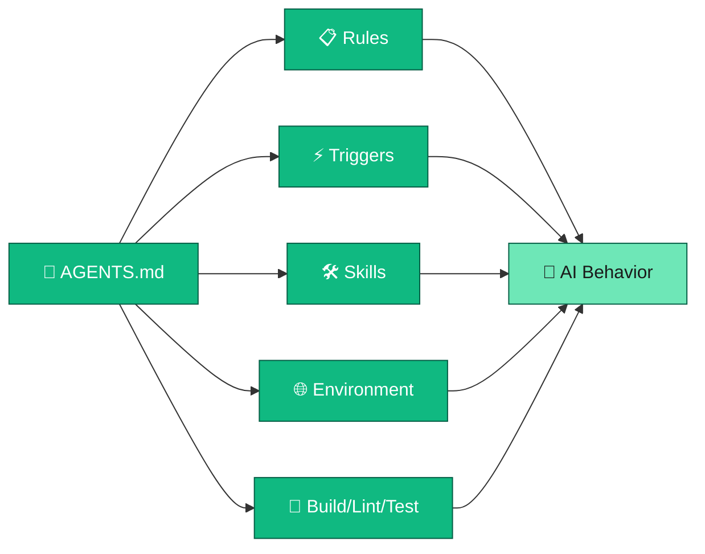
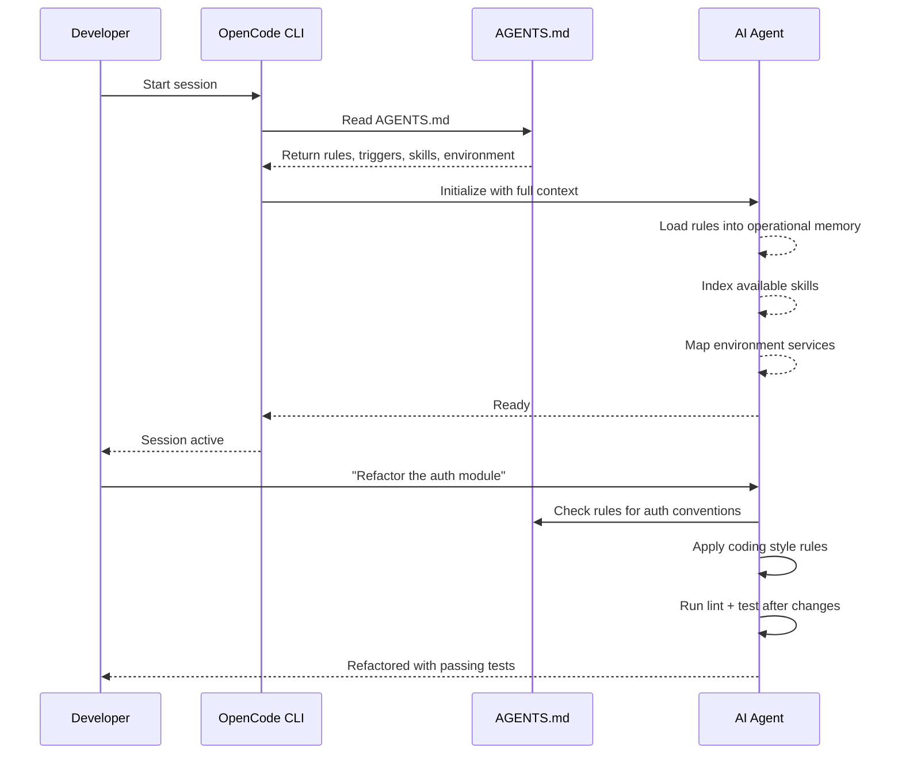

## What if your AI assistant had a rulebook it actually followed?

You know the feeling. You open ChatGPT, ask it to write a function, and it gives you something that *technically* works but uses tabs when your entire codebase uses spaces. Or it suggests a library you've never heard of when you specifically wanted to stick with what's already installed. Or it cheerfully suggests `rm -rf` to "clean up" without so much as a warning.

Every conversation starts from zero. Every session, you re-explain your conventions. Every time, you hope the AI remembers that you prefer TypeScript over JavaScript, that your project uses PostgreSQL not MongoDB, that you *really* don't want it touching your `.env` files.

What if there were a file — a single file — that your AI read *before* every conversation? A file that told it exactly how to behave, what rules to follow, what shortcuts to recognize, and what your environment looks like?

That file exists. It's called **AGENTS.md**, and it's the closest thing your AI coding assistant has to a constitution.

## What AGENTS.md Actually Is

At its simplest, AGENTS.md is a Markdown file that lives at the root of your project (or in your global config directory). When an agentic coding tool like OpenCode starts a session, it automatically reads this file and injects its contents into the AI's context.

Think of it as the difference between hiring a freelancer for a one-off gig versus onboarding a full-time team member. The freelancer shows up, does the work, and leaves. The team member gets the employee handbook, learns the codebase conventions, understands the deployment pipeline, and knows not to commit to main on a Friday.

AGENTS.md is that employee handbook.



The key insight is **persistence**. This isn't a system prompt you paste once and lose. It's not a chat message you hope the AI remembers. It's a file that gets loaded *every single time* a session starts, guaranteeing that your AI always has the same baseline understanding of how to work with your project.

## Inside the Constitution: The Key Sections

A well-structured AGENTS.md typically contains five core sections. Let's walk through each one.

### 1. Rules — The Laws of the Land

This is the meat of the file. Rules define what the AI should and shouldn't do. They cover everything from coding style to safety restrictions.

Common rule categories include:

- **Code style**: "Use snake_case for Python, camelCase for JavaScript, PascalCase for classes"
- **Safety restrictions**: "Never execute `rm -rf *` or destructive wildcard deletions"
- **Convention enforcement**: "Always follow existing patterns in neighboring files"
- **Security**: "Never commit secrets, API keys, or credentials"
- **Behavioral preferences**: "Answer concisely. One word answers are best"

The beauty of rules is that they're *specific to your project*. A Python data science project's rules look completely different from a TypeScript SaaS app's rules. And because they're in a file, you can version-control them, share them with your team, and evolve them over time.

Here's the thing that makes rules powerful: **they're not suggestions**. When an agentic tool loads AGENTS.md, those rules become part of the AI's operational context. The AI doesn't just "try to remember" them — it actively checks them before taking actions.

### 2. Triggers — Your Shortcut Words

Triggers are special words or phrases that activate specific workflows. Think of them as command pallettes for your AI.

For example, instead of typing "check the status of all my Docker containers and show me which ones are running," you could define a trigger like:

```
| Trigger | Action |
|---------|--------|
| `ct`    | Docker container management menu |
| `sp`    | Disk space analysis and cleanup  |
| `mem`   | Memory system gateway            |
```

Now you just type `ct` and the AI knows exactly what you want. Triggers are a productivity multiplier because they encode your most common workflows into single words.

### 3. Skills — Reusable Workflow Recipes

Skills are the most powerful concept in the agentic stack. A skill is a reusable workflow definition — a Markdown file that describes a multi-step process the AI can follow.

Think of skills as functions for AI behavior. Instead of explaining "here's how to create a blog post" every single time, you define a skill once. Then the AI can invoke that skill whenever the task comes up, following the exact same steps every time.

AGENTS.md references these skills so the AI knows they exist:

```
- `astro` — Blog framework + Directus integration
- `research` — Deep research mode with evidence-based methodology
- `skill-factory` — Meta-skill for creating new skills
```

Skills can nest inside other skills. The `transcription` skill, for instance, automatically invokes the `astro` skill after extracting a YouTube transcript. This composability is where agentic coding starts to feel genuinely different from chat-based AI.

### 4. Environment Configuration — The Map of Your World

This section tells the AI about your infrastructure. What services are running? What ports? What URLs? What databases?

```yaml
Active Services:
  - Astro Blog: http://ubuntu4:3002
  - Directus CMS: http://ubuntu4:8055
  - Langflow: http://ubuntu4:7860
  - PostgreSQL: localhost:5432
```

Without this context, your AI is blind. It doesn't know you have a CMS running on port 8055 or that your blog builds with Astro. With it, the AI can interact with your services directly — hitting APIs, checking health endpoints, even debugging deployment issues.

This section also typically includes:

- **Server variables** (hostname, IP, FQDN)
- **URL formatting rules** ("always use `ubuntu4` not `localhost` in responses")
- **API tokens and endpoints** (referenced, not hardcoded)
- **Volume mount mappings** (which directories are shared with containers)

### 5. Build, Lint, Test — The CI Pipeline in a File

This is deceptively simple but incredibly useful:

```
- Build: npm run build
- Lint: npm run lint (Biome for JS, Ruff for Python)
- Test: npm test (Vitest for JS), pytest (Python)
- Single Test: pytest tests/test_file.py
```

When the AI knows your build commands, it can verify its own work. It writes code, runs the linter, fixes issues, runs tests, and reports results — all without you lifting a finger. This is the feedback loop that makes agentic coding qualitatively different from copy-pasting ChatGPT output.

## How It Actually Works: The Session Start Sequence

Let's trace what happens when you start an OpenCode session with AGENTS.md configured:



Notice the critical detail: the AI checks the rules *before responding*. It doesn't just start writing code — it consults the constitution first. This is what separates agentic coding from chat-based coding. The AI has a persistent, structured understanding of your project that shapes every action it takes.

## How AGENTS.md Compares to Other Configuration Files

You might be thinking: "Doesn't this already exist?" Sort of. Several tools have their own versions:

| File | Tool | What It Does |
|------|------|-------------|
| `AGENTS.md` | OpenCode | Full constitution: rules, triggers, skills, environment, build commands |
| `CLAUDE.md` | Claude Code | Project instructions and coding preferences for Anthropic's Claude |
| `.cursorrules` | Cursor | Project-level instructions for Cursor's AI features |
| `.github/copilot-instructions.md` | GitHub Copilot | Coding guidelines for Copilot in VS Code |

The concept is the same across all of them: **give the AI persistent context about your project**. The differences are in scope and power. Some are simple preference lists. Others (like AGENTS.md) support full skill systems, trigger words, environment mappings, and composability.

If you're using any agentic coding tool, check what configuration file it supports. Then actually use it. The difference between an AI with configuration and one without is like the difference between a developer who read the docs and one who didn't.

## Practical Exercise: Write Your First AGENTS.md

Enough theory. Let's build one. Here's a starter template you can drop into your project today. Adapt it to your stack, your conventions, and your preferences.

```markdown
# AGENTS.md — Project Configuration

## Rules

### Code Style
- Use TypeScript strict mode with explicit return types
- Use async/await, avoid raw promises or callbacks
- Group imports: stdlib → third-party → local
- Naming: camelCase (variables/functions), PascalCase (classes/components)
- Use absolute imports with path aliases (@lib/, @components/)

### Safety
- NEVER execute destructive commands (rm -rf, DROP TABLE, etc.)
- NEVER commit .env files, API keys, or credentials
- Always ask before installing new dependencies
- Never push to main/master branch directly

### Behavior
- Answer concisely. Prefer 1-3 sentences over paragraphs
- Follow existing patterns in neighboring files
- Run lint and tests after making changes
- Use the existing test framework — check package.json first

## Triggers

| Trigger | Action |
|---------|--------|
| `db` | Database operations menu |
| `deploy` | Run deployment pipeline |
| `test` | Run full test suite |
| `lint` | Run linter on changed files |

## Build/Lint/Test Commands

- Build: `npm run build`
- Lint: `npm run lint`
- Test: `npm test`
- Single test: `npx vitest run path/to/test.ts`
- Type check: `npx tsc --noEmit`

## Environment

- Frontend: http://localhost:3000 (Next.js)
- API: http://localhost:8080 (Express)
- Database: PostgreSQL on localhost:5432
- Cache: Redis on localhost:6379

## Key Dependencies

- Framework: Next.js 14 (App Router)
- State: Zustand
- Styling: Tailwind CSS
- Database: Prisma ORM
- Testing: Vitest + Testing Library
```

Copy this template. Modify it for your project. Put it where your tool expects it. Then start a session and watch the difference.

You'll notice it immediately. The AI will use your import conventions without being told. It'll run your test suite after changes. It'll know your API runs on port 8080 instead of guessing. Small things individually, but they compound into an experience that feels less like chatting with an AI and more like pair programming with someone who actually read the documentation.

## The Constitution Metaphor Holds

A real constitution does three things: it establishes principles, it defines processes, and it constrains power. AGENTS.md does exactly the same thing for your AI coding assistant.

**Principles** — your coding style, your naming conventions, your architectural preferences.

**Processes** — your build pipeline, your test commands, your deployment workflow.

**Constraints** — what the AI should never do, what needs approval, what's off-limits.

Without a constitution, power is arbitrary. The AI does whatever seems reasonable in the moment, which might not align with what you actually want. With one, every action is grounded in rules you defined, processes you established, and constraints you set.

In the next post, we'll explore **Skills** — the reusable workflow definitions that turn your AI from a code generator into a genuine automation partner. If AGENTS.md is the constitution, skills are the legislation: specific, actionable procedures for getting things done consistently.

---

*This is Post 2 in "The Agentic Stack" — a series about the emerging patterns and tools that make AI-assisted coding actually work. [Read Post 1](/posts/agentic-stack-1-the-stack/) or [start from the beginning](/posts/agentic-stack-1-the-stack/).*