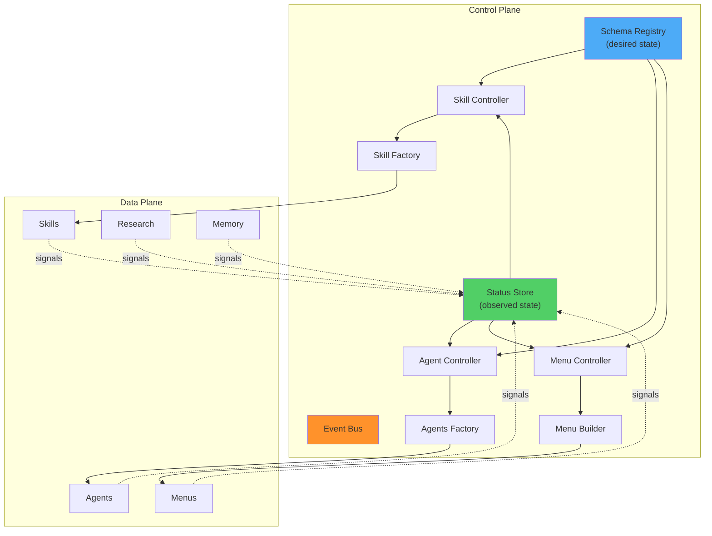

## The Problem Nobody Has Named Yet

Every team using AI agents hits the same wall. Skills proliferate. Usage goes unmeasured. Quality drifts. Nobody knows what's working, what's dead, or what's quietly broken. The agents themselves work fine — it's the *governance* that's missing.

This isn't a tooling problem. It's a control problem. And control problems have a known solution.

## A Vocabulary Accident

This framework didn't come from a whiteboard session. It emerged from fixing a menu.

I was tracking which options users selected in AI agent menus — a tactical signal-tracking task. The script worked, but only 11% of skills had any data. That gap exposed a structural problem: the system had no way to enforce that signals were being recorded everywhere.

To fix that, I needed schemas that described what menus *should* look like. That required factories that could produce menus from those schemas. And to close the loop, I needed something that read the signals, compared them against the schemas, and fired corrections when they diverged.

Schemas. Factories. Signals. And the thing that connects them.

I called it a Manager. Then I corrected myself. Manager implies discretion — a person making judgement calls. That's the wrong abstraction. What I needed was something stateless, declarative, and relentless. Something that continuously compares desired state against observed state and actuates correction when the gap exceeds a threshold.

A **Controller**. And the layer of all controllers operating together is the **Control Plane**.

I had independently derived Kubernetes.

## The Four Primitives

Once you see the pattern, you see it everywhere. Four primitives, no more, no less:

### 1. Schema — The Declaration

A schema declares desired state. What a thing *should* be. Not what it is — what it should be. Schemas are contracts. They're the source of truth.

Examples: YAML configs, JSON schemas, Pydantic models, menu format rules, trigger definitions.

### 2. Signal — The Measurement

A signal reports observed state. What a thing *actually* is. Signals are measurements — telemetry from the real world flowing back into the system.

Examples: menu selection data, trigger usage counts, health check results, memory usage metrics, error logs.

### 3. Controller — The Reconciliation

A controller is a continuous loop: read spec (desired), read status (observed), compute drift, actuate correction. No discretion. No judgement. Just convergence. Like a thermostat.

### 4. Factory — The Actuator

A factory produces or modifies artifacts to close drift. When a controller detects that spec doesn't match status, it fires a factory. The factory does the actual work: creating a skill, fixing a config, rebuilding a menu.

## The Architecture



The Control Plane governs the Data Plane. The Data Plane never talks back directly — it emits Signals, which the Control Plane reads. Separation of concerns as architecture.

## The Spec/Status Pattern

Every resource in the system gets a dual structure:

```yaml
apiVersion: opencode/v1
kind: Skill
metadata:
  name: research
  controller: skill-controller

spec:                    # DESIRED STATE — user/factory-owned
  version: "2.1.0"
  triggers: ["research", "rf"]
  health:
    min_usage_per_30d: 3
    max_violations: 0

status:                  # OBSERVED STATE — controller-owned
  phase: Active
  drift: NONE
  conditions:
    - type: Ready
      status: "True"
    - type: Synced
      status: "True"
  signals:
    invocations_30d: 7
    menu_presentations: 12
    selection_rate: 0.83
```

The `drift` field is the computed error signal: spec minus status. A controller reads it. If drift is HIGH, the controller fires the appropriate factory. If drift is CRITICAL, it alerts before acting.

This is the Kubernetes pattern: `spec` is owned by the user, `status` is owned by the controller. Separate ownership. Clean contract.

## The Vocabulary

When you name things correctly, the architecture becomes obvious:

| Term | Definition | Product Analogy |
|------|-----------|----------------|
| **Schema** | Desired state declaration | The blueprint |
| **Signal** | Observed state measurement | The inspection report |
| **Controller** | Reconciliation loop (observe → diff → act) | The quality assurance team |
| **Factory** | Artifact producer/modifier | The production line |
| **Control Plane** | Collective governance layer | The management system |
| **Data Plane** | Governed artifacts | The products |
| **Drift** | Computed error signal (spec − status) | The defect rate |
| **Condition** | State machine entry (Ready, Synced, Healthy) | The health check |
| **Kind** | Resource type in the schema registry | The product category |
| **Reconciliation** | One cycle: observe → diff → act → report | The audit cycle |

Terms considered and rejected: Manager (implies discretion), Optimizer (component, not primitive), Tracker (subsumed into Signal).

## Why This Matters

The AI agent ecosystem is at the same stage cloud infrastructure was in 2013: everyone's building things, nobody's governing them. Teams have dozens of agents, hundreds of skills, thousands of prompts — and zero visibility into what's working, what's drifted, or what's dead.

Kubernetes solved this for containers by introducing the control plane pattern: declare desired state, measure actual state, reconcile continuously. The same pattern applies to AI agents. The primitives are the same. Only the resources differ.

**The first team to ship an AI Agent Control Plane defines the category.**

## What I'm Selling

I'm not selling AI tools. I'm selling the absence of chaos.

Every team that adopts AI agents hits the ungoverned proliferation wall. They have skills that nobody uses, configs that don't match documentation, menus that violate their own format rules, and no way to know any of this is happening without manual inspection.

The control plane makes it legible. Schemas declare intent. Signals measure reality. Controllers close the gap. Factories do the work. The system heals itself.

**Structure. Order. Self-governance.** That's the product.

## The Three Vectors

**1. The Control Plane Itself** — Schema registry, status store, controllers, factories, signal pipeline. Teams install it, register their agent types, and get automated governance. Price: team subscription.

**2. Structure as a Service** — The methodology, not the software. You come in, declare schemas for a team's chaotic agent sprawl, wire up controllers, and leave them with a self-governing system. Price: consulting engagement.

**3. The Standard** — The vocabulary itself. Schema, Signal, Controller, Factory, Drift, Condition, Kind, Spec, Status, Reconciliation. Published as an open standard. First mover defines the category. Price: free (standard) → paid (implementation + certification).

Vector 3 is the most important. The team that names the primitives owns the market.

## The Minimal Implementation

Three PostgreSQL tables. One event bus. A Python process with a `reconcile()` function per resource type. That's it.

```sql
-- Schema Registry
CREATE TABLE resource_types (
    kind TEXT PRIMARY KEY,
    version TEXT,
    schema_json JSONB,
    created_at TIMESTAMPTZ
);

-- Resource Store  
CREATE TABLE resources (
    kind TEXT,
    name TEXT,
    spec JSONB,           -- desired state
    status JSONB,         -- observed state
    generation INT,
    observed_generation INT,
    drift TEXT,           -- NONE|LOW|MEDIUM|HIGH|CRITICAL
    last_reconciled TIMESTAMPTZ,
    PRIMARY KEY (kind, name)
);

-- Change Log
CREATE TABLE change_log (
    id SERIAL,
    resource_kind TEXT,
    resource_name TEXT,
    controller TEXT,
    operation TEXT,
    drift_items JSONB,
    before_state JSONB,
    after_state JSONB,
    auto BOOLEAN,
    created_at TIMESTAMPTZ
);
```

The event bus is PostgreSQL `LISTEN/NOTIFY`. No Kafka. No Redis. No new infrastructure. You already run PostgreSQL.

## The State of Play

This isn't theoretical. The system exists today:

- **4 factories** running (skill-factory, agents-factory, project-factory, research-factory)
- **72 skills** as the test corpus
- **Menu signals** being recorded and aggregated
- **Menu optimizer** as the first proto-controller (generates proposals, not yet auto-actuating)
- **Canonical schemas** defined for Skill, Agent, ResearchProject, Menu, and the Controller contract itself
- **Signal pipeline** verified end-to-end (present → select → aggregate → detect)

The gap between what exists and what's described here is buildable in weeks, not months. The hard part — the conceptual framework — is done. The rest is execution.

## The Deeper Pattern

Schema + Signal + Controller + Factory = directed evolution. Not the random mutation of biological evolution, but homeostatic self-improvement: the system measures deviation from its own declared ideal state and produces the correction.

The schema is the homeostatic setpoint. The signal is the sensory input. The controller is the comparator. The factory is the effector. This is control theory applied to AI infrastructure.

Your system doesn't just improve. It improves itself *deterministically*. Every reconciliation cycle is auditable. Every drift calculation is reproducible. Every correction is logged.

That's not a feature. That's a principle.

---

*The evolution project continues. Schema Registry prototype (DO-022) and Controller upgrade (DO-023) are the next build milestones.*

## Proof It Works: Karpathy's autoresearch

After publishing this framework, I found [Andrej Karpathy's autoresearch](https://github.com/karpathy/autoresearch) — a repo where an AI agent autonomously experiments on LLM training code overnight. He built it independently. It's the control plane pattern in miniature, with different names:

| Control Plane Primitive | autoresearch Equivalent | Role |
|---|---|---|
| **Schema** | `program.md` | Declares desired state — how the agent should behave. Karpathy calls it "a super lightweight skill." |
| **Signal** | `results.tsv` + `val_bpb` | Measures observed state after each run. The metric flowing back into the system. |
| **Controller** | The experiment loop | Observe (read git state) → diff (check if val_bpb improved) → actuate (keep or discard). Continuous reconciliation. |
| **Factory** | Agent modifying `train.py` | Produces changes to close drift (lower val_bpb). |

The experiment loop is literally the reconciliation loop:

```
LOOP FOREVER:
  1. Read git state (observe)
  2. Modify train.py with hypothesis (actuate via factory)
  3. Run experiment: uv run train.py (execute)
  4. Check val_bpb (measure signal)
  5. If improved: keep commit (drift negative → converged)
  6. If worse: git reset (drift positive → rollback)
```

The `keep`/`discard` logic is drift detection: spec minus status. The "NEVER STOP" directive is continuous reconciliation made explicit. The single-file constraint (`train.py` only) is a bounded schema contract. The simplicity criterion ("simpler is better") is deterministic self-improvement over random mutation.

Both projects independently derived the same architecture. That's not coincidence — it's convergent evolution toward a known-correct pattern. Karpathy built a proof-of-concept for one resource type. The control plane generalises it to all AI agent resources.

The **Experiment** Kind is now a first-class resource in the schema registry: [experiment-schema.yaml](http://ubuntu4:8080/editor/opencode/schemas/experiment-schema.yaml).
