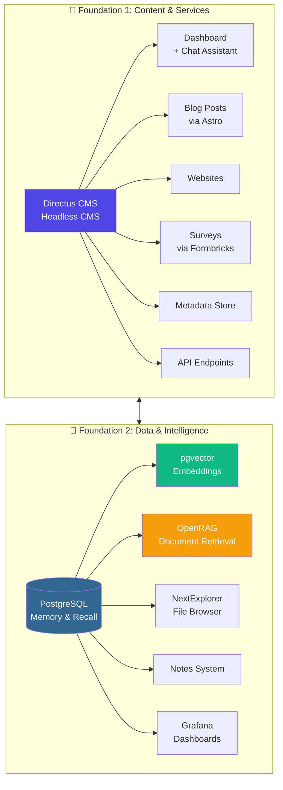
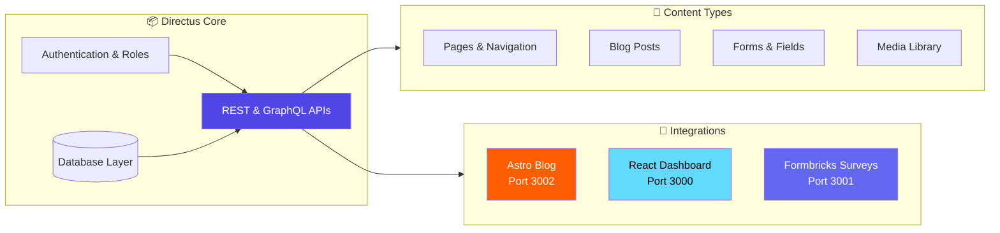
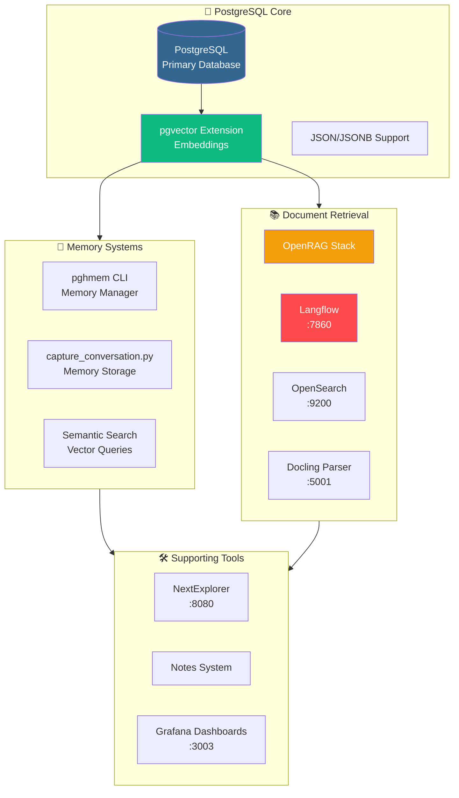
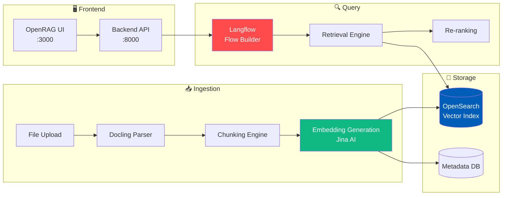
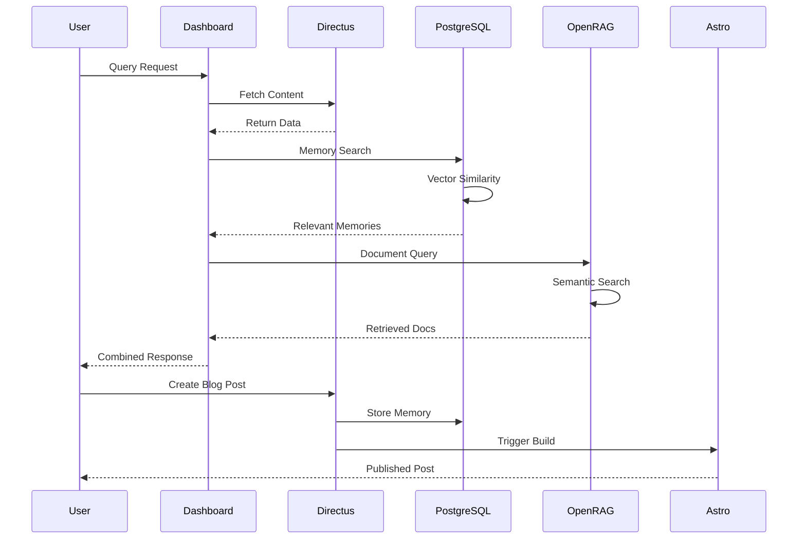
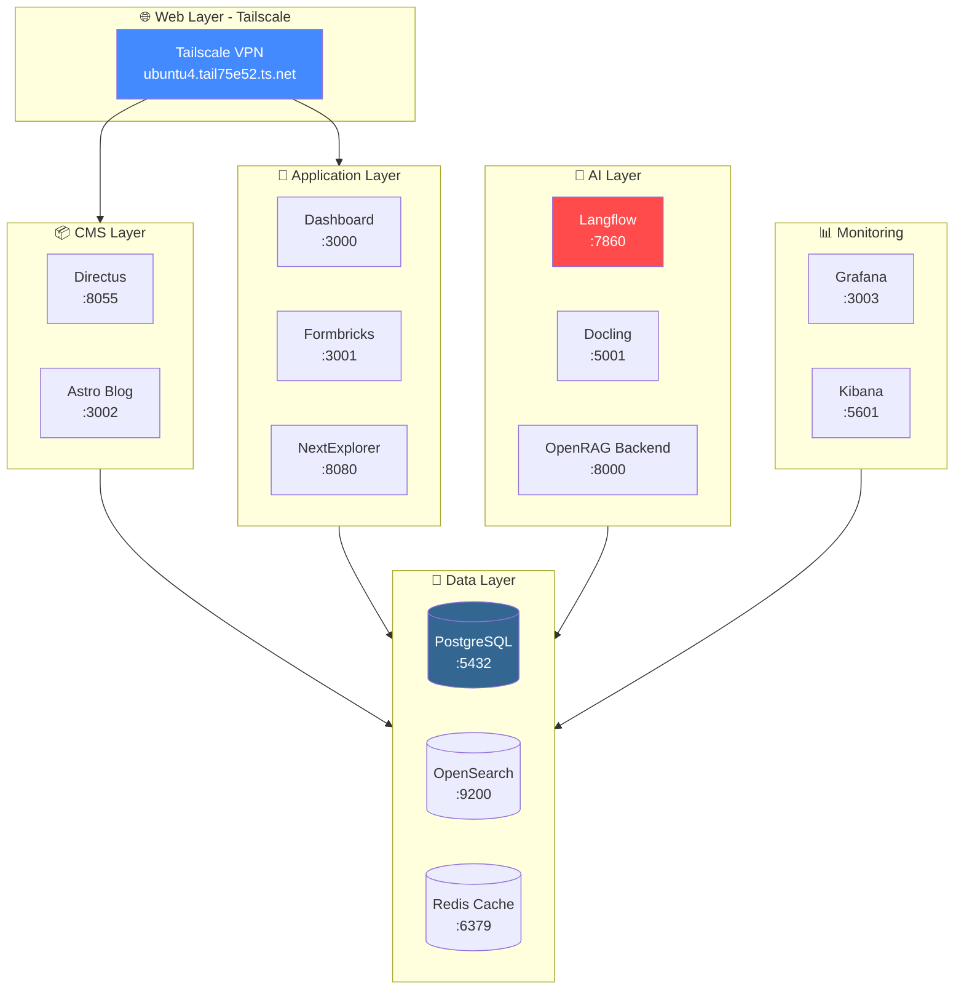
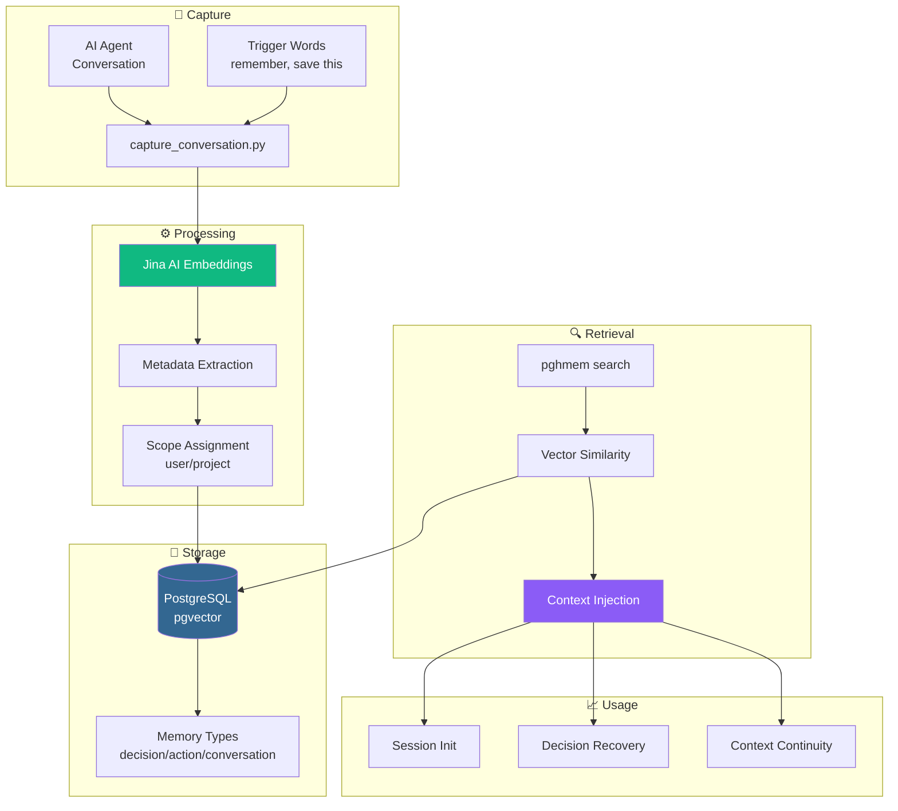

This post presents a series of diagrams illustrating the infrastructure foundations of a personal AI assistant setup. The architecture is built on two primary pillars: **Content Management** (via Directus) and **Data Intelligence** (via PostgreSQL memory and retrieval systems).

---

## Architecture Overview

The complete infrastructure spans multiple interconnected systems:

---

## Foundation 1: Directus CMS Ecosystem

Directus serves as the central content hub, managing all structured data and providing APIs for consumption.

---

## Foundation 2: Data Intelligence Layer

The second foundation handles all memory, retrieval, and intelligence capabilities.

### OpenRAG Stack Architecture

---

## Integration Flow

How the two foundations communicate and share data:

---

## Service Topology

All services and their port mappings:

---

## Memory Flow Architecture

How memories are captured, stored, and retrieved:

---

## Key Configuration Files

| Component | Location | Purpose |
|-----------|----------|---------|
| Directus Config | `/media/docker/directus/` | CMS configuration |
| PostgreSQL Data | PostgreSQL container volume | Memory & embeddings |
| Astro Blog | `/media/docker/astro-blog/` | Blog content & builds |
| OpenRAG Stack | `/media/docker/openrag/` | Document retrieval |
| NextExplorer | `/media/docker/nextexplorer/` | File browser |
| AGENTS.md | `~/.config/opencode/AGENTS.md` | Agent instructions |
| Environment | `~/.config/opencode/environment.md` | Environment tracking |

---

## Summary

This infrastructure provides:

1. **Content Management** - Directus as the single source of truth for structured content
2. **AI Memory** - PostgreSQL with pgvector for persistent, searchable memory
3. **Document Intelligence** - OpenRAG for semantic document retrieval
4. **Unified Access** - NextExplorer for file management, Grafana for monitoring
5. **Publishing** - Astro for high-performance blog generation
6. **Feedback** - Formbricks for surveys and user input

The two foundations work together to create a cohesive AI assistant capable of remembering context, retrieving relevant information, and publishing content seamlessly.