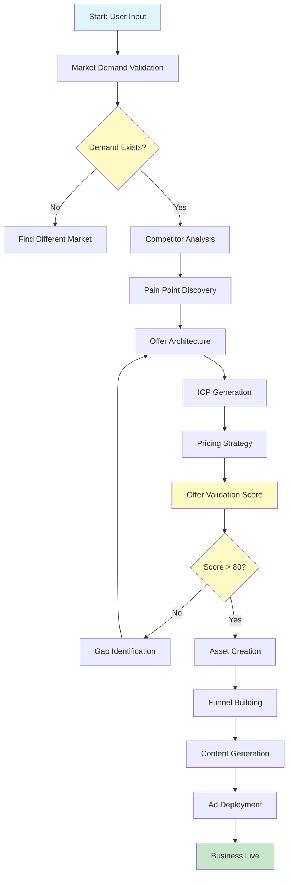

## The Paradigm Shift: From Using AI to Letting AI Cook

In a live demonstration that challenges everything we know about business building, Serge Gatari unveils **Cook AI**—a platform that automates the creation of a million-dollar business in under 55 minutes. The core philosophy is radical yet simple: **don't use AI as a tool to make money—let AI autonomously build and execute businesses for you.**

The reason most business owners struggle isn't lack of tools or opportunities. It's that humans are biologically wired for survival, not greatness. Risk aversion, limiting beliefs, and execution fatigue kill more businesses than market conditions ever could. Cook AI solves this by **removing the human from the execution loop entirely**.

## The Two Variables to Making Money

According to Gatari, business success depends on two critical variables:

1. **Knowledge** — Finding the right opportunities where actual demand exists
2. **Execution** — Having the discipline, skills, and relentlessness to execute until it works

AI can solve both by accessing infinite knowledge to find truth and executing relentlessly without human limitations. But there's a catch: most people apply AI to the wrong opportunities, amplifying failure rather than success.

## The "Truth Engine" Architecture

The key innovation in Cook AI is the **Truth Engine**—a system that validates market opportunities before execution begins. Here's how it works:

### Phase 1: Market Validation

The platform begins by analyzing real-time search trends and demand curves. For example, interest in "AI automation" skyrocketed in June 2025 and has remained consistent since. It identifies market gaps—like local businesses losing 30-50% of leads because they can't follow up fast enough.

### Phase 2: Competitor Research

Rather than guessing what works, Cook AI automatically:

- **Finds successful competitors** in your chosen niche
- **Funnel hacks** their complete marketing systems
- **Extracts case studies** to prove mechanisms work
- **Breaks down ad frameworks** (35% guarantee-based, 20% pain-agitation-solution, 10% exclusivity/scarcity)

### Phase 3: Pain Point Discovery

The platform discovers real customer pain using natural language from reviews, forums, and social media. Instead of generic "I need leads," it finds specific pain like:

> "I've been in business for three years and still have no idea where my next client is coming from. Every month is a panic."

This specificity is crucial. Knowing to say "quality of leads is garbage" versus "I need more leads" is a **10x difference in outcomes**.

### Phase 4: Offer Architecture

Based on validated opportunities, Cook AI generates:

- **Three unique mechanisms** aligned with market gaps
- **Multiple Ideal Customer Profiles** with detailed psychographics
- **Data-driven pricing** based on actual market benchmarks, not limiting beliefs
- **Offer validation scores** (0-100) with specific improvement suggestions

## The $60,000 Mistake (And How to Avoid It)

Gatari shares a cautionary tale: A client scaled a 7-figure offer in the dental niche, then tried replicating it in home services. They spent **$60,000 over six months** before discovering AI wasn't wanted in that market.

With Cook AI's Truth Engine, this insight would have been revealed in **3 seconds**—saving both money and months of wasted effort.

## End-to-End Automation: No Platform Hopping

The most impressive aspect is the **one-click deployment**. Traditional business building requires:

- ClickFunnels or GoHighLevel for funnels
- Facebook Ads Manager for campaigns
- Canva for creative assets
- Calendly for scheduling
- Multiple CRM systems

Cook AI integrates everything into a single platform:

- **Landing pages** deployed with one click (no leaving the platform)
- **Logos and branding** generated automatically
- **VSL scripts** written based on proven frameworks
- **Ad creatives** based on top-performing competitor ads
- **Voice and face cloning** for personalized outreach at scale
- **CRM integration** for seamless lead management

The ads go live **without you clicking a single button in Facebook Ads Manager**.

## The Chef vs. Ingredients Analogy

Gatari uses a powerful metaphor: If you give ingredients to an average person and give the same ingredients to a chef, who cooks the better meal? The chef, obviously.

The problem isn't access to tools—anyone can use ChatGPT, build apps on Replit, or create funnels on ClickFunnels. The problem is **who's wielding the tools**. Most people were never taught to "cook" businesses. They create "dogs in a cloud" while others create ads that print millions.

Cook AI doesn't just give you tools—it adds the **logic of a master chef** to execute with precision.

## Case Studies Are No Longer a Barrier

In 2026, you don't need your own case studies to get clients. Here's the strategy:

1. Find competitors with proven case studies in your target market
2. Use their proof to validate your mechanism
3. Market the claim with conviction
4. Deliver results using AI-powered fulfillment

This removes the classic chicken-and-egg problem: "I can't get clients without case studies, but I can't get case studies without clients."

## Removing Limiting Beliefs

One of the most powerful features is **data-driven pricing**. Most entrepreneurs price based on self-worth:

- "I was only making $2K/month, so charging $2K feels like a lot"
- Result: Undercharge, acquire customers at a loss, churn before profitability

Cook AI benchmarks pricing against actual market data:

- Customer acquisition cost (CAC)
- Fulfillment costs
- Lifetime value (LTV)
- Required margins for sustainability

As Gatari notes:

> "Rich people don't necessarily do better stuff. They're just so cooked that they're like, 'Oh, this villa costs $10K a day. Okay, cool.'"

## The Future: Business as "Cooking"

The vision is that business building becomes a **gamified, fun process**. Instead of grinding through market research, competitor analysis, and funnel building, you:

1. Create a workspace
2. Answer a few questions about your skills and goals
3. Let AI find the truth, build assets, and deploy campaigns
4. Manage multiple offers simultaneously across different tabs

The future isn't one offer you're cooking—it's **multiple offers** you're letting AI cook in parallel.

## Why Traditional Software is "Cooked"

Gatari makes a bold prediction: platforms like ClickFunnels and GoHighLevel are at risk because they're **systems of record**, not systems of action.

- **Old software**: Holds your data but requires human operators
- **AI-native platforms**: Agents execute on data without human bottlenecks

AI needs to be able to **do things** with the data, not just store it. That's why Cook AI includes native deployment, content creation, and ad management—the AI can act, not just organize.

## Addressing the Objections

### "My clients don't want to talk to robots"

Cook AI discovered this objection in real estate: "If someone is spending $1M on a property, why would they want to talk to AI?"

The platform automatically reframes:

> "The AI handles initial inquiry qualification and scheduling within the agent's business process. It's not replacing your personal touch—the client experience remains human when it matters most: at the appointment."

### "I don't have case studies"

Use competitor proof, then deliver. The mechanism is proven; you just need to execute.

### "This seems too good to be true"

Gatari acknowledges the platform is "a little dangerous" and "too disruptive." He expects pushback from the "funnel mafia" and traditional software companies. But the technology is real, and the demonstrations are live.

## The Bottom Line

**For entrepreneurs**: Cook AI could eliminate months of trial-and-error, thousands in wasted ad spend, and the psychological barriers that prevent business success. It's not just a tool—it's an AI business partner that validates opportunities, builds assets, and deploys campaigns autonomously.

**For the industry**: This signals the decline of traditional funnel builders, ad agencies, and business consultants who don't adapt to AI-driven automation. The future belongs to platforms that enable AI agents to take action, not just store data.

**The key insight**: The biggest risk in the AI era isn't execution capability—it's opportunity selection. With infinite leverage, applying power to the wrong market amplifies failure. Cook AI's Truth Engine solves this by validating demand before execution.

As Gatari puts it:

> "It's either cook or be cooked."

---

## References

- **Full Video**: [Watch AI Build Him a $1M Business LIVE in 55 Minutes](https://www.youtube.com/watch?v=5a4Nu4i3UgU)
- **Full Transcript**: Available in processing resources
- **Short Summary**: Available in processing resources

---

*This blog post was automatically generated from a comprehensive analysis of the video transcript. The Cook AI platform represents a significant evolution in business automation, and its impact on traditional business services will be fascinating to watch.*