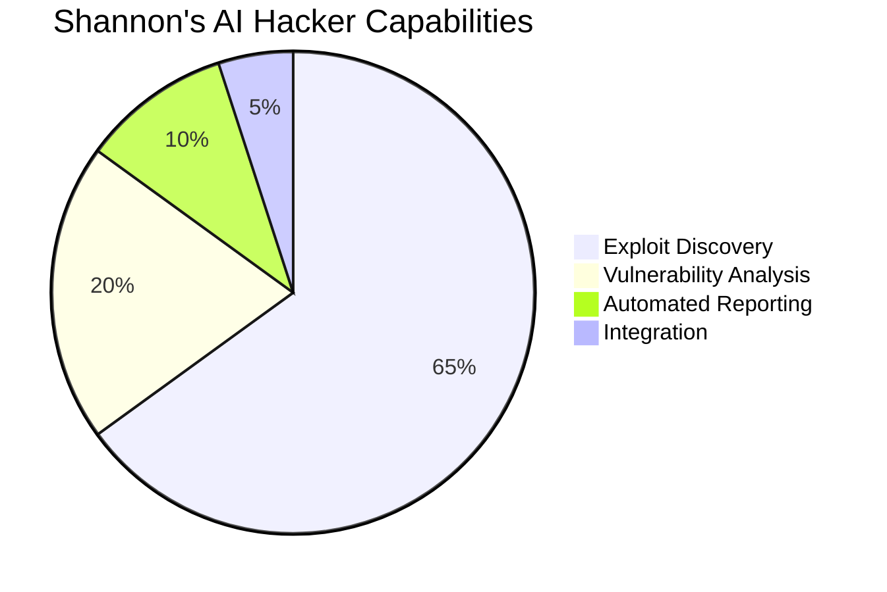

The AI development landscape is evolving at breakneck speed in 2026, with new tools and frameworks emerging almost weekly. This month's analysis reveals some fascinating trends that are fundamentally changing how developers approach coding, debugging, and software architecture.


graph LR
    A[Vibe Coding Era] --> B[Transition Phase]
    B --> C[Agentic Engineering Era]
    
    A --> D[Manual Coding]
    A --> E[Individual Developer]
    A --> F[Tool-based Assistance]
    A --> G[Knowledge Silos]
    
    C --> H[AI-powered Development]
    C --> I[Collaborative Agent Teams]
    C --> J[Automated Task Orchestration]
    C --> K[Continuous Context Awareness]
    
    B --> L[Andrej Karpathy's Shift]
    B --> M[SuperAgent Frameworks]
    B --> N[Skills-based Architecture]


## GitHub's New Kings: The Rise of AI-Native Projects


graph TD
    A[GitHub Trending March 2026] --> B[OpenClaw: 253K+ Stars]
    A --> C[KeygraphHQ/shannon: 27K Stars]
    A --> D[badlogic/pi-mono: 19K Stars]
    A --> E[ruvnet/RuView: 25K Stars]
    A --> F[ByteDance deer-flow: 24K Stars]
    
    B --> G[Personal AI Assistant]
    C --> H[AI Hacker Tool]
    D --> I[AI Agent Toolkit]
    E --> J[WiFi Pose Estimation]
    F --> K[SuperAgent Harness]


### OpenClaw: The New GitHub Champion

**Stars:** 253,888 (and counting!)

OpenClaw has dethroned established projects to become the most starred repository on GitHub. This TypeScript-based personal AI assistant works on any OS and platform, following "the lobster way." Its explosive growth of 100,507 stars in recent months demonstrates the massive demand for personalized, platform-agnostic AI assistants.

Key features driving its adoption:
- Cross-platform compatibility (Windows, macOS, Linux)
- Extensible skill system
- Natural language interaction
- Local-first architecture

### KeygraphHQ/shannon: The AI Security Revolution

**Stars:** 27,703 | **Success Rate:** 96.15%

Shannon represents a breakthrough in automated security testing. This fully autonomous AI hacker has achieved remarkable success on the XBOW Benchmark, finding actual exploits in web applications with near-perfect accuracy.

### badlogic/pi-mono: The Complete AI Agent Toolkit

**Stars:** 19,401 | **Growth:** 13,545 stars

This comprehensive toolkit provides everything needed for building AI agents:
- Coding agent CLI
- Unified LLM API
- TUI & web UI libraries
- Slack bot integration
- vLLM pods

## The Skills Ecosystem: Specialized AI Capabilities

### Claude Skills Explosion

Multiple Claude-focused repositories are trending, indicating a major shift toward specialized AI skills:


graph LR
    A[Claude Skills Ecosystem] --> B[Jeffallan/claude-skills: 4.3K stars]
    A --> C[K-Dense-AI/claude-scientific-skills: 11K stars]
    A --> D[openai/skills: 10K stars]
    A --> E[huggingface/skills: 8K stars]
    A --> F[thedotmack/claude-mem: 32K stars]
    
    B --> G[66 Specialized Skills for Full-Stack Devs]
    C --> H[Scientific Research Skills]
    D --> I[OpenAI's Codex Skills]
    E --> J[HuggingFace AI Skills]
    F --> K[Automatic Session Memory]


### Jeffallan/claude-skills: Developer Specialization

This repository offers 66 specialized skills specifically for full-stack developers, transforming Claude Code into an expert pair programmer. The 3,934 star growth suggests developers are increasingly looking for domain-specific AI assistance.

### TheDotmack/claude-mem: AI Memory System

With 32,644 stars and massive 15,208 star growth, this Claude Code plugin automatically captures everything during coding sessions, compresses it with AI, and injects relevant context back into future sessions. This represents a major advancement in AI-assisted development continuity.

## Enterprise AI Adoption: Platform Wars Heat Up

### GitHub Agentic Workflows (gh-aw)

**Stars:** 3,726 | **Growth:** 3,391 stars

GitHub's own entry into the agentic space, written in Go, shows that even the platform itself is embracing AI agents. This native support for agentic workflows within GitHub indicates where the future of development is headed.

### ByteDance deer-flow: The SuperAgent Harness

**Stars:** 24,010 | **Growth:** 3,897 stars

ByteDance's open-source SuperAgent harness that researches, codes, and creates is gaining massive traction. It handles different levels of tasks that could take minutes to hours, using sandboxes, memories, tools, skills, and subagents.

## Emerging Categories: AI for Specific Domains

### ruvnet/RuView: AI-Powered Sensing

**Stars:** 25,155 | **Growth:** 14,683 stars

This Rust-based project turns commodity WiFi signals into real-time human pose estimation, vital sign monitoring, and presence detection—all without video. It represents the convergence of AI and IoT in fascinating new ways.

### clockworklabs/SpacetimeDB: Lightning-Fast Development

**Stars:** 22,101 | **Growth:** 2,975 stars

Promising "development at the speed of light," this Rust-based database system is gaining attention for its performance claims and modern architecture.

### tobi/qmd: Local Knowledge Search

**Stats:** 12,099 stars | 5,871 star growth

A mini CLI search engine for docs, knowledge bases, and meeting notes that runs entirely locally. This reflects the growing trend toward privacy-focused, on-device AI tools.

## Infrastructure and Developer Experience

### Google Suite CLI: The AI Office Integration

**Stars:** 5,381 | **Growth:** 4,014 stars

Steipete's gogcli provides command-line access to Gmail, Google Calendar, Google Drive, and Google Contacts. The massive growth suggests developers are increasingly looking to AI-integrate their entire workflow.

### obra/superpowers: The Skills Framework

**Stars:** 69,204 | **Growth:** 25,785 stars

This agentic skills framework and software development methodology represents one of the most mature ecosystems in the space. The combination of framework and methodology is key to its adoption.

## The Comprehensive AI Tools Database

**Stars:** 127,592 | **Growth:** 32,589 stars

The `x1xhlol/system-prompts-and-models-of-aI-tools` repository has become the definitive reference for AI development tools, covering everything from commercial products like Cursor, Devin AI, and Junie to open-source alternatives.

## Market Implications and Trends

### 1. The Skills Economy is Here

The explosion of skills-based repositories indicates we're moving beyond general-purpose AI assistants toward specialized, domain-specific capabilities. Developers want AI that understands their specific stack and workflow.

### 2. Enterprise Integration is Accelerating

GitHub's own entry into agentic workflows and the rise of enterprise-focused platforms like deer-flow suggest that AI is no longer just for individual developers but is becoming part of team workflows.

### 3. Local-First is Gaining Traction

Tools like qmd (local search) and RuView (WiFi-based sensing without cameras) indicate a growing preference for privacy-respecting, on-device AI solutions.

### 4. Specialized Domains are Emerging

We're seeing the rise of AI for specific use cases: security testing (Shannon), office automation (gogcli), healthcare sensing (RuView), and development tools (pi-mono).

## What's Next for AI Development?

Based on these trends, we can expect:

1. **More Specialized Skills:** AI will become increasingly domain-specific
2. **Better Integration:** AI tools will become more deeply integrated into existing workflows
3. **Enterprise Adoption:** Large organizations will increasingly adopt AI development tools
4. **Privacy Focus:** More tools will prioritize on-device processing and privacy
5. **Standardization:** We'll likely see emerging standards for AI skills and workflows

The AI developer revolution is here, and these tools are just the beginning. As we move through 2026, we can expect even more innovation as the ecosystem matures and developers continue to push the boundaries of what's possible with AI-assisted development.

## Resources and Links

- [OpenClaw](https://github.com/openclaw/openclaw) - Personal AI Assistant
- [KeygraphHQ/shannon](https://github.com/KeygraphHQ/shannon) - AI Hacker Tool
- [badlogic/pi-mono](https://github.com/badlogic/pi-mono) - AI Agent Toolkit
- [ruvnet/RuView](https://github.com/ruvnet/RuView) - WiFi Pose Estimation
- [ByteDance deer-flow](https://github.com/bytedance/deer-flow) - SuperAgent Harness
- [Jeffallan/claude-skills](https://github.com/Jeffallan/claude-skills) - Developer Skills
- [GitHub Agentic Workflows](https://github.com/github/gh-aw) - Official GitHub AI
- [Comprehensive AI Tools Database](https://github.com/x1xhlol/system-prompts-and-models-of-ai-tools) - All AI Tools Reference

The future of development is AI-assisted, and these tools are leading the charge. Which of these trends are you most excited about? Share your thoughts in the comments below!