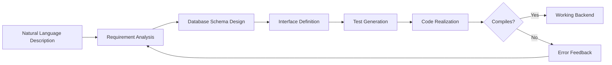

# AutoBE: Generating Backend Code from Natural Language with Local LLMs

AutoBE is an open-source tool that generates fully working TypeScript backends from plain English descriptions. Instead of relying on raw AI-generated code — which often breaks, fails to compile, or hallucinates non-existent APIs — AutoBE forces the AI to fill structured forms that are then compiled into real, working TypeScript. If anything goes wrong, the system detects the error and feeds it back to the AI for automatic correction, looping until everything compiles perfectly.

> **TL;DR**: AutoBE takes natural language backend descriptions and produces compilable TypeScript code through a structured form-and-compiler pipeline — not raw code generation.

## Quick Summary

- AutoBE generates backends from plain English, not by having the AI write raw code
- Uses structured forms + purpose-built compilers to produce real TypeScript
- Automatic error detection and feedback loop until code compiles
- Works with local models via Ollama (tested with Qwen 3.5 27B)
- Runs through phases: analysis, database schema, interface, tests, and realization
- Still bleeding edge — great for prototyping, not yet production-ready

## How It Works

The key insight behind AutoBE is that AI-generated code is unreliable. It breaks, doesn't compile, and hallucinates APIs that don't exist. AutoBE solves this by never letting the AI write raw code at all.

Instead, the architecture works in three stages:

1. **Structured Forms** — The AI fills in structured data forms (not freeform code)
2. **Purpose-Built Compilers** — These forms are transformed into real TypeScript code
3. **Feedback Loop** — If anything breaks, the system detects the exact error and sends it back to the AI for correction, looping until everything compiles

This approach is fundamentally different from asking ChatGPT or Claude to write code. The AI is constrained to structured outputs that compilers can verify and transform.

## Installation and Setup

### Prerequisites

- Node.js and npm
- pnpm (preferred for speed and disk efficiency via shared packages)
- Ollama with a capable model (Qwen 3.5 27B recommended for local use)

### Steps

1. Clone the AutoBE repository (available on GitHub at `wrtnlabs/autobe`)
2. Install dependencies with `pnpm install`
3. Fix directory permissions if needed
4. Launch the playground — runs on `localhost:5173`
5. Configure an Ollama vendor in settings (no API key required for local models)
6. Select your model and start describing your backend

### Vendor Configuration

The UI has a settings panel where you add a vendor. Select the Ollama template, confirm the base URL (default `http://localhost:11434`), and save. The model name must match exactly what appears in your `ollama list` output.

## The Generation Pipeline

Once configured, you describe your application in natural language. AutoBE processes the request through several phases:

The tool shows real-time progress and token usage in the sidebar. It generates:

- **Requirement analysis** with core features and data models
- **API requirements** with request/response formats
- **Database schemas**
- **Interface definitions**
- **Test files**

## Local Models vs API Models

Running AutoBE with local models (like Qwen 3.5 27B quantized via Ollama) has trade-offs:

| Aspect | Local Models | API Models |
|--------|-------------|------------|
| **Cost** | Free, unlimited | Token-based pricing |
| **Privacy** | Fully local, offline | Data sent to API |
| **Throttling** | None | Rate limits apply |
| **Speed** | Slower (especially quantized) | Faster |
| **Quality** | Good for demos, limited for production | Higher accuracy |

The quantized versions of models (like Qwen 3.5 27B) work for demonstration purposes but are not ideal for production use. The full models perform significantly better. If cost is a concern with API models, the local approach is attractive because AutoBE can consume large numbers of tokens during its multi-phase generation pipeline.

## Practical Assessment

**Strengths:**
- Genuine innovation in structured code generation vs raw code output
- Automatic error detection and correction loop
- Works entirely offline with local models
- Eliminates boilerplate backend work (schemas, API endpoints, tests)

**Limitations:**
- Slow with local quantized models
- Only supports TypeScript
- UI needs polish (no dark mode, terminology confusing)
- Not production-ready yet
- Still on the bleeding edge

## Verdict

AutoBE represents an interesting direction for AI-assisted development. Rather than asking an AI to write code and hoping it works, it constrains the AI to structured forms that compilers transform into verified, compilable output. The automatic feedback loop — detect errors, send them back to the AI, regenerate — is the key innovation.

For developers who want to skip the boring boilerplate work of setting up database schemas, writing API endpoints, and creating test files, AutoBE is worth watching. It's not ready for production, but the idea is sound and the execution shows promise.

---

*Source: [Function Calling Harness with AutoBE and Ollama](https://www.youtube.com/watch?v=-FXkI0sUAus) by Fahd Mirza*