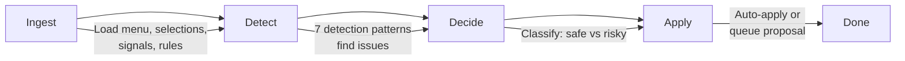

> **TL;DR**: We built a 4-stage optimizer pipeline that automatically detects dead menu options, reorders by usage, prunes underperformers, and proposes structural changes across 28 AI skill menus — all driven by real usage data.

## Quick Summary

- Discovered that **Mobile Toggle was missing from every single one of our 28 skill menus** — the original intuition that sparked this whole project
- Designed and built a **4-stage pipeline** (Ingest → Detect → Decide → Apply) with **7 detection patterns**
- The optimizer runs in **semi-auto mode**: safe changes apply instantly, risky changes queue as proposals
- Wrote **33 unit tests**, fixed edge cases, and committed everything in 3 clean commits

## The Problem: Menus Decay

In an AI agent system with dozens of skills, each skill has a menu of options presented to the user via structured choice prompts. These menus are defined in JSON blocks inside markdown files. Over time, menus accumulate cruft:

- **Dead options** — choices that look useful but never get selected
- **Order fatigue** — the 7th option in a 10-option menu gets ignored
- **Context mismatch** — popular options buried at position 8 when they should be at position 2
- **Missing globals** — mandatory options like "Skill Discovery" or "Mobile Toggle" get forgotten in new skills
- **Size violations** — menus grow past the 10-option limit

We needed a system that could **detect these problems automatically** and either fix them or propose fixes. That system is the Menu Optimizer Engine.

## Architecture: 4-Stage Pipeline



### Stage 1: Ingest

The pipeline starts by collecting data from four sources:

| Source | File | Data |
|--------|------|------|
| **Menu definition** | `SKILL.md` JSON block | Options, labels, descriptions |
| **Selection history** | `menu-learning/selections.json` | Per-option selection counts |
| **Presentation signals** | `optimizer/signals.json` | Presentation count, selection rates |
| **Rules** | `global-menu-options.json`, `format-rules.json` | Mandatory options, size limits |

### Stage 2: Detect — 7 Patterns

This is the core intelligence. Seven detection patterns scan for different types of menu decay:

| # | Pattern | What It Detects | Example |
|---|---------|-----------------|---------|
| 1 | **Dead Option** | Zero selections ever | An option that's been in the menu for 30+ days with zero picks |
| 2 | **Underperformer** | Selection rate < 5% | An option picked once out of 40 presentations |
| 3 | **Order Fatigue** | Low selection rate past position 6 | The 8th option has a 1% selection rate |
| 4 | **Context Mismatch** | Popular option in wrong position | Most-selected option sitting at position 7 |
| 5 | **Size Violation** | Menu exceeds 10 options | A menu with 14 options (limit is 10) |
| 6 | **Template Drift** | Menu diverges from its template | A "service" skill missing required service options |
| 7 | **Missing Globals** | Mandatory options absent | No "Skill Discovery" or "Mobile Toggle" |

### Stage 3: Decide

Each finding gets classified as either **safe** (auto-apply) or **risky** (queue as proposal):

| Risk Level | Actions | Requires Approval? |
|------------|---------|-------------------|
| **Safe** | Reorder, prune dead options, append missing globals | No — applied automatically |
| **Propose** | Restructure menu, add new options, change templates | Yes — queued as proposal file |

This semi-auto approach means the optimizer can clean up menus without human intervention for obvious improvements, while protecting against destructive changes.

### Stage 4: Apply

Safe changes are written directly to the skill's `SKILL.md` file. Risky changes create a JSON proposal file in `optimizer/proposals/` that can be reviewed and applied later:

```bash
# Review pending proposals
python3 optimize.py --proposals

# Apply a specific proposal
python3 optimize.py --apply proposal_20260401_143052_a7f3

# Dismiss a bad proposal
python3 optimize.py --dismiss proposal_20260401_143052_a7f3
```

## The Discovery: Mobile Toggle Was Missing Everywhere

The very first run of the optimizer's `--check-coverage` command revealed something surprising:

> **Mobile Toggle was missing from all 28 skill menus.**

Not just a few — every single one. The global option had been added to `global-menu-options.json` as a mandatory option, but no existing skills had been updated to include it. The optimizer detected this immediately and auto-appended it to all 28 skills in a single pass.

Global option coverage across the ecosystem averaged just **8.3%** — most skills had only 1-2 of the 11 mandatory global options in their menus.

## Signal Recording: Feeding the Optimizer

The optimizer needs real usage data to make good decisions. We built a signal recording system with two commands:

```bash
# When a menu is presented to the user:
python3 record_signal.py present --skill "news" --options '[...]'

# When the user selects an option:
python3 record_signal.py select --skill "news" --option "📰 Fetch News" --position 0
```

These signals feed into `optimizer/signals.json`, which tracks:

- **Per-skill aggregates**: total presentations, total selections, last activity timestamps
- **Per-option stats**: selection count, presentation count, selection rate, position history
- **Raw event stream**: recent present/select events (auto-compacted when exceeding 100 entries)

The detection patterns use this data to calculate selection rates, identify dead options, and detect order fatigue.

## CLI Reference

```bash
# Analyze a single skill
python3 optimize.py --skill news --mode report

# Interactive mode (auto-apply safe changes)
python3 optimize.py --skill news --mode interactive

# Analyze all skills
python3 optimize.py --all --mode report

# Check global option coverage
python3 optimize.py --check-coverage

# Manage proposals
python3 optimize.py --proposals
python3 optimize.py --apply <id>
python3 optimize.py --dismiss <id>

# Compact raw signals
python3 optimize.py --compact
```

## What We Learned

<details>
<summary>Technical Deep Dive: Edge Cases and Bug Fixes</summary>

### Proposal ID Collision

The original proposal ID format used timestamps with second-level precision: `proposal_20260401_143052`. When multiple proposals were created in the same second (which happened during test runs), they would overwrite each other's files.

**Fix**: Added a 4-character random suffix: `proposal_20260401_143052_a7f3`.

### Test Assertion Boundaries

Two unit tests had boundary-condition edge cases:

1. **`test_detect_underperformers_below_threshold`**: A selection rate of 1/20 = 0.05 is NOT strictly less than the threshold of 0.05 — it's equal. The test was asserting this should trigger detection, but the code correctly used `<` not `<=`.

2. **`test_detect_context_mismatch`**: The context mismatch detector triggers when an option's current position exceeds its popularity rank + 2. A gap of exactly 2 positions wasn't enough — needed a larger gap to trigger.

Both were fixed by adjusting test data to clearly sit on one side of the boundary.

### Data Format Discovery

The optimizer already had `ingest_signals()` reading from `aggregates.<skill>` in `signals.json`. The new `record_signal.py` writes to exactly the same structure — no schema changes needed. The data contract was already correct.

</details>

## Results

| Metric | Before | After |
|--------|--------|-------|
| Skills missing Mobile Toggle | 28/28 (100%) | 0/28 (0%) |
| Global option coverage | ~8.3% average | Improved (submenu options pending) |
| Dead options detected (news skill) | Unknown | 7 pruned automatically |
| Missing globals detected (news skill) | Unknown | 11 appended automatically |
| Unit tests | 0 | 33 (all passing) |
| Detection patterns | 0 | 7 |

## What's Next

- **Automatic signal recording**: Wire the agent hook so every menu presentation and selection is recorded automatically
- **Ecosystem-wide optimizer run**: Execute `--all --mode interactive` on the full skill set once we have real usage data
- **Global option coverage improvement**: The submenu options (📂 Skills →, 📂 Menus →) are flagged as missing but may not need to be in every flat menu — needs design decision

## The Code

All code lives in the `menu-factory` skill at `~/.config/opencode/skills/menu-factory/`:

| File | Purpose |
|------|---------|
| `scripts/optimize.py` | 4-stage optimizer engine (~500 lines) |
| `scripts/record_signal.py` | Signal recording CLI |
| `optimizer/signals.json` | Signal tracking store |
| `optimizer/proposals/` | Pending proposals directory |
| `optimizer/history/` | Applied optimization log |
| `tests/test_optimize.py` | 33 unit tests |

---

**Tags**: ai-agents, menu-systems, self-improving, python, automation, opencode
**Categories**: AI Automation, Engineering