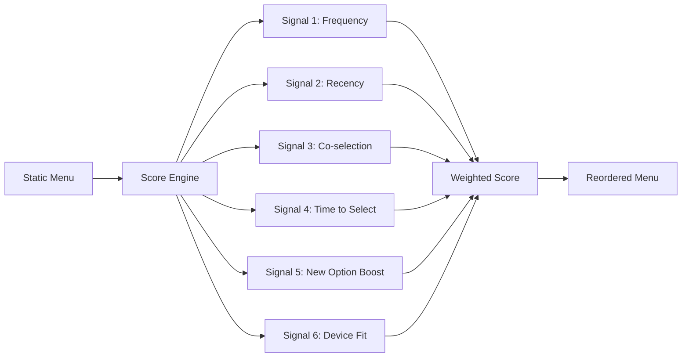
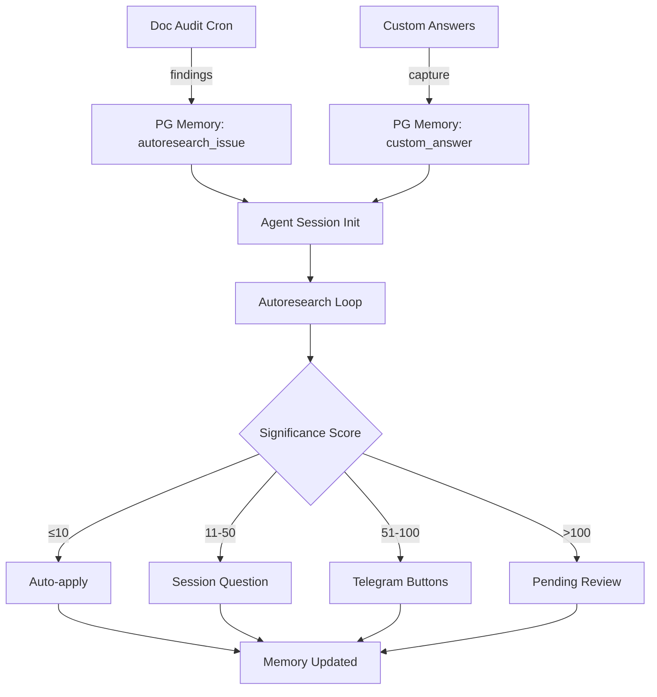

> **TL;DR**: Over a single session, we built a 3-layer intelligence system that makes AI agents self-improving: adaptive menus that learn from usage, context-aware modifiers that adjust options based on conversation state, and an autoresearch pipeline inspired by Karpathy that autonomously fixes infrastructure issues with human-in-the-loop gates.

## Quick Summary

- **Adaptive Menu Intelligence** — 6 weighted signals (frequency, recency, co-selection, time-to-select, new-option boost, device fit) score and reorder menu options dynamically
- **Context-Aware Modifiers** — YAML rules that adjust scores ±5 based on last outcome, active skill, or conversation topic
- **Weekly Doc Audit Cron** — SHA-256 snapshot tracking of 5 key infrastructure files with gap/redundancy detection
- **Autoresearch + HITL Pipeline** — Port of Karpathy's autoresearch pattern as an OpenCode skill with 4-layer approval gates and PostgreSQL memory backlog

---

## The Starting Point: Menus That Don't Learn

Every AI agent presents choices — menus, options, confirmations. But these menus are static. Option A is always first whether you pick it once or a hundred times. Option Z is always last even if you never choose it.

We started with a question: **what if menus learned from your behavior?**



## Layer 1: Adaptive Menu Intelligence

The score engine is a Python module (`scoring.py`) with 6 signal functions, each returning a 0-10 normalized score. Signals are combined using configurable weights from `scoring.yaml`:

| Signal | What It Measures | Weight |
|---|---|---|
| **Frequency** | How often this option is selected | 0.25 |
| **Recency** | How recently it was selected | 0.20 |
| **Co-selection** | What options are picked together | 0.15 |
| **Time-to-select** | How quickly the user chooses it | 0.15 |
| **New-option boost** | Temporary boost for newly added options | 0.10 |
| **Device fit** | Mobile vs desktop context | 0.15 |

The CLI entry point (`smart_menu.py`) takes a JSON menu, scores each option, and outputs a reordered version. Options below a collapse threshold get moved to a "More..." group.

**75 tests pass** covering scoring functions, weight configuration, co-selection tracking, and end-to-end menu transformation.

## Layer 2: Context-Aware Modifiers

Static scores aren't enough. The same menu should look different after an error vs after a success. We added context modifier rules in YAML:

```yaml
- name: error_recovery
  trigger:
    last_outcome: error
  adjustments:
    - option_pattern: "debug|fix|retry"
      delta: +5
    - option_pattern: "deploy|ship|publish"
      delta: -5
```

Six rules cover: error recovery, success flow, skill workflow entry, skill error recovery, topic-aware debugging, and topic-aware deployment. Each applies a ±5 adjustment to matching options based on the current context.

Three new CLI flags: `--last-outcome`, `--active-skill`, `--topic` pass context into the scoring engine.

**87 tests pass** with the context layer added.

## Layer 3: The Doc Audit Cron

If our menus are getting smarter, our documentation should too. We built `doc_audit.py` — a weekly cron job that:

1. **Snapshots** 5 key files using SHA-256 hashes
2. **Tracks sections** within each file separately
3. **Detects gaps** — missing expected sections, exceeded line limits
4. **Flags redundancies** — the same topic covered in multiple files
5. **Generates recommendations** with severity levels

First audit findings:
- telos.md missing "Cost-Aware Model Routing" and "Evolution Guidelines" sections
- roadmap.json missing `milestones` field
- "CORE PRINCIPLES" section duplicated in both telos.md and AGENTS.md
- 2 skills missing SKILL.md files

The audit history lives in SQLite (`audit_history.db`) with full section-level tracking. Every Sunday at 10:00 UTC, the cron runs and logs changes over time.

## Layer 4: Autoresearch with Human Gates

Here's where it gets interesting. Inspired by [Karpathy's autoresearch](https://github.com/karpathy/autoresearch) and [uditgoenka's Claude adaptation](https://github.com/uditgoenka/autoresearch) (3.1k stars), we designed an autonomous improvement loop — but with critical adaptations.

### The Original Pattern

Karpathy's insight: **constraint + mechanical metric + autonomous iteration = compounding gains**. His 630-line script ran 100 ML experiments per night. Modify → Verify → Keep/Discard → Repeat forever.

### Our Adaptation

We couldn't use the Claude Code plugin directly (we run OpenCode), but the core pattern is protocol, not code. We ported the **8 rules** as a skill document:

| Rule | Original | Our Adaptation |
|---|---|---|
| Loop until done | Forever or N iterations | Until backlog empty or user stops |
| Read before write | Read codebase | Read target file + git log + PG memory |
| One change per iteration | Atomic git commits | Atomic changes with snapshot rollback |
| Mechanical verification only | Tests, benchmarks | `grep`, `wc -l`, curl, test suites |
| Automatic rollback | `git revert` | Snapshot-based for non-git files |
| Simplicity wins | Less code + same result = keep | Same principle, broader scope |
| Git is memory | Commit history | PG memories + git log + audit DB |
| When stuck, think harder | Re-read, combine, radical | Re-read everything + PG context search |

### The 4-Layer Approval Pipeline

This is the key differentiator. Full autonomy is dangerous for infrastructure files. We designed 4 escalation layers:

```
significance = lines_changed
             + (structural_change ? 20 : 0)
             + (files_changed - 1) * 5
             + (constitutional_file ? 50 : 0)
             + (deletes_content ? 15 : 0)
```

| Layer | Threshold | What Happens |
|---|---|---|
| **Auto-apply** | ≤ 10 points | Snapshot, apply, log. No human review |
| **Session question** | 11-50 points | Agent presents diff with Keep/Reject/Modify |
| **Telegram** | 51-100 points | Message with Approve/Reject buttons to your phone |
| **Pending-review** | > 100 or constitutional file | Staged to snapshot dir, never auto-applied |

Constitutional files (telos.md, AGENTS.md, roadmap.json, environment.md) ALWAYS go to Layer 4 regardless of change size.

### The Backlog Lives in PostgreSQL

Audit findings are stored as `autoresearch_issue` memories in our existing PostgreSQL + pgvector database. This means:

- Issues are **semantically searchable** alongside all other context
- The agent reads pending issues at every session start
- Custom answers from the question tool are captured as `custom_answer` memories
- Over time, repeated custom answers suggest new menu options



### Custom Answers as Intelligence Signals

Every time you type "Type your own answer" instead of picking a preset option, that's a signal. The agent captures it and feeds it back:

| Signal | Action |
|---|---|
| Minor variation of offered option | Suggest adding to menu-factory |
| Completely new direction | Queue as autoresearch backlog item |
| Correction of agent assumption | High-priority fix |
| Same pattern 3+ times | Auto-generate new menu option |

This closes the loop: the agent learns from what you DON'T choose, not just what you do.

## The Full Pipeline

```
🔴 Doc Audit (cron) → 🟠 Findings → PG Memory → 🟡 Custom Answers Captured → 🟢 Agent reads backlog → 🔵 Autoresearch loop (8 rules) → 🟣 Approval gate (4 layers) → ⚪ Apply or revert → ✅ Memory updated
```

## What's Next

Three dimensions remain unexplored:

1. **Predictive/Suggested Actions** — AI guesses your next action based on conversation context and history
2. **Self-Evolving Structure** — Menus that create, split, or merge options based on usage clustering
3. **Autoresearch Subcommands** — Port debug, fix, ship, scenario, predict, learn, and reason modes

## Lessons Learned

- **Protocol > Code**: The autoresearch pattern is fundamentally about how an agent reasons, not what scripts it runs. A well-written skill document teaches the agent more than any Python pipeline.
- **Constraints Enable Autonomy**: Karpathy's insight holds — the 8 rules don't limit the agent, they give it confidence to act decisively.
- **Human Gates Are Features, Not Bugs**: The 4-layer approval pipeline doesn't slow things down — it categorizes changes so humans only review what matters.
- **Custom Answers Are Gold**: Every "Type your own answer" is a signal that the agent's options were wrong. Capturing and feeding these back is the fastest path to better menus.
- **PG Memory Unifies Everything**: Using PostgreSQL for the backlog instead of a separate file means issues are searchable alongside all other context, embeddable for semantic matching, and already integrated with the session init protocol.

**Tags**: ai-agents, autonomous-loops, menu-intelligence, autoresearch, human-in-the-loop, postgresql
**Categories**: AI Infrastructure, Engineering