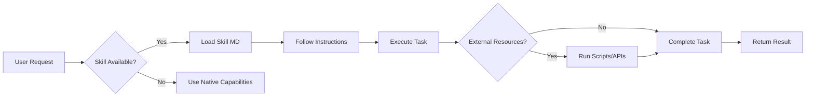
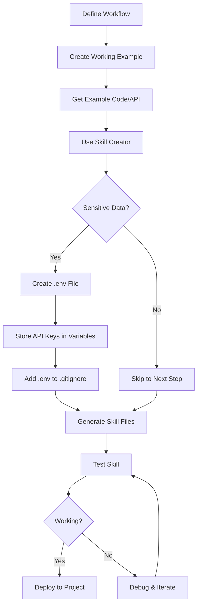

## Video Overview

This comprehensive 20-minute tutorial by Leon van Zyl covers everything you need to know about Claude Code Skills - from finding and installing skills to creating your own custom skills.

**Video:** [Claude Code Skills - The Only Tutorial You Need](https://www.youtube.com/watch?v=vIUJ4Hd7be0)
**Author:** [Leon van Zyl](https://www.youtube.com/@leonvanzyl)
**Duration:** 20m 53s

## Summary

Claude Code Skills allow you to extend Claude's capabilities by teaching it how to perform tasks it can't do natively, such as generating images. Skills are essentially markdown files with precise instructions that the agent follows when needed.

### Key Concepts

**Skills vs MCP Servers vs Custom Commands:**
- **Skills**: Auto-activated based on conversation context, minimal token usage, include domain knowledge and workflows
- **MCP Servers**: Always available in context with full metadata, provide tools (browsers, databases, etc.)
- **Custom Commands**: Purely reusable prompts, stored for easy access

**Why Skills are Preferred:**
- Minimal context consumption (only loaded when needed)
- Can include specialized workflows and domain knowledge
- Leverage Claude's existing knowledge and tools
- Can include additional resources like Python scripts

### Key Points Covered

1. **Finding Skills**: Use marketplaces like skills.sh or the official Anthropic marketplace
2. **Installing Skills**: Copy commands from skills.sh and install at project or global level
3. **Creating Skills**: Use the skill creator skill or build from documentation
4. **Sensitive Data**: Store API keys in `.env` files, never hardcode in skills
5. **Image Generation**: Skills can teach Claude to generate images using services like Nano Banana Pro or open-source models

### Skills Marketplace (skills.sh)

A fantastic ecosystem where you can:
- Search for new skills
- View trending and all-time favorite skills
- Install skills with simple CLI commands
- Find skills for specific needs (React, front-end design, browser automation, etc.)

Popular skills include:
- Find Skills skill
- Skill Creator
- Front-end Design
- React Best Practices
- Browser Use
- Image Generation

## Claude Code Skills Workflow

## Full Transcript

### [00:00] Introduction to Skills

Now, let's have a look at adding an image to this hero section. Please generate an image of a woman jogging next to the beach. The agent correctly identified that it's got access to our image generator skill. And if we have a look at it, we get this image with this little chatbot saying, "Hey, you got this. Keep going." And our displayer was replaced with an image generated by Claude Code.

We can use skills to give our agents access to extra capabilities. Like you saw in the intro, we were able to get Claude code to generate images, which is something that Claude can't do natively. So, in this video, you'll learn everything you need to know to get started with using skills, from finding and installing skills to creating your very own skills.

### [01:00] Understanding Skills

We'll also have a look at the differences between skills, MCP servers, and custom commands. And we'll also look at advanced topics like creating skills that rely on sensitive data like API keys.

This infographic describes it best. We can use skills to teach Claude code how to do something that it couldn't do natively. For example, generating images. Skills are basically markdown files with very precise instructions.

Along with those instructions, we can also include any other resources. For example, if the agent needs to generate an image, the markdown file will contain precise instructions on how to use a Python script to generate those images. Or another example is the front-end design skill which provides a lot of context and resources for building high-quality UI designs.

So we can use skills to specify very specific workflows and even provide domain knowledge. Basically, we can use skills to take existing knowledge built into Claude along with any tools that it already has access to to execute very specific workflows.

### [01:47] Skills vs MCP Servers

Skills get confused with MCP servers all the time. But the real difference is that MCP servers simply provide new tools to the agent. These tools could give the agent access to control a browser window or to access a database, etc.

Of course we can combine skills with tools to create very specialized workflows. Custom commands are purely reusable prompts. So custom commands are not really related to skills or MCP servers in any way. These are simply reusable prompts that users can store to easily access those prompts again.

Whereas skills are actually auto-activated by the agent based on conversation context. If we ask the agent to generate an image, it will then see it's got access to the image generation skill, pull in that skill's markdown file and then follow the instructions in that file to generate an image.

Of course, for MCP servers and any other tools, those will always be available in the agent's context. So, yes, you could have a tool that can generate images as well, but keep in mind that tool along with all of its metadata will be preloaded into the agent's context and consume tokens, whether or not the agent needs the tool or not.

### [02:59] Token Efficiency

That's why in some instances skills are preferred over MCP servers because as you'll see in this video, skills actually take up very little context. If you are interested in this infographic, I'll link to it in the description of this video.

I use Claude without any skills or MCP servers to create this landing page for a fitness app. So, this is very much based on the training data built into Claude and it doesn't look bad, but we will use our skills to greatly improve this design.

### [03:28] Adding Skills - Method 1: Marketplace

Of course towards the end of the video I'll show you how to create your own skill for generating images and then we'll replace this placeholder with our actual AI-generated image. So how do we add skills to Claude Code? Luckily, that's super easy. We can download skills from existing marketplaces (skills created by other users) or we can create our very own skills.

Let's start by downloading skills from existing marketplaces. Now there are really two ways to do this. One solution, and this is actually the most complex solution (I'll show you an easier way in a second), is to use the built-in plugins function within Claude Code.

Within Claude, we can go to plugins and by default, you won't see any plugins in this list. What you'll have to do is press right to go to marketplaces and then add a new marketplace like the official Anthropic marketplace.

These marketplaces are typically stored in GitHub repositories and Anthropic has this official repository which I'll link to in the description as well. In this repo we have access to several plugins. If we go into the plugins folder we can see all these available plugins.

Within there we have something like the front-end design skill which basically contains a folder for the skill itself and this markdown file containing very strict instructions on using this skill. Now we don't really care about the contents of these files at this stage. If you want you can definitely read through it but it's nothing more than very detailed instructions.

### [05:00] Adding Skills - Method 2: skills.sh (Easier)

Now there are many repositories out there and if you know the repository path all you have to do is copy the URL and then we can go to add marketplace, paste in that GitHub URL, and of course I'm getting this message because I've already installed this marketplace but for you you will now see this marketplace.

You will be able to browse all the plugins and you can simply press spacebar to select any plugins you want like this front-end design skill. So after selecting the skill that you want, you can simply press I on the keyboard to install that skill and then afterwards if we run the skills command we will see the front-end design skill has been installed.

This has been installed at user level. Now I'm going to show you a way easier way to find and install skills.

Simply go to this website: skills.sh

This is a really cool project from Verscell and this is an open agent skills ecosystem. This makes it really easy to search for new skills. You can also view all the trending skills, what's hot right now, or just have a look at all-time favorites. This is such a cool project.

### [06:10] Popular Skills

If we have a look at these all-time favorite skills, the most popular one seems to be this find skills skill. So with this skill we can ask the agent to automatically search this marketplace for a suitable skill and it will be able to install the skill itself.

Another really useful skill is a skill creator skill. So with this skill we can give our agent some instructions and it will be able to create a skill itself. There are so many really useful skills here.

I do recommend this Vue/React best practices skill if you're using Vite, React, or Next.js. And I also really like this front-end design skill.

### [06:49] Installing via skills.sh

Let's actually have a look at installing this skill. All we have to do is copy this command. Then back in our project, let's paste in that command and press enter. Now we can select our tool or CLI.

I've got Claude Code installed and I'm also using Cursor, so I'll just press space to select these tools. Let's press enter. Then we can specify if we want to use the skill at project level or globally across all of our projects.

I like setting up skills at project level because that way I can add them to the repository and my entire team will have access to the same skills. Then I'll select symlink. Let's proceed with installation.

### [07:27] Skill Installation Results

What this did is in the `.clauded` folder we now have this skills subfolder with this front-end design skill. And in here we've got our skill.md file. Since we also selected Cursor, we can find the skill in the Cursor folder as well. And as a catch-all, it's also created a skill in the agents folder. A lot of tools and frameworks use the agent folder as well.

Let's go ahead and install a few more. If you want to create video animations, you can install Emotion as well. It's a really cool and fine skill, but I'm actually going to install the Framer skills skill. Let's install this.

### [08:10] More Skills Installation

Let's also grab React best practices as I am using Next.js in this project. Let's install this skill. And if we wanted to give our agent access to a browser, we can install the browser use skill as well.

And that's it. I think you get the idea. So we've got a skill for using the browser. We've got a skill for finding skills in the marketplace. And then we have some skills to assist with front-end design and using React.

### [08:36] Viewing Skills and Token Usage

Right now, if we open Claude Code and we go to skills, we can see all of our project skills over here. If you don't see skills, simply restart Claude Code and they should be available.

And look at this. You can see that these skills barely use any tokens. If we run the context command, we can see token usage for skills over here as well. And although we've added a lot of skills to this project, we're barely using any tokens.

### [09:03] Context Loading

And that is because Claude only loads the minimum amount of context into memory. And only if the skill is needed will it dive into these folders to pull in all of these additional files and context. But until then, the context window is really lean.

There's actually a very nice way to visualize this by asking Claude code, "Please create an HTML file in the root of this project listing all of the skills that you have available. Do not dive into the details of skills. Only list the context that you have available at this current point in time on this page."

And this is the only information that's loaded into context at this point in time. It's just enough for the agent to be aware of what skills are available and when to use them.

### [09:46] Using Skills - Front-end Design

Speaking of using skills, let's get Claude to fix this UI. Please, can you use your front-end design skill to fix up this user interface? The website looks really bland and it's very sort of AI sloppy. So use your front-end design skill to create something that looks modern that represents an AI-powered fitness app. The only thing I want you to keep is the hero section with a placeholder image. We'll load the image after the fact.

Now, you might have noticed that I asked Claude explicitly to use the skill. Now you don't have to do that. The agent should be able to identify the skill and then use it automatically. But I personally like to nudge the agent towards using these skills.

### [10:26] Skill Activation and Context Loading

And look at that. The agent now loaded the skill into memory. And it's only at this point in time that all of this context, everything in here, and you can see this is really a large file.

All of this context is only loaded into the conversation at this point in time, unlike MCP servers where tools along with their documentation is always sitting in memory. So Claude is currently cooking and this app should look very different in a few moments.

### [10:54] Verifying with Browser

But so Claude made his changes but let's also get it to verify the changes by using the browser. Please use your browser use skill to verify your changes. The UI needs to look correct.

And there you go. I'm not pressing anything. This is the agent actually just going through the page itself and checking if everything is okay. I did ask the agent not to run the browser in headless mode because I wanted to see the browser myself.

I think the colors and font work way better with a fitness brand and I also like the new logo. Everything else just looks really professional.

### [11:30] Creating Custom Skills - Image Generation

Now let's have a look at adding an image to this hero section. Now by default Claude can't generate images. So what we can do is give it a skill to teach it how to generate images.

Creating skills is really easy. Of course, you can try to do it yourself by going through this documentation and then just following the instructions or what you can do is simply just copy the content of this page, give it to Claude and say, "Hey, I want you to create a skill based on this documentation and this is the skill that I want you to create."

An even easier solution is to simply download the skill creator skill.

### [12:02] Using Skill Creator

So copy this command. Then let's run this skill. I'll select Claude Code. We'll install it at project level. And now our agent has access to a skill creator skill. I'll just restart Claude Code.

Now this is really up to you. I'm going to use Nano Banana Pro which is a paid service for generating these images, but I think for fun and as an added bonus, I'll also show you how to use an open-source model which is completely free and it should work on everyone's hardware.

### [12:35] Community Resources

But before we create our own skill, you might want to join my school community. This is a fantastic place for accessing all resources in my videos, and you can share ideas and get assistance from like-minded people in this community.

So, if you want a structured way to learn all of these different skills, then this is the place for you. I also started uploading exclusive videos and Q&A live streams. And I've only priced this at $7 a month, which is a complete steal for the value, and you will be supporting my channel.

### [13:02] Open-Source vs Paid Models

Now, as I mentioned, we will be using Nano Banana Pro to generate these images. But I do want to prove to you that it is possible to use open-source models as well.

So, in this other repository, I created this local image gen skill. This will use a free open-source model to generate images. So you don't need an API key, you don't need accounts, there's no cost involved, nothing.

The agent will simply run this Python script. And this script uses a really tiny model for generating these images, which means we can simply ask Claude code, "Please use your local image gen skill to generate an image of a dog. Please store it in the open images folder." And let's just send that.

It's just for fun. The agent is loading in that local image gen. It's now running the underlying Python script for generating the image. And now we have this dog.png PNG file which is a little bit tiny but indeed it is an image of a dog.

### [13:59] Open-Source Model Limitations

Now I probably won't use this to generate anything photorealistic but this could be useful for generating icons or user profile images. And of course you don't have to use this specific model either. You can go on Hugging Face and generate something that will work on your hardware setup.

If you are interested in playing around with this skill I'll upload it to the community. But what you're interested in is building your own skills.

### [14:19] Creating Nano Banana Pro Image Generation Skill

So how can we create a Nano Banana image generation skill that Claude Code can use? The first thing is to figure out what that workflow actually looks like.

So when you define a skill, remember skills are really these predetermined or procedural workflows that you want the agent to go through whenever performing an action.

For generating images with Nano Banana Pro, we need the agent to use a script. And the easiest way to do that is to create a working example.

### [14:50] Creating Working Example

So, I'll simply go to AI Studio.google.com and I'll select the Nano Banana Pro model. Then for the aspect ratio, I'll just select an example like this. A woman running on beach. I'll just add photorealistic. Let's run this.

And cool. We now have this image. So, let's go to get code. And now we have this example code snippet. So, I'm actually going to copy this.

### [15:18] Creating the Skill

Then back in our project, let's say, "I need you to create a new skill using your skill creator skill. This skill will allow us to generate images using the Nano Banana Pro model from Google. Here is an example code snippet for generating images. Keep in mind that images can be 1K, 2K, or 4K. Always default to 1K unless otherwise specified. For the aspect ratio, generate square images by default. Always store images in the following folder."

Then I'll just type `public/generated images`.

### [15:54] Working with Sensitive Data

But here is a really important topic. Working with sensitive data, including things like API keys. The Gemini API, as with many other SDKs and APIs, require an API key to work. So this is actually expecting a Gemini API key to be passed to it.

Now you do not want to hardcode these keys in skills because if you deploy that skill or maybe even share it with someone else, you're going to leak your API key.

### [16:24] Secure API Key Storage

So how do you store sensitive data and securely pass it to these skills? Well, in this instance, what we have to do is create a new file in the root of the project and call it `.env`.

This `.env` file should always be excluded by git and should never be published to the repository. So in your ignore file, always ensure that you are excluding `.env` files. And if you don't have an ignore file in your project, simply create one.

### [16:50] Creating the .env File

Then in this file, I'm going to create this variable. So in AI Studio, I'll go to get API key. You can just create a new key or I'll just reuse this one. And I'm going to do this off camera, but all you have to do is paste in your key and save this `.env` file.

### [17:08] Instructing Claude About the API Key

Now I'm going to tell Claude I have already created a `.env` file and I stored the Gemini API key in that file under this variable like so.

So just always keep in mind if you are working with sensitive data, please do not pass it to Claude directly and please don't ask Claude to hardcode it in the skill itself.

### [17:27] Running Skill Creator

Right, let's run this.

And as you can see, the skill creator skill was loaded. And of course, it's asking a few questions like, "You mentioned an example code snippet for generating images with a Nano Banana Pro model, but it wasn't included." All right, that's my bad.

So, I'm just going to pass that to Claude.

### [17:43] Generated Skill Review

All right, so we now have this image generator skill. If we have a look at the skills file, we have a description and all of the instructions for using the script as well as all of the different sizes and aspect ratios. This is really really cool.

Now the secret source behind the skill is this script. So in the scripts folder we have this Python file and it's this Python file that's going to use the Gemini SDK to generate the image. And this is grabbing the Gemini API key from our environment variables. It's not hardcoded in the script at all.

### [18:20] Testing the Image Generation Skill

So let's test it out. I'm actually going to exit out of Claude Code. Let's go back in. Let's say, "Please generate an image of a woman jogging next to the beach. There should be a little AI assistant floating just behind her shoulder, motivating her to keep going."

I accidentally pressed escape. So, let's just say resume.

The agent correctly identified that it's got access to our image generator skill. It's running the Python script. All right. So we've got our new file in this generated images folder. And if we have a look at it, we get this image with this little chatbot saying, "Hey, you got this. Keep going."

This will be perfect image to use on our website.

### [19:00] Image Optimization Skill

But problem is if we have a look at the file size, this is over 600 kilobytes, which is way too big for a website. So thankfully, what we can do is create a new skill.

So let's say, "Please create a new skill. What I want this skill to do is I'm going to provide a link to an image. And this image needs to be optimized for a website. At the moment, these images are massive. So I want them to be resized for use in a website and they should be high quality enough to be used in a hero section and they should be converted to WebP. These converted images should then be moved to public folder."

I'm actually just going to type `public/assets` like that.

### [19:44] Creating Image Optimizer Skill

All right, let's send this.

So now in the `.claude` folder under skills we now have this image optimizer skill which also uses a Python script for resizing images and converting them to WebP. So I'll just restart Claude Code again and let's say, "Please use your optimize image skill on this image." Then let's throw in this image that we generated earlier.

Let's send this. And just as a reminder, this image is 631 KB.

### [20:12] Image Optimization Results

And now we have this assets folder. And in here, let's open up this version of the image. And as you can see, details are all there. This looks fantastic.

But this version of the image is only 56 KB. That's way better.

### [20:26] Final Website Update

Please, can you replace the placeholder on the homepage with this optimized image? And let's send this.

And now this placeholder was replaced with an image generated by Claude Code. How awesome is that?

### [20:38] Conclusion

If you enjoyed this video, please hit the like button and subscribe to my channel for more Claude Code and AI Agent Coding tutorials. Then also check out this other video and I'll see you in the next one. Bye-bye.

---

## Skill Development Workflow

## Key Takeaways

1. **Skills extend Claude's native capabilities** - Teach it to do things it can't do out of the box
2. **Minimal token usage** - Skills only load context when actually needed
3. **Easy discovery and installation** - Use skills.sh marketplace for one-command installs
4. **Skill Creator automates development** - Give it requirements and it builds the skill
5. **Secure API key handling** - Always use `.env` files, never hardcode credentials
6. **Combining skills is powerful** - Chain multiple skills together for complex workflows

## Resources

- **skills.sh**: Open agent skills ecosystem
- **Official Anthropic Marketplace**: GitHub repository with curated skills
- **Skill Creator**: Automate skill creation
- **Nano Banana Pro**: Paid image generation service
- **Local Image Gen**: Free open-source alternative

## Tags
youtube, Claude Code, skills, tutorial, AI, development, image generation, front-end design