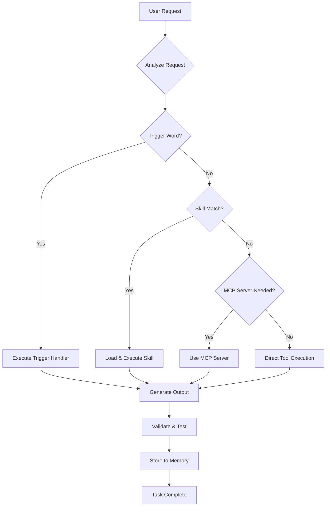

## Introduction

This document provides a complete overview of my agent system architecture, including all operational instructions, skills, MCP servers, trigger words, and workflows that enable autonomous and efficient task execution.

---

## System Architecture Overview

### Core Components

The agent system is built on three foundational pillars:

1. **OpenCode** - The primary orchestration platform (CLI-based AI agent interface)
2. **Skills** - 47+ specialized skill modules for domain-specific tasks
3. **MCP Servers** - Model Context Protocol servers for extended capabilities (context retrieval, memory, web search, etc.)

### Flow Diagram



---

## Global Rules & Trigger Words

The system uses 30+ trigger words for instant task routing. Here are the primary categories:

### Memory & Information Triggers

| Trigger | Description | Action |
|---------|-------------|--------|
| `mem check` | Run comprehensive memory system status check | Displays memory state, OpenMemory status, OOM activity, recommendations |
| `mem` | Check memory for specific topic | Queries OpenMemory for relevant information |
| `remember` | Store information to OpenMemory | Saves content with appropriate tags and metadata |
| `gr` | Display global rules | Shows /media/docs/instructions/global-instructions.md |

### System & Operations Triggers

| Trigger | Description | Action |
|---------|-------------|--------|
| `c` or `containers` | Container and service review | Shows Docker containers, native services, statistics, issues |
| `perf` | Performance review | Disk I/O, network latency, last hour analysis |
| `process check` | System status check | OpenMemory, containers, resources, monitoring, OOM status |
| `check` | Comprehensive check | All of above in formatted sections |
| `cleanup` | Disk space cleanup | Executes /root/scripts/disk-cleanup.sh |
| `cron` | Cron job status | Shows scheduled tasks, execution times, success/failure |

### Documentation & Output Triggers

| Trigger | Description | Action |
|---------|-------------|--------|
| `o` | Save output to MD | Copies current output to /media/docs/output |
| `u` | Update documentation | Updates instructions/docs to reflect changes |
| `commands` | List trigger words | Shows all available trigger words |

### Task & Workflow Triggers

| Trigger | Description | Action |
|---------|-------------|--------|
| `co` | Continue/Resume | Continues with current task |
| `init` | Initialize project | Sets up AGENTS.md for project-specific instructions |
| `skills` | Display skill menu | Shows all available skills with descriptions |
| `skill` | Interactive skill selection | Presents options via question tool |
| `review weekly/monthly/quarterly` | Storage quality review | Audits OpenMemory storage quality |

### Specialized Operations Triggers

| Trigger | Description | Action |
|---------|-------------|--------|
| `YouTube URL` | Video transcription | Full workflow: extract transcript → summarize → blog post |
| `blog post` or `WordPress` | Blog management | Creates/manages WordPress blog posts |
| `mermaid` or `diagram` | Diagram generation | Creates Mermaid visualizations |
| `api` | Use z.ai environment | Accesses API URL and key from environment |
| `opencodeskill` | OpenCode configuration | Configuration expertise for agents, skills, MCP |
| `git` | Git backup strategy | Backup/restore for 4 GitHub repositories |
| `checkpoint` or `ch` | Create checkpoint | Backs up global rules, skills, patterns, scripts, gateways |
| `smooth` | Load Smooth Protocol | Analyzes task, improves, runs 3+ test cycles |
| `clarity` | Ask clarifying questions | Ensures understanding before proceeding |
| `advise` or `advice` | Provide recommendations | Improvements, next steps, errors, design, strategy |

---

## Skills: 47+ Domain-Specific Modules

### Infrastructure & Deployment Skills

| Skill | Purpose | Location |
|--------|---------|-----------|
| **dokploy** | Container deployment platform management | `/root/.opencode/skill/dokploy/` |
| **portainer** | Container management UI | `/root/.opencode/skill/portainer/` |
| **homarr** | Dashboard container & database | `/root/.opencode/skill/homarr/` |
| **maintenance** | System maintenance & monitoring | `/root/.opencode/skill/maintenance/` |

### AI & Content Skills

| Skill | Purpose | Location |
|--------|---------|-----------|
| **fabric** | AI pattern framework integration | `/root/.opencode/skill/fabric/` |
| **news** | Multi-source news aggregation (Hacker News, tech, geopolitics) | `/root/.opencode/skill/news/` |
| **glm-slide** | Slide/poster creation with GLM AI | `/root/.opencode/skill/glm-slide/` |
| **crawl4ai** | Web scraping and data extraction | `/root/.opencode/skill/crawl4ai/` |
| **agent-browser** | Browser automation (95% success rate) | `/root/.opencode/skill/agent-browser/` |
| **transcription** | Audio/video transcription | `/root/.opencode/skill/transcription/` |

### Data & Knowledge Skills

| Skill | Purpose | Location |
|--------|---------|-----------|
| **openmemory** | Semantic memory storage & retrieval | `/root/.opencode/skill/openmemory/` |
| **databases** | Database management (PostgreSQL, MySQL, Redis, MongoDB) | `/root/.opencode/skill/databases/` |
| **research** | Enterprise-grade research methodology | `/root/.opencode/skill/research/` |
| **context7** | Documentation & code example search | MCP server |

### Development Skills

| Skill | Purpose | Location |
|--------|---------|-----------|
| **astro** | Astro static site framework | `/root/.opencode/skill/astro/` |
| **hugo** | Hugo static site creation & publishing | `/root/.opencode/skill/hugo/` |
| **chartjs** | Chart integration for Hugo/Memos | `/root/.opencode/skill/chartjs/` |
| **presentation** | Presentation creation (Slidev, Reveal.js, Marp) | `/root/.opencode/skill/presentation/` |
| **beautiful-mermaid** | Mermaid diagram styling | `/root/.opencode/skill/beautiful-mermaid/` |

### Content Management Skills

| Skill | Purpose | Location |
|--------|---------|-----------|
| **memos** | Note-taking system management | `/root/.opencode/skill/memos/` |
| **kavita** | Digital library & ebook collection | `/root/.opencode/skill/kavita/` |
| **affine** | Knowledge base & workspace | `/root/.opencode/skill/affine/` |
| **copyparty** | File server with indexing | `/root/.opencode/skill/copyparty/` |
| **filebrowser** | File management interface | `/root/.opencode/skill/filebrowser/` |

### Workflow & Automation Skills

| Skill | Purpose | Location |
|--------|---------|-----------|
| **activepieces** | Workflow automation platform | `/root/.opencode/skill/activepieces/` |
| **ralph-loop-mine** | Autonomous iterative development | `/root/.opencode/skill/ralph-loop-mine/` |
| **task-management** | Task tracking CLI | `/root/.opencode/skill/task-management/` |
| **cronflow** | Workflow analysis & optimization | `/root/.opencode/skill/cronflow/` |
| **flow** | Execution flow analysis | `/root/.opencode/skill/flow/` |

### OpenCode Core Skills

| Skill | Purpose | Location |
|--------|---------|-----------|
| **opencode** | OpenCode configuration expertise | `/root/.opencode/skill/opencode/` |
| **update-gr** | Global instructions management | `/root/.opencode/skill/update-gr/` |
| **versions** | Git backup version checking | `/root/.opencode/skill/versions/` |
| **git-backup-strategy** | Backup management & automation | `/root/.opencode/skill/git-backup-strategy/` |

### Analysis & Review Skills

| Skill | Purpose | Location |
|--------|---------|-----------|
| **skillscompare** | Skill ecosystem comparison | `/root/.opencode/skill/skillscompare/` |
| **ceo-board-prep** | Board meeting preparation | `/root/.opencode/skill/ceo-board-prep/` |
| **system-review** | System health review | `/root/.opencode/skill/system-review/` |

### Utility Skills

| Skill | Purpose | Location |
|--------|---------|-----------|
| **freya** | T-shirt bleaching & tie-dye | `/root/.opencode/skill/freya/` |
| **mindsdb** | Machine learning database | `/root/.opencode/skill/mindsdb/` |
| **smart-search** | Advanced search capabilities | `/root/.opencode/skill/smart-search/` |
| **skill-pattern-discoverer** | Integrated skill/pattern discovery | `/root/.opencode/skill/skill-pattern-discoverer/` |
| **skill-catalogue** | Skill inventory management | `/root/.opencode/skill/skill-catalogue/` |

---

## MCP Servers (Model Context Protocol)

### Available MCP Servers

| Server | Purpose | Access |
|---------|---------|---------|
| **openmemory** | Semantic memory storage, retrieval, reinforcement | http://localhost:8080 |
| **context7** | Documentation & code example search | Context7 API |
| **brave-search** | Web search via Brave API | Brave Search API |
| **agent-browser** | Browser automation & testing | Vercel Agent Browser |
| **webfetch** | URL content fetching | WebFetch MCP |
| **websearch** | Real-time web search (Exa AI) | WebSearch Prime |
| **codesearch** | Code example search (Exa Code) | Exa Code API |

### MCP Server Capabilities

#### OpenMemory MCP
- `openmemory_openmemory_store` - Add memories with metadata
- `openmemory_openmemory_query` - Semantic search with filters
- `openmemory_openmemory_list` - List recent memories
- `openmemory_openmemory_get` - Retrieve specific memory by ID
- `openmemory_openmemory_reinforce` - Boost memory salience

#### Context7 MCP
- Library/package name resolution
- Documentation fetching for libraries
- Code example search

#### Brave Search MCP
- General web queries
- News and article search
- Online content gathering

---

## OpenMemory Integration

### Memory Sectors

The system uses five memory sectors for intelligent classification:

| Sector | Content Type | Examples |
|---------|--------------|-----------|
| **Episodic** | Events, experiences, conversations with timestamps | "User requested X on 2026-02-11" |
| **Semantic** | Facts, knowledge, decisions, preferences | "Always use Python 3.11+" |
| **Procedural** | How-to workflows, procedures, installation steps | "Install Docker with these commands..." |
| **Emotional** | Strong feelings, moods, reactions | "Frustrated by this error" |
| **Reflective** | Insights, meta-cognition, learnings | "This pattern works better..." |

### Automatic Memory Triggers

The system automatically stores memories when:

1. **Long User Prompts** (>20 words) - with tags `user-prompts, communication`
2. **Explicit "remember" Keyword** - stores following content
3. **User Preferences** - "I prefer", "always use", "my setting" → tag `preferences`
4. **Procedures/Workflows** - how-to content → tag `procedural`
5. **Important Decisions** - "We decided", "Let's use" → tag `semantic` with metadata `decision=true`
6. **Successful Procedures** - after complex task completion → tag `procedural` with metadata `success=true`

### Memory Decay System

- **Lambda**: 0.02 (decay rate)
- **Interval**: 1440 minutes (24 hours)
- **Threads**: 3 parallel processing
- **Ratio**: 0.03 (threshold for reinforcement)

---

## Key Protocols & Workflows

### Browser Validation Protocol (CRITICAL)

**Tool**: Vercel Agent Browser (95% success rate)

**Required Workflow**:
1. **Pre-Validation** - Start server, verify accessibility
2. **Snapshot Navigation** - Navigate to local service
3. **Structure Analysis** - Run `agent-browser snapshot` for interactive references
4. **User Journey Testing** - Click buttons, fill forms, navigate menus
5. **Artifact Collection** - Take screenshots at key validation points
6. **Error Detection** - Check visual issues, console errors
7. **Session Cleanup** - Always run `agent-browser close`

### Skill Priority Guidelines

1. **Skills First** - Check for appropriate OpenCode skills before patterns
2. **Pattern Supplement** - Only then check Fabric patterns
3. **Skills Override** - Skills ALWAYS override similar patterns when available
4. **Reliability** - Established skills preferred over experimental patterns

### Container Deployment Protocol

**MANDATORY Checklist** for any web server/container:

1. **Port Availability Check** - `ss -tlnp | grep :<port>`
2. **Configuration Updates** - Update ALL files referencing the port
3. **Container Logging Setup** - Configure adequate verbosity and log locations
4. **Service Startup** - Monitor container logs for errors
5. **Post-Deployment Testing** - Use agent browser to verify:
   - Web interface (UI, navigation, responsive design)
   - API endpoints (functionality, data formats)
   - Service health checks
   - Authentication flows
   - Container restart validation
6. **Persistence Verification** - Reboot to confirm fix survives

### YouTube Workflow Protocol

**Automatic execution** when YouTube URL detected:

**Phase 1 - Transcript Extraction** (Script):
- Execute `python /media/docker/commands/youtube_transcript_extractor.py "<URL>"`
- Extract full transcript with metadata
- Save JSON: `/media/docs/output/youtube_[title]_[id]_[ts].json`
- Save TXT: `/media/docs/output/youtube_[title]_[id]_[ts].txt`

**Phase 2 - Summarization** (Agent-generated):
- Analyze transcript for key points, themes, insights
- Generate comprehensive summary with executive summary
- Save: `/media/docs/output/youtube_[title]_[id]_[ts]_summary.md`

**Phase 3 - Short Summary** (Automatic):
- Extract key points from comprehensive summary
- Create 2-3 sentence executive summary
- Save: `/media/docs/output/youtube_[title]_[id]_summary_short.md`

**Phase 4 - Blog Post Creation** (Agent):
- Create Hugo post with proper frontmatter
- Structure with H2/H3 headings
- Add Mermaid diagram if themes suggest visualization
- Include references to transcript and summary files
- Publish to: `/media/docker/website/content/posts/youtube-[id]-[slug].md`

**Phase 5 - Verification** (Parallel):
- Run Hugo syntax validation
- Navigate to post URL with agent browser
- Verify rendering and functionality

---

## Code Style Guidelines

### Python
- **Formatting**: Black (88 chars line width)
- **Naming**: snake_case for variables/functions, PascalCase for classes
- **Imports**: Group stdlib, third-party, local
- **Async**: Use async/await, avoid callbacks
- **Error Handling**: Try/catch with specific exceptions

### JavaScript/TypeScript
- **Formatting**: Biome
- **Naming**: camelCase for variables/functions, PascalCase for classes/components
- **Types**: Strict TypeScript, type annotations everywhere
- **Imports**: Absolute imports preferred

### Build/Lint/Test Commands

| Language | Build | Lint | Test |
|-----------|-------|-------|-------|
| **Python (OpenMemory)** | `make build` | `make lint` | `make test` |
| **JavaScript (JS projects)** | `npm run build` | `npm run lint` (Biome) | `npm test` (Vitest) |
| **Single Tests** | - | - | `cd tests/py-sdk && python test-sdk.py` |
| **Single Tests (JS)** | - | - | `npx vitest run path/to/test.ts` |

---

## Critical Restrictions

### OpenCode Process Restrictions

**NEVER restart OpenCode processes** unless explicitly authorized:

**Prohibited Actions**:
- Do NOT restart any OpenCode server processes
- Do NOT restart processes on port 4096
- Do NOT execute `kill <PID>` for OpenCode
- Do NOT modify OpenCode configuration that triggers restart
- Do NOT stop/start OpenCode services without authorization

**Required Authorization**:
1. STOP and ask for explicit confirmation
2. Explain exactly what operation you're planning
3. Wait for clear authorization
4. Document the reason for the restart

### No Display-Only Restrictions

**NEVER impose "display-only" restrictions**:
- Always execute requested actions fully
- Write files instead of just displaying content
- Execute commands instead of just showing what would happen
- Deploy/create instead of just describing steps
- Only exception: explicit user authorization needed for security

---

## Global Instructions Modification Protocol

When adding/modifying rules in `global-instructions.md`:

1. **Check for Existing Instructions** - Ensure no duplication
2. **Impact Analysis** - Analyze impact on existing workflows
3. **Conflict Resolution** - Identify and resolve conflicts
4. **Validation** - Test new rule integration
5. **Documentation** - Follow established format

---

## AGENTS.md Update Protocol

When creating/updating AGENTS.md files:

**Must Include**:
- **Web Server Testing Requirements** - Always use agent browser after deployment
- **Critical Testing Checklist** - Web interfaces, API endpoints, service health, authentication, container restarts

**Project-Specific AGENTS.md**:
- If AGENTS.md doesn't exist in project directory, create one
- Include project-specific agent instructions and configurations

---

## File Locations Reference

### Key Configuration Files

| File | Purpose |
|-------|----------|
| `/media/docs/instructions/global-instructions.md` | Global rules and trigger words |
| `/root/AGENTS.md` | Coding agent guidelines |
| `/root/.config/opencode/opencode.json` | OpenCode configuration |
| `/root/.opencode/skill/[skill_name]/SKILL.md` | Skill documentation |

### Documentation Directories

| Directory | Purpose |
|------------|----------|
| `/media/docs/output/` | Generated documents, scripts, reports |
| `/media/docs/instructions/` | Operating instructions and guides |
| `/media/docs/apis/` | API documentation collection |
| `/media/docker/` | Container projects and configurations |

### Memory & Logs

| Location | Purpose |
|----------|----------|
| `/data/openmemory.db` (in container) | OpenMemory database |
| `/media/docker/openmemory-data/` | OpenMemory persistent storage |
| `/root/.local/share/opencode/log/` | OpenCode session logs |
| `/var/log/` | System logs and cron reports |

---

## Quick Reference

### Essential Commands

```bash
# Start Hugo site
cd /media/docker/website && hugo server --port 1314 --bind 0.0.0.0

# Create memo via API
bash /media/docs/output/memos-create.sh "# My Note"

# List containers
docker ps --format "table {{.Names}}\t{{.Status}}\t{{.Ports}}"

# Check memory status
openmemory_openmemory_list --limit 10

# Navigate with agent browser
agent-browser browser_navigate --url "http://ubuntu58-1:3000"
agent-browser browser_snapshot
agent-browser browser_close
```

### Access URLs

| Service | URL |
|---------|------|
| **Hugo Blog** | http://ubuntu58-1:1314 |
| **Memos** | http://ubuntu58-1:5230 |
| **OpenMemory Dashboard** | http://ubuntu58-1:3006 |
| **OpenMemory API** | http://ubuntu58-1:8080 |
| **Homepage Dashboard** | http://ubuntu58-1:8765 |
| **Portainer** | https://ubuntu58-1:9443 |

---

## Summary

This agent system architecture provides:

- **47+ Skills** covering infrastructure, AI, content, databases, development, and more
- **30+ Trigger Words** for instant task routing and automation
- **7 MCP Servers** for memory, context, search, and browser capabilities
- **5 Memory Sectors** for intelligent classification and retrieval
- **Critical Protocols** for browser validation, deployment, and workflow management
- **Automatic Memory Storage** triggered by long prompts, decisions, and procedures

The system ensures consistent, context-aware assistance through proper skill prioritization, memory integration, and comprehensive testing protocols.

---

**Last Updated**: 2026-02-11
**OpenCode Version**: Current
**Total Skills**: 47+
**Total MCP Servers**: 7
**Total Trigger Words**: 30+