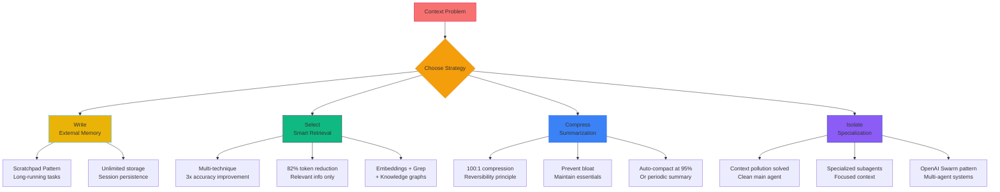

## Quick Overview

This video from AI RoundTable explores **context engineering** as a critical optimization layer for production-ready LLM agents. As agents scale from simple tools (5-10) to complex systems (30+), context window management becomes the primary failure point—not prompting or model limitations. The video presents four core strategies (**Write, Select, Compress, Isolate**) that can reduce token costs by 78-85% while dramatically improving reliability.

## The Hidden Problem Behind Agent Failures

You build an LLM agent, give it five tools, and everything works perfectly. Your project grows—you add ten more tools, still fine. Then you reach thirty tools, and suddenly the agent starts making strange decisions. It misses obvious tool calls or fails tasks it used to handle easily.

If this sounds familiar, you're not alone. The interesting part? The problem usually isn't the prompt. It isn't even the model. It's something much more fundamental.

To understand what's happening, we need to talk about the **context window**.

## Context Window: The RAM of LLM Agents

Think of an LLM like an operating system. The model is the CPU, and the context window is the RAM. Just like RAM, it has limited capacity, and everything competes for that space.

Your system prompt, conversation history, tool definitions, retrieved documents, intermediate results—they all live in that finite window. Imagine this breakdown:
- 10K tokens for your system prompt
- 50K for conversation history
- 30K for tools
- 25K for retrieved documents
- 35K for tool results

That's **150,000 tokens** trying to fit into a 128,000 token window. Something has to go, and once the window fills up, the model starts losing track of what actually matters. This isn't something we can fix with better prompting alone. We need a different solution.

## Four Types of Context Failures

When context gets out of control, we typically see four kinds of failures:

### 1. Context Poisoning

A hallucination or error makes its way into the context and keeps getting referenced, compounding the mistake over time. [DeepMind documented this phenomenon with their Pokemon-playing agent](https://www.deepmind.com/blog/playing-atari-with-deep-reinforcement-learning)—it hallucinated a game state, and from there the agent's decisions just kept getting worse.

### 2. Context Distraction

The context becomes very large, so the model starts leaning more on recent patterns instead of what it learned during training. [Databricks research showed that even massive models like LLaMA 3.1 start losing accuracy well before hitting their theoretical limits](https://www.databricks.com/blog/llama-3-context-length).

### 3. Context Confusion

Too much irrelevant information makes it hard for the model to focus, causing it to call wrong tools or produce lower-quality responses.

### 4. Context Clash

Contradictory information exists in the context, and the agent can't reconcile it.

There's also fascinating research called "lost in the middle" that shows models perform best with information at the beginning or end of the context window, but accuracy drops significantly for information in the middle. So even with huge context windows, important details can effectively disappear. This isn't a bug—it's how LLM architecture works.

## Four Core Context Engineering Strategies

The industry has emerged four core strategies to solve this problem: **Write, Select, Compress, and Isolate**. These patterns appear in CloudCode, Cursor, and all successful agent frameworks. Let's explore each one.

## Strategy 1: Write (External Memory)

Write is about external memory. The core idea is simple: don't force the model to remember everything. Instead, save information outside the context window.

Think about how you work. When solving a complex problem, you take notes, write down intermediate results, and don't try to keep everything in your head. Agents need to do the same thing. This is the **scratchpad pattern**.

Use this method for long-running tasks—anything with dozens of tool calls, lots of intermediate state, or situations where you need to preserve information across many steps.

### Real Example

[Anthropic's multi-agent researcher system uses a component called "lead researcher" before it starts delegating work to other agents](https://www.anthropic.com/research/multi-agent-communication)—it writes its plan to external memory. the "lead researcher" before it starts delegating work to other agents. It writes its plan to external memory. Why? Because if the context window exceeds the threshold, it gets truncated. Without that external memory, the plan gets lost and the whole system falls apart. With external memory, the agent writes once, retrieves when needed, and keeps going.

### Trade-offs

**Positive**: You prevent context overflow and get essentially unlimited storage with persistence across sessions.

**Negative**: You add complexity. You need to manage external state and implement logic for when to write, what to write, and when to retrieve. But for long-running agents, it's often necessary.

## Strategy 2: Select (Smart Retrieval)

Select is about smart retrieval—only putting into context what you actually need and when you need it.

You don't load your entire file system into RAM. You load the files you're working with. Modern code agents like [Cursor](https://cursor.sh) and [v0.dev](https://v0.dev) utilize this method. They use multiple retrieval techniques in parallel:
- **Embedding-based semantic search** for finding similar code
- **grep for exact string matches**
- **Knowledge graphs** for understanding relationships between files
- **AST parsing** to understand code structure

### The 3x Improvement

This multi-technique approach gets **three times better retrieval accuracy** compared to using just one method—which is not a small improvement. The key is that different types of queries need different retrieval techniques.

### Trade-offs

**Positive**: You can dramatically reduce tokens (82% reduction in some cases), only relevant information makes it into context, and if you already have a knowledge base or vector database, this integrates naturally.

**Negative**: You need a good retrieval system. If your retrieval is bad, you'll miss important information. There's also added latency for the retrieval step itself. But when it works, it works very well.

## Strategy 3: Compress (Efficiency)

With compress, you retain only the tokens you actually need. This involves summarization and pruning—you use an LLM to condense conversation history, removing old messages that no longer matter and keeping only essential information.

### When to Trigger Compression

- **Auto-compact** when you hit 95% of your context window
- **Periodic summarization** every N conversation turns
- **Before expensive operations** to reduce cost

### The Reversibility Principle

There's a concept called the reversibility principle that suggests you can achieve **100:1 compression ratios**. For example, take a 50,000 token web page, compress it to a 500 token summary plus the URL. If you need the full content later, you can always retrieve it.

[CloudCode does this automatically](https://code.cursor.sh/blog/context-aware-code-editing)—when context usage gets high, it triggers a background process to summarize the conversation history.

### Trade-offs

**Positive**: You prevent bloat, get massive token savings, and if you do it carefully, you can maintain all important information.

**Negative**: If you're too aggressive with compression, you can lose critical details. Summarization itself requires an LLM call, which adds cost and latency, and deciding what's important isn't always straightforward.

## Strategy 4: Isolate (Specialization)

Isolate is about splitting context across specialized subagents. Each subagent gets a focused context window for a narrow task.

### The Pattern

Your main agent receives a complex task. Instead of doing everything itself, it delegates to specialized subagents. Each subagent works in isolation with its own set of tools and instructions. They do their work and return only a summary to the main agent.

This solves a specific problem called **context pollution**. Imagine you need to read through a massive log file to find information. If the main agent does that, its context gets filled with thousands of lines of logs. But if a subagent handles it and returns just the answer, the main agent's context stays clean.

[OpenAI Swarm](https://platform.openai.com/docs/guides/productionizing-agents) and Anthropic's multi-agent systems both use this pattern extensively.

### Trade-offs

**Positive**: You prevent context clash because each agent is optimized for its specific task, so the system scales better than trying to build one "super agent."

**Negative**: You face architectural complexity. You need coordination between agents, and information can get lost during hand-offs if you're not careful. This is probably the most sophisticated strategy, but for complex domains, it's often the right choice.

## Token Savings by Strategy

The impact of these strategies is substantial. Using an example of 70 tools:

- **Native (no optimization)**: 3,663 tokens
- **Write**: 3,500 tokens (5% savings)
- **Compress**: 1,200 tokens (67% reduction)
- **Select**: 646 tokens (82% reduction)
- **Isolate + Select**: 564 tokens (85% reduction)

Overall, we're talking about **78-85% cost reduction** just by being smart about context management.

## Real-World Scenarios

### Scenario 1: 10-Turn Conversations

**Problem**: History accumulates, old context becomes irrelevant, and you start hitting token limits.

**Solution**: Combine **select and compress**. Use retrieval to put in only relevant parts of conversation history and summarize all terms that don't matter anymore.

### Scenario 2: 50+ Tool Calls Per Task

**Problem**: Intermediate results pile up fast, and the agent needs to reference earlier steps, causing context to explode.

**Solution**: **Write + compress**. Use a scratchpad to store intermediate results externally and summarize tool outputs before adding them to context. The agent can access everything it needs without overloading the context window.

### Scenario 3: Multi-Domain Operations

**Problem**: Cross-domain queries, conflicting tool definitions, and context confusion.

**Solution**: **Isolate + select**. Create specialized subagents for each domain and use routing to direct queries to the right agent. Each agent operates with a clean, focused context.

### Scenario 4: Large Document Processing

**Problem**: Documents exceed the context window, and you can't chunk them without losing coherence.

**Solution**: **Compress + write**. Summarize document chunks intelligently, store full documents externally, and retrieve specific sections when the agent needs more detail.

### Scenario 5: Gradual Agent Failure

**Problem**: Your agent works great initially, then starts failing, and you're wondering what happened. This is that classic context poisoning scenario.

**Solution**: Add error handling to catch bad information before it gets into context, use compression to periodically clean out potentially corrupted context, and implement validation checks. Detect context poisoning early through systematic monitoring of agent decisions. When performance degrades unexpectedly, roll back to the last known good state and rebuild context from there. This prevents compounding errors and allows for systematic debugging of what caused the poisoning in the first place.

## Production Patterns

### 1. Self-Healing

When a tool call fails, catch that error and feed it back into context. LLMs are surprisingly good at reading error messages and adjusting. To keep your agent from getting stuck, set a simple rule—for example, three strikes, then escalate to a human or reset.

### 2. Context Budget Monitoring

Track token usage at every turn. Set auto-compact triggers at 80-90% of your limit and don't wait until you hit the ceiling.

### 3. Response-as-Prompt Engineering

Structure your tool outputs carefully. Use XML or JSON. Add metadata hints. Include inline instructions in the response itself. Remember, the way you format tool outputs shapes how the agent thinks about the next step.

### 4. Hybrid Approaches

You don't have to pick just one strategy. For example, select relevant documents, compress conversation history, and isolate complex subtasks. This is the strategy that real production systems usually use.

## Key Takeaways

1. **The context window is a scarce resource**—just like RAM. Treat it that way and don't waste it.

2. **You have four strategies**: Write for external memory, Select for smart retrieval, Compress for efficiency, and Isolate for specialization.

3. **Most agent failures are context failures**, not model failures. So when your agent breaks, look at the context first.

4. **Start simple**. You can begin with Select and Compress, which give you the biggest wins with the least complexity, then add Write and Isolate when you actually need them.

## Conclusion

This is the third and final video in our agent optimization series. We started with semantic caching for cost optimization, then tool management for tool selection optimization, and now context engineering for accuracy and reliability optimization. With each video, we tackled a different bottleneck, and together they give you a complete framework for building production-grade agents.

As the Anthropic team put it: **most agent failures today aren't model failures anymore. They're context failures.**

By implementing these four strategies—Write, Select, Compress, and Isolate—you can reduce token costs by 78-85% while dramatically improving the reliability of your LLM agents. Start with Select and Compress for immediate wins, then add Write and Isolate as your agent system scales in complexity.

The context window is finite. How you manage it determines whether your agents succeed or fail.

---

**Video Source**: [Context Engineering for LLM Agents (Production-Ready Agents #3)](https://www.youtube.com/watch?v=cD2D_gRESaA) by AI RoundTable

**Related Content**:
- Full transcript: `[file in resources]`
- Short summary: `[file in resources]`