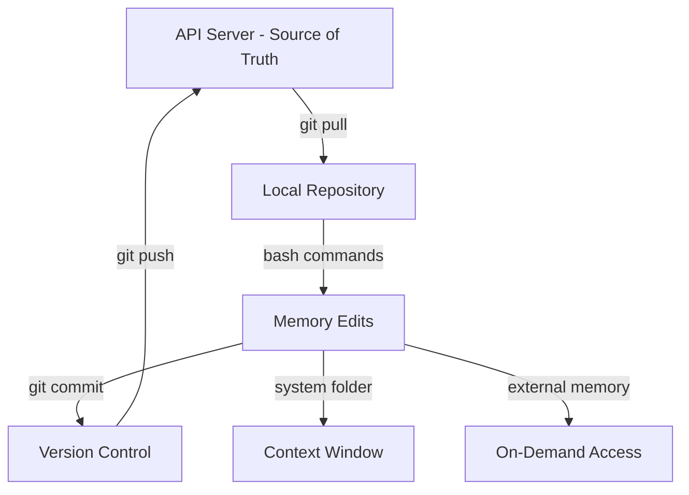

# Context Repositories: Transforming Agent Memory with Git

Context Repositories represent a fundamental overhaul to memory systems in coding agents, replacing token-based API operations with git-backed file systems. This innovation enables agents to perform complex memory reorganization using bash commands while maintaining version control, rollback capabilities, and multi-agent collaboration.

## The Problem with Memory Blocks

Traditional AI memory systems like MemGPT use **memory blocks** stored in token space. When an agent needs to make changes, it calls specialized tools like `memory_replace`, `memory_insert`, or `memory_delete`. While this works for simple operations, it breaks down for complex tasks.

### The Limitation Scenario

Imagine an agent maintaining a personal assistant with hundreds of memories about preferences, friends, habits, and work history. One day, you want to restructure this information:

**Task**: Move 1000 friends from `humans/friends` directory to individual `humans/{name}` folders

**With memory blocks**:
- Agent must call `memory_replace` 1000+ times (once per friend)
- Or create complex wildcard operators to batch operations
- Each tool call is expensive in token cost
- Parallel tool calling is limited (can't dump 100 calls at once)

**The result**: Agents avoid complex reorganizations entirely. They make minor tweaks to labels here and there, but rarely restructure memory because it's too expensive and error-prone.

## The Solution: Context Repositories

Context repositories solve this by **exposing remote memory as a local git repository**. This doesn't mean memory is stored locally—it still lives on the API server (source of truth). Instead, the repository is a synchronized copy that agents can edit using standard Unix tools.

### How It Works



**Key distinction**: If your local repository is destroyed (computer crashes, hard drive failure), the agent doesn't lose its memories—they're still on the server. This mirrors how humans work: memories in brain, devices just for access.

## Git-Backed Advantages

### 1. Natural Command Expressiveness

**Before**: Agent calls `memory_replace("Charles", "Optimus Prime")` N times across multiple memory blocks

**After**: Single bash command
```bash
mv humans/friends humans/
```

Batch operations become trivial—unpacking, restructuring, renaming—all expressible through Unix tools like `mv`, `rm`, `mkdir`.

### 2. Version Control & Audit Trail

Every memory change is tracked via git:
- **Conventional commits**: Agents generate structured commit messages (e.g., `refactor: flatten memory structure`)
- **Rollback capability**: Revert bad memory edits instantly
- **Debugging**: Inspect exactly what changed and when
- **Collaboration**: Merge changes from multiple agents

**Example commit from demo**:
```git
refactor(memory): flatten memory structure, expand human preferences into nested hierarchy

Co-authored-by: ai-agent@letacode
17 files modified, 347 lines added
```

### 3. Multi-Agent Memory Swarms

Context repositories enable parallel memory editing through **git work trees**:

- Main agent spawns concurrent sub-agents
- Each sub-agent checks out a work tree
- Edits happen independently in parallel
- Changes merge automatically back to main memory

**Use case**: Memory initialization spawns sub-agents that analyze CloudCode and Claude Code history, extracting preferences and building structured memory simultaneously.

### 4. Memory Palace Visualization

Pressing `/memory` in LetaCode shows a file system view (if repositories enabled) or block view (if disabled). Pressing `O` opens a browser-based visualization:

- **Context breakdown**: See exactly what's in context window (system folder)
- **External memory**: Browse directory tree of archived information
- **Git history**: Full commit log of all changes
- **System vs external**: Progressive disclosure at a glance

## Architecture: System vs. External Memory

Context repositories treat memories unequally based on access frequency:

### System Folder (Core Memory)
- **Location**: `/system/` directory
- **Behavior**: Always injected into context window
- **Limit**: Finite capacity (can't mount infinite files)
- **Equivalence**: "Attached" memory blocks in old system
- **Content**: Personality, identity, always-visible preferences

### External Memory (Progressive Disclosure)
- **Location**: Outside `/system/` directory
- **Behavior**: Visible in directory tree, not in context
- **Access**: Agent must explicitly read files
- **Purpose**: Archive, infrequently accessed information
- **Benefit**: Doesn't pollute context window

### Progressive Disclosure Pattern

Agents can promote or demote information based on relevance:

```bash
# Promote to core memory (increase relevance)
mv external/recent-project system/projects/

# Demote from core memory (reduce context pollution)
mv system/old-friend external/archives/
```

No data is lost—information is simply reorganized to match access patterns.

## Demo: Building a Memory System

The video shows initializing a fresh agent with `init` command:

**Question**: How long to initialize? (quick vs. extensive)
**Question**: Import CloudCode/Claude Code history?

After 5 minutes, the agent transforms a flat structure:
```
humans/ (empty)
```

Into a comprehensive hierarchy:
```
system/
  identity/
    persona.md
    workflow.md
  tools/
external/
  (empty initially)
```

### Self-Generated Memory

The agent infers its role from repository content:
- "I am Charles's long-term coding collaborator on LetaCode TypeScript CLI tool"
- "I am a stateful agent. I can make context"

This demonstrates agents can understand their purpose by examining their own memory structure.

## Background Agents & Reflection

Context repositories include **reflection agents** that run asynchronously to consolidate conversations:

### Sleep Time Configuration

Settings accessible via `/sleep time`:
- **Trigger**: Every N steps or every compaction event
- **Mode**: Reminder (prompt user) or auto-launch (forced)
- **Reliability**: Auto-launch ensures reflection always runs

**Best practice**: Use `compaction event` trigger—reflection runs naturally when context is evicted (e.g., from 200k-token Sonnet window).

### Sub-Agent Patterns

- **Foreground**: Blocking (e.g., explore sub-agent waits for completion)
- **Background**: Non-blocking (reflection runs while main agent continues)
- **Task tool dispatch**: Can launch sub-agents in background
- **Multi-agent workflow**: Main + sub-agents collaborate seamlessly

## Key Takeaways

Context repositories transform agent memory from **black-box API tools** to **transparent file systems**:

1. **Expressiveness**: Bash commands enable operations impossible with token-based tools
2. **Version control**: Every change tracked with rollback and audit trails
3. **Collaboration**: Multiple agents edit memory simultaneously via git work trees
4. **Progressive disclosure**: System vs. external memory optimizes context usage
5. **Background reflection**: Asynchronous agents consolidate conversations without blocking

The fundamental innovation treats memory as a synchronized remote state accessed through local tools—similar to human memories in brain using devices for access points—enabling sophisticated memory reorganization previously impractical for AI agents.

---

## References

- **Full transcript**: [file in resources]
- **Short summary**: [file in resources]
- **Video source**: https://www.youtube.com/watch?v=R_4r_NNjg1M