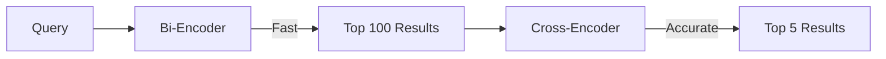

# Cross-Encoder Re-Ranking for RAG: Complete Guide

Building a Retrieval Augmented Generation (RAG) pipeline? The retriever is your first line of defense. While bi-encoder embeddings get you most of the way there, cross-encoder re-ranking can push your accuracy from good to great. Here's everything you need to know.

## The Two-Stage Retrieval Pipeline

Modern RAG systems use a **two-stage retrieval approach**:

1. **Bi-Encoder (First Stage)**: Encode query and documents independently, fast similarity search
2. **Cross-Encoder (Second Stage)**: Process query+document pairs together, higher accuracy



## Accuracy Improvements: The Numbers

Based on comprehensive benchmarks from LlamaIndex evaluations on this combination of embedding and re-ranking delivers significant improvements in both Hit Rate (fraction of queries where correct answer appears in top-k) and MRR (Mean Reciprocal Rank - average position of correct answer):

| Embedding Model | Without Reranker | With BGE-Reranker-Large | Improvement |
|------------------|------------------|-------------------------|-------------|
| **OpenAI** | Hit: 0.8596, MRR: 0.7903 | Hit: 0.9101, MRR: 0.8558 | **+5% hit rate** |
| **JinaAI-Base** | Hit: 0.8708, MRR: 0.7921 | Hit: 0.9382, MRR: 0.8685 | **+7% hit rate** |
| **BGE-Large** | Hit: 0.8258, MRR: 0.7556 | Hit: 0.8764, MRR: 0.8228 | **+5% hit rate** |
| **Cohere v3.0** | Hit: 0.8315, MRR: 0.7697 | Hit: 0.8876, MRR: 0.8360 | **+6% hit rate** |
| **Voyage** | Hit: 0.8427, MRR: 0.7803 | Hit: 0.9157, MRR: 0.8512 | **+7% hit rate** |

**Key Findings:**
- **Typical improvement**: 5-10% increase in Hit Rate and 7-9% increase in MRR
- **Best performers**: OpenAI + CohereRerank, JinaAI-Base + BGE-Reranker-Large
- **Rerankers improve MRR more than hit rate**, meaning correct answers appear higher in results

## Latency Impact

### Architecture Comparison

| Aspect | Bi-Encoder (Embedding) | Cross-Encoder (Reranker) |
|--------|------------------------|--------------------------|
| **Computation** | Encode query once, pre-indexed | Process query + each document pair together |
| **Speed** | Fast (O(1) lookup after encoding) | Slow (O(n) where n = documents to rerank) |
| **Accuracy** | Lower (independent embeddings) | Higher (joint attention over query+doc) |
| **Scalability** | Excellent (pre-computed) | Limited (must process each pair) |

### Latency Benchmarks

**Typical Reranking Pipeline:**
```
Query → Bi-Encoder → Retrieve top-100 → Cross-Encoder → Rerank to top-5
         (fast)                      (adds 50-200ms)
```

**Estimated Latency (GPU, batch of 10 docs):**

| Model Type | Latency |
|-----------|---------|
| Tiny models (TinyBERT-L2) | 10-30ms |
| Small models (MiniLM) | 30-80ms |
| Large models (BGE-large) | 80-200ms |
| Cohere API | 100-300ms |

## Popular Models Comparison

### Open-Source Cross-Encoders

#### MS-MARCO Family (Sentence Transformers)

| Model | Parameters | Downloads | Best For |
|-------|-----------|-----------|--------|
| **ms-marco-MiniLM-L6-v2** | 22.7M | 14.4M/month | **Best balance - Recommended** |
| **ms-marco-MiniLM-L12-v2** | 33.4M | 1.51M/month | Higher accuracy, slower |
| **ms-marco-TinyBERT-L2-v2** | 4.39M | 489k/month | **Fastest - Low latency needs** |
| **ms-marco-electra-base** | 110M | 27.3k/month | Highest accuracy in family |

#### BGE Reranker Family (BAAI)

| Model | Parameters | Languages | Strengths |
|-------|-----------|-----------|-----------|
| **bge-reranker-large** | ~560M | EN + ZH | **Best overall accuracy**, cross-lingual |
| **bge-reranker-base** | ~278M | EN + ZH | Good accuracy, faster than large |

**New BGE LLM Rerankers (March 2024):**
- Built on GEMMA and MiniCPM backbones
- Support larger inputs and multi-lingual
- Better performance on BEIR, C-MTEB, MIRACL

### Commercial API: Cohere Rerank

| Model | Context Length | Features | Best For |
|-------|---------------|----------|--------|
| **rerank-v4.0-pro** | 32,768 tokens | Highest accuracy | Enterprise, long documents |
| **rerank-v4.0-fast** | 32,768 tokens | Speed optimized | Real-time applications |
| **rerank-v3.5** | 4,096 tokens | Balanced | General purpose |

**Advantages:**
- No infrastructure management
- Continuously improved
- Multi-lingual support
- Structured data support (YAML)

## Cost/Benefit Analysis

### When Re-Ranking is Worth It

**High-Value Use Cases:**
- **Legal/medical document search**: Accuracy critical, worth latency
- **Customer support**: Wrong answers = frustrated customers
- **Financial research**: Missing relevant docs = bad decisions
- **Enterprise search**: Users expect Google-quality results

**ROI Calculation Example:**
```
Baseline: 85% hit rate → 15% of queries need manual search
With reranking: 92% hit rate → 8% need manual search
Time saved: 7% × queries × avg manual search time (5 min)
= Significant productivity gains for knowledge workers
```

### When to Skip Re-Ranking

**Skip re-ranking when:**
- **Real-time chat**: Latency matters more than perfect accuracy
- **Simple semantic search**: Good enough with embeddings alone
- **High-volume, low-stakes**: News feed, product recommendations
- **Resource-constrained**: Mobile devices, edge computing
- **Already high accuracy**: If embeddings give 95%+ hit rate

### Cost Comparison

| Approach | Infrastructure Cost | Latency | Accuracy |
|----------|---------------------|---------|----------|
| **Bi-encoder only** | Low (one model) | 10-50ms | Baseline |
| **Open-source reranker** | Medium (two models, more GPU) | +50-200ms | +5-10% |
| **Cohere API** | Pay per use, no infra | +100-300ms | +5-10% |

## Model Recommendations

### Best Overall Combination
```
Embedding: OpenAI text-embedding-3-large OR JinaAI-v2-base-en
Reranker: bge-reranker-large OR CohereRerank
Result: 92-94% hit rate, 0.86-0.87 MRR
```

### Best Speed/Accuracy Balance
```
Embedding: bge-large-en-v1.5
Reranker: ms-marco-MiniLM-L6-v2
Latency: ~80-120ms total
Result: 87-88% hit rate
```

### Best for Low Latency
```
Embedding: bge-small-en-v1.5
Reranker: ms-marco-TinyBERT-L2-v2
Latency: ~30-60ms total
Result: 82-84% hit rate
```

### Best for Long Documents
```
Embedding: Any
Reranker: Cohere rerank-v4.0-pro (32K context)
OR BGE LLM rerankers (new, supports longer inputs)
```

### Best for Multilingual
```
Embedding: BGE-M3 (100+ languages)
Reranker: BGE LLM rerankers OR CohereRerank
```

## Implementation Best Practices

### Optimal Pipeline Configuration
```python
# Step 1: Retrieve with bi-encoder
retriever = VectorIndexRetriever(similarity_top_k=100)  # Get more candidates

# Step 2: Rerank top candidates
reranker = CohereRerank(top_n=5)  # Or BGE reranker

# Result: Better accuracy than retrieving top-5 directly
```

### Chunking Considerations
- **Cohere v4.0**: Auto-chunks at 32,764 tokens
- **Self-hosted**: Pre-chunk documents to model's max length (usually 512 tokens)
- **Key insight**: Re-ranking works best on coherent chunks, not arbitrary splits

### Evaluation Protocol
1. Generate question-context pairs (use LLM to create test set)
2. Measure baseline (embedding-only) hit rate and MRR
3. Add reranker, measure improvement
4. Calculate ROI: (improvement) vs (latency cost)

## Summary

**Re-ranking is worth it when:**
- Accuracy improvements of 5-10% matter for your use case
- Users notice and complain about missing relevant results
- You can tolerate 50-200ms additional latency
- You have sufficient compute resources or budget

**Best open-source choice**: `bge-reranker-large` for accuracy, `ms-marco-MiniLM-L6-v2` for speed

**Best API choice**: Cohere Rerank v4.0 for ease of use and long documents

**Skip re-ranking when**: Building real-time chat, have simple search needs, or already achieving 95%+ accuracy with embeddings alone.