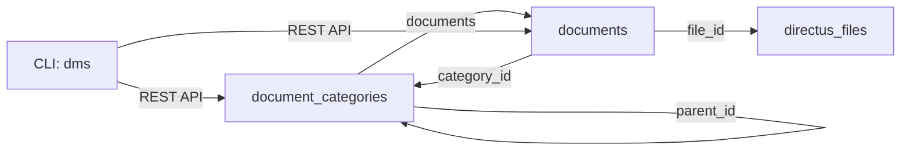

# Beyond Blog Posts: Using Directus as a Document Management System

Most people know Directus as a headless CMS — great for blog posts, pages, and structured content. But buried inside every Directus instance is a surprisingly capable file and document management system. I recently set one up for my homelab, and it took less than an hour to get a fully API-driven document store with hierarchical categories, tagging, version tracking, and a CLI tool for terminal-based operations.

## The Setup: Two Collections, Four Relations

The core idea is simple: one collection for categories, one for documents, and relations tying everything to Directus's built-in file storage.



**document_categories** holds your folder hierarchy. Each category has a name, icon, description, and an optional `parent_id` for nesting — think "Finance > Invoices" or "Technical > Architecture".

**documents** is the main table. Each record has a title, description, doc type (word, excel, ppt, pdf, markdown, image, other), status (draft, published, archived), tags as JSON, a version number, and crucially — a `file_id` that links to Directus's native file storage.

## Why This Works Better Than You'd Expect

Directus already handles file uploads, storage, and serving via its `/files` and `/assets` endpoints. What the custom collections add is **structure** — metadata, categorisation, and relationships that plain file storage lacks.

You get:
- **Hierarchical categories** with self-referential parent relationships
- **Flexible tagging** via a JSON field (no join tables needed)
- **Document lifecycle** with draft/published/archived status
- **Full REST API** with filtering, sorting, and relational queries
- **RBAC** — control who can see, upload, or manage documents per folder or collection
- **Auto-timestamps** — `date_created` and `date_updated` out of the box

A query like "show me all published Excel files in Finance tagged 'quarterly'" becomes a single API call:

```bash
curl -s -G "http://localhost:8055/items/documents" \
  -H "Authorization: Bearer $TOKEN" \
  --data-urlencode "filter[doc_type][_eq]=excel" \
  --data-urlencode "filter[status][_eq]=published" \
  --data-urlencode "filter[category_id][name][_eq]=Finance" \
  --data-urlencode "filter[tags][_contains]=quarterly" \
  --data-urlencode "fields=id,title,file_id.filename_download"
```

## The CLI: Terminal-First Document Management

The best part of an API-driven system is that you can wrap it in a CLI. I built a Bash script called `dms` that handles the common operations:

```bash
# Upload a file and auto-categorise it
dms upload quarterly-report.xlsx "Q1 Financial Report" Finance

# Search across all documents
dms search "quarterly"

# List by type and status
dms list excel published

# Tag a document
dms tag <id> finance,quarterly,2026

# Download a file
dms download <id> ./reports/

# View statistics
dms stats
```

The script auto-detects file types from extensions (`.xlsx` → `excel`, `.docx` → `word`, `.pptx` → `ppt`), uploads the file to Directus, creates the document record, and links it to the correct category — all in one command.

## When Directus Isn't Enough

This setup is ideal for **structured storage with API access** — linking documents to projects, clients, or any other structured data in your Directus instance. But it has limits:

- **No document preview** — Directus stores files but doesn't render Word/PPT/Excel in-browser
- **No full-text search inside documents** — you're searching metadata, not file contents
- **No collaborative editing** — it's storage, not Google Docs
- **No OCR** — scanned PDFs won't be searchable

If you need those features, consider Paperless-ngx (for OCR and full-text search) or Nextcloud (for collaborative editing). A hybrid approach works well too: Directus for structured metadata and API access, Paperless-ngx for ingestion and search.

## The Schema, If You Want to Build Your Own

Here's the minimal schema to recreate this:

**document_categories**: `id` (uuid), `name` (string), `icon` (string), `description` (text), `parent_id` (uuid, self-referential M2O)

**documents**: `id` (uuid), `title` (string), `description` (text), `doc_type` (string enum), `status` (string enum), `tags` (json), `version` (integer), `file_id` (uuid, M2O to directus_files), `category_id` (uuid, M2O to document_categories)

Four relations connect everything: documents to files, documents to categories, categories to themselves (parent/child), and documents to users.

It's straightforward, extensible, and gives you a document management system that plays nice with every other piece of data in your Directus instance. Sometimes the best tool for the job is the one you already have running.

**Tags**: directus, document-management, homelab, cli, rest-api, headless-cms
**Categories**: Tutorials, Infrastructure
