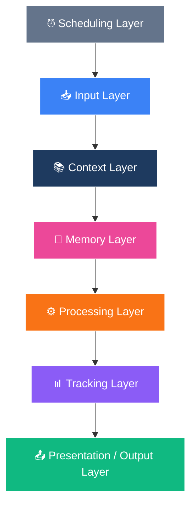
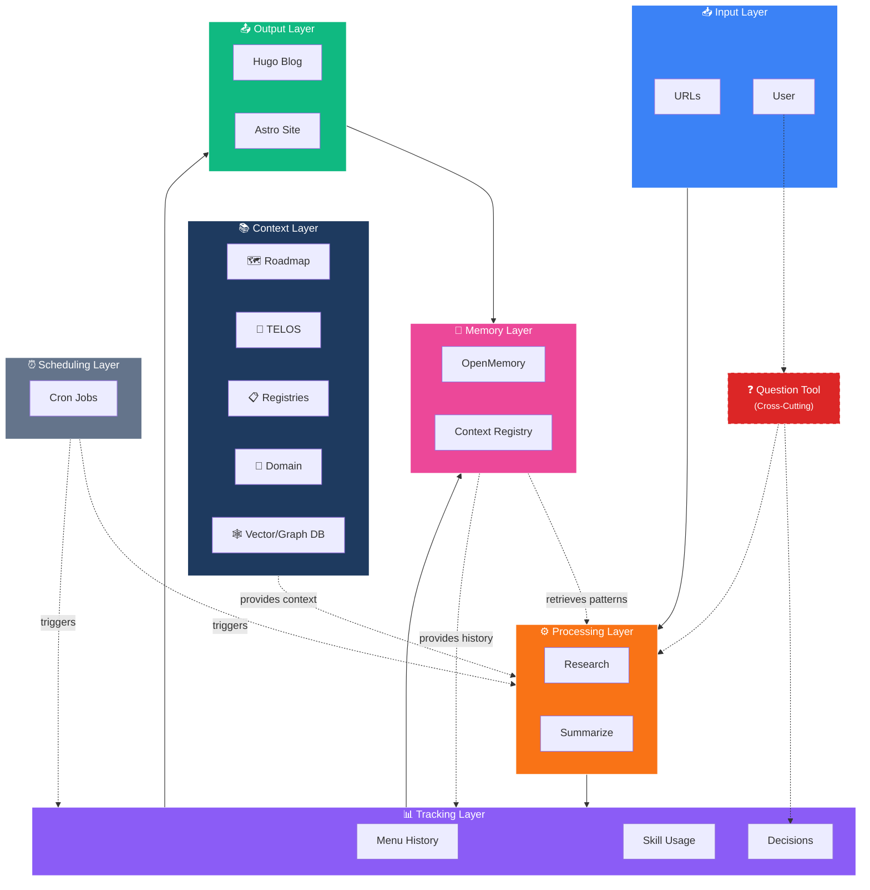
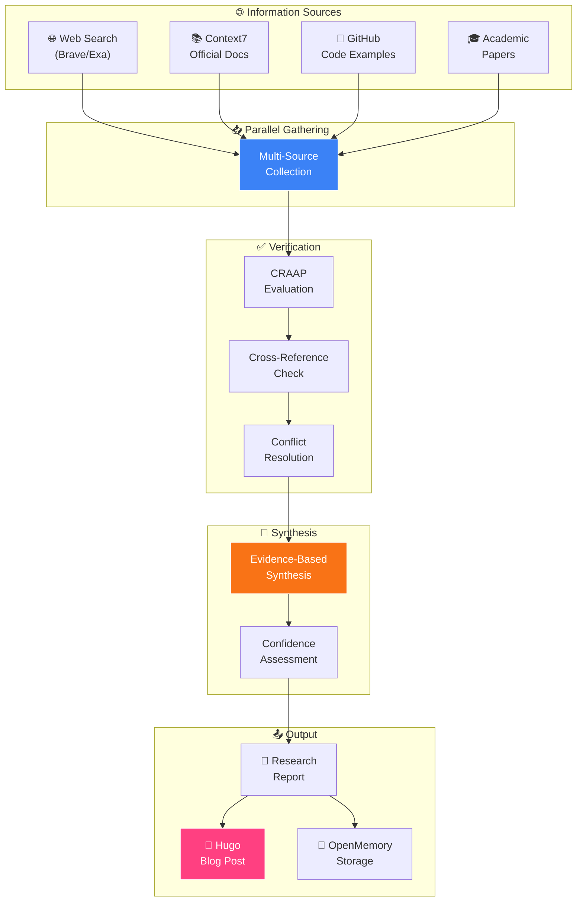
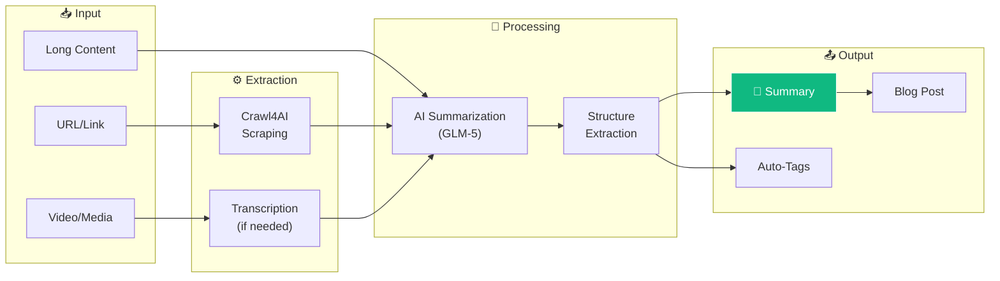
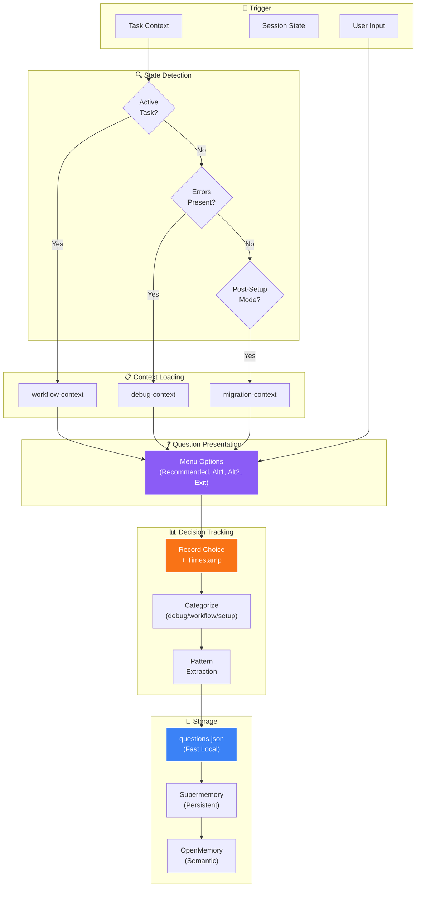
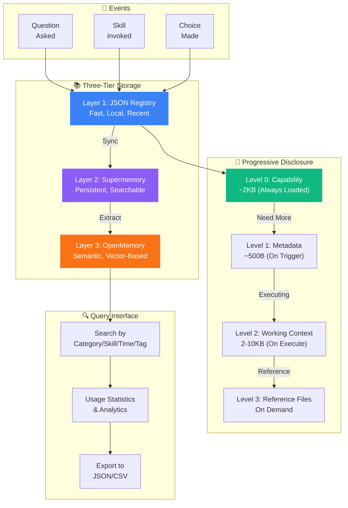
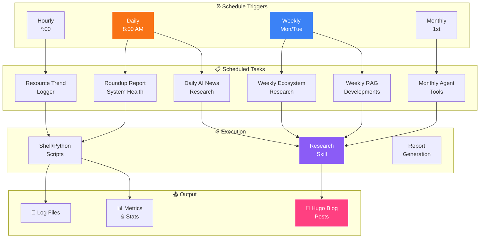
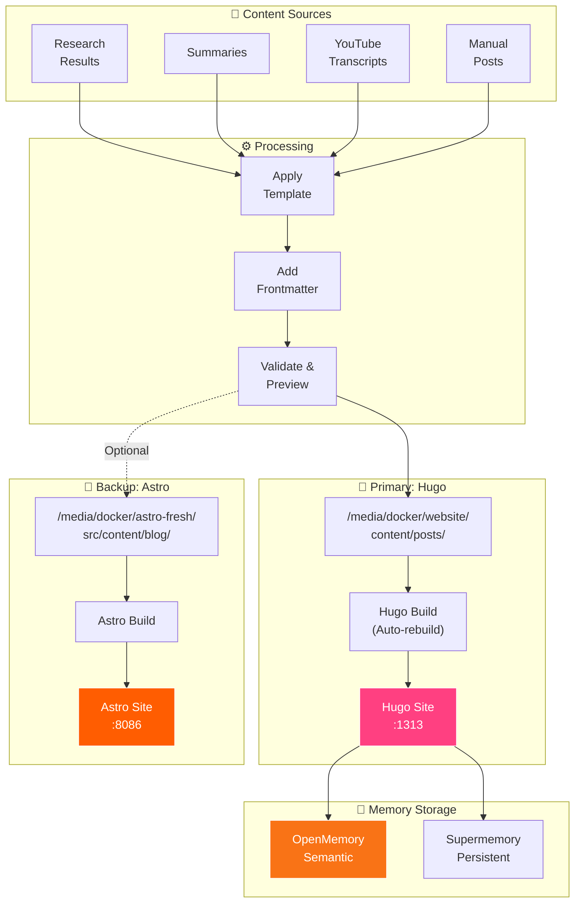
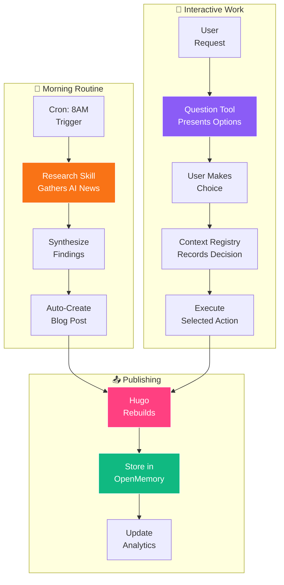

A visual guide to how the key environment components connect: Research, Summarization, Question Tool, Menu & Skill History, Decision Tracking, Cron Jobs, and Blog Publishing.

## High Level Layers



---


## Component Overview



---

## 1. Research Workflow

The Research skill gathers information from multiple sources, synthesizes findings, and publishes to the blog.



### Research Tools

| Tool | Purpose | Status |
|------|---------|--------|
| **Brave Search** | Real-time web search | ✅ MCP Connected |
| **Context7** | Official documentation | ✅ MCP Connected |
| **GitHub Search** | Code examples | ✅ Available |
| **Crawl4AI** | Web scraping | ✅ MCP Connected |

### Research Implementation

**Skill Location:** `~/.config/opencode/skills/research/SKILL.md`

**Web Form Interface:** http://ubuntu4:8898

| Feature | Description |
|---------|-------------|
| Static Dropdowns | Intensity, thinking, format options |
| Topic Input | Text field with optional context |
| Source Selection | Web, Docs, GitHub, Academic, News |
| Cron Scheduling | Now, Hourly, Daily, Weekly, Monthly |
| Auto Publishing | Creates Hugo blog post |

**Scheduled Research Tasks:**

```bash
# Cron jobs configured
0 8 * * *   daily-ai-news        # Daily AI ecosystem
0 8 * * 1   weekly-ecosystem     # Monday ecosystem review
0 9 * * 2   weekly-rag-developments  # Tuesday RAG news
0 8 1 * *   monthly-agent-tools  # Monthly agent tools
```

**Key Scripts:**

| Script | Location | Purpose |
|--------|----------|--------|
| Daily Research | `~/scripts/daily-research/ai_ecosystem_research.py` | Fetches 12 repos + HN stories |
| Research Engine | `/media/docker/research-task/research_engine.py` | Core research execution |
| Scheduled Runner | `/media/docker/research-task/scripts/run-scheduled-research.sh` | Cron task runner |
| OliveTin Executor | `/media/docker/olivetin/config/scripts/execute-research.sh` | Manual task execution |

---

## 2. Summarization Flow

URLs and content are summarized for quick consumption and storage.



### Summarize Tool Implementation

**Tool:** `@steipete/summarize` (v0.11.1)

**Installation:**
```bash
npm i -g @steipete/summarize@latest
```

**Binary Location:** `/root/.npm-global/bin/summarize`

**Configuration:** `~/.summarize/config.json`

```json
{
  "env": {
    "OPENROUTER_API_KEY": "sk-or-v1-..."
  },
  "model": "free",
  "models": {
    "free": {
      "candidates": [
        "openrouter/arcee-ai/trinity-large-preview:free"
      ]
    }
  }
}
```

**Usage Examples:**

```bash
# Summarize a webpage
summarize "https://example.com"

# Summarize YouTube video (with transcript)
summarize "https://youtube.com/watch?v=..."

# Summarize PDF (remote or local)
summarize "https://arxiv.org/pdf/....pdf"
summarize "/path/to/local.pdf"

# Summarize podcast/audio
summarize "https://feeds.npr.org/500005/podcast.xml"
summarize "/path/to/audio.mp3"

# Extract slides from video
summarize --slides "https://youtube.com/watch?v=..."
```

**Features:**

| Feature | Description |
|---------|-------------|
| Web Scraping | Automatic content extraction |
| YouTube Transcripts | Auto or manual captions |
| Audio Transcription | Whisper, Parakeet, Canary backends |
| PDF Processing | Remote URLs or local files |
| Slide Extraction | Key frames from videos |
| Podcast Support | RSS feeds and audio files |
| Caching | SQLite cache for repeated URLs |

**Output Format:**
```
## Overview
[Summary content]

## Key Points
[Bullet points]

[time] · [duration] · [word count] words · [model] · [tokens]
```

---
## 3. Question Tool & Decision Tracking

The Question Tool presents options and tracks all decisions for learning.



### Decision Categories

| Category | Trigger Patterns | Example |
|----------|-----------------|---------|
| `debug` | error, failed, fix | "I'm seeing error X" |
| `workflow` | feature, implement, refactor | "Add authentication" |
| `setup` | install, configure, setup | "Set up Docker" |
| `skill_selection` | skill names present | "Use hugo skill" |
| `confirmation` | confirm, proceed, yes/no | "Should I continue?" |
| `navigation` | menu, back, next, view | "Show me options" |

---

## 4. Menu & Skill History (Context Registry)

The Context Registry tracks all interactions with progressive disclosure.



### Storage Locations

```
~/.config/opencode/context-registry/
├── data/
│   ├── questions.json      # Question history
│   ├── skills.json         # Skill usage
│   ├── context-index.json  # Disclosure index
│   └── analytics.json      # Aggregated stats
```

---

## 5. Cron Jobs & Scheduled Tasks

Automated tasks run on schedules to keep the environment updated.



### Active Cron Schedule

| Schedule | Task | Output |
|----------|------|--------|
| Hourly | Resource Trend Logger | `/var/log/resource-trends.log` |
| Daily 3AM | Roundup Report | `/root/cron-logs/roundup-cron.log` |
| Daily 8AM | Daily AI News | Hugo blog post |
| Weekly Mon 8AM | Ecosystem Research | Hugo blog post |
| Weekly Tue 9AM | RAG Developments | Hugo blog post |
| Monthly 1st 8AM | Agent Tools Review | Hugo blog post |

---

## 6. Blog Publishing (Hugo & Astro)

Content flows from research and summarization to dual blog platforms.



### Blog Platforms

| Platform | Port | Purpose | Posts Directory |
|----------|------|---------|-----------------|
| **Hugo** | :1313 | Primary blog, TELOS Blog | `/media/docker/website/content/posts/` |
| **Astro** | :8086 | Backup site, Astro Fresh | `/media/docker/astro-fresh/src/content/blog/` |

---

## Complete Integration Flow

How all components work together in a typical workflow:



---

## Quick Reference

| Component | Trigger | Output | Storage |
|-----------|---------|--------|---------|
| **Research Skill** | `research` / Web Form (:8898) | Blog post | OpenMemory |
| **Summarize Tool** | `summarize "URL"` | Summary + metadata | SQLite cache |
| **Question Tool** | `q` / auto-detect | Menu options | questions.json |
| **Context Registry** | `cr` | History query | 3-tier storage |
| **Cron Jobs** | Schedule (4 tasks) | Reports + posts | Logs + blog |
| **Hugo Blog** | File write | Published page | /media/docker/website |
| **Astro Blog** | Manual | Published page | /media/docker/astro-fresh |

## Tool Quick Commands

```bash
# Research
python3 ~/scripts/daily-research/ai_ecosystem_research.py  # Run daily research
open http://ubuntu4:8898  # Open research web form

# Summarize
summarize "https://example.com"           # Summarize webpage
summarize "https://youtube.com/watch?v=..."  # Summarize video
summarize --slides "https://youtube.com/..."  # Extract slides

# Check status
curl -s http://localhost:8898/health     # Research form health
docker ps | grep research                # Research container
ls /media/docs/research/                 # Research outputs
```

---

*Last updated: February 28, 2026*