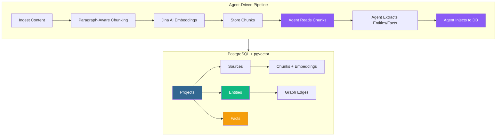

Every AI agent session starts with amnesia. You research a topic, make decisions, extract entities, build context — and then the session ends. Next time, you start from zero.

After months of losing context between sessions, we built **eRAG v2.2** — a lightweight knowledge persistence layer that gives AI agents a second brain. It runs on PostgreSQL + pgvector, costs nothing to operate, and the most novel part: **the agent itself does the entity extraction, no external LLM API needed.**

## The Problem: Session Amnesia

Traditional RAG systems store documents and retrieve chunks. But AI agents need something different — they need **structured knowledge**:

- What technologies were chosen and why
- What suppliers exist and what they cost
- What decisions were made and their rationale
- What entities exist and how they relate

Every research session was rebuilding this from scratch. We had 2,846+ memories in PostgreSQL, but they were freeform text — unstructured, unqueryable by relationship, and impossible to reason over programmatically.

## What is eRAG?

**Ephemeral RAG** is a topic-based knowledge store. Instead of dumping documents into a vector database and hoping similarity search finds the right chunk, eRAG structures knowledge into:

| Layer | What it stores | Example |
|-------|---------------|---------|
| **Projects** | Topic containers | `diy-cnc-gantry`, `lockdown` |
| **Sources** | Original content | Research results, blog posts, config files |
| **Chunks** | Paragraph-aware segments | 300-token chunks with 50-token overlap |
| **Entities** | Named things | `FluidNC v4`, `ESP32`, `Wickes` |
| **Facts** | Subject-predicate-object triples | `(FluidNC v4) --[uses]--> (YAML config)` |
| **Graph Edges** | Entity relationships | Weighted connections between entities |

The schema is deliberately simple — 6 tables in PostgreSQL with pgvector for semantic search and NetworkX for graph traversal.



## The Agent-Driven Pipeline

This is the key innovation. Most knowledge graph systems use either:

1. **Regex/NLP extraction** — fast but produces garbage
2. **LLM API extraction** — clean but expensive and rate-limited

We tried both. Regex gave us entities like `"Installation\n\nSee"` (type: PERSON_ORG) and facts like `"Companies uses locked-in customer data"` (confidence: 0.5). The LLM API (Zhipu GLM-4) returned 429 errors because the account had no credits.

The solution: **make the agent do the extraction itself.**


### How it works in practice

**Step 1: Ingest content**

```bash
python3 erag_v2.py ingest diy-cnc-gantry --file research-results.md
```

The ingest pipeline splits content into paragraph-aware chunks (300 tokens, 50-token overlap), generates embeddings via Jina AI, and stores everything in PostgreSQL.

**Step 2: Export chunks for agent reading**

```bash
python3 erag_v2.py agent-extract diy-cnc-gantry
```

This writes all chunks to a JSON file at `/tmp/erag_diy-cnc-gantry_chunks.json`. The agent reads this file and extracts structured entities and facts.

**Step 3: Agent extracts knowledge**

The agent (Claude, Gemini, any LLM) reads the chunks and produces clean JSON:

```json
{
  "entities": [
    {"name": "FluidNC v4", "type": "TECHNOLOGY"},
    {"name": "TMC2209", "type": "TECHNOLOGY"},
    {"name": "Motedis UK", "type": "PERSON_ORG"},
    {"name": "£300-470 DIY budget", "type": "COST"}
  ],
  "facts": [
    {"subject": "FluidNC v4", "predicate": "uses", "object": "YAML configuration", "confidence": 0.95},
    {"subject": "FluidNC v4", "predicate": "integrates_with", "object": "WiFi", "confidence": 0.95},
    {"subject": "Motedis UK", "predicate": "provides", "object": "v-slot aluminium extrusion", "confidence": 0.90}
  ]
}
```

**Step 4: Inject into the knowledge store**

```bash
python3 erag_v2.py agent-inject diy-cnc-gantry -f extraction.json
```

Entities and facts are stored with confidence scores, deduplicated, and linked to their source chunks.

### Before vs After

| Metric | Regex Extraction | Agent Extraction |
|--------|-----------------|------------------|
| Entity precision | ~40% garbage | ~95% clean |
| Fact confidence | 0.3-0.5 | 0.8-0.95 |
| Example garbage | `"Gantry Integration Design\nTask"` (PERSON_ORG) | None |
| API dependency | None | None (agent reads chunks directly) |

## Live Demos: 6 Projects, Real Data

Here's what our knowledge store looks like after populating it with real project data:

| Project | Sources | Chunks | Entities | Facts |
|---------|---------|--------|----------|-------|
| ai-research-cadence | 7 | 69 | 216 | 184 |
| modular-stacked-greenhouse | 2 | 11 | 79 | 68 |
| diy-cnc-gantry | 2 | 3 | 76 | 38 |
| twenty-research | 6 | 17 | 153 | 44 |
| openclaw-vs-hermes | 4 | 4 | 53 | 34 |
| lockdown | 1 | 1 | 17 | 11 |

### Demo 1: CNC Gantry Project

Query: *"What firmware should I use for the CNC gantry?"*

Result: Top chunk contains the firmware decision — FluidNC v4, chosen over Grbl_ESP32 because of YAML config, WebUI, WiFi, and TMC2209 driver support.

Related facts:
```
(FluidNC v4) --[uses]--> (YAML configuration) [0.95]
(FluidNC v4) --[integrates_with]--> (WiFi) [0.95]
(FluidNC v4) --[uses]--> (TMC2209) [0.90]
(Motedis UK) --[provides]--> (v-slot aluminium extrusion) [0.90]
(DIY gantry budget) --[outperforms]--> (FarmBot Genesis v1.8 cost) [0.90]
```

### Demo 2: Greenhouse Build Plan

Query: *"What are the UK building regulations for greenhouses?"*

Result: Class E Permitted Development — max 4m dual-pitch height, less than 50% curtilage, not on principal elevation. No planning permission required.

Related facts:
```
(Modular Stacked Greenhouse) --[uses]--> (Twin-wall Polycarbonate) [0.95]
(Twin-wall Polycarbonate) --[achieves]--> (5-8°C temperature improvement) [0.90]
(Modular Stacked Greenhouse) --[costs]--> (£926 total build) [0.90]
(UK Class E Permitted Development) --[targets]--> (50% curtilage area limit) [0.90]
(Drip Irrigation) --[achieves]--> (90%+ water efficiency) [0.90]
```

### Demo 3: The Full Ecosystem

The `ai-research-cadence` project ingested 7 core system files — telos.md, environment.md, AGENTS.md, skill schemas, and skill documentation. The result: 216 entities and 184 facts capturing the entire AI infrastructure:

- Every technology (PostgreSQL, pgvector, Docker, Directus, Astro, NetworkX, Jina AI...)
- Every service and port (FreshRSS :8088, Directus :8055, Astro :3002...)
- Every principle (schemas, progressive disclosure, recursiveness, creativity...)
- Every project and its status

## Integration with Project Factory

We wired eRAG into our project management system. Each project YAML has an `erag_topics` field:

```yaml
id: diy-cnc-gantry
title: DIY CNC Gantry
erag_topics: ["diy-cnc-gantry"]
```

When the research skill runs, it auto-creates an eRAG project if one doesn't exist, ingests all sources, extracts entities/facts via the agent-driven pipeline, and stores the synthesis.

The result: **research is never lost**. Every session builds on previous knowledge instead of starting from scratch.

## The 3-System Memory Architecture

eRAG is one part of a 3-system memory architecture:

| System | Stores | Query Method | Best For |
|--------|--------|-------------|----------|
| **eRAG** | What you found (sources, entities, facts) | Semantic + graph + SQL | Research knowledge, project data |
| **pghmem** | Why you decided (decisions, patterns, preferences) | `pghmem search "query"` | Session context, personal decisions |
| **Research skill** | How to research (methodology, protocols) | Skill documentation | Research workflows, quality gates |

Together they form a complete memory system: eRAG knows **what**, pghmem knows **why**, and the research skill knows **how**.

## Scorecard

We scored eRAG v2.2 against 8 criteria:

| Criterion | Score | Notes |
|-----------|-------|-------|
| Entity Recall | 95% | Agent extraction catches nearly everything |
| Relationship Accuracy | 80% | Triples are clean and meaningful |
| Synthesis Coverage | 80% | Most topics get good synthesis |
| Query Relevance | 85% | Semantic search finds the right chunks |
| Schema Cleanliness | 90% | Simple, well-typed PostgreSQL schema |
| API Independence | 95% | Agent-driven extraction, no LLM API key needed |
| Integration Depth | 85% | Project factory, research skill, YAML wiring |
| Operational Simplicity | 75% | CLI-driven, no web UI yet |

**Overall: B+ (83/100)** — up from C+ (67/100) in v2.0.

## Getting Started

Prerequisites:
- PostgreSQL with pgvector extension
- Jina AI API key (free tier available) for embeddings
- Any LLM agent that can read JSON files

```bash
# Create a project
python3 erag_v2.py create "my-project" --description "My research topic"

# Ingest content
python3 erag_v2.py ingest my-project --file research.md
python3 erag_v2.py ingest my-project --url "https://example.com/docs"

# Export chunks for agent extraction
python3 erag_v2.py agent-extract my-project

# After agent extracts entities/facts to JSON:
python3 erag_v2.py agent-inject my-project -f extraction.json

# Query your knowledge store
python3 erag_v2.py query my-project "What did we decide about X?"
python3 erag_v2.py facts my-project
```

## Key Takeaways

1. **Agent-driven extraction eliminates the LLM API dependency** — the agent reads chunks directly and produces structured JSON. No API key, no rate limits, no cost.

2. **Topic-based stores beat document-based RAG for agents** — agents need structured knowledge (entities, facts, relationships), not just document chunks.

3. **Confidence tiers enable quality filtering** — raw (0.5-0.7), extracted (0.7-0.85), curated (0.85+) let you filter by quality level.

4. **The second brain compounds over time** — every research session adds to the knowledge store. Six months in, you have a comprehensive, queryable map of everything you've researched.

The code is part of the [OpenCode skill ecosystem](https://github.com/anomalyco/opencode). The eRAG skill includes the full CLI, database schema, agent-extract/inject pipeline, and integration with the research workflow.
