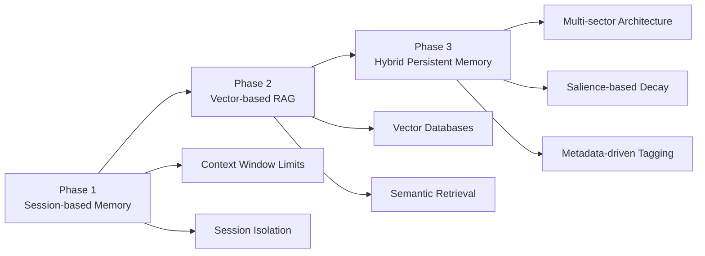
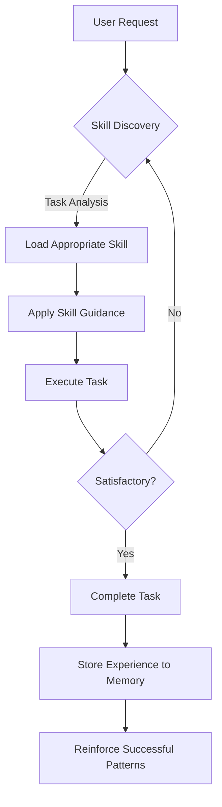
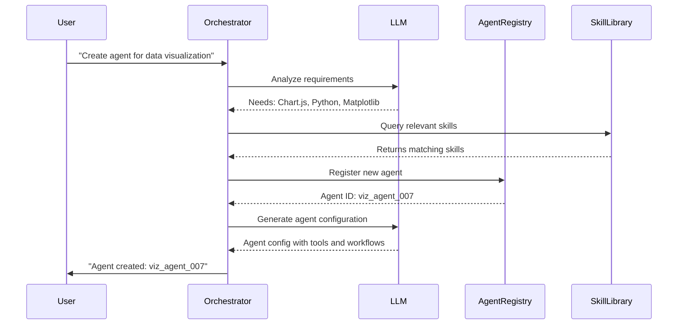
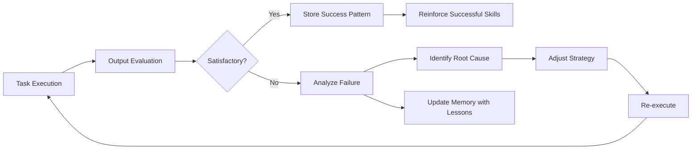
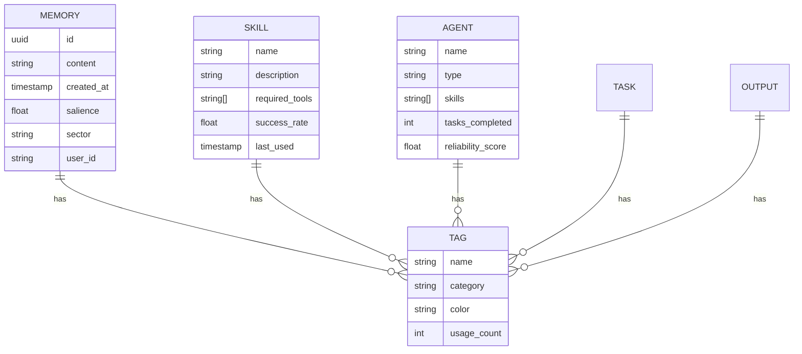

## Introduction

AI is shifting from monolithic models to multi-agent ecosystems—networks of specialized AI entities collaborating to solve complex problems. This analysis examines multi-agent workflow complexity, memory systems, skill management, and "AI at every stage" orchestration.

## The Rise of Multi-Agent Architectures

### From Single Models to Agent Swarms


2022-2023: Single general-purpose models with breadth/depth trade-offs. 2024+: Multi-agent systems introduced **specialization**—assigning specific roles:
- **Research Agents**: Gather and analyze information
- **Writing Agents**: Structure and compose content  
- **Code Agents**: Generate, review, and refactor code
- **Analysis Agents**: Evaluate outputs and identify patterns
- **Orchestrator Agents**: Coordinate other agents and manage workflows

### Critical Assessment

**Strengths:**
- **Modularity**: Each agent optimized for specific tasks
- **Parallelism**: Multiple agents work simultaneously
- **Robustness**: Single agent failure doesn't doom workflow
- **Explainability**: Easier to debug than monolithic systems

**Weaknesses:**
- **Coordination Overhead**: Managing inter-agent communication adds complexity
- **Cost**: Running multiple models dramatically increases token consumption
- **Debugging**: Determining which agent failed is difficult
- **Latency**: Sequential dependencies compound response times

**Critique:**
Current frameworks suffer from **orchestration over-engineering**—building complex scheduling and state management for problems solvable with simpler approaches. Risk of "agent sprawl": deploying unnecessary agents when one well-engineered system would suffice.

## Memory Systems: The Foundation of Intelligent Agents

### The Evolution from Context Windows to Persistent Memory

Memory is the critical differentiator between simple chatbots and truly intelligent agents. The evolution of AI memory systems follows three distinct phases:



### Phase 1: Session-Based Memory (2022-2023)

Early systems used context windows—sliding windows of conversation history:

1. **Finite Capacity**: Even 128K-1M token windows have limits
2. **Session Isolation**: Each conversation started from scratch
3. **No Prioritization**: All information treated equally

### Phase 2: Vector-Based RAG (2023-2024)

**How It Works:**
1. User queries converted to vector embeddings
2. Similar vectors retrieved from vector databases
3. Retrieved context injected into prompt
4. LLM generates responses grounded in retrieved information

**Strengths:**
- Effectively unlimited storage capacity
- Semantic understanding enables high-quality retrieval
- Grounding reduces hallucinations

**Critical Weaknesses:**
- Static retrieval doesn't understand temporal relevance
- No memory reinforcement or decay mechanism
- All retrieved memories treated equally
- Limited ability to handle complex queries

### Phase 3: Hybrid Persistent Memory (2025-Present)

The most advanced systems, including OpenMemory and proprietary implementations, introduce sophisticated memory management:

**Multi-Sector Architecture:**
Memory is organized into distinct sectors, each serving different purposes:

| Sector | Purpose | Example Content | Retrieval Strategy |
|--------|---------|-----------------|-------------------|
| **Episodic** | Specific events and experiences | "User asked for Python script on 2026-01-15" | Time-based, sequential |
| **Semantic** | General knowledge and concepts | "Python async/await best practices" | Vector similarity |
| **Procedural** | How-to instructions and workflows | "Deploy Docker container with port binding" | Pattern matching |
| **Emotional** | User preferences and sentiments | "User prefers concise responses" | User-specific filtering |
| **Reflective** | Meta-cognition and self-improvement | "Debugging approach worked well" | Analysis-driven |

**Salience-Based Decay:**
Memories have dynamic salience scores that:
- Increase when reinforced by user feedback
- Decrease over time through natural decay
- Boost when accessed frequently
- Decay if never retrieved

**Metadata-Driven Tagging:**
Every memory tagged with:
- User ID for personalization
- Session ID for context tracking
- Content type tags (`user-prompts`, `workflow`, `preferences`, `troubleshooting`)
- Timestamp for temporal queries
- Source identifiers for provenance

### Critical Analysis of Memory Systems

**What Works:**
- Vector-based retrieval effective for semantic search
- Multi-sector organization provides useful abstraction
- Metadata tagging enables powerful filtering

**What Needs Improvement:**
1. **Cross-Referencing**: Struggle connecting related memories across sectors
2. **Forgetting Mechanisms**: Better ways to intentionally forget outdated information
3. **Conflict Resolution**: Systems lack robust strategies when memories contradict
4. **Privacy-by-Design**: Need granular access controls and automatic PII detection

**The Innovation Gap:**
Missing **metacognitive memory**—memory about memory. Systems need to:
- Self-evaluate: "This memory is likely outdated"
- Self-correct: "This memory conflicts with newer information"
- Self-optimize: "I should reinforce this memory for future use"
- Self-organize: "These related memories should be grouped"

## Skill and Agent Management: AI Orchestrating AI

### The Skill-First Paradigm

Modern AI systems are moving toward a **skill-first architecture** where capabilities are defined, discovered, and applied dynamically:



**Skills as Reusable Capabilities:**
Skills encapsulate:
- Specialized knowledge (e.g., "Docker container management")
- Task-specific workflows (e.g., "Hugo blog post creation")
- Tool usage protocols (e.g., "how to use the write tool correctly")
- Best practices and patterns (e.g., "error handling in Python")

**Skill Discovery Protocol:**
When an agent encounters a task, it should:
1. Classify the task type (coding, documentation, analysis, etc.)
2. Check available skills inventory
3. Select the most appropriate skill
4. Load and apply skill guidance
5. Store the outcome for future learning

### Agent Creation and Selection

Advanced systems are moving toward **dynamic agent creation**—AI generates and configures agents on demand based on task requirements.

**Automated Agent Generation Workflow:**



**Agent Selection Algorithms:**
Rather than manually assigning agents, intelligent systems use:
- **Capability Matching**: Agent capabilities vs. task requirements
- **Performance History**: Historical success rates for similar tasks
- **Resource Availability**: Current load and capacity
- **Cost-Benefit Analysis**: Expected value vs. computational cost

**Critique of Current Approaches:**
The concept of dynamic agent creation is powerful but faces significant challenges:

1. **Over-Generation**: Systems may create more agents than necessary, leading to agent sprawl
2. **Knowledge Silos**: Dynamically created agents may lack access to institutional knowledge
3. **Version Management**: When you have dozens of auto-generated agents, tracking versions and updates becomes complex
4. **Testing**: Auto-generated agents need automated testing to ensure reliability

**Recommendation:**
Instead of full agent creation, systems should focus on **agent specialization**—configuring existing archetypes (Researcher, Writer, Analyst, etc.) with specific skills and parameters. This provides the benefits of customization without the overhead of managing entirely new agent identities.

## AI at Every Stage: Ultimate Meta-Orchestration

**Vision**: AI managing AI at every stage with minimal human oversight.

### 1. Prompt Engineering and Improvement

**Current State:**
- Manual prompt engineering
- Static prompt templates
- Limited feedback loops

**Future State:**
- AI analyzes prompt effectiveness
- Automatic A/B testing of prompt variants
- Real-time optimization based on task outcomes
- Cross-prompt learning across contexts

**Critical Question:**
How do we prevent **prompt over-fitting**—prompts that work perfectly for specific test cases but fail on novel problems?

**Proposed Solution:**
Implement **prompt diversity metrics** rewarding prompts that:
- Work across diverse test cases
- Handle edge cases gracefully
- Remain interpretable
- Maintain safety constraints

### 2. Skill Selection and Creation

**AI-Driven Skill Discovery:**
1. Analyze task requirements
2. Search skill inventory for matches
3. If no match, generate new skill definition
4. Test on similar tasks
5. Refine based on performance

**Skill Quality Assurance:**
Auto-generated skills need:
- **Validation**: Does it work correctly?
- **Testing**: Can it handle edge cases?
- **Documentation**: Is it well-documented?
- **Comparison**: How does it compare to existing skills?

**Critique:**
Automated skill creation risks generating low-quality, redundant skills. Need:
- **Skill deduplication**: Identify and merge similar skills
- **Skill deprecation**: Remove unused or obsolete skills
- **Skill versioning**: Track evolution and improvements

### 3. Agent Selection and Delegation

**Intelligent Delegation:**
- Analyze task complexity and requirements
- Select appropriate agents or teams
- Define delegation boundaries
- Monitor delegation success
- Learn from delegation failures

**Delegation Decision Matrix:**

| Complexity | Novelty | Risk | Delegation Strategy |
|------------|---------|------|-------------------|
| Low | Low | Low | Auto-delegate to standard agent |
| Low | High | Medium | Delegate + human review |
| High | Low | Medium | Multi-agent collaboration |
| High | High | High | Human-in-the-loop required |

**Critical Gap:**
Current systems lack robust **delegation confidence estimation**—ability to predict whether delegated task will succeed.

### 4. Self-Improvement and Feedback Loops

**Metacognitive Capabilities:**
- **Self-evaluate**: Assess output quality
- **Self-correct**: Identify and fix mistakes
- **Self-optimize**: Improve performance
- **Self-document**: Explain decision-making

**Feedback Loop Architecture:**



**Challenge: Reliable Self-Evaluation**
LLMs are poor at judging their own output quality—tend to be overconfident even when wrong. Need:
- **External evaluation metrics**: Automated tests, human feedback, benchmarks
- **Calibration techniques**: Improve self-assessment accuracy
- **Confidence intervals**: Quantified uncertainty, not binary judgments

### 5. Telemetry and Analysis

**Comprehensive Monitoring:**
- Tool usage patterns and frequencies
- Agent selection decisions and success rates
- Memory access patterns and hit rates
- Latency and cost metrics
- Error types and failure modes

**AI-Driven Analysis:**
- Identify performance bottlenecks
- Detect anomalous behavior
- Suggest optimizations
- Predict future resource needs
- Recommend skill/agent improvements

**Privacy Considerations:**
- What data is collected?
- How long is it stored?
- Who has access?
- Is it anonymized?

### 6. Content Creation and Aggregation

**AI-Generated Content:**
- Draft generation (articles, documentation, code)
- Content optimization (clarity, structure, flow)
- Personalization (adapting to audience)
- Translation and localization
- Format conversion (Markdown, HTML, PDF)

**Content Aggregation:**
- Curate content from multiple sources
- Identify connections and relationships
- Generate summaries and syntheses
- Tag and organize for retrieval
- Maintain provenance chains

**Quality Assurance Challenge:**
At scale, human review is impractical. Need:
- Automated quality scoring
- Fact-checking against verified sources
- Plagiarism detection
- Consistency checking across related content
- A/B testing of content variants

## Advanced Metadata and Tagging Systems

### Cross-Cutting Metadata Architecture

Most powerful systems use **unified metadata schema** spanning all components:



### Tag Categories and Taxonomies

**Functional Tags:**
- `user-prompts`, `workflow`, `preferences`, `troubleshooting`
- `coding`, `documentation`, `analysis`, `research`
- `high-risk`, `low-risk`, `human-approval-required`

**Content Tags:**
- Topic-specific: `python`, `docker`, `machine-learning`, `data-visualization`
- Domain-specific: `finance`, `healthcare`, `education`, `legal`
- Format-specific: `markdown`, `html`, `json`, `yaml`

**Operational Tags:**
- `production`, `staging`, `development`
- `deprecated`, `stable`, `experimental`
- `high-traffic`, `low-traffic`

### AI-Driven Tag Management

**Automatic Tagging:**
- Extract tags from content automatically
- Apply domain-specific ontologies
- Maintain tag hierarchies (e.g., `programming > python > async/await`)
- Handle tag synonyms and aliases

**Tag Optimization:**
- Merge redundant tags
- Split overly broad tags
- Deprecate unused tags
- Identify emerging tags

**Tag-Based Retrieval:**
- **Exact tag matches**: `tag:docker` AND `tag:container`
- **Semantic tag similarity**: Conceptually related tags
- **Tag co-occurrence**: Tags appearing together frequently
- **User-specific tag preferences**: Personalized ranking

## Critical Evaluation and Recommendations

### The Over-Automation Trap

**Risk:**
In enthusiasm for "AI at every stage," we risk creating systems that are:
- Over-engineered: More complex than necessary
- Opaque: Difficult to understand or debug
- Brittle: Break unexpectedly in novel situations
- Expensive: Computational costs balloon

**Reality Check:**
Not every task needs AI management. Simple, deterministic tasks handled better by:
- Static code
- Configuration files
- Traditional algorithms

**Recommendation:**
Adopt **selective AI deployment strategy**:
1. Identify tasks where AI provides clear value
2. Apply AI selectively, not universally
3. Maintain human oversight for high-stakes decisions
4. Provide manual overrides and intervention points

### Complexity vs. Capability Tradeoff

**The Curve:**
As complexity increases, capabilities grow—but so does:
- Development time
- Maintenance burden
- Debugging difficulty
- Failure modes

**The Sweet Spot:**
- **Too simple**: Can't handle complex tasks
- **Too complex**: Unmaintainable
- **Just right**: Elegant, modular, understandable

**Framework: Complexity Budgeting**
- Core orchestration: High complexity budget (critical functionality)
- Individual agents: Medium complexity budget (specialized, bounded scope)
- Integrations: Low complexity budget (keep interfaces simple)

### The Evaluation Gap

**Problem:**
Lack robust metrics for evaluating multi-agent systems:
- How do we measure "good orchestration"?
- What's success rate for complex workflow?
- How do we compare agent architectures?

**Proposed Metrics:**
1. **Task Success Rate**: Percentage of tasks completed successfully
2. **Agent Efficiency Ratio**: Successes per agent deployed
3. **Resource Efficiency**: Output value per computational cost
4. **Latency Distribution**: Time to complete tasks (mean, median, P95, P99)
5. **Robustness Score**: Performance on edge cases and novel inputs
6. **Explainability Index**: How well humans can understand decisions

**Benchmarking Needs:**
- Multi-agent workflows
- Memory system performance
- Skill discovery and application
- Agent selection accuracy

### The Security Frontier

**Emerging Threats:**
1. **Indirect Prompt Injection**: Malicious data influences agent behavior
2. **Agent Compromise**: One compromised agent corrupts swarm
3. **Data Poisoning**: Manipulating training or memory data
4. **Orchestration Hijacking**: Taking control of workflow decisions

**Defensive Strategies:**
- **Sandboxed Execution**: Agents run in isolated environments
- **Input Validation**: Strict validation of all external inputs
- **Audit Trails**: Complete logging of all agent actions
- **Zero Trust Architecture**: Verify every agent, every time
- **Fail-Safe Defaults**: Default to safe, conservative behavior

### The Human Role

**Not Obsolete, But Elevated:**
Humans won't be replaced—they'll operate at higher levels:
1. **Strategic Oversight**: Setting goals and constraints
2. **System Design**: Architecting agent ecosystems
3. **Exception Handling**: Dealing with novel or critical failures
4. **Quality Assurance**: Establishing standards and validation
5. **Continuous Improvement**: Iterating on system design

**Future Workflow:**
```
Human defines: "Analyze market trends and produce report"
AI executes: Deploys research agents, gathers data, generates analysis
Human reviews: Evaluates report quality and accuracy
AI learns: Incorporates feedback, improves future performance
```

## Emerging Trends and Future Directions

### Trend 1: Agentic Governance and Standards

**What's Happening:**
- The Linux Foundation's Agentic AI Foundation (2025)
- Standard protocols for inter-agent communication (MCP, A2A)
- OpenAI's standardized agent tools (2025)

**Implications:**
- Interoperability between agent ecosystems
- Shared best practices and patterns
- Reduced vendor lock-in
- Faster innovation through standardization

**Critical Question:**
Will standards foster innovation or stifle it? History shows both outcomes possible.

### Trend 2: Small Language Models (SLMs)

**The Shift:**
- SLMs for specialized tasks (cheaper, faster)
- Large models only when needed (complex reasoning)
- Hybrid architectures mixing model sizes

**Efficiency Gains:**
- 10-100x cost reduction for sub-tasks
- 5-50x latency reduction
- More specialized, domain-optimized models

**Challenge:**
Determining which tasks require which model size remains an open problem.

### Trend 3: Hardware-Accelerated AI Operations

**Developments:**
- NPUs (Neural Processing Units) in consumer devices
- AI-specific ASICs for data centers
- Edge computing with on-device inference

**Implications:**
- Faster, cheaper AI inference
- Privacy-preserving local processing
- New constraints and opportunities for agent design

### Trend 4: Multi-Modal Agent Capabilities

**Expansion Beyond Text:**
Agents increasingly handle:
- Images (analysis, generation, editing)
- Audio (speech, music, sound effects)
- Video (understanding, generation, editing)
- 3D models (scanning, modification, printing)

**Orchestration Complexity:**
Coordinating multi-modal agents requires:
- Cross-modal understanding (how do text and video relate?)
- Format conversion (translating between modalities)
- Unified representation (common data structures)

### Trend 5: Explainable AI (XAI) Integration

**Demand for Transparency:**
As AI makes more decisions, humans need:
- Explanations of why decisions were made
- Visibility into agent reasoning
- Ability to audit agent behavior
- Control over agent actions

**Technical Approaches:**
- Chain-of-thought logging
- Decision tree visualization
- Attention map interpretation
- Counterfactual explanations

## Concrete Recommendations

### For System Architects

1. **Start Simple**: Build single-agent systems first, add complexity incrementally
2. **Define Clear Boundaries**: Each agent should have well-defined responsibility
3. **Implement Telemetry Early**: Collect data from day one to enable optimization
4. **Design for Failure**: Assume agents will fail and build recovery mechanisms
5. **Keep Humans in Loop**: Maintain oversight, especially for high-stakes decisions

### For Developers

1. **Embrace Modular Design**: Build skills and agents as reusable components
2. **Invest in Testing**: Automated tests essential for reliable multi-agent systems
3. **Document Everything**: Skill descriptions, agent configurations, workflow diagrams
4. **Version Control Everything**: Skills, agents, prompts, configurations—all under version control
5. **Monitor Performance**: Track metrics, identify bottlenecks, iterate rapidly

### For Organizations

1. **Build Internal Expertise**: Multi-agent systems require specialized skills
2. **Start with High-Value Workflows**: Focus on problems where AI provides clear ROI
3. **Establish Governance**: Define policies for agent deployment, data access, security
4. **Invest in Infrastructure**: Scalable infrastructure essential for production systems
5. **Iterate Continuously**: Systems are never "done"—continuous improvement required

## Conclusion

Multi-agent workflows represent one of the most significant AI developments since transformers. Moving from monolithic models to orchestrated swarms enables tackling increasingly complex problems.

Navigate this evolution carefully:

- **Avoid Over-Automation**: Not every task needs AI management
- **Embrace Simplicity**: Best systems are often the simplest that work
- **Invest in Understanding**: Build systems humans can understand and debug
- **Prioritize Reliability**: Complexity should never come at expense of robustness
- **Maintain Oversight**: Human judgment remains essential, especially for high-stakes decisions

The future isn't AI replacing humans—it's AI and humans collaborating at new levels, with AI handling repetitive/analytical/generative work, and humans providing strategic direction, ethical oversight, and creative vision.

**The goal isn't to build the most complex system possible—it's to build the most effective system for solving real problems.** Complexity is a means to an end, not an end in itself.

---

## Further Reading and Resources

- **Machine Learning Mastery**: [7 Agentic AI Trends to Watch in 2026](https://machinelearningmastery.com/7-agentic-ai-trends-to-watch-in-2026/)
- **IBM Think**: [AI Agents in 2025: Expectations vs. Reality](https://www.ibm.com/think/insights/ai-agents-2025-expectations-vs-reality)
- **Ioni.ai**: [Multi-AI Agents in 2025: Key Insights, Examples, and Challenges](https://ioni.ai/post/multi-ai-agents-in-2025-key-insights-examples-and-challenges)
- **InfoWorld**: [Multi-agent AI workflows: The next evolution of AI coding](https://www.infoworld.com/article/4035926/multi-agent-ai-workflows-the-next-evolution-of-ai-coding.html)
- **The Conversation**: [AI agents arrived in 2025 – here's what happened and challenges ahead in 2026](https://theconversation.com/ai-agents-arrived-in-2025-heres-what-happened-and-the-challenges-ahead-in-2026-272325)

---

*Published: February 2, 2026*
*Author: OpenCode Agent System*
*Category: AI & Software Architecture*
*Tags: AI, Multi-Agent Systems, Memory Systems, Workflows, Orchestration*