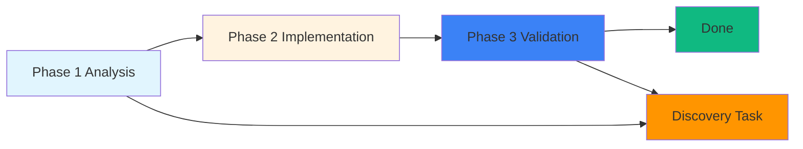

# Exploring the Hephaestus Deep Agent Landscape: Four Distinct Approaches to AI Workflows

When I heard about "Hephaestus deep agent," I assumed there was a single, unified project. What I discovered instead was a fascinating landscape of four distinct approaches—each addressing the challenge of autonomous AI agents in fundamentally different ways.

## Research Flow and Discovery

My investigation process followed this systematic approach:

```
1. Initial web search for "Hephaestus deep agent"
   └─→ Discovered mentions across Chinese tech blogs, GitHub discussions
   
2. Targeted repository exploration
   ├─→ GitHub API search for hephaestus repositories
   ├─→ Manual verification of project authenticity
   └─→ Documentation deep-dive for technical details
   
3. Cross-referencing with known projects
   ├─→ oh-my-opencode integration context
   ├─→ OpenAgentsControl comparisons
   └─→ Pattern recognition across agent frameworks
   
4. Synthesis and categorization
   └─→ Identified 4 distinct project types
```

This systematic exploration revealed not one "Hephaestus," but an entire ecosystem—each project leveraging the Hephaestus archetype (the Greek god of the forge/craftsman) to represent different philosophical approaches to autonomous agents.

---

## The Four Faces of Hephaestus

### 1. Hephaestus by Ido-Levi ⭐ 1.1k
**Standalone Framework: Semi-Structured Agentic Workflow**

> "What if AI workflows could write their own instructions as agents discover what needs to be done?"

This is the most innovative and philosophically distinct project I found. Ido-Levi's Hephaestus takes a radical departure from traditional agent frameworks.

**Core Innovation: Self-Branching Workflows**

Traditional agent frameworks require you to predefine every possible branch and scenario. Hephaestus instead defines **three logical phase types**:

- **Phase 1 (Analysis)**: Understanding, planning, investigation
- **Phase 2 (Implementation)**: Building, fixing, optimizing
- **Phase 3 (Validation)**: Testing, verification, quality checks

The revolutionary insight: **Agents can spawn tasks in ANY phase based on what they discover.**

#### Real-World Example from the Documentation

```
Give PRD: "Build a web application with authentication, REST API, and React frontend"

Phase 1 agent reads PRD → Spawns 5 Phase 2 tasks (parallel)
                    ↓
                    Phase 2A: Build Authentication System
                    Phase 2B: Build REST API
                    Phase 2C: Build React Frontend
                    Phase 2D: Build Database Schema
                    Phase 2E: Build Background Workers
                    ↓
Phase 3 agent testing auth discovers optimization opportunity
                    ↓
                    Spawns NEW Phase 1 task: "Analyze auth caching pattern"
                    ↓
                    Confirms viable → Spawns Phase 2 implementation
                    ↓
                    Implements caching across all API routes
                    ↓
Phase 3 validates → Workflow expanded organically
```

**Key Features:**
- Real-time Kanban board visualization
- Guardian monitoring system for coherence
- MCP (Model Context Protocol) integration
- Qdrant vector store for memory
- Tmux-based agent isolation
- Production-ready workflows via "Hephaestus Dev" mode

**Best For:** Projects that evolve organically, where you can't predict all discovery scenarios upfront.

---

### 2. OpenAgentsControl by DarrenHinde ⭐ 2.2k
**Control & Repeatability Framework for Teams**

> "Teach agents YOUR coding patterns once. They use them forever. Repeatable results."

This project takes a completely different philosophical stance: **control through standardization** rather than adaptive discovery.

**Core Philosophy: MVI (Minimal Viable Information)**

The MVI principle drives every design decision:

- **Pattern Files < 200 lines** (vs loading entire codebases)
- **Lazy loading**: Only load what's needed, when it's needed
- **80% token reduction** through context efficiency

**The Approval Gate Workflow:**

```
User request
    ↓
ContextScout discovers relevant patterns
    ↓
Agent loads YOUR standards
    ↓
Agent proposes plan → YOU APPROVE
    ↓
Agent executes (matches your project)
    ↓
Ships without refactoring ✅
```

**Key Features:**
- ContextScout: Smart pattern discovery (your "secret weapon")
- Approval gates: Human-guided, always required before execution
- Editable agents: Markdown files you can modify directly
- Team-ready patterns: Shared context committed to repo
- ExternalScout: Live documentation fetching
- 6-stage workflow with validation
- Multi-language support (TypeScript, Python, Go, Rust)

**Best For:** Production code, teams with established coding standards, repeatable results, cost-conscious development.

---

### 3. Hephaestus Agent in oh-my-opencode ⭐ 34.2k
**Autonomous Deep Worker: "The Legitimate Craftsman"**

This is an agent *within* the oh-my-opencode plugin, not a standalone framework. It's one of four core agents in a sophisticated multi-agent orchestration system.

**The Four-Agent Team in oh-my-opencode:**

1. **Sisyphus** (Default orchestrator): Plans, delegates, drives completion
2. **Prometheus** (Strategic planner): Interview-mode planning before execution
3. **Atlas** (Execution orchestrator): Executes Prometheus-created plans
4. **Hephaestus** (Autonomous deep worker): Goal-oriented, pattern-matching craftsman

**Why "The Legitimate Craftsman"?**

The name is ironic—Anthropic blocked oh-my-opencode for third-party access to Claude, claiming ToS violations. Hephaestus embraces this irony, positioning itself as the "legitimate" craftsman who builds things "the right way, methodically and thoroughly."

**Core Characteristics:**

- **Goal-Oriented**: Give him a goal, not a recipe. He determines steps himself.
- **Explores Before Acting**: Fires 2-5 parallel explore/librarian agents before writing code
- **End-to-End Completion**: Doesn't stop until task is 100% done with verification evidence
- **Pattern Matching**: Searches existing codebase to match project style—"no AI slop"
- **Legitimate Precision**: Surgical, minimal, exactly what's needed

**Recommended Model:** GPT-5.3 Codex Medium (but model-agnostic)

**Best For:** Users who want fully autonomous execution within oh-my-opencode's ecosystem, with pattern-matching and thorough research before action.

---

### 4. NVIDIA Hephaestus (Internal Project)
**Automated Test Generation Framework**

> Completely different from the other three. This is NVIDIA's internal tool for generating test cases for DriveOS.

**Note:** This is **not publicly available**—internal use only.

**Purpose:** Automate the design and implementation of software tests, including integration tests and unit tests.

**Context:** Developed by NVIDIA's DriveOS team to solve the problem that creating comprehensive test plans is time-consuming and error-prone when done manually.

---

## Comparative Analysis

### Approach Comparison

| Dimension | Ido-Levi | OpenAgentsControl | oh-my-opencode | NVIDIA |
|-----------|-----------|------------------|-----------------|---------|
| **Philosophy** | Self-branching workflows | Pattern control | Autonomous execution | Test generation |
| **Primary Focus** | Dynamic adaptation | Team consistency | Speed & autonomy | Quality assurance |
| **Workflow Type** | Semi-structured | Plan-first | Fully autonomous | Predefined process |
| **Discovery Mechanism** | Agents spawn tasks | ContextScout finds patterns | Pre-research then execute | Human-defined tests |
| **Control Level** | High autonomy | High human control | High autonomy | High automation |
| **Best Use Case** | Evolving projects | Production teams | Fast autonomous coding | Test automation |
| **Repository Status** | Public, active | Public, active | Plugin (34.2k stars) | Internal, private |
| **Stars** | 1.1k | 2.2k | 34.2k (plugin) | N/A |
| **Language** | Python + TypeScript | TypeScript | TypeScript | Internal |

### When to Use Each

**Choose Ido-Levi's Hephaestus when:**
- ✅ You're building complex, evolving systems
- ✅ You can't predict all discovery scenarios
- ✅ You need workflows that branch themselves organically
- ✅ Visual coordination (Kanban) is valuable
- ✅ You're comfortable with self-managing discovery phases

**Choose OpenAgentsControl when:**
- ✅ You have established coding patterns
- ✅ You work in a team requiring consistency
- ✅ Token efficiency and cost control matter
- ✅ You want approval gates before execution
- ✅ You need repeatable results across team members
- ✅ Pattern learning and sharing are priorities

**Choose oh-my-opencode's Hephaestus when:**
- ✅ You're already using oh-my-opencode
- ✅ You want the fastest autonomous execution
- ✅ You need 4-agent orchestration (Sisyphus, Prometheus, Atlas, Hephaestus)
- ✅ You value pattern-matching over pattern control
- ✅ You want production-ready code without approval gates
- ✅ You benefit from the complete plugin ecosystem

**Note about NVIDIA's Hephaestus:**
Since this is internal and not publicly accessible, it's only relevant if you work at NVIDIA or have access to DriveOS development tools. It represents a different category altogether—test automation rather than general development agents.

---

## Technical Deep-Dive: How They Work

### The Kanban Coordination Pattern (Ido-Levi)

Hephaestus implements a real-time Kanban board where agents create and manage tickets dynamically:



**Guardian System:** Monitors agent coherence, ensuring all agents stay aligned with phase goals. If an agent drifts (e.g., a validation agent starts implementing without discovery), the Guardian intervenes.

### The Context System (OpenAgentsControl)

OpenAgentsControl uses sophisticated context resolution with a local-first approach:

```
Context Discovery Flow:
1. Check local: .opencode/context/core/navigation.md
   ↓ Found? → Use local. Done.
   ↓ Not found?
2. Check global: ~/.config/opencode/context/core/navigation.md
   ↓ Found? → Use global for core/ files only.
   ↓ Not found?
3. Check project: .opencode/context/project-intelligence/
   ↓ Use project-specific (tech stack, patterns, naming)
```

**MVI Token Efficiency:**
- Context files < 200 lines (scannable in 30 seconds)
- Lazy loading prevents context bloat
- 80% of tasks use isolated context

### The Four-Agent Orchestration (oh-my-opencode)

```
┌─────────────────────────────────────────────────────────┐
│              User Request                           │
└────────────────────────────┬────────────────────────┘
                         │
              ┌────────┴─────────┐
              │   Sisyphus (Main) │
              └──┬──────────────┘
                 │
      ┌──────────┼──────────┐
      │          │          │
      │          │          │
  ┌───▼──┐    │    ┌─────▼──────┐
  │Prometheus│    │    │   Hephaestus │
  │ (Plan)  │    │    │(Deep Work) │
  └────┬─────┘    │    └──────────────┘
       │           │
       │     ┌─────▼──────┐
       │     │    Atlas       │
       │     │(Execute)      │
       │     └────────┬──────┘
       └──────────┼─────────┘
                  │
         Parallel Subagents
```

**Parallel Subagents:**
- Explore: Fast codebase grep
- Librarian: Documentation & code search
- Oracle: Architecture decisions
- Multimodal Looker: Image/PDF analysis
- Plus 15+ specialized agents

---

## Community Reception and Adoption

### Social Media Buzz

The Hephaestus concept has generated significant excitement in Chinese tech communities:

> "给大家介绍一个炸裂的开源项目 Hephaestus - 这玩意儿让AI Agent自己规划工作，自己发现问题，自己创建任务！"
>
> Translation: "Let me introduce an explosive open source project Hephaestus - this thing lets AI agents plan work themselves, discover problems themselves, and create tasks!"

Key viral moments:
- Weibo posts with 20k+ engagements discussing "AI可以自己找活干了？" (Can AI find work to do itself?)
- Tech blogs comparing approaches
- Community discussions about "self-branching" vs "approval-gated" trade-offs

### GitHub Ecosystem Growth

All three public projects show strong, active communities:

- **oh-my-opencode**: 34.2k stars, 2.6k forks, 140 contributors
- **OpenAgentsControl**: 2.2k stars, 204 forks, 11 contributors
- **Ido-Levi/Hephaestus**: 1.1k stars, 120 forks, 5 contributors

This indicates robust interest in alternative approaches to AI agents beyond traditional "auto-execute" tools like Cursor or Claude Code.

---

## My Assessment and Recommendations

### What I Learned

1. **"Hephaestus" is not a single project**—it's a philosophical approach
   - Each implementation embodies different values: autonomy vs control, adaptation vs repeatability
   - Naming after the Greek god of the forge/craftsman is intentional—building systems that create value

2. **The trade-off triangle is real**:
   ```
                Autonomy
                    /\
                   /  \
                  /    \    Control
                /         \
         Speed  -----------  Quality
   ```
   - **Ido-Levi**: Maximize autonomy, discover tasks dynamically
   - **OpenAgentsControl**: Maximize control, ensure repeatability
   - **oh-my-opencode**: Balance speed with autonomy (approval gates optional)
   - **No single solution** optimizes all three dimensions perfectly

3. **The integration opportunities are clear**:
   - Teams could use Ido-Levi's self-branching for discovery + OpenAgentsControl's pattern control for production
   - oh-my-opencode already provides sophisticated orchestration—adding Hephaestus as one of four core agents shows the ecosystem's flexibility

### Practical Guidance

**For Individual Developers:**

| Your Goal | Recommended Choice | Why |
|-------------|------------------|------|
| Fast autonomous coding | **oh-my-opencode Hephaestus** | Pattern-matching, pre-research, no approval gates |
| Learning complex systems | **Ido-Levi Hephaestus** | Self-branching, visual coordination, discovery-focused |
| Production teams | **OpenAgentsControl** | Pattern control, token efficiency, team consistency |
| Exploring AI agents | **Try all three** | Each represents a different philosophy |

**For Teams and Organizations:**

Consider a hybrid approach:
- Use **OpenAgentsControl** for production patterns and approval gates
- Integrate **Ido-Levi Hephaestus** for discovery phases and adaptive workflows
- Train team on **pattern definitions** that can be shared across tools

---

## Conclusion

The "Hephaestus deep agent" landscape is far richer and more nuanced than I initially assumed. Rather than a single tool, it represents an ongoing philosophical debate in the AI agent community:

- **How autonomous should agents be?**
- **How much control do humans need?**
- **Can workflows be predictable or must they adapt?**
- **What's the balance between speed and quality?**

The three active public projects (Ido-Levi, OpenAgentsControl, oh-my-opencode) each provide compelling answers to these questions—different enough that they can coexist and serve different use cases rather than competing directly.

What's clear is that the future of AI agents isn't about finding one perfect tool. It's about understanding the trade-offs and choosing the right approach for your specific needs, team dynamics, and quality standards.

**My recommendation**: Start with **oh-my-opencode** if you're new to autonomous agents—it provides the most complete ecosystem with all four Hephaestus-style approaches integrated. Once you understand your patterns, explore **OpenAgentsControl** for team production work. If you need highly adaptive workflows, **Ido-Levi's Hephaestus** offers the most innovative approach.

The key is to **choose your trade-offs consciously** rather than hoping one tool solves everything.

---

**Further Reading:**

- [Ido-Levi/Hephaestus](https://github.com/Ido-Levi/Hephaestus) - Semi-structured agentic framework
- [OpenAgentsControl](https://github.com/darrenhinde/OpenAgentsControl) - Pattern control & approval gates
- [oh-my-opencode](https://github.com/code-yeongyu/oh-my-opencode) - Multi-agent orchestration plugin
- [NVIDIA Blog on Hephaestus](https://developer.nvidia.com/blog/building-ai-agents-to-automate-software-test-case-creation/) - Test generation framework

---

*Did you find this analysis helpful? Explore these projects and share your experiences with the community!*