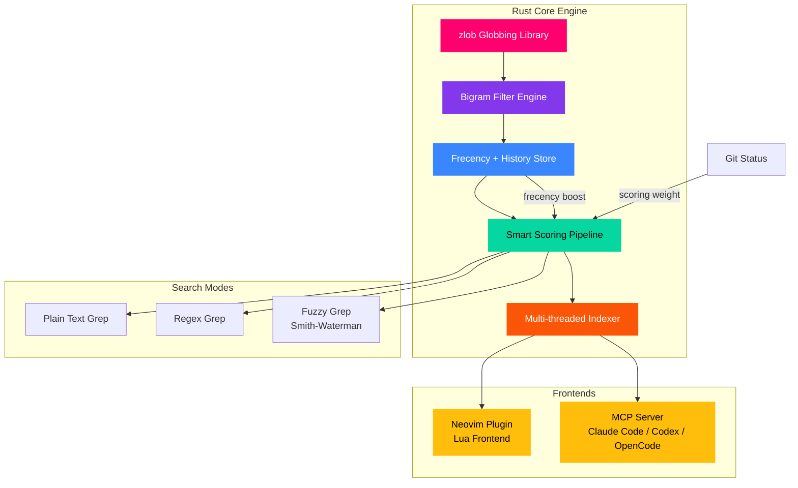

> *freakin fast fuzzy file finder* — and this time, the name isn't exaggerating.

## TL;DR

**fff.nvim** is a Rust-powered fuzzy file picker that serves two masters: your Neovim editor and your AI coding agents (via MCP). It remembers what files you work with (frecency), searches with typo-resistant algorithms, and reportedly cuts token usage and round-trips significantly compared to built-in Claude Code tooling. If you use Neovim *or* AI-assisted coding, this is worth ten minutes of your time.

| What | Detail |
|------|--------|
| **Repo** | [dmtrKovalenko/fff.nvim](https://github.com/dmtrKovalenko/fff.nvim) |
| **Author** | Dmitriy Kovalenko |
| **License** | Apache 2.0 |
| **Core Language** | Rust (engine) + Lua (Neovim frontend) |
| **Unique Angle** | MCP server — AI agents get fast, memory-aware file search |

---

## Why This Matters

The gap between "what AI agents know about your codebase" and "what they can actually find" is enormous. Most AI coding tools rely on greedy globbing, slow tree walks, or brute-force reads. They don't remember. They don't learn. Every session starts from zero.

fff.nvim fixes this by giving AI agents the same quality of file search that humans get in a modern editor — and then making it *faster* by keeping a frecency-weighted history of what matters in your project.

For Neovim users, it's a best-in-class fuzzy finder with live grep, git integration, and cross-mode suggestions. For AI agent users, it's a productivity multiplier that reduces the number of round-trips and tokens burned on file discovery.

---

## Architecture Overview



The architecture splits cleanly: a **Rust core** handles all the heavy lifting (indexing, scoring, globbing, searching), while **thin frontends** expose it to Neovim and MCP clients. The frecency store persists across sessions, meaning the AI agent or editor "remembers" your project layout.

---

## The MCP Angle: AI Agents That Actually Find Things

This is the commercially interesting part. fff.nvim ships an MCP (Model Context Protocol) server that plugs directly into Claude Code, Codex, and OpenCode. Instead of AI agents fumbling through your codebase with `find` and `grep`, they get:

- **Memory-aware search** — frecency-boosted results mean agents find the *right* files faster
- **Typo-resistant queries** — bigram filtering handles imperfect agent-generated queries
- **Constraint system** — agents can filter by `git:modified`, glob patterns, or exclusion rules
- **Reduced token waste** — fewer round-trips means less context burned on file discovery

### MCP Installation

```bash
# One-liner install for MCP server
curl -L https://dmtrkovalenko.dev/install-fff-mcp.sh | bash
```

After installation, your AI agent tools automatically gain access to the fff.nvim search backend. The agent can query files, get ranked results, and leverage the full constraint system — all without leaving the conversation context.

The repo includes `.mcp.json` configuration and an `install-mcp.sh` script, making setup essentially zero-config for supported platforms.

---

## Rust-Powered Performance

The performance story is real. The core engine is written in Rust and leverages:

- **zlob** — reportedly the fastest globbing library available
- **Bigram filters** — sub-millisecond fuzzy matching on large codebases
- **Multi-threaded indexing** — parallel directory walks with minimal overhead
- **Smith-Waterman scoring** — biological sequence alignment algorithm repurposed for fuzzy text matching (yes, really)

The repo includes benchmark charts (chart.png) showing significant improvements over built-in Claude Code tools — both in token consumption and round-trip count. For teams running AI agents at scale, this translates directly to cost savings.

---

## Neovim Integration

For Neovim users, fff.nvim is a full-featured fuzzy finder replacement:

### Installation (lazy.nvim)

```lua
{
  "dmtrKovalenko/fff.nvim",
  lazy = false,
  config = function()
    require("fff").setup({
      -- Frecency tracking enabled by default
      -- Live grep with typo-resistant search
      -- Git status highlighting built-in
    })
  end,
}
```

### Key Features in the Editor

- **Live grep** with three modes: plain text, regex, and fuzzy (Smith-Waterman)
- **Cross-mode suggestions** — no results in file search? It suggests grep matches, and vice versa
- **Git integration** — modified, staged, and untracked file indicators in results
- **Multi-select + Quickfix** — select multiple files and send them directly to the quickfix list
- **Constraint system** — filter with `git:modified`, `test/`, `!vendor`, or glob patterns

```lua
-- Example: Find modified files
require("fff").find_files({ constraints = "git:modified" })

-- Example: Live grep across test files only
require("fff").live_grep({ constraints = "test/" })
```

---

## Smart Scoring Pipeline

The scoring system is where fff.nvim separates itself from simpler finders. Results are ranked by a composite score combining:

| Factor | Weight | Purpose |
|--------|--------|---------|
| **Frecency** | High | Frequently + recently opened files rank higher |
| **Git status** | Medium | Modified/staged files get a boost |
| **File size** | Low | Smaller files (configs, tests) prioritized over large generated files |
| **Definition matches** | Medium | Exact name matches score higher than substring matches |
| **Combo boost** | Variable | Multiple matching factors compound the score |

This means the file you edited five minutes ago and the test file you open twenty times a day will *always* surface first — whether you're searching from Neovim or asking your AI agent to find it.

---

## Constraint System Deep Dive

<details>
<summary><strong>Expand: Full Constraint Syntax</strong></summary>

The constraint system supports composable filters:

```
git:modified          # Only git-modified files
test/                 # Only files in test directories
!vendor               # Exclude vendor directories
*.tsx                 # Glob pattern matching
git:modified + test/  # Combine: modified test files only
```

Constraints work across both file search and live grep modes. In MCP mode, agents can pass constraints as parameters, enabling precise file discovery without multiple queries.

</details>

---

## Cross-Mode Suggestions

<details>
<summary><strong>Expand: How Cross-Mode Works</strong></summary>

One of the more thoughtful features: when file search returns no results, fff.nvim automatically suggests grep matches for the same query. When grep returns nothing, it suggests file matches. This eliminates the "wrong mode" problem that plagues every other fuzzy finder.

In practice, this means you rarely need to switch modes manually. Type what you're looking for, and the system figures out whether it's a filename or content match.

</details>

---

## Nix Flake Support

The repo includes a `flake.nix` for Nix users, providing reproducible builds and system-level installation. Combined with `rust-toolchain.toml` for pinned Rust versions, the build system is robust and deterministic — a nice touch for DevOps teams managing developer environments.

---

## Who Should Use This

| Role | Why |
|------|-----|
| **Neovim power users** | Best-in-class fuzzy finder with memory, git integration, and cross-mode suggestions |
| **AI-assisted developers** | MCP integration cuts token waste and improves agent file discovery |
| **DevOps / Platform engineers** | Nix flake support, Rust binary, reproducible installs |
| **Teams at scale** | Reduced round-trips = reduced AI costs per developer |
| **Open-source contributors** | Active development, Apache 2.0 license, welcoming structure |

---

## Getting Started

```bash
# MCP server (for AI agents)
curl -L https://dmtrkovalenko.dev/install-fff-mcp.sh | bash

# Neovim (lazy.nvim)
# Add dmtrKovalenko/fff.nvim to your plugin spec

# Neovim (vim.pack — Neovim 0.10+)
vim.pack.add("fff.nvim")
```

The project is under active development with commits landing daily and multiple contributors. The Rust core ensures it won't slow down as your codebase grows, and the frecency store means it gets *better* the more you use it.

---

## Final Thoughts

fff.nvim sits at an interesting intersection: it's a legitimate Neovim fuzzy finder that also happens to solve a real problem for AI coding agents. The MCP integration isn't bolted on — it's a first-class feature with dedicated install tooling and configuration. The Rust core gives it the performance headroom to handle massive codebases without breaking a sweat.

If you're using AI agents for coding and tired of watching them burn tokens on file discovery, or if you're a Neovim user who wants a finder that actually learns your habits, fff.nvim is worth the install.

**Repo**: [github.com/dmtrKovalenko/fff.nvim](https://github.com/dmtrKovalenko/fff.nvim)

---

*Tags: neovim, ai-tools, mcp, fuzzy-finder, rust, developer-tools*