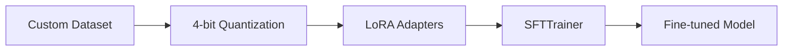

> **TL;DR**: Learn how to fine-tune Google's Gemma-4 E2B model on custom data using Unsloth and LoRA — in under 3 minutes with less than 8GB VRAM.

## Quick Summary

- Gemma-4 E2B has 5.1B total parameters but only 2.3B "effective" parameters due to per-layer embeddings — making it cheap to fine-tune
- The tutorial uses **Unsloth** with **4-bit quantization** and **LoRA adapters** to train on a custom Gandhara civilization dataset
- Training completed in **under 3 minutes** on a single GPU with peak VRAM of just ~8GB
- Only **25M out of 5.1B parameters** (0.49%) were trained — the rest stayed frozen

## The E2B Architecture Explained

Google's Gemma-4 E2B is cleverly designed. Think of it as a book where the total 5.1 billion parameters are all the pages. But it uses **per-layer embeddings** — like an index at the back. You glance at the index quickly to find what you need, but you don't read it word for word.

The actual **2.3 billion effective parameters** are the real content — the chapters your brain actually processes. When people say "E2B runs like a 2B model," they mean the compute cost matches a 2B model because only those 2.3B parameters do the heavy lifting during inference. The embeddings are fast lookups, not expensive matrix multiplications.

## The Fine-Tuning Pipeline



### Prerequisites

The setup uses a standard Ubuntu server with an NVIDIA GPU. Key packages:

- **Unsloth** — Optimized training library
- **PyTorch** — Deep learning framework
- **Transformers** — HuggingFace model hub integration

## Building the Custom Dataset

The tutorial uses a dataset of ~100 detailed Q&A pairs about the **Gandhara civilization** — an ancient crossroads of Buddhist, Greek, Persian, and Indian worlds in what is now Pakistan. The dataset covers:

- Kushan Empire history
- Silk Road trade routes
- Buddhist philosophy and Gandharan art
- Ancient scripts and key rulers
- Monasteries, geography, and the civilization's decline

The format follows the **ShareGPT template** in JSONL (JSON Lines) — each line is a JSON object with a "human" question and a "GPT" response containing rich, detailed answers.

## Training Configuration Explained

The training script applies several key techniques:

| Parameter | Value | Why |
|-----------|-------|-----|
| **Batch size** | 2 | Conservative — keeps VRAM low |
| **Gradient accumulation** | 4 | Effective batch size of 8 without the VRAM cost |
| **Warmup steps** | 10 | Learning rate ramps up gradually to prevent unstable updates |
| **Epochs** | 3 | Multiple passes reinforce learning |
| **Learning rate** | 2e-4 | Standard safe value for LoRA fine-tuning |
| **Optimizer** | AdamW 8-bit | Standard for LLM training, 8-bit uses less VRAM |
| **Weight decay** | 0.01 | Regularization to prevent overfitting on small datasets |
| **LR schedule** | Linear | Smooth convergence — LR decreases toward zero |

### LoRA: Low-Rank Adaptation

Instead of training all 2.3 billion parameters, LoRA attaches small trainable adapter layers to the attention and MLP modules. Everything else stays frozen. This makes fine-tuning fast and memory-efficient — only **25 million out of 5.1 billion parameters** (0.49%) were actually trained.

## Results

The training loss dropped from **15.51 to ~4.7** — a healthy descent showing genuine learning. The gradient norm stabilized from 25 down to ~1.5-1.7.

When tested with "Who was Kanishka I and what was his significance to Gandhara and Buddhism?":

- **Base model**: Generic 2-line textbook answer with no depth
- **Fine-tuned model**: Grounded, nuanced, detailed response covering historical context, reign details, and patronage of Buddhism

The difference was described as "palpable" — a completely different level of expertise.

## Merging and Deployment

After training, the LoRA adapter can be merged with the base model using a single command, then uploaded to HuggingFace:

```bash
# Merge adapter with base model
model.save_pretrained_merged("merged-model")

# Upload to HuggingFace
model.push_to_hub("your-username/gemma4-gandhara")
```

The adapter output is very small since it only contains the delta between the base and fine-tuned model.

<details>
<summary>Technical Deep Dive: Why This Matters</summary>

### The Economics of Fine-Tuning

This tutorial demonstrates that state-of-the-art open-source LLMs can be specialized for niche domains with:

- **Minimal hardware**: 8GB VRAM (runnable on consumer GPUs or even CPU)
- **Minimal time**: Under 3 minutes for training
- **Minimal data**: ~100 high-quality Q&A pairs
- **Minimal parameters**: Only 0.49% of the model is modified

This democratizes AI specialization. You don't need a PhD in machine learning or access to massive compute clusters. A domain expert with a curated dataset can create a specialized model in an afternoon.

### The Per-Layer Embedding Innovation

The E2B architecture is significant because it decouples **model capability** from **inference cost**. The full 5.1B parameters give the model rich representations, but during inference, the per-layer embeddings act as cached lookups rather than requiring expensive matrix multiplications. This means you get the quality of a larger model at the cost of a smaller one.

</details>

<details>
<summary>References & Resources</summary>

- [Google Gemma-4 E2B on HuggingFace](https://huggingface.co/google/gemma-4-E2B)
- [Unsloth GitHub Repository](https://github.com/unslothai/unsloth)
- [Original video by Fahd Mirza](https://www.youtube.com/watch?v=cHpB0PTRx5A)
- [Gandhara Civilization - Wikipedia](https://en.wikipedia.org/wiki/Gandhara)

</details>

**Tags**: gemma-4, fine-tuning, lora, unsloth, llm, local-ai, machine-learning
**Categories**: AI Tutorials, Machine Learning