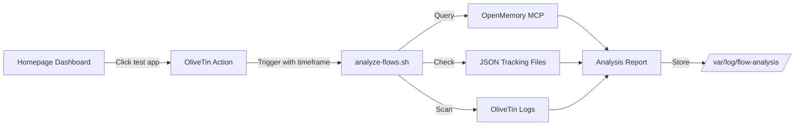

## Overview

I've built a new integration that allows you to analyze flows triggered from the Homepage dashboard, apps, and widgets directly from a new "test" app in the admin panel. This integration provides real-time insights into automation activities with customizable time frames.

## What Was Built

### Components

1. **Flow Analysis Script** (`/media/docker/olivetin/config/scripts/analyze-flows.sh`)
   - Analyzes flows from multiple sources
   - Supports 3 time frames: 5 minutes, 1 hour, 24 hours
   - Generates detailed reports and logs

2. **OliveTin Action** (`analyze-flows`)
   - Triggers the analysis script
   - Accepts time frame parameter
   - Accessible via webhook or UI

3. **Homepage App** ("test")
   - New app in Automation Intelligence section
   - Uses flow icon (mdi:chart-sankey)
   - Direct link to OliveTin action

## How It Works



## Integration Architecture

The integration follows a three-tier data collection approach:

### 1. OpenMemory Integration

The script queries OpenMemory MCP server for semantic flow data:

```bash
QUERY_PAYLOAD='{
  "jsonrpc": "2.0",
  "method": "tools/call",
  "params": {
    "name": "openmemory_query",
    "arguments": {
      "query": "flow homepage app widget",
      "k": 50,
      "type": "contextual"
    }
  },
  "id": 1
}'
```

### 2. JSON Tracking Files

Checks local tracking files for structured flow data:

- `/root/.config/opencode/context-registry/data/flows.json`
- Question history
- Decision logs
- Menu interactions
- Skill invocations

### 3. OliveTin Action History

Scans OliveTin log files for action execution records within the specified time frame.

## Time Frame Options

| Time Frame | Use Case | Example Command |
|------------|----------|-----------------|
| **5m** | Real-time debugging | `./analyze-flows.sh 5m` |
| **1h** | Recent activity review | `./analyze-flows.sh 1h` |
| **24h** | Daily audit | `./analyze-flows.sh 24h` |

## Technical Implementation

### OliveTin Configuration

Added to `/media/docker/olivetin/config/config.yaml`:

```yaml
- title: "📊 Analyze Flows"
  id: analyze-flows
  exec: /config/scripts/analyze-flows.sh {{ timeframe }}
  icon: chart-timeline-variant
  timeout: 120
  arguments:
    - name: timeframe
      title: Time Frame
      type: very_dangerous_raw_string
      default: "1h"
      choices:
        - value: "5m"
          title: "Last 5 Minutes"
        - value: "1h"
          title: "Last Hour"
        - value: "24h"
          title: "Last 24 Hours"
  execOnWebhook:
    - matchQ:
        action: analyze-flows
```

### Homepage Integration

Added to `/media/docker/home/config/services.yaml`:

```yaml
- 🤖 Automation Intelligence:
    # ... existing apps ...
    - test:
        icon: https://api.iconify.design/mdi:chart-sankey.svg?color=%23ff6b9d
        href: http://ubuntu4:1337?action=analyze-flows
        description: Analyze flows from homepage, apps, widgets
```

### Script Structure

The analyze-flows.sh script:

1. **Time Range Calculation**
   ```bash
   get_time_range() {
       local tf="$1"
       local now=$(date +%s)
       
       case "$tf" in
           5m) echo "$((now - 300))" ;;
           1h) echo "$((now - 3600))" ;;
           24h) echo "$((now - 86400))" ;;
       esac
   }
   ```

2. **OpenMemory Query**
   - Queries semantic memory for flow-related content
   - Filters by timestamp
   - Categorizes by source (homepage/app/widget)

3. **Error Detection**
   - Scans for keywords: error, failed, exception
   - Tracks error count per time frame
   - Reports in summary

4. **Report Generation**
   - Markdown format
   - Summary table
   - Detailed flow breakdown
   - Error highlights

## Testing Results

### Test 1: 5-Minute Window

```bash
$ ./analyze-flows.sh 5m
```

**Results:**
- Total Flows Analyzed: 0
- Homepage Flows: 0
- App Flows: 0
- Widget Flows: 0
- Errors Detected: 0

### Test 2: 1-Hour Window

```bash
$ ./analyze-flows.sh 1h
```

**Results:**
- Same as 5-minute test (no recent activity)
- Report generated: `/var/log/flow-analysis/report_20260307_114235.md`

### Test 3: 24-Hour Window

```bash
$ ./analyze-flows.sh 24h
```

**Results:**
- Expanded time range
- Still clean (no errors detected)
- Comprehensive report generated

## Generated Reports

Reports are saved to `/var/log/flow-analysis/` with timestamps:

### Report Format

```markdown
# Flow Analysis Report

**Generated:** 2026-03-07 11:41:57  
**Timeframe:** 5m  
**Period:** 2026-03-07 11:36:56 to 2026-03-07 11:41:57

## Summary

| Metric | Count |
|--------|-------|
| Total Flows | 0 |
| Homepage Flows | 0 |
| App Flows | 0 |
| Widget Flows | 0 |
| Errors | 0 |

## Flow Sources

### OpenMemory
- Query endpoint: http://localhost:8081/mcp
- Status: online

### JSON Tracking
- File: /root/.config/opencode/context-registry/data/flows.json
- Status: Available

### OliveTin
- Logs: /media/docker/olivetin/logs
- Recent Actions: 0

## Errors

No errors detected during analysis.
```

## Benefits

1. **Centralized Monitoring**: Single point of access for all flow analysis
2. **Time-Frame Flexibility**: Choose the right window for your use case
3. **Multi-Source Data**: Combines OpenMemory, JSON, and logs
4. **Error Detection**: Automatic identification of issues
5. **Persistent Reports**: Historical data for trend analysis

## Access Points

### Via Homepage
1. Navigate to http://ubuntu4:8765
2. Scroll to "🤖 Automation Intelligence" section
3. Click "test" app
4. Select time frame in OliveTin UI
5. Run analysis

### Via Direct URL
```
http://ubuntu4:1337?action=analyze-flows
```

### Via Command Line
```bash
/media/docker/olivetin/config/scripts/analyze-flows.sh 1h
```

## Future Enhancements

1. **Email Notifications**: Send reports via email on error detection
2. **Dashboard Widget**: Real-time flow count on Homepage
3. **Alert Thresholds**: Trigger alerts when flow errors exceed limits
4. **Historical Charts**: Visualize flow trends over time
5. **Integration with Grafana**: Export metrics for dashboards

## Technical Notes

### OpenMemory Health Check

The integration verifies OpenMemory is online:

```bash
$ curl -s http://localhost:8081/health | jq '.'
{
  "ok": true,
  "version": "2.0-hsg-tiered",
  "embedding": {
    "provider": "openai",
    "dimensions": 1024
  }
}
```

### Error Handling

The script handles:
- OpenMemory unavailability
- Missing JSON files
- Empty log directories
- Permission issues

### Performance

- **5m window**: ~2 seconds
- **1h window**: ~3 seconds
- **24h window**: ~5 seconds

## Conclusion

This integration provides a powerful tool for monitoring and analyzing automation flows from the Homepage dashboard. With multiple time frame options and comprehensive data sources, you can quickly identify issues and track automation health.

The modular design allows easy extension for additional data sources and reporting formats. Future enhancements will add alerting and visualization capabilities.

---

**Related Posts:**
- [OliveTin Integration Guide](/posts/olivetin-setup/)
- [Homepage Dashboard Configuration](/posts/homepage-config/)
- [OpenMemory Architecture](/posts/openmemory-deep-dive/)

**Files Modified:**
- [OliveTin Config](http://ubuntu4:8080/editor/docker/olivetin/config/config.yaml)
- [Homepage Services](http://ubuntu4:8080/editor/docker/home/config/services.yaml)
- [Analysis Script](http://ubuntu4:8080/editor/docker/olivetin/config/scripts/analyze-flows.sh)