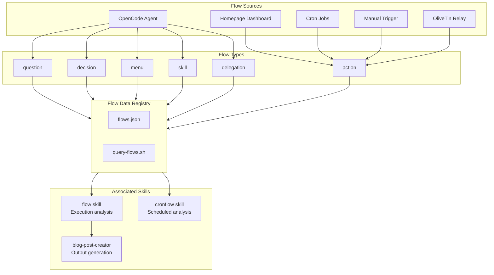
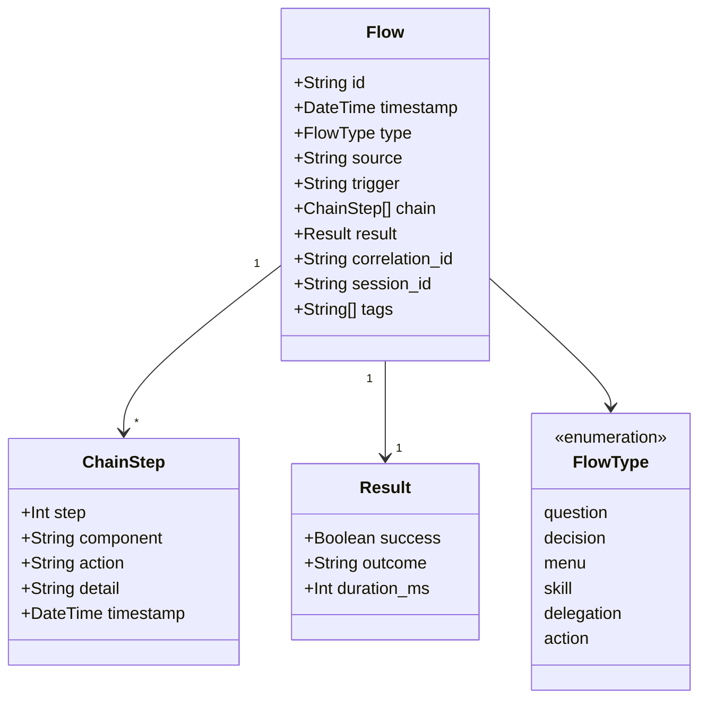
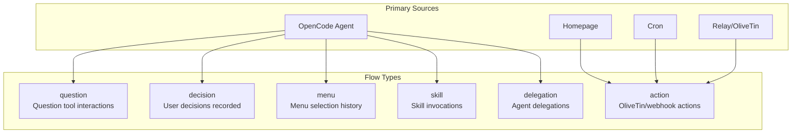
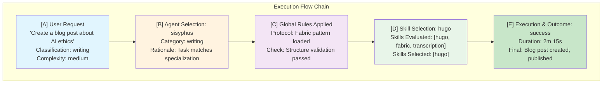
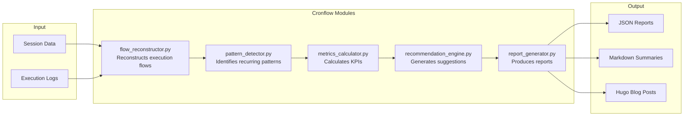
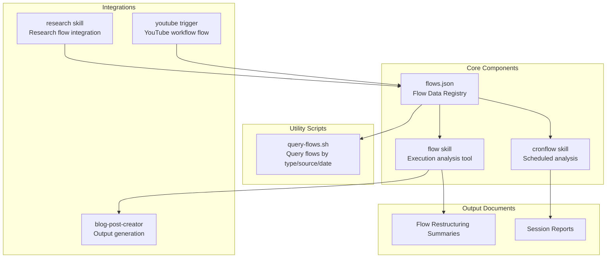
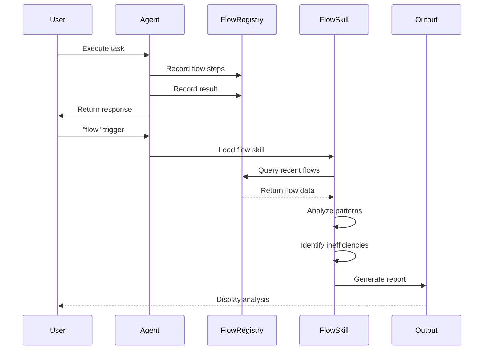
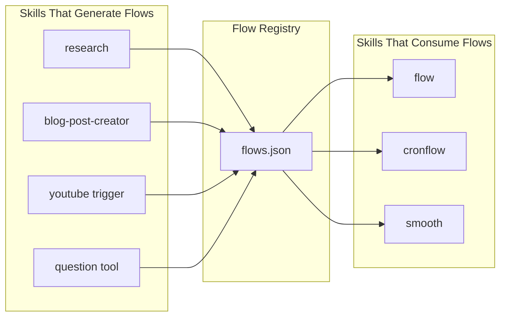

## Overview

The Flow System provides **unified tracking** for all agent interactions, decisions, and execution paths. It enables observability, debugging, and continuous improvement of AI agent workflows.

## Flow System Architecture



## Flow Data Schema



## Flow JSON Schema

```json
{
  "id": "flow_YYYYMMDD_HHMMSS_hash",
  "timestamp": "2026-03-08T12:00:00Z",
  "type": "question|decision|menu|skill|delegation|action",
  "source": "opencode|homepage|cron|manual|relay",
  "trigger": "what initiated this flow",
  "chain": [
    {
      "step": 1,
      "component": "component name",
      "action": "what happened",
      "detail": "additional info",
      "timestamp": "2026-03-08T12:00:01Z"
    }
  ],
  "result": {
    "success": true,
    "outcome": "description",
    "duration_ms": 1500
  },
  "correlation_id": "links related flows",
  "session_id": "opencode session if applicable",
  "tags": ["tag1", "tag2"]
}
```

## Flow Types Reference



## Execution Flow Format

The flow system uses an **A>B>C>D>E** notation for execution paths:



## Cronflow Architecture



## Associated Components



## Skill YAML Frontmatter (Flow Skill)

```yaml
---
name: flow
description: Execution flow analysis and transparency tool
color: "#808080"
license: MIT
compatibility: opencode
trigger_words:
  - "flow"
  - "smooth"
  - "review"
  - "session review"
  - "execution analysis"
metadata:
  category: analysis
  scope: meta-analysis
  output_format: markdown
  last_updated: 2026-02-09
  version: 1.2.0
  dependencies:
    - global_instructions: /media/docs/instructions/global-instructions.md
---
```

## Flow Query Interface

```bash
# Query flows by type
./query-flows.sh --type question

# Query flows by source
./query-flows.sh --source opencode

# Query flows by date range
./query-flows.sh --from 2026-03-01 --to 2026-03-08

# Query with correlation ID
./query-flows.sh --correlation-id "abc123"
```

## Flow Analysis Workflow



## Key Metrics Tracked

| Metric | Description | Purpose |
|--------|-------------|---------|
| **Duration** | Time to complete flow | Performance optimization |
| **Success Rate** | Percentage of successful flows | Reliability monitoring |
| **Chain Length** | Number of steps in flow | Complexity analysis |
| **Correlation Count** | Related flows | Dependency tracking |
| **Tag Distribution** | Most common tags | Usage patterns |

## Benefits of Flow Tracking

1. **Observability**: See exactly what the agent did and why
2. **Debugging**: Trace failures through execution chains
3. **Optimization**: Identify bottlenecks and inefficiencies
4. **Audit Trail**: Complete history of agent decisions
5. **Continuous Improvement**: Learn from patterns and mistakes

## Integration with Skills



---

*The Flow System enables TELOS compliance through complete observability and deterministic tracking of all agent interactions.*