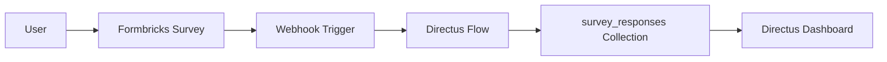

---
title: "Setting Up Formbricks with Directus Integration: A Complete Guide"
description: "How I deployed Formbricks for surveys and integrated it with Directus CMS for automated data collection and workflow automation."
publishDate: 2026-03-26
tags: ["formbricks", "directus", "docker", "self-hosted", "surveys", "automation"]
category: "Infrastructure"
---

# Setting Up Formbricks with Directus Integration

I recently added **Formbricks** to my self-hosted stack for collecting user feedback through surveys. In this post, I'll walk through the setup process and the integration I built with **Directus CMS** for automated data collection.

## What is Formbricks?

Formbricks is an open-source experience management platform that lets you:

- Create **link surveys** (shareable URLs)
- Build **in-app surveys** (embedded in your applications)
- Target specific user segments
- Collect NPS scores, feedback, and research data

It's a great alternative to tools like Typeform or SurveyMonkey, with the added benefit of full data ownership.

## Installation via Docker

### Step 1: Download the Docker Compose File

```bash
mkdir -p /media/docker/formbricks && cd /media/docker/formbricks
curl -o docker-compose.yml https://raw.githubusercontent.com/formbricks/formbricks/stable/docker/docker-compose.yml
```

### Step 2: Configure Environment Variables

Formbricks requires several secrets. Generate them:

```bash
# Generate secrets
NEXTAUTH_SECRET=$(openssl rand -hex 32)
ENCRYPTION_KEY=$(openssl rand -hex 32)
CRON_SECRET=$(openssl rand -hex 32)

# Update docker-compose.yml
sed -i "s|NEXTAUTH_SECRET: |NEXTAUTH_SECRET: $NEXTAUTH_SECRET|" docker-compose.yml
sed -i "s|ENCRYPTION_KEY: |ENCRYPTION_KEY: $ENCRYPTION_KEY|" docker-compose.yml
sed -i "s|CRON_SECRET: |CRON_SECRET: $CRON_SECRET|" docker-compose.yml
```

### Step 3: Set Your URL

Update the `WEBAPP_URL` and `NEXTAUTH_URL` to match your server:

```yaml
WEBAPP_URL: http://your-server:3200
NEXTAUTH_URL: http://your-server:3200
```

### Step 4: Adjust Ports

I changed the default ports to avoid conflicts:

```yaml
# Redis
ports:
  - "6380:6379"  # Changed from 6379

# Formbricks
ports:
  - 3200:3000    # Changed from 3000
```

### Step 5: Start the Stack

```bash
docker compose up -d
```

Formbricks will:
1. Start PostgreSQL (pgvector)
2. Start Redis (Valkey)
3. Run database migrations
4. Launch the Next.js application

Access the setup wizard at `http://your-server:3200` to create your first admin user.

## Directus Integration

The real power comes from connecting Formbricks to your existing systems. I integrated it with **Directus CMS** to automatically store survey responses.

### Creating the Collection

First, I created a `survey_responses` collection in Directus:

```bash
curl -X POST http://localhost:8055/collections \
  -H "Authorization: Bearer YOUR_TOKEN" \
  -H "Content-Type: application/json" \
  -d '{
    "collection": "survey_responses",
    "meta": {
      "icon": "poll",
      "note": "Responses from Formbricks surveys"
    },
    "fields": [
      {"field": "id", "type": "uuid"},
      {"field": "date_created", "type": "timestamp"},
      {"field": "survey_id", "type": "string"},
      {"field": "respondent", "type": "string"},
      {"field": "data", "type": "json"}
    ]
  }'
```

### Setting Up the Webhook Flow

Directus Flows make this integration seamless. I created a flow that:

1. **Receives** POST requests from Formbricks webhooks
2. **Extracts** survey data from the payload
3. **Stores** the response in the `survey_responses` collection

```bash
# Create the Flow
curl -X POST http://localhost:8055/flows \
  -H "Authorization: Bearer YOUR_TOKEN" \
  -H "Content-Type: application/json" \
  -d '{
    "name": "Formbricks Webhook Receiver",
    "icon": "webhook",
    "trigger": "webhook",
    "options": {
      "method": "POST",
      "path": "formbricks_response"
    }
  }'
```

Then add an operation to save the data:

```json
{
  "type": "item-create",
  "options": {
    "collection": "survey_responses",
    "payload": {
      "survey_id": "{{$trigger.body.data.surveyId}}",
      "respondent": "{{$trigger.body.data.personId}}",
      "data": "{{$trigger.body.data}}"
    }
  }
}
```

### Configuring Formbricks Webhook

In Formbricks, configure the webhook:

1. Go to **Settings → Integrations → Webhooks**
2. Add new webhook:
   - **URL**: `http://your-directus:8055/flows/trigger/FLOW_ID`
   - **Events**: `response.created`
   - **Headers**: `Authorization: Bearer YOUR_TOKEN`

## Architecture Overview



## What's Next?

With this foundation, you can:

1. **Build dashboards** in Directus to visualize survey data
2. **Connect to n8n** for complex automation workflows
3. **Send Telegram notifications** when surveys are completed
4. **Create follow-up actions** based on response content

## Key Takeaways

- **Formbricks** provides a powerful, self-hosted survey platform
- **Directus Flows** make webhook integrations straightforward
- **JSON storage** in Directus preserves full survey response flexibility
- **Docker networking** allows seamless service-to-service communication

The combination of Formbricks for data collection and Directus for data management creates a flexible, privacy-respecting feedback system that you fully control.

---

*Have questions about setting up Formbricks or Directus? Feel free to reach out!*
