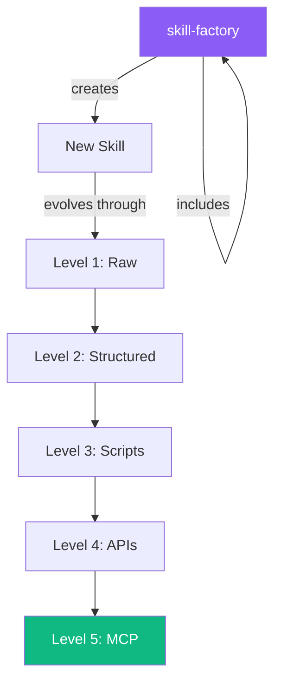

> This post is part of the [Knowledge Crystallization series](/posts/knowledge-crystallization-series).
> See also: [eRAG v2.2: Building a Second Brain](/posts/erag-v22-building-second-brain-for-agent-projects) | [The Recursion Principle](/posts/kc-06-recursion) | [Autoresearch as Universal Skill](/posts/andrej-karpathy-autoresearch-universal-skill)

---

## The Journey in One Diagram

```
🔴 Raw Prompts    →  🟠 Skills        →  🟡 Protocols    →  🟢 Scripts
    (Chat history)     (SKILL.md)         (Sections)         (Shell/Python)
                                                              ↓
                    ✅ Deterministic  ←  🟣 MCP Servers  ←  🔵 APIs
                        (Level 5)        (Typed tools)       (REST/GraphQL)
```

Six months ago, every AI session started from zero. Today, our agents have 2,846+ memories, 30+ structured skills, a knowledge graph with 594 entities and 379 facts, and a meta-skill that creates new skills — including itself.

This is the story of how we got there.

---

## Stage 1: Chaos (🔴 Raw Prompts)

Every conversation was a one-shot. You typed a prompt, got a response, and hoped it was good. No persistence. No structure. No way to improve.

The only "knowledge" was the chat history — a linear stream of tokens that vanished when the session ended.

**What it looked like:**

```
User: "Help me set up a Docker container for my blog"
Agent: [produces config]
User: "Now add SSL"
Agent: [produces new config, forgets previous context]
Session ends. Everything is gone.
```

**The problem:** No session had any memory of any other session. Every interaction was groundhog day.

---

## Stage 2: Capture (🟠 Skills)

The first evolution was simple: write things down.

We created `SKILL.md` files — Markdown documents that captured procedures, context, and instructions. Instead of re-explaining "how to deploy the blog" every time, we wrote it once and loaded it on demand.

```markdown
# Blog Deployment Skill
## Purpose
Deploy the Astro blog to the production container.

## Steps
1. Build the Astro project
2. Copy dist/ to the container
3. Restart nginx
4. Verify with curl
```

This was the first crystallization — converting **probabilistic knowledge** (hoping the AI remembers) into **deterministic knowledge** (a file that always says the same thing).

**The breakthrough:** Skills were composable. A skill could reference another skill. A meta-skill could create skills.

But skills were still just text. They had no automation, no validation, no state.

---

## Stage 3: Structure (🟡 Protocols)

The next evolution added structure: schemas, sections, progressive disclosure.

Instead of a flat Markdown file, skills gained:

| Component | Purpose |
|-----------|---------|
| **Frontmatter** | Metadata (version, triggers, dependencies) |
| **Trigger words** | Keywords that activate the skill |
| **Sections** | Progressive disclosure layers (L0→L4) |
| **Checklists** | Required steps that must be completed |
| **Quality gates** | Validation before proceeding |

This is where the **Knowledge Crystallization series** was born. We wrote 6 posts documenting the architecture:

1. [The Problem](/posts/the-problem-why-your-ai-assist) — Why AI assistants forget
2. [Architecture](/posts/architecture-progressive-discl) — Progressive disclosure design
3. [Meta-Skills](/posts/meta-skills-skills-that-create) — Skills that create skills
4. [Schemas](/posts/schemas-guardrails-quality-gat) — Guardrails and quality gates
5. [Determinism](/posts/the-2026-determinism-formula) — The determinism formula
6. [Recursion](/posts/kc-06-recursion) — Systems that build themselves

**The 2026 Determinism Formula:**

```
Determinism = Schema Validation + State Reducer + Tool Mocks + Policy Gates
```

Structure turned skills from "suggestions" into "protocols" — repeatable, auditable, and improvable.

---

## Stage 4: Automation (🟢 Scripts)

Structure without automation is just documentation. The next evolution attached scripts to skills.

```bash
# Before: agent reads skill, follows steps manually
# After: agent runs script, gets validated output

python3 ~/.config/opencode/scripts/validate_triggers.py
python3 erag_v2.py ingest my-project --file research.md
bash ~/.config/opencode/cron-scripts/news-briefing.sh
```

This is where skills started doing real work:

- **News briefings** — cron jobs that aggregate HN + GitHub trending, generate summaries, and publish blog posts automatically
- **eRAG ingestion** — scripts that chunk content, generate embeddings, and store knowledge
- **Trigger validation** — automated checks that skill triggers are consistent across files
- **Deferred options** — a CLI (`deferred add/done/list`) for tracking postponed decisions

The key insight: **scripts are crystallized actions**. They're what happens when you take a repeatable pattern and freeze it into executable code.

## Stage 4.5: The CLI Layer (🟢+1 Command Line Tools)

Scripts are one-shot. CLIs are **repeatable, composable, discoverable**.

The next evolution turned scattered scripts into proper CLI tools with subcommands, help text, and structured I/O:

```bash
# Memory system - search 2,846+ memories by semantic similarity
pghmem search "docker deployment" --limit 5
pghmem stats                    # 2,846 memories across 127 tags
pghmem related <id>             # Find related memories

# Deferred options - track postponed decisions
deferred add "MCP migration for eRAG" --priority high --category skills
deferred list --status active   # 23 deferred items
deferred done DO-042            # Mark complete

# eRAG - knowledge graph management
erag_v2.py create "new-project"
erag_v2.py ingest my-project --file research.md
erag_v2.py query my-project "What firmware did we choose?"
erag_v2.py facts my-project    # 379 facts, 594 entities

# Trigger validation - cross-file consistency checks
python3 ~/.config/opencode/scripts/validate_triggers.py

# Flow tracking - multi-step workflow monitoring
hybrid_tracker.py flow list --active
```

Why CLIs matter in the evolution:

| Property | Script | CLI |
|----------|--------|-----|
| Discovery | Must read source | `--help` |
| Composability | Copy-paste | Pipe chains |
| State | Global vars | Subcommand scope |
| Input/Output | Implicit | Structured (JSON, tables) |
| Error handling | `set -e` | Typed exit codes |

The CLI layer is the bridge between **scripts that run** and **APIs that serve**. Every CLI tool has a clear contract: subcommand in, structured data out. That contract becomes the API specification later.

**21 Python scripts. 2 CLI tools with 25+ subcommands. All built by the agent, for the agent.**


---

## Stage 5: Integration (🔵 APIs)

Scripts run locally. APIs connect systems.

We built integration layers that let skills talk to each other and to external services:

```
Directus CMS ←→ Astro Blog ←→ PostgreSQL Memory
     ↕              ↕              ↕
  Dashboard     Blog Posts      eRAG Knowledge
  Surveys       OG Images       pgvector Search
  Metadata      RSS Feeds       Graph Traversal
```

The **eRAG v2.2** system (detailed in [its own post](/posts/erag-v22-building-second-brain-for-agent-projects)) exemplifies this stage:

- PostgreSQL + pgvector for semantic storage
- NetworkX for graph traversal
- Jina AI for embeddings
- Agent-driven extraction (no LLM API needed)
- Project Factory integration via YAML wiring

The result: a 3-system memory architecture:

| System | Knows | Query |
|--------|-------|-------|
| **eRAG** | What you found | Semantic + graph + SQL |
| **pghmem** | Why you decided | `pghmem search` |
| **Research skill** | How to research | Skill documentation |

---

## Stage 6: Self-Improvement (🟣→✅ Deterministic)

The final evolution — and the most powerful — is recursion.

**skill-factory** is a skill that creates skills. It includes itself in its own output. It follows the evolution protocol it defines:



This is where [Andrej Karpathy's autoresearch pattern](/posts/andrej-karpathy-autoresearch-universal-skill) connects. The autoresearch loop — experiment, measure, keep what works, discard what doesn't — is exactly what skill evolution does:

1. **Run the skill** on a real task
2. **Measure** against quality criteria
3. **Keep** improvements, **revert** regressions
4. **Repeat** autonomously

We adapted this for prompt optimization, documentation quality, and skill improvement. The `skill-improver` skill analyzes usage patterns, failures, and drift to propose concrete improvements.

---

## The Maturity Matrix

Where each skill sits on the evolution ladder:

| Skill | Level | Why |
|-------|-------|-----|
| **skill-factory** | 3 → 4 | Scripts + evolving API integration |
| **eRAG** | 4 | Full API layer, PostgreSQL, embeddings |
| **research** | 3 | Structured methodology + CLI scripts |
| **blog-post-creator** | 3 | Automation pipeline + quality gates |
| **attention** | 3 | News monitoring + synthesis pipeline |
| **brainstorming** | 2 | Structured methodology, no automation yet |
| **cron** | 4 | API-driven cron management |

**The goal:** Every skill evolves toward Level 5 (MCP/Deterministic), where it becomes a typed, validated, self-testing component that smaller models (7B-14B) can execute correctly.

---

## The Scorecard

After 6 months of evolution:

| Metric | Month 1 | Month 6 | Delta |
|--------|---------|---------|-------|
| Skills | 3 (raw) | 30+ (structured) | +900% |
| Memories | 0 | 2,846+ | ∞ |
| Entities (eRAG) | 0 | 594 | New |
| Facts (eRAG) | 0 | 379 | New |
| Automated pipelines | 0 | 5 | New |
| Blog posts (auto) | 0 | 12 | New |
| Meta-skills | 0 | 4 (factory, improver, discovery, evolution) | New |
| Session continuity | 0% | ~80% | +80pts |

---

## What's Next

The evolution continues in three directions:

**1. MCP Server Migration** — Converting top skills into MCP servers with typed tool definitions. This is Level 5, the final crystallization stage.

**2. Small Model Execution** — All schemas, protocols, and skills are being designed so 7B-14B parameter models can execute them. Determinism isn't just about reliability — it's about **cost efficiency**.

**3. Autonomous Evolution** — The skill-improver skill is evolving toward full autoresearch: automatically running experiments on skill quality, measuring results, and pushing improvements without human intervention.

```
🔴 Today         →  🟠 Next Quarter  →  🟡 End of 2026
   Human-guided       Semi-autonomous      Fully autonomous
   evolution          improvement          skill evolution
```

---

## The Takeaway

The evolution from ad-hoc prompts to deterministic systems isn't theoretical — it's the natural trajectory of any AI agent infrastructure:

1. **Capture** what works (skills)
2. **Structure** it with schemas and protocols
3. **Automate** it with scripts
4. **Connect** it with APIs
5. **Crystallize** it into deterministic components
6. **Let it improve itself** through recursion

Each stage compounds on the previous one. Skills without structure are just notes. Structure without automation is just documentation. Automation without integration is just scripts. Integration without self-improvement is just infrastructure.

**The full stack, together, is a system that builds itself.**

---

*Related reading:*
- *[Knowledge Crystallization Series](/posts/knowledge-crystallization-series)* — The 6-part architecture guide
- *[eRAG v2.2: Building a Second Brain](/posts/erag-v22-building-second-brain-for-agent-projects)* — Knowledge persistence layer
- *[The Recursion Principle](/posts/kc-06-recursion)* — Systems that build themselves
- *[Autoresearch as Universal Skill](/posts/andrej-karpathy-autoresearch-universal-skill)* — Self-improving optimization loops
- *[AI Assistant Infrastructure](/posts/ai-assistant-infrastructure)* — The infrastructure diagrams