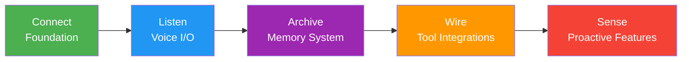
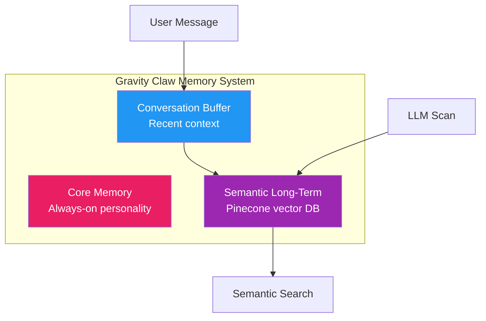
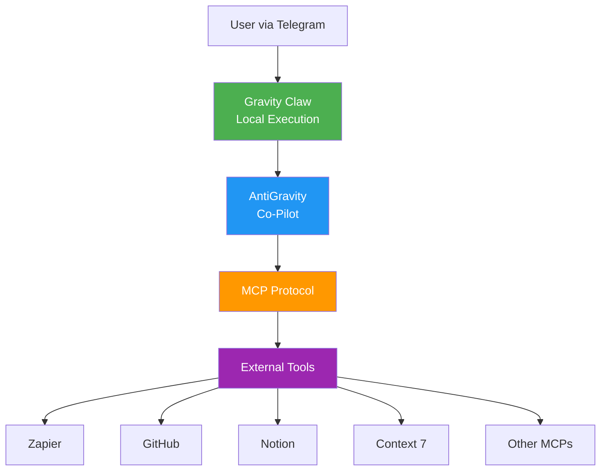

Imagine building your own AI assistant that you fully understand and can customize to your exact needs. That's exactly what Jack Roberts demonstrates in this video, where he creates Gravity Claw—a custom AI assistant built entirely within the AntiGravity platform.

What makes this approach so compelling? Unlike forking OpenClaw's 100,000+ lines of code or relying on pre-built solutions, Gravity Claw lets you add functionalities incrementally. You understand every aspect of the architecture because you built it, and all your data stays local on your machine.

In this comprehensive tutorial, Jack walks through the complete implementation using the five-step **CLAWS framework**—Connect, Listen, Archive, Wire, and Sense—to build a production-grade AI assistant with voice capabilities, semantic memory, external tool integrations, and proactive automation.

## What is Gravity Claw?

Gravity Claw is essentially an AI co-pilot built within AntiGravity. Think of it as having a Lego shop where you can select exactly the bricks you need to build whatever you want, rather than working with a pre-existing mold or structure.

The key differentiator is that you're adding functionalities as you go within AntiGravity, meaning you fully understand the architecture of what your application does. It's **100% customizable**—if you don't like how the memory system works, you can change it. Want different voice capabilities? Swap them out. Everything is under your control.

### Core Benefits

- **No Supply Chain Risk**: No dependencies on external code or massive codebases
- **Complete Customization**: 100% control over every feature and behavior
- **Local-First Architecture**: All data stays on your laptop
- **Free Usage Options**: Can use free models via OpenRouter and Groq
- **Multi-Device Access**: Chat from phone, tablet, or desktop

## The CLAWS Framework

The entire Gravity Claw implementation follows a clear, easy-to-follow five-step framework:



Each phase builds upon the previous one, resulting in a fully functional AI assistant by the end. Let's dive into each phase.

## Phase 1: Connect - Building the Foundation

The first phase sets up the basic communication channel and establishes the security framework for your AI assistant.

### Prerequisites

Before starting, you'll need:
- **AntiGravity** installed and initialized with Opus 4.6 thinking mode
- **Telegram** (for the messaging interface)
- **Docker** (container ecosystem for safety)
- **Node.js** (most users already have this installed)

### Creating the Telegram Bot

The process begins by creating a dedicated Telegram bot:

1. Message `@BotFather` on Telegram
2. Send `/newbot` to create a new bot
3. Name it `gravity_core_bot`
4. Copy the access token provided

This gives you a secure messaging channel that only you can use.

### Configuring AntiGravity

Next, you configure AntiGravity with the necessary API keys:

- **Telegram Bot Token**: From BotFather
- **OpenRouter API Key**: Provides access to 300+ models, many available for free
- **Your Telegram User ID**: Obtained from `@userinfobot` for whitelisting

The whitelisting feature is critical—it ensures that only your specific Telegram account can interact with the bot, even though it's running locally on your machine.

### Security Layers

Jack emphasizes that Gravity Claw offers two layers of security:

1. **Local Execution**: Everything runs on your laptop, no external data storage
2. **Telegram Whitelisting**: Only your user ID can interact with the bot

This addresses a common concern—hesitancy about giving ClaudeBot access to sensitive information like Gmail. With Gravity Claw, you have complete control and visibility.

### Testing the Foundation

Once configured, you can test the basic connection:

```
User: "Hey, what day is it today?"
Gravity Claw: "It is Tuesday, February 17th, 2026."
```

The bot is alive and working, and you can now have conversations with it from anywhere—your phone while walking, tablet at home, or desktop while working.

## Phase 2: Listen - Voice Capabilities

With the foundation in place, the next phase adds bidirectional voice communication capabilities.

### Voice Input: Speech-to-Text

Initially, Gravity Claw only processes text messages. If you send a voice message, nothing happens—because it doesn't have transcription capabilities yet.

To add voice input, you integrate a transcription service:

**Groq Integration (Free Option)**:
- Create a free account at `console.gro.com`
- Generate an API key
- Groq provides Whisper transcription at no cost

**OpenAI Alternative**:
- If you have an OpenAI API key, it also works with Whisper
- You can choose either service based on your preferences

Once configured, Gravity Claw automatically transcribes voice messages and processes the text output.

### Voice Output: Text-to-Speech

For the complete conversational experience, you add text-to-speech capabilities using ElevenLabs:

- Create an account at ElevenLabs
- Generate an API key from the developer settings
- ElevenLabs offers low-latency models with emotional intelligence
- Voices sound more human-like than older TTS systems

**Customization Options**:
- Choose gender (male/female)
- Select accents (e.g., "UK British")
- Specify any voice preferences in natural language

### Testing Voice Capabilities

With both input and output configured, you can have full voice conversations:

```
User: (Voice message) "Yo yo yo, test test test. Can you hear me?"
Gravity Claw: (Transcribes) "You said: Yo yo yo, test test test. Can you hear me?"
Gravity Claw: (Voice response) "I hear you loud and clear. Test successful. What's up?"
```

The bot automatically reloads with each feature addition, so you can test immediately.

## Phase 3: Archive - Superhuman Memory

One of the most powerful features of Gravity Claw is its sophisticated three-tier memory system. Without proper memory, an AI assistant would:
- Burn through context windows quickly
- Lose track of important information
- Have no long-term knowledge retention
- Be unable to semantically search past conversations

### The Three-Tier Memory Architecture

Gravity Claw implements a sophisticated memory system with three layers:



**Layer 1: Core Memory**
- Always present in the system prompt
- Contains essential personality and behavioral instructions
- Never forgets core identity and preferences

**Layer 2: Conversation Buffer**
- Temporary storage for recent conversation context
- Automatically saved after every exchange
- Provides immediate context for follow-up messages

**Layer 3: Semantic Long-Term Memory**
- Powered by Pinecone vector database
- Every message is automatically embedded and stored
- LLM scans conversations for important facts (name, preferences, deadlines)
- Includes a `rememberFacts` tool for explicit mid-conversation memory creation

### Why Pinecone Instead of Supabase?

Jack demonstrates that Pinecone offers significant advantages over using Supabase with pg_vector:

| Feature | Pinecone | Supabase pg_vector |
|---------|-----------|-------------------|
| **Read Speed** | Instant (no network hop) | Network hop every message |
| **Cost** | Free tier available | Cloud costs |
| **Setup** | Already installed | Separate setup required |
| **Data Privacy** | Local machine option | Cloud storage |
| **Complexity** | Simpler implementation | More complex |

### Initialization Sequence

When Gravity Claw first starts, it asks you questions to populate core memory:

```
Gravity Claw: "What should I call you?"
User: "Just call me Jack."

Gravity Claw: "What are your goals this year?"
User: "I want to add as much value as possible to my community and keep growing Glider."
```

This information is stored in core memory and available in every future conversation.

### Soul.md - Personality Definition

You can further customize Gravity Claw's behavior by creating a `soul.md` file:

- Constructive but challenging
- Not sycophantic
- Casual tone, mirroring your language
- Proactive thinking
- Looks around corners for opportunities
- Tries new angles and perspectives

This ensures the assistant behaves exactly how you want it to.

### Memory Creation Triggers

The system creates memories through multiple mechanisms:

1. **Automatic**: Every message saved to buffer and embedded in Pinecone
2. **Post-Exchange LLM Scan**: After each exchange, the LLM scans for important facts
3. **Explicit Tool Calls**: Using `rememberFacts` tool mid-conversation
4. **Manual Requests**: Asking Gravity Claw to remember specific information

You can verify that memories are being stored by checking Pinecone directly—you'll see all your information stored and searchable.

## Phase 4: Wire - External Tool Integrations

This is where Gravity Claw becomes truly powerful—connecting it to external tools and services you already use.

### MCP: Model Context Protocol

MCP is the universal language that allows AntiGravity to communicate with anything. Gravity Claw can leverage **all MCP connections** you've configured in AntiGravity.

### Pre-Connected MCP Servers

The video demonstrates several MCPs already connected:

- **NotebookLM**: Notebook and document processing
- **Notion**: Knowledge base integration
- **Supabase**: Database access
- **Vercel**: Web deployment capabilities
- **GitHub**: Code repository management
- **Context 7**: Access to latest documentation for any library
- **Zapier**: Email, calendar, and automation access

### Adding New MCPs

The process for adding new MCPs is straightforward:

1. Visit the MCP directory website
2. Find the MCP you want (e.g., GitHub, Playwright, Code Memory)
3. Validate by checking the GitHub repository and README
4. Copy the MCP server code
5. Ask AntiGravity: "Add this MCP to my MCP config"
6. Provide any required API keys

### Gravity Claw Dashboard

Jack has built a helpful dashboard tool (linked in the video description) that allows you to:

- Select features from a comprehensive list
- Use a Lego brick metaphor for feature selection
- Choose integrations like WhatsApp, Telegram, voice capabilities
- Add tools like knowledge graphs, context pruning, various APIs
- Generate prompts for all selected features simultaneously
- Copy the prompt to AntiGravity
- Build comprehensive feature sets in one go

This makes it incredibly easy to design your ideal AI assistant.

### Giving Gravity Claw MCP Access

Once you have your desired MCPs configured, you give Gravity Claw access:

> "I would now like Gravity Claw to be able to leverage my MCP connections. For example, I have Zapier which lets me ask questions about my emails or meetings. Give Gravity Claw ability to do that."

AntiGravity then integrates these capabilities into Gravity Claw's architecture.

### Real-World Example: Email Query

Jack demonstrates this by asking Gravity Claw to check his emails:

```
User: "Go to my emails and tell me what was the subject line of the last email I received."
Gravity Claw: "Your last email was: Verify your account."
```

Gravity Claw accesses his Gmail via the Zapier MCP, retrieves the information, and responds—all while maintaining local execution and security.

### The System Architecture

The final architecture is impressive:



Anything you can connect via MCP in AntiGravity, Gravity Claw can now use.

## Phase 5: Sense - Proactive Communication

The final phase adds heartbeat or proactive messaging capabilities—the ability for Gravity Claw to reach out to you autonomously.

### The Heartbeat Concept

Jack explains the heartbeat feature as what makes the AI "feel human"—the ability for Gravity Claw to reach out to you with messages like:

> "Hey Jack, haven't seen you track your weight for the past 5 days. Have you been leaving those cupcakes alone?"

This provides accountability and proactive support.

### Implementation with Cron Jobs

The system uses cron jobs for scheduling:

1. Install `node-cron` package
2. Create `heartbeat.ts` file with scheduling logic
3. Update `index.ts` to include the heartbeat system

### Daily Accountability Check

Jack sets up a daily check-in:

- **Time**: 8:00 AM every day
- **Behavior**:
  - Loads memory context
  - Asks about weight tracking
  - Asks about today's biggest goal
- **Efficiency**: Uses lightweight LLM call (500 tokens max) to conserve credits

### Testing the Heartbeat

To verify it works, Jack asks Gravity Claw to send an immediate message:

> "Validate that it works. Get Gravity Claw to send me a message right now."

Almost by magic, a message appears in Telegram:

> "Good morning, Jack. Hope you're crushing Tuesday already. Quick time to check in. Have you stepped on the scale today yet? What's one thing you want to demolish today?"

The heartbeat is working perfectly.

### Always-On Deployment with Railway

There's one limitation—if your laptop is closed or you're out grabbing coffee, Gravity Claw can't send those heartbeat messages because it's running on your desktop.

**Railway** solves this problem:

Railway allows remote execution so Gravity Claw can run 24/7 and communicate with you whether your laptop is open or closed.

**Security Benefits**:

- Railway has no open ports (unlike VPS where anyone can knock on doors)
- Combined with Telegram whitelisting, you have two layers of security
- Analogy: "A guy in a locked room making phone calls out there"

**Deployment Process**:

1. Create a Railway account
2. AntiGravity installs Railway CLI
3. Deploy bot using `railway up`
4. Verify connection with pairing code

Everything happens automatically—you just watch it happen. The bot is now always-on and can reach you anytime.

## Gravity Claw vs Alternatives

The video makes a compelling case for why Gravity Claw is superior to existing approaches.

### vs OpenClaw/Claudebot

| Feature | Gravity Claw | OpenClaw/Claudebot |
|---------|---------------|---------------------|
| **Customization** | 100% control | Limited by existing code |
| **Understanding** | You built it, you know it | Forking 100,000+ lines |
| **Security** | Local, whitelisted | Potential exposure |
| **Supply Chain Risk** | None | Dependency issues |
| **Learning Curve** | Natural language | Code review required |

### vs Supabase (for Memory)

As shown earlier, Pinecone offers significant advantages in speed, cost, and simplicity compared to using Supabase with pg_vector for the vector database layer.

### vs Self-Hosting Multiple Services

Instead of running OpenClaw, separate memory services, voice systems, and various integrations, Gravity Claw consolidates everything into a single, cohesive system you built and understand.

## Key Advantages Summarized

**Complete Understanding**: Because you built Gravity Claw step-by-step through natural language conversations with AntiGravity, you understand every aspect of its architecture. There are no black boxes.

**100% Customizable**: If you don't like how the memory system stores information, change it. Want different voice capabilities? Swap them. Need different personality? Adjust the soul.md file. Everything is under your control.

**No Supply Chain Risk**: No dependencies on external codebases or forking massive projects. You're building something entirely within your controlled environment.

**Local-First Privacy**: All your data stays on your laptop. Your conversations, memories, and interactions are never sent to third-party servers.

**Free Usage Options**: You can run Gravity Claw entirely free using:
- OpenRouter's free models
- Groq's free Whisper transcription
- Pinecone's free tier
- ElevenLabs has a free tier

**Multi-Device Access**: Chat with Gravity Claw from your phone while walking, your tablet at home, or your desktop while working. Everything syncs seamlessly.

**Extensible**: Add any feature through MCP connections. Need GitHub integration? Add the GitHub MCP. Want calendar access? Add the calendar MCP. The possibilities are nearly limitless.

**Transparent**: You have full visibility into what the bot is doing, why it's doing it, and how it's processing your requests. No hidden operations.

## Practical Use Cases

The video demonstrates several real-world applications:

1. **Email Management**: "What was the subject line of my last email?"
2. **Daily Accountability**: Automated weight and goal tracking at 8 AM
3. **Voice Conversations**: Full two-way voice communication via Telegram
4. **Information Retrieval**: Semantic memory search across all conversations
5. **Multi-Tool Queries**: Access Gmail, GitHub, calendars, and documentation
6. **Research Assistance**: Ask for information from any connected MCP
7. **Trend Analysis**: Leverage semantic memory to spot patterns over time

## Getting Started

To build your own Gravity Claw, you'll need:

1. **AntiGravity** installed and configured
2. **Telegram** account for the messaging interface
3. **API Keys**:
   - OpenRouter (for model access)
   - Groq or OpenAI (for Whisper transcription)
   - ElevenLabs (for text-to-speech, optional)
   - Pinecone (for semantic memory, optional)
4. **MCP Servers** configured for tools you want to connect
5. **Railway account** (optional, for 24/7 deployment)

The video includes links to the Gravity Claw dashboard tool for feature selection, making it even easier to get started.

## Conclusion

Jack Roberts has demonstrated that building a production-grade AI assistant is accessible, customizable, and secure when you leverage AntiGravity's capabilities.

By following the CLAWS framework—Connect, Listen, Archive, Wire, and Sense—you can create an AI assistant with:

- Bidirectional voice communication
- Sophisticated three-tier memory system
- Integration with external tools via MCP
- Proactive heartbeat messaging
- Complete control over architecture and behavior

The result is an AI assistant that's entirely under your control, transparent in its operations, and extensible through natural language conversation—all while running locally and accessible from anywhere.

This approach democratizes AI assistant development. You don't need to be a developer to build something powerful. You don't need to understand 100,000 lines of code. You just need to have a conversation with AntiGravity and follow the CLAWS framework.

Gravity Claw is unstoppable because you built it to be exactly what you need.

---

## References

- **Full Transcript**: `[file in resources]`
- **Short Summary**: `[file in resources]`
- **Video Source**: https://www.youtube.com/watch?v=-hYE5U6FGk8