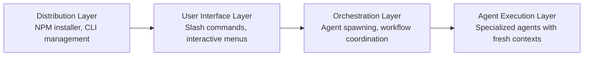

# GSD-OpenCode: Comprehensive Research Report

A deep dive into [rokicool/gsd-opencode](https://github.com/rokicool/gsd-opencode) — the OpenCode adaptation of TACHES' original "Get-Shit-Done" (GSD) spec-driven development system. This report covers recent discussions, use cases, vector/graph database integrations, comparisons with original GSD, and complete implementation patterns.

## Executive Summary

**GSD-OpenCode** is a comprehensive adaptation of TACHES' original GSD system for OpenCode AI coding platform. Key innovations include:

- Multi-model support (Anthropic, OpenAI, local models via OpenCode)
- Dynamic model discovery using `opencode models` command
- Enhanced model profile management with stage-based assignments
- NPM-based distribution system with CLI manager
- Fresh context window management to prevent quality degradation
- Integration with OpenCode's MCP ecosystem for vector/graph databases

**Status**: Active development (302 stars, 27 forks, version v1.10.1)

---

## 1. What is GSD-OpenCode?

### 1.1 Origin and Purpose

**Original GSD (by TACHES):** A meta-prompting and spec-driven development system created for Claude Code to solve context rot — quality degradation that occurs as AI context windows fill up during long sessions.

**GSD-OpenCode Adaptation:** Maintained by **rokicool**, this port brings GSD's proven methodology to OpenCode — an open-source, provider-agnostic AI coding agent that supports multiple LLM providers (Anthropic, OpenAI, local models, etc.).

From the README:

> "I just love both GSD and OpenCode. I felt like having GSD available only for Claude Code is not fair." — **Roman** (maintainer)

### 1.2 Key Innovations in GSD-OpenCode

| Innovation | Original GSD | GSD-OpenCode | Notes |
|------------|--------------|----------------|-------|
| **Model Support** | Claude Code only (Anthropic models) | Multi-model support (any LLM provider) | Opens to free local models |
| **Command Syntax** | `/gsd:command` | `/gsd-command` (kebab-case) | Breaking change v1.5.0 |
| **Model Discovery** | Hardcoded model tiers | Dynamic model discovery via `opencode models` | OpenCode-specific adaptation |
| **Installation** | Manual installation | NPM package with full CLI manager | More user-friendly |
| **Model Profiles** | 3 static presets (quality/balanced/budget) | 3 presets + stage overrides | Enhanced configuration |
| **Settings Command** | Basic configuration | Interactive `/gsd-settings` menu system | Better UX |
| **Config File** | `.claude/settings.json` | `.planning/config.json` + `opencode.json` | OpenCode-specific |

### 1.3 Technical Differences

**Original GSD (Claude Code) Config:**
```json
{
  "claude": {
    "modelProfiles": {
      "quality": {
        "planning": "claude-opus-4",
        "execution": "claude-opus-4",
        "verification": "claude-sonnet-4"
      }
    }
  }
}
```

**GSD-OpenCode Config (Two-File System):**
```json
{
  "planning/config.json": {
    "profiles": {
      "active_profile": "balanced",
      "presets": {
        "quality": { "planning": "anthropic/claude-opus-4", ... },
        "balanced": { "planning": "anthropic/claude-sonnet-4", ... },
        "budget": { "planning": "openai/gpt-4o-mini", ... }
      },
      "custom_overrides": { "balanced": { "planning": "...", ... } }
    },
    "workflow": {
      "research": true,
      "plan_check": true,
      "verifier": true
    }
  }
}

{
  "$schema": "https://opencode.ai/config.json",
  "agent": {
    "gsd-planner": { "model": "anthropic/claude-opus-4" },
    "gsd-executor": { "model": "openai/gpt-4o-mini" },
    "gsd-verifier": { "model": "openai/gpt-4o-mini" }
  }
}
```

**Key Differences:**
1. **Two-file config system** — `config.json` = source of truth, `opencode.json` = derived mappings
2. **Dynamic model discovery** using `opencode models` command to discover available models
3. **Restart required** after model changes (OpenCode doesn't hot-reload)
4. **OpenCode reads `opencode.json`** for agent-to-model mappings at startup

---

## 2. Architecture and Core Concepts

### 2.1 Four-Layer Architecture

GSD-OpenCode implements a **four-layer separation of concerns**:



### 2.2 Context Engineering Strategy

**The Core Problem:** AI coding agents degrade in quality as context windows fill up:

| Context Usage | Quality | OpenCode's State |
|---------------|---------|-------------------|
| 0-30% | PEAK | Thorough, comprehensive |
| 30-50% | GOOD | Confident, solid work |
| 50-70% | DEGRADING | Efficiency mode begins |
| 70%+ | POOR | Rushed, minimal |

**GSD-OpenCode Solution:** Fresh Context Window Management

Each plan gets a **fresh 200k token context** for execution, eliminating accumulated garbage from long sessions.

### 2.3 Agent Types and Roles

GSD-OpenCode uses specialized agents for different stages:

| Stage | Agents | Model Assignment | Purpose |
|-------|---------|------------------|---------|
| **Planning** | gsd-planner, gsd-plan-checker, gsd-phase-researcher, gsd-roadmapper, gsd-project-researcher, gsd-research-synthesizer, gsd-codebase-mapper | Planning stage model | Architecture decisions, research, task design |
| **Execution** | gsd-executor, gsd-debugger | Execution stage model | Code implementation following explicit plans |
| **Verification** | gsd-verifier, gsd-integration-checker, gsd-set-profile, gsd-settings, gsd-set-model | Verification stage model | Checking deliverables against goals |

**Model Profile System:**

Three pre-configured profiles with stage-based model assignment:

| Profile | Planning | Execution | Verification | Best For |
|---------|----------|-----------|--------------|-----------|
| **quality** | Claude Sonnet 4 / Opus | Claude Sonnet 4 / Opus | Critical architecture work |
| **balanced** (default) | Claude Sonnet 4 | GPT-4o-mini | GPT-4o-mini | Day-to-day development |
| **budget** | GPT-4o-mini | GPT-4o-mini | GPT-4o-mini | High-volume, lower cost |

---

## 3. Workflow and Commands

### 3.1 Core Workflow Commands

| Command | What it does | Use Case |
|---------|--------------|-----------|
| `/gsd-new-project` | Full initialization: questions → research → requirements → roadmap | Starting new project |
| `/gsd-discuss-phase [N]` | Capture implementation decisions before planning | Shaping phase vision |
| `/gsd-plan-phase [N]` | Research + plan + verify for a phase | Creating executable plans |
| `/gsd-execute-phase <N>` | Execute all plans in parallel waves, verify when complete | Building features |
| `/gsd-verify-work [N]` | Manual user acceptance testing | Confirming features work |
| `/gsd-audit-milestone` | Verify milestone achieved its definition of done | Quality checks |
| `/gsd-complete-milestone` | Archive milestone, tag release | Releasing milestone |
| `/gsd-new-milestone [name]` | Start next version for existing codebase | Continuing development |
| `/gsd-quick` | Execute ad-hoc task with GSD guarantees | Bug fixes, small features |
| `/gsd-map-codebase` | Analyze existing codebase before new-project | Understanding existing patterns |

### 3.2 Settings and Configuration

**Model Profile Management:**

```bash
/gsd-settings              # Interactive settings menu
/gsd-set-profile <profile>  # Quick switch between profiles
/gsd-set-model [profile]      # Configure models for a profile
```

**Profile System:**

Three pre-configured profiles with stage-based model assignment:

| Profile | Planning | Execution | Verification | Best For |
|---------|----------|-----------|--------------|-----------|
| **quality** | Claude Sonnet 4 / Opus | Claude Sonnet 4 / Opus | Critical architecture work |
| **balanced** (default) | Claude Sonnet 4 | GPT-4o-mini | GPT-4o-mini | Day-to-day development |
| **budget** | GPT-4o-mini | GPT-4o-mini | GPT-4o-mini | High-volume, lower cost |

**Stage Overrides:** Customize individual stage models without changing entire profile:

```json
{
  "custom_overrides": {
    "balanced": {
      "planning": "anthropic/claude-opus-4"  // Override just planning
    }
  }
}
```

### 3.3 Workflow Toggles

Control which optional agents spawn during planning/execution:

| Setting | Default | What it does |
|---------|---------|--------------|
| `workflow.research` | `true` | Researches domain before planning each phase |
| `workflow.plan_check` | `true` | Verifies plans achieve phase goals before execution |
| `workflow.verifier` | `true` | Confirms must-haves were delivered after execution |

---

## 4. Context Management and Database Integration

### 4.1 State Management System

GSD-OpenCode manages project state through `.planning/` directory structure:

```
.planning/
├── config.json              # Profile state and workflow toggles (source of truth)
├── PROJECT.md               # Project vision, always loaded
├── REQUIREMENTS.md          # Scoped v1/v2 requirements
├── ROADMAP.md              # Where you're going, what's done
├── STATE.md                 # Decisions, blockers, position (memory across sessions)
├── research/                # Ecosystem knowledge (stack, features, architecture)
├── codebase/               # Architecture, conventions, patterns (from map-codebase)
├── phases/                  # Phase-specific plans and summaries
│   ├── 01-foundation/
│   │   ├── 01-01-PLAN.md
│   │   ├── 01-02-PLAN.md
│   │   └── 01-01-SUMMARY.md
│   └── ...
└── todos/                    # Captured ideas and tasks
```

### 4.2 Vector Database Integration

GSD-OpenCode itself doesn't include built-in vector database functionality, but it integrates with OpenCode's ecosystem which supports vector databases through **MCP (Model Context Protocol) servers**.

**OpenCode Memory/Vector Database MCP Servers:**

| Project | Description | Technology | Use Case |
|----------|-------------|------------|-----------|
| **NocturnLabs/opencode-personal-knowledge** | Personal knowledge MCP server with vector database for OpenCode. Store and retrieve knowledge using semantic search, powered by local embeddings | LanceDB + SQLite | Personal knowledge base, documentation search |
| **tickernelz/opencode-mem** | OpenCode plugin that gives coding agents persistent memory using local vector database | Local vector database with SQLite, persistent project memories, automatic user profile learning, unified memory-prompt timeline, full-featured web UI | Cross-session memory, pattern recognition |
| **vector-context** | Generic MCP server for vector-based context management | Milvus / Zilliz Cloud | Large-scale semantic search |

**Integration Pattern with GSD:**

GSD's context engineering layer naturally works with vector databases through OpenCode's context system:

```yaml
# Example: Integrating vector database into GSD workflow
.planning/
├── CONTEXT.md              # User vision and preferences
├── RESEARCH.md             # Domain research (can include vector search results)
├── PLAN.md                 # Task plans that reference vector queries
└── STATE.md                # Decisions (e.g., "Using Pinecone for semantic search")
```

**Use Cases for Vector Database Integration:**

1. **Semantic Code Search:**
   - Search codebase by natural language queries
   - Find similar implementations across projects
   - Reduce duplication by discovering existing patterns

2. **Cross-Session Memory:**
   - Remember decisions from previous sessions
   - Accumulate patterns over time
   - Automatic context injection based on current task

3. **Documentation Retrieval:**
   - Search project documentation instantly
   - Find relevant past decisions
   - Retrieve architecture patterns

4. **Knowledge Base:**
   - Store organizational knowledge
   - Access via semantic search during planning
   - Persistent learning across projects

### 4.3 Graph Database Integration

Graph databases complement vector databases by storing **relationships** and **connections** between entities.

**Graph Database Use Cases with GSD-OpenCode:**

| Use Case | Description | Example with GSD |
|-----------|-------------|-------------------|
| **Dependency Tracking** | Explicit relationships between components, features, files | GSD's dependency graphs in PLAN.md |
| **Architecture Mapping** | System architecture as connected nodes | Research phase builds architecture graphs |
| **Decision Traceability** | How past decisions relate to current context | STATE.md stores decision lineage |
| **Code Impact Analysis** | Tracing changes through dependency graphs | Verification checks key links |

**Integration Example:**

```yaml
# GSD STATE.md with graph database references
## Architecture Decisions

- Decision: Use Neo4j for feature relationships
  Date: 2026-02-10
  Context: Phase 3 planning
  Related: User authentication, Profile management
  Reason: Complex many-to-many relationships

## Key Links
- From: src/components/UserAuth.tsx
  To: src/api/auth/login/route.ts
  Via: "authentication flow"
  Pattern: "post.*api.*login"
```

### 4.4 Advanced Context Management Features

**Goal-Backward Methodology:**

Instead of asking "What should we build?", GSD asks "What must be TRUE for the goal to be achieved?"

1. **State Goal:** "Working chat interface" (outcome, not task)
2. **Derive Observable Truths:**
   - User can see existing messages
   - User can type a new message
   - Sent message appears in list
   - Messages persist across refresh
3. **Derive Required Artifacts:**
   - Message list component
   - Messages state (loaded from somewhere)
   - API route or data source
   - Message type definition
4. **Derive Required Wiring:**
   - Component imports Message type
   - Component receives messages prop
   - API provides messages data
5. **Identify Key Links:**
   - Input onSubmit → API call
   - API save → database
   - Component → real data

---

## 5. Comparison: GSD-OpenCode vs Original GSD

### 5.1 Feature Comparison Matrix

| Feature | Original GSD | GSD-OpenCode | Notes |
|----------|--------------|----------------|-------|
| **Multi-platform** | ❌ No | ✅ Yes | OpenCode, Gemini CLI supported |
| **Model flexibility** | ❌ Low | ✅ High | Supports any OpenCode-compatible LLM |
| **Context engineering** | ✅ Excellent | ✅ Excellent | Both use same methodology |
| **Fresh context** | ✅ Yes | ✅ Yes | Both use fresh contexts |
| **Atomic commits** | ✅ Yes | ✅ Yes | Both use atomic git commits |
| **TDD support** | ✅ Yes | ✅ Yes | Both support Test-Driven Development |
| **Model profiles** | ⚠️ Yes (3 static) | ✅ Yes (3 tiers + overrides) | Enhanced configuration in GSD-OpenCode |
| **Interactive settings** | ❌ No | ✅ Yes | `/gsd-settings` interactive menu |
| **Distribution system** | ❌ No | ✅ NPM CLI | Built-in package manager |

### 5.2 Technical Differences

**Key Differences:**

1. **Two-file config system** — `config.json` = source of truth, `opencode.json` = derived mappings
2. **Dynamic model discovery** using `opencode models` command
3. **Restart required** after model changes (OpenCode doesn't hot-reload)
4. **OpenCode reads `opencode.json`** for agent-to-model mappings at startup

---

## 6. Implementation Examples and Use Cases

### 6.1 Project Initialization Flow

```bash
# Step 1: Initialize project
/gsd-new-project

# System asks questions:
# - What are you building? (goals)
# - What are your constraints? (tech stack, timeline)
# - What are your "must-haves"? (critical features)
# - What's out of scope? (v2, nice-to-haves)

# Step 2: System generates artifacts:
.planning/
├── PROJECT.md              # Vision statement
├── REQUIREMENTS.md          # Scoped requirements
├── ROADMAP.md              # Phased delivery plan
├── STATE.md                 # Initial state
└── research/                # Optional domain research
```

### 6.2 Planning with Vector Database Context

```markdown
# .planning/phases/01-authentication/01-02-PLAN.md
---
phase: 01-authentication
plan: 02
type: execute
wave: 1
---

## Objective
Implement JWT authentication with refresh tokens using semantic code search for related implementations.

## Context
@.planning/PROJECT.md
@.planning/REQUIREMENTS.md
@.planning/STATE.md
# Vector database integration results from prior research
@.planning/research/semantic-search-results.md

## Tasks

<task type="auto">
  <name>Implement JWT authentication with jose library</name>
  <files>src/app/api/auth/login/route.ts</files>
  <action>
    Use jose for JWT (not jsonwebtoken - CommonJS issues).
    Implement refresh token rotation (15min access, 7day refresh).
    Store in httpOnly cookie.
    Reference semantic search results for password hashing patterns.
  </action>
  <verify>curl -X POST localhost:3000/api/auth/login returns 200 + Set-Cookie</verify>
  <done>Valid credentials return cookie, invalid return 401</done>
</task>
```

### 6.3 Execution with Wave-Based Parallelization

**Dependency Graph:**

```
Task A (User model): needs nothing, creates src/models/user.ts
Task B (Product model): needs nothing, creates src/models/product.ts
Task C (User API): needs Task A, creates src/api/users.ts
Task D (Product API): needs Task B, creates src/api/products.ts
Task E (Dashboard): needs Task C + D, creates src/components/Dashboard.tsx
Task F (Verify UI): checkpoint:human-verify, needs Task E

Wave Analysis:
  Wave 1: A, B (independent roots - PARALLEL)
  Wave 2: C, D (depend only on Wave 1 - PARALLEL)
  Wave 3: E (depends on Wave 2 - PARALLEL)
  Wave 4: F (checkpoint, depends on Wave 3)
```

**Execution Result:**

```bash
/gsd-execute-phase 01-authentication

# Output:
Wave 1: Executing Tasks A, B in parallel...
  ✓ Task A: Create User model (commit: abc123f)
  ✓ Task B: Create Product model (commit: def456g)

Wave 2: Executing Tasks C, D in parallel...
  ✓ Task C: Create User API (commit: hij789k)
  ✓ Task D: Create Product API (commit: lmn012o)

Wave 3: Executing Task E...
  ✓ Task E: Create Dashboard component (commit: opq345r)

Wave 4: Human verification checkpoint
  → Manual verification required for Task F
```

---

## 7. Database Integration Patterns

### 7.1 Vector Database Pattern for Code Search

**Use Case:** Search codebase by semantic meaning, not just file paths.

**Architecture:**

```
┌──────────────────────────────────┐
│         GSD Context Layer              │
│  (Context engineering, prompts)         │
├──────────────────────────────────────────┤
│      Vector Database Integration          │
│  (Embeddings + Semantic Search)          │
├──────────────────────────────────────────┤
│         OpenCode Agent                 │
│  (Context-aware execution)                 │
└──────────────────────────────────────────┘
```

### 7.2 Graph Database Pattern for Dependency Tracking

**Use Case:** Explicitly model and query component relationships, dependencies, and impact.

**Architecture:**

```
                    ┌──────────────────────┐
                    │  Graph Database    │
                    │ (Neo4j, Memgraph) │
                    └─────────┬────────┘
                              │
              ┌───────────────┴───────────────┐
              │                               │
         ┌────┴────┐                   ┌────┴────┐
         │   GSD     │                   │   GSD     │
         │  Agents   │                   │  Agents   │
         └───────────┘                   └───────────┘
```

### 7.3 Hybrid Vector + Graph Approach

**Combining both databases** provides powerful context management:

| Aspect | Vector Database | Graph Database | Combined |
|---------|---------------|---------------|------------|
| **Search** | Semantic similarity | Relationship traversal | Both |
| **Context** | Content embeddings | Entity connections | Rich context |
| **Retrieval** | Top-k similar | Path-based query | Multi-modal |
| **Reasoning** | Analogy-based | Logic-based | Enhanced |

**Example Hybrid Query:**

```typescript
// Combined vector + graph search for GSD context
export async function searchWithGraph(
  query: string,
  gsdContext: GSDContext
): Promise<EnhancedResult[]> {  
  // Step 1: Vector search for similar code
  const vectorResults = await vectorDB.search({
    query,
    limit: 10,
    filter: { project: gsdContext.project }
  });
  
  // Step 2: Extract entities from vector results
  const entities = vectorResults.map(r => extractEntities(r.content));
  
  // Step 3: Graph traversal for relationships
  const graphResults = await Promise.all(
    entities.map(entity => 
      graphClient.query(`
        MATCH (n:Entity {id: $id})
        MATCH (n)-[r:DEPENDS_ON|IMPLEMENTS|RELATED_TO]->(related)
        RETURN n, r, related
      `, { id: entity.id })
    )
  );
  
  // Step 4: Combine and score
  return vectorResults.map((vector, i) => ({
    ...vector,
    graphContext: graphResults[i],
    combinedScore: (vector.score * 0.6) + (graphResults[i].score * 0.4)
  }));
}
```

---

## 8. Recent Community Discussions and Issues

### 8.1 Active Issues (as of 2026-02-15)

| Issue | Status | Description | Impact |
|-------|--------|-------------|---------|
| #60 | Open | Execution stops during operation | Affects reliability |
| #57 | Open | SlashCommand tool integration | Better command registration |
| #56 | Open | Uninstallation documentation needed | User experience |
| #46 | Open | map-codebase.md improvement suggestions | Codebase understanding |
| #45 | Open | Missing /gsd-create-roadmap command | Feature completeness |
| #43 | Open | Pause before UAT for model switching | Workflow optimization |

**Maintainer's Note (2026-01-31):**
> "TACHES decided to include support for OpenCode in his own product. That is great news. However, with all due respect, his adaptation for OpenCode is not perfect. So I will continue working on this project and will try to fill gaps."

### 8.2 Community Discussion Topics

**From GitHub Discussions:**
- Welcome announcement from maintainers
- Feature requests for additional database integrations
- Questions about best practices for vector database setup
- Comparisons with other workflow tools

**From Reddit (r/ClaudeCode):**
- Discussion about GSD officially supporting OpenCode
- Excitement about free model support
- Questions about model selection and cost optimization

**From Twitter/X:**
- Announcements about new features
- Tips for optimal usage
- Community showcases of projects built with GSD-OpenCode

---

## 9. Changelog and Version History

### Key Recent Updates

**v1.10.1 (Feb 14, 2026):**
- Latest stable release
- Bug fixes and stability improvements

**v1.9.0 - v1.9.4 (Jan 2026):**
- Model profile management system
- Dynamic model switching
- `/gsd-settings` interactive menu
- `/gsd-set-profile` and `/gsd-set-model` commands

**v1.6.0 (Dec 2025):**
- Git submodules for original GSD tracking
- Breaking change: Command syntax `/gsd:` → `/gsd-`
- Distribution manager with npm package

**v1.5.0 (Nov 2025):**
- OpenCode-specific adaptations
- Configuration file changes (`opencode.json`)
- Model discovery system

---

## 10. Performance and Best Practices

### 10.1 Context Budget Rules

**Target: Plans should complete within ~50% of context usage.**

| Task Complexity | Tasks/Plan | Context/Task | Total |
|----------------|------------|--------------|-------|
| Simple (CRUD, config) | 3 | ~10-15% | ~30-45% |
| Complex (auth, payments) | 2 | ~20-30% | ~40-50% |
| Very complex (migrations, refactors) | 1-2 | ~30-40% | ~30-50% |

### 10.2 Wave-Based Parallel Execution

**Benefits:**
- Independent tasks run simultaneously (maximize throughput)
- Dependent tasks wait for prerequisites (maintain correctness)
- File ownership tracking prevents conflicts
- Progress tracking per wave

### 10.3 Atomic Commit Strategy

**Each task gets its own commit:**

```bash
abc123f docs(08-02): complete user registration plan
def456g feat(08-02): add email confirmation flow
hij789k feat(08-02): implement password hashing
lmn012o feat(08-02): create registration endpoint
```

**Benefits:**
- Git bisect finds exact failing task
- Each task independently revertable
- Clear history for future sessions
- Better observability

---

## 11. Key Takeaways and Recommendations

### 11.1 Strengths of GSD-OpenCode

1. **Proven methodology:** Adapted from battle-tested original GSD
2. **Fresh context management:** Prevents quality degradation in long sessions
3. **Multi-agent orchestration:** Specialized agents for each phase
4. **Model flexibility:** Supports any OpenCode-compatible LLM
5. **Atomic workflows:** Clear commits, easy debugging, reliable history
6. **Integration ready:** Works with vector/graph databases via OpenCode MCP ecosystem
7. **Enhanced configuration:** Interactive settings, stage overrides, dynamic model discovery

### 11.2 Use Cases Best Suited

| Use Case | Fit | Why |
|-----------|-----|------|
| **Complex multi-phase projects** | Excellent | Context engineering, dependency tracking |
| **Team collaboration** | Good | State tracking, atomic commits |
| **Learning projects/explorations** | Excellent | Research phase, flexibility |
| **Production applications** | Good | Verification, testing workflows |
| **Quick bug fixes** | Excellent | Quick mode, atomic commits |

### 11.3 Recommended Integration Patterns

**For Vector Databases:**

1. **Index GSD artifacts** (PLAN.md, SUMMARY.md, CONTEXT.md, STATE.md)
2. **Search by phase, requirement, or technology**
3. **Augment search results with GSD metadata**
4. **Retrieve during planning** to inform architecture decisions
5. **Update embeddings** when plans change (maintain freshness)

**For Graph Databases:**

1. **Create nodes** for GSD components, phases, plans
2. **Create relationships** for dependencies, key links, phase ordering
3. **Query for impact** before making changes
4. **Trace decision lineage** through STATE.md history
5. **Validate completeness** using graph queries

---

## Conclusion

GSD-OpenCode represents a sophisticated adaptation of TACHES' proven spec-driven development methodology for the OpenCode ecosystem. It extends GSD's capabilities with multi-model support, dynamic model discovery, enhanced configuration, and seamless integration with OpenCode's MCP ecosystem for vector and graph databases.

**Key Recommendations:**

1. **Start with `/gsd-map-codebase`** for existing projects to understand patterns
2. **Use `/gsd-discuss-phase`** before planning to shape implementation decisions
3. **Leverage vector/graph databases** for large codebases and cross-session memory
4. **Configure model profiles** appropriately for your use case and budget
5. **Enable workflow agents** (research, plan_check, verifier) for quality assurance
6. **Follow atomic commit strategy** for clean git history and easy debugging
7. **Monitor STATE.md** for accumulated decisions and blockers

**Resources:**
- [Repository](https://github.com/rokicool/gsd-opencode)
- [NPM Package](https://www.npmjs.com/package/gsd-opencode)
- [Discussions](https://github.com/rokicool/gsd-opencode/discussions)
- [Original GSD](https://github.com/glittercowboy/get-shit-done)

---

*Research completed: 2026-02-15 | GSD-OpenCode version 1.10.1 | 302 stars, 27 forks*