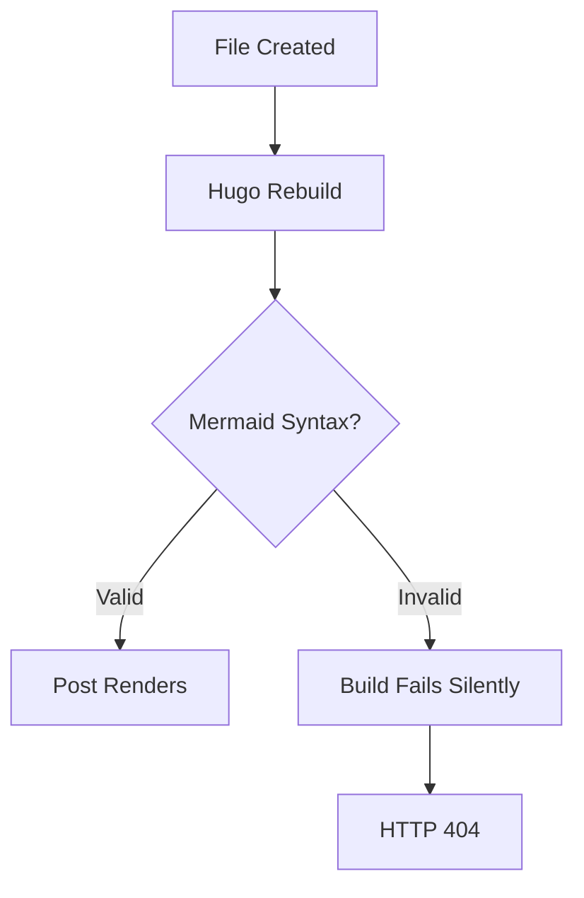
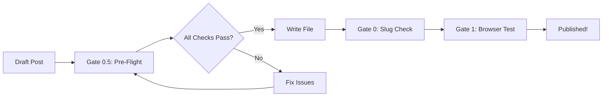

# The Problem

While creating a comprehensive blog post about OliveTin integration, I encountered a frustrating issue: 
the post returned HTTP 404 errors despite the file existing and Hugo reporting successful builds.

This session analysis documents what went wrong, how it was diagnosed, and the improvements implemented 
to prevent similar issues in the future.

## Symptoms

- Blog post file created successfully in `/media/docker/website/content/posts/`
- Hugo logs showed successful rebuild: `Source changed /posts/2026-02-25-...`
- `hugo list all` command showed correct slug
- HTTP requests to expected URL returned 404
- Other posts continued working normally

## Root Cause Analysis

After systematic troubleshooting, the root cause was identified:

**Mermaid diagrams with quoted subgraph names caused Hugo build failures.**



The problematic syntax used quotes around the subgraph name:

```
subgraph [QUOTED]OliveTin Interface[QUOTED]    ← QUOTES CAUSE FAILURE
```

The correct syntax should be:

```
subgraph OliveTin_Interface      ← NO QUOTES, USE UNDERSCORES
```

### Contributing Factors

1. **Long lines in markdown** (315 characters) - may have contributed to parsing issues
2. **Hugo's silent failure mode** - builds "succeed" but pages don't render
3. **No pre-flight validation** - errors only discovered after deployment

---

# The Solution

Based on this analysis, I implemented a comprehensive set of improvements to the Hugo blog workflow.

## 1. Mermaid Validation Script

**Created:** `/media/docker/commands/validate-mermaid.sh`

This script runs five validation checks before Hugo builds:

| Check | Purpose | Error Level |
|-------|---------|-------------|
| Shortcode pairs | Every `` has `` | Error |
| Quoted subgraphs | No quotes in subgraph names | Error |
| Unsupported types | No unsupported diagram formats | Error |
| Line length | Lines under 300 characters | Error |
| Node labels | Proper label formatting | Warning |

### Usage

```bash
/media/docker/commands/validate-mermaid.sh /path/to/post.md
```

### Sample Output

```
=== Mermaid Validation for: post.md ===

Check 1: Verifying Mermaid shortcode pairs...
✅ PASS: Mermaid shortcode pairs matched (2 pairs)

Check 2: Verifying subgraph names don't use quotes...
❌ ERROR: Mermaid subgraph names should not use quotes
   Problematic pattern found: subgraph with quotes
   Correct pattern: subgraph Name

=== Validation Complete ===
❌ Mermaid validation failed - 1 error(s) found
```

## 2. Enhanced Hugo Skill Documentation

Updated `/root/.opencode/skill/hugo/SKILL.md` with:

### Pre-Deployment Validation Section

```markdown
### Pre-Deployment Validation (MANDATORY for posts with Mermaid)

Always run validation before Hugo build:

/media/docker/commands/validate-mermaid.sh /path/to/post.md
```

### Common Errors Table

| Error | Cause | Fix |
|-------|-------|-----|
| Post returns 404 | Mermaid syntax error | Run validate-mermaid.sh |
| Subgraph not rendering | Quoted subgraph name | Remove quotes |
| Entire site broken | Unclosed shortcode | Match all shortcodes |
| Mindmap error | Unsupported type | Use graph TD instead |

### Working Examples

```markdown

graph TD
    subgraph OliveTin_Interface
        A[Web Dashboard]
        B[Button Groups]
    end
    subgraph Backend_Execution
        C[Docker Containers]
    end
    A --> C

```

**Key rule:** Use underscores or camelCase in subgraph names, NOT spaces or quotes.

## 3. Line Length Guidelines

Added to Hugo skill:

| Context | Maximum | Recommendation |
|---------|---------|----------------|
| General text | 300 chars | 200 chars |
| Code blocks | 400 chars | 300 chars |
| Mermaid diagrams | 200 chars | 150 chars |

### Detection Command

```bash
awk '{if (length > 200) print NR": "length" chars"}' post.md
```

## 4. Enhanced Validation Gateway

Added **Gate 0.5: Pre-Flight Syntax Check** to the Hugo skill's validation workflow:



### Pre-Flight Checks

1. **Mermaid Validation** - Run validate-mermaid.sh
2. **Line Length Check** - No lines > 300 characters
3. **Frontmatter Validation** - Valid YAML, correct slug format
4. **Shortcode Balance** - All shortcodes properly closed

---

# Testing Results

## Validation Script Tests

### Test 1: Valid Post (OliveTin integration post)

```
✅ PASS: Mermaid shortcode pairs matched (2 pairs)
✅ PASS: No quoted subgraph names found
✅ PASS: No unsupported diagram types found
⚠️  WARNING: Long line detected (max 200 recommended)
✅ PASS: No obvious node label issues

=== Validation Complete ===
✅ Mermaid validation passed - no errors found
```

### Test 2: Post with Intentional Errors

```
❌ ERROR: Unclosed Mermaid shortcodes (2 open, 1 close)
❌ ERROR: Quoted subgraph names found
❌ ERROR: Mindmap diagram type not supported

=== Validation Complete ===
❌ Mermaid validation failed - 3 error(s) found
```

The script correctly identified all three intentional errors.

---

# Lessons Learned

## What Went Wrong

1. **Silent failures** - Hugo doesn't always report Mermaid syntax errors
2. **No validation** - Issues only discovered at deployment time
3. **Special characters** - Quotes in Mermaid subgraph names caused failures

## What Went Right

1. **Systematic troubleshooting** - Removed Mermaid to isolate the issue
2. **Documentation updates** - Captured learnings in Hugo skill
3. **Automation** - Created validation script for future posts

## Key Takeaways

1. **Always validate Mermaid syntax** before Hugo builds
2. **Subgraph names must NOT use quotes** - use underscores instead
3. **Keep lines under 200 characters** for better maintainability
4. **Pre-flight checks prevent deployment failures**

---

# Files Created/Modified

| File | Action | Purpose |
|------|--------|---------|
| `/media/docker/commands/validate-mermaid.sh` | Created | Mermaid syntax validation |
| `/root/.opencode/skill/hugo/SKILL.md` | Updated | Added 4 new sections |
| OliveTin blog post | Fixed | Wrapped long line |

---

# Future Improvements

## Short-term

- [ ] Add validation to blog post creation workflow
- [ ] Create similar validators for Chart.js and other shortcodes
- [ ] Add pre-commit hooks for validation

## Long-term

- [ ] Integrate validation into CI/CD pipeline
- [ ] Create automated syntax fix suggestions
- [ ] Build real-time validation in editor

---

# Conclusion

This troubleshooting session transformed a frustrating 404 error into a comprehensive 
improvement of the Hugo blog workflow. The key insight was that **prevention is better 
than debugging** - by adding validation steps before Hugo builds, future blog posts 
will be more reliable and easier to create.

The new workflow ensures:

- ✅ Mermaid syntax validated before deployment
- ✅ Line length guidelines followed
- ✅ Pre-flight checks catch errors early
- ✅ Clear troubleshooting documentation available

---

*Flow Analysis Date: February 25, 2026*
*Session: OliveTin Blog Post Creation*
*Resolution Time: ~30 minutes*