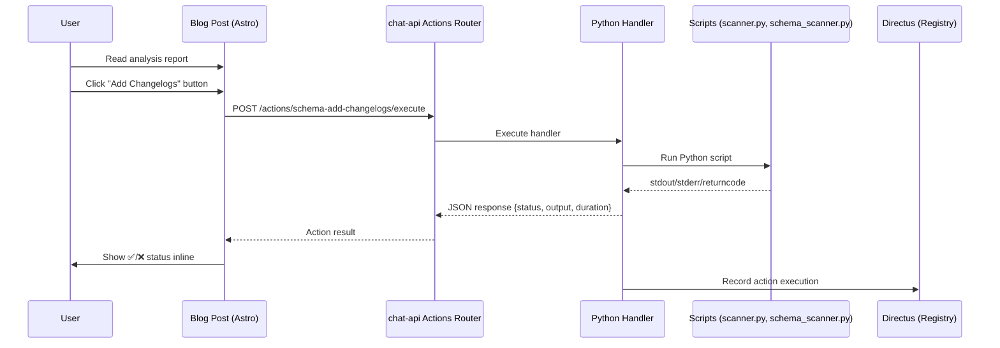

<style>
.sev-section { border-radius: 6px; margin: 1.2rem 0; overflow: hidden; border: 1px solid; }
.sev-critical { border-color: #ef4444; background: rgba(239,68,68,0.04); }
.sev-critical > summary { background: rgba(239,68,68,0.12); color: #dc2626; }
.sev-warning { border-color: #f59e0b; background: rgba(245,158,11,0.04); }
.sev-warning > summary { background: rgba(245,158,11,0.12); color: #b45309; }
.sev-action { border-color: #3b82f6; background: rgba(59,130,246,0.04); }
.sev-action > summary { background: rgba(59,130,246,0.12); color: #2563eb; }
.sev-positive { border-color: #22c55e; background: rgba(34,197,94,0.04); }
.sev-positive > summary { background: rgba(34,197,94,0.12); color: #16a34a; }
.sev-neutral { border-color: #6b7280; background: rgba(107,114,128,0.04); }
.sev-neutral > summary { background: rgba(107,114,128,0.08); color: #4b5563; }
.sev-section > summary { padding: 0.6rem 1rem; font-weight: 600; cursor: pointer; display: flex; align-items: center; gap: 0.5rem; list-style: none; }
.sev-section > summary::-webkit-details-marker { display: none; }
.sev-section > summary::before { content: '▶'; font-size: 0.75rem; transition: transform 0.15s; }
.sev-section[open] > summary::before { transform: rotate(90deg); }
.sev-body { padding: 0.8rem 1rem; }
.summary-grid { display: grid; grid-template-columns: repeat(auto-fit, minmax(120px,1fr)); gap: 0.6rem; margin: 0.5rem 0; }
.summary-card { border-radius: 6px; padding: 0.6rem 0.8rem; text-align: center; }
.summary-card .sc-val { font-size: 1.4em; font-weight: 700; }
.summary-card .sc-label { font-size: 0.75em; opacity: 0.7; margin-top: 0.15rem; }
.sc-red { background: rgba(239,68,68,0.1); color: #dc2626; }
.sc-amber { background: rgba(245,158,11,0.1); color: #b45309; }
.sc-green { background: rgba(34,197,94,0.1); color: #16a34a; }
.sc-blue { background: rgba(59,130,246,0.1); color: #2563eb; }
</style>

> **TL;DR**: Blog post analysis reports now ship with clickable action buttons that execute improvement scripts directly from the browser. Click a button → the action runs → results appear inline. No terminal needed.

## The Problem

Automated analysis produces findings, but findings don't fix themselves. A report saying "18 schemas need changelogs" is useful until you actually have to go add them. The gap between **knowing** something needs improving and **doing** the improvement was always a manual step.

<div class="summary-grid">
<div class="summary-card sc-blue"><div class="sc-val">⚡ 6</div><div class="sc-label">Action Buttons</div></div>
<div class="summary-card sc-green"><div class="sc-val">🔄 1</div><div class="sc-label">HTTP Call</div></div>
<div class="summary-card sc-green"><div class="sc-val">🐍</div><div class="sc-label">Python Handlers</div></div>
<div class="summary-card sc-amber"><div class="sc-val">📊</div><div class="sc-label">Inline Results</div></div>
</div>

## Architecture



## The Six Actions

Every ecosystem report blog post includes buttons for the most common improvement tasks:

| Button | What It Does | Target | Time |
|--------|-------------|--------|------|
| 📝 **Add Changelogs** | Adds `$changelog` entries to all schemas missing them | Schema files | ~30s |
| 🔗 **Fix Overlaps** | Adds `extends: base-entity` to schemas with high overlap | Schema files | ~60s |
| 🔍 **Re-scan** | Runs full schema scanner + updates `$analysis` blocks | Scanner | ~15s |
| 📂 **Add Context** | Creates `context/` directories for skills missing them | Skills | ~10s |
| 📋 **Fix Menus** | Analyzes and reports on menu compliance issues | Menus | ~30s |
| 🔬 **Full Scan** | Runs all 4 analyzers + publishes new report | Everything | ~60s |

## How It Works

### 1. Action Registry (FastAPI)

Each action is a declarative entry in an actions router on the existing chat-api service (port 8057):

```python
ACTIONS = {
    "schema-add-changelogs": {
        "id": "schema-add-changelogs",
        "label": "Add Changelogs to All Schemas",
        "icon": "📝",
        "handler": "add_schema_changelogs",  # Python function
        "category": "schemas",
    },
}
```

The handler executes inline Python scripts via `subprocess.run()`, with stdout, stderr, and return code returned as JSON.

### 2. Blog Post Button Generation

When the `scanner.py --report` command generates a blog post, it calls `action_buttons.py` which produces self-contained HTML with inline JavaScript:

```html
<script>
window._runAction = function(btn) {
  var bar = btn.closest('.eco-action-bar');
  var status = document.getElementById('eco-status');
  var actions = JSON.parse(bar.dataset.actions);
  fetch('http://ubuntu4:8057/actions/' + actionId + '/execute', {
    method: 'POST', body: JSON.stringify({action_id: actionId})
  }).then(showStatus(btn, data));
};
</script>
```

No external script dependency — everything survives Astro's markdown rendering pipeline.

### 3. Docker Integration

The chat-api container has volume mounts to access the host's scripts and schemas:

```yaml
extra_hosts:
  - "host.docker.internal:host-gateway"
```

Actions execute `OPENCODE_BASE=/host/opencode python3 scanner.py` so scripts write back to the host filesystem, updating real files.

## The User Journey

```
🔴 Cron runs at 6 AM → Analyzes ecosystem → Publishes blog
  ↓
🟠 User reads blog post → Sees health scores + findings
  ↓
🟡 User clicks "Fix Overlaps" button
  ↓
🟢 Backend: POST /actions/schema-fix-overlaps/execute
  ↓
🔵 Handler: Adds extends: base-entity to 8 schemas
  ↓
🟣 Blog post shows: ✅ Fix Overlaps completed in 1542ms
```

No terminal. No copy-pasting. Read the report, click the fix.

## Adding New Actions

Three steps:

1. **Register the action** in `chat-api/routers/actions.py`:
```python
ACTIONS = {
    "new-action-id": {
        "label": "Do Something",
        "handler": "new_python_function",
    }
}
```

2. **Write the handler**:
```python
def new_python_function(params=None):
    result = subprocess.run(["python3", "script.py"], ...)
    return {"stdout": ..., "stderr": ..., "returncode": ...}
```

3. **Add to action_buttons.py**:
```python
ACTION_GROUPS["ecosystem"].append({
    "action_id": "new-action-id",
    "icon": "🆕", "label": "New Action", "color": "#00ffff",
})
```

## What's Tracked

Every action execution is recorded:
- **Duration** — How long it took
- **Status** — completed or failed
- **Output** — First 2000 chars of stdout
- **Error** — stderr on failure

This creates an audit trail of improvements made, visible in the blog post's scan history table.

## Current Ecosystem Health

| Type | Score | Objects | Issues |
|------|-------|---------|--------|
| ✅ Schemas | 84 | 19 | 18 |
| ✅ Menus | 82 | 90 | 187 |
| 🔴 Skills | 55 | 122 | 174 |
| 🔴 Agents | 56 | 20 | 32 |

**Overall: 69.4/100** — room for improvement, which is exactly what the action buttons are for.

<details class="sev-section sev-warning">
<summary>📋 Skills — 55/100 (122 skills)</summary>
<div class="sev-body">

**Findings:**
- 52 "developing" — lack context directories or scripts
- 27 "new" — minimal documentation
- 34 "mature" — fully structured

**Actionable:** 📂 Add Context Dirs button creates missing `context/` directories for all 53 skills that need them.

</div>
</details>

<details class="sev-section sev-action" open>
<summary>🔵 How to Use Action Buttons</summary>
<div class="sev-body">

1. Open any ecosystem report blog post
2. Look for the **⚡ Quick Actions** bar below the title
3. Click the button for the improvement you want
4. Watch the status bar turn green (✅) or red (❌)
5. Green means the action completed — your system is now improved

Available from any report post:
- Schema improvements (changelogs, overlaps, re-scanning)
- Skill infrastructure (context directories)
- Menu compliance fixes
- Full ecosystem re-analysis

</div>
</details>

---

*This post describes the interactive action button system now embedded in all automated analysis reports. The system turns passive reporting into active improvement.*
