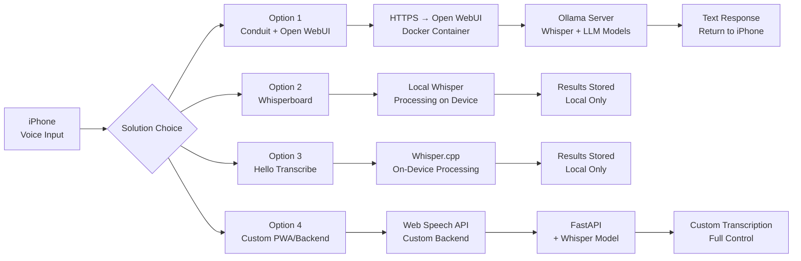

## Introduction

In today's mobile-first world, having a voice transcription solution that integrates with your self-hosted Linux infrastructure is incredibly valuable. Whether you're documenting meetings, creating content, or building voice-enabled AI applications, the right setup can transform how you capture ideas.

This guide explores **four comprehensive solutions** for iPhone-based voice transcription that connect to custom Linux backends, with a focus on leveraging your existing Ollama and container infrastructure.

## Architecture Overview



## Solution Comparison

### Conduit + Open WebUI (Recommended for AI Chat)

| Feature | Details |
|---------|---------|
| **Type** | Native iOS App + Docker Backend |
| **Price** | Free |
| **Processing** | Open WebUI handles Whisper, Ollama handles LLM |
| **Offline** | Yes (cached content) |
| **Custom Integration** | Yes (connect to your Ollama server) |
| **Voice Input** | Built-in microphone button |
| **Voice Output** | Streaming TTS if configured |

**Setup Steps:**
```bash
# 1. Deploy Open WebUI
cd /media/docker/open-webui
docker-compose up -d

# 2. Add Whisper Model
docker exec -it ollama ollama run whisper-small

# 3. Install Conduit on iPhone
# Search: "Conduit: OpenWebUI Client"
# Connect to: https://ubuntu58-1:3000
```

**Advantages:**
- Native iOS app with pre-integrated voice input
- Full Open WebUI features (models, history, search)
- Leverages your existing Ollama infrastructure
- Works offline with cached content

**Limitations:**
- Only for chat/text output
- Requires Open WebUI setup

**App Store:** https://apps.apple.com/us/app/conduit-openwebui-client/id6749840287

---

### Whisperboard (Best for Pure Transcription)

| Feature | Details |
|---------|---------|
| **Type** | Native iOS App |
| **Price** | Free |
| **Processing** | OpenAI Whisper locally on device |
| **Offline** | Yes (100% local) |
| **Custom Integration** | No |
| **Real-time** | Yes |

**Setup Steps:**
```bash
# No backend setup required

# Install from App Store
# Search: "WhisperBoard - Voice to Text"
```

**Advantages:**
- Completely free (no subscriptions)
- 100% local processing (privacy-focused)
- Real-time transcription
- Multiple model sizes available

**Limitations:**
- No custom backend integration
- Results stored locally only
- Cannot send to your Ollama server

**App Store:** https://apps.apple.com/us/app/whisperboard-voice-to-text/id1661442906

---

### Hello Transcribe (Best for Media Production)

| Feature | Details |
|---------|---------|
| **Type** | Native iOS App |
| **Price** | $4.99 one-time purchase |
| **Processing** | Whisper.cpp locally on device |
| **Offline** | Yes |
| **Custom Integration** | No |
| **Export** | SRT subtitle files |

**Setup Steps:**
```bash
# No backend setup required

# Install from App Store
# Search: "Hello Transcribe"
```

**Advantages:**
- Private processing
- One-time purchase (no subscriptions)
- Excellent SRT export for video production
- Good for YouTube content creators

**Limitations:**
- No custom API support
- Local-only processing
- Limited integration options

**App Store:** https://apps.apple.com/us/app/hello-transcribe/id6443919768

---

### Custom PWA / Backend (Best for Full Control)

| Feature | Details |
|---------|---------|
| **Type** | Progressive Web App + Custom Backend |
| **Price** | Free (self-hosted) |
| **Processing** | Custom backend with Whisper |
| **Offline** | Limited (PWA support constraints) |
| **Custom Integration** | Complete control |
| **Voice Input** | Web Speech API (iOS limitation) |

**Architecture:**
```python
# Backend (FastAPI container)
from fastapi import FastAPI
from faster_whisper import WhisperModel

app = FastAPI()
model = WhisperModel("small", device="cpu")

@app.post("/transcribe")
async def transcribe_audio(audio: UploadFile):
    audio_data = await audio.read()
    segments, info = model.transcribe(audio_data)
    return {"transcription": " ".join([seg.text for seg in segments])}
```

**Setup Steps:**
```bash
# 1. Create backend container
cd /media/docker/voice-trx
docker-compose up -d

# 2. Build PWA manifest
# 3. Deploy to Hugo site
```

**Advantages:**
- Full customization over workflow
- Integrates with existing infrastructure
- Can add custom features (TTS, analysis, etc.)

**Limitations:**
- Web Speech API **NOT supported** in iOS standalone PWAs
- Requires file upload (no streaming)
- More development work

**Research Finding:** iOS Safari has limited PWA support — Web Speech API doesn't work in standalone mode.

---

## Implementation Guides

### Option 1: Conduit + Open WebUI (Full Setup)

**Step 1: Deploy Open WebUI**
```bash
cd /media/docker/open-webui
docker-compose up -d

# Check status
docker ps | grep open-webui
```

**Step 2: Configure Ollama Models**
```bash
# Add Whisper model
docker exec -it ollama ollama run whisper-small

# Add your LLM model
docker exec -it ollama ollama run llama3.2
```

**Step 3: Install Conduit on iPhone**
1. Open App Store
2. Search: "Conduit: OpenWebUI Client"
3. Install (Free)
4. Launch app
5. Enter server URL: `https://ubuntu58-1:3000`
6. Configure authentication (if required)
7. Start using voice input

**Step 4: Test Voice Input**
- Open Conduit
- Tap microphone icon
- Speak → See real-time transcription
- Send to Ollama → Receive AI response

**Success Criteria:**
- ✅ Open WebUI accessible at http://ubuntu58-1:3000
- ✅ Conduit connects to server
- ✅ Voice input works
- ✅ Text-to-speech works (if configured)

---

### Option 2: Whisperboard (Simple Setup)

**Step 1: Install Whisperboard**
1. Open App Store
2. Search: "WhisperBoard - Voice to Text"
3. Install (Free)
4. Launch app

**Step 2: Configure Settings**
- Select Whisper model (small, medium, or large)
- Adjust sensitivity/threshold
- Enable real-time transcription

**Step 3: Start Transcribing**
- Tap microphone button
- Speak naturally
- Transcription appears in real-time
- Save/export when needed

**Success Criteria:**
- ✅ App installed and launches
- ✅ Model downloads successfully
- ✅ Transcription works in test environment
- ✅ Results save to device

---

### Option 3: Hello Transcribe (Media Production Setup)

**Step 1: Install Hello Transcribe**
1. Open App Store
2. Search: "Hello Transcribe"
3. Install ($4.99 one-time)
4. Launch app

**Step 2: Configure for Content Creation**
- Select Whisper.cpp model
- Enable high-accuracy mode
- Configure export preferences

**Step 3: Create Content**
1. Record audio/video
2. Import to app
3. Transcribe with Whisper
4. Export as SRT file
5. Upload to YouTube with video

**Success Criteria:**
- ✅ One-time purchase completed
- ✅ SRT export works
- ✅ Subtitles appear on video
- ✅ Processing accuracy is acceptable

---

### Option 4: Custom Backend (Advanced Setup)

**Step 1: Create Backend Container**
```bash
# Create directory structure
mkdir -p /media/docker/voice-trx/{app,templates}

# Create docker-compose.yml
cat > /media/docker/voice-trx/docker-compose.yml << 'EOF'
version: '3.8'
services:
  voice-trx-api:
    image: python:3.11-slim
    working_dir: /app
    ports:
      - "8200:8000"
    volumes:
      - ./app:/app
    command: uvicorn main:app --host 0.0.0.0 --port 8000
EOF

# Create main.py
cat > /media/docker/voice-trx/app/main.py << 'EOF'
from fastapi import FastAPI, UploadFile
from faster_whisper import WhisperModel
import tempfile
import os

app = FastAPI()
model = WhisperModel("small", device="cpu")

@app.post("/transcribe")
async def transcribe_audio(audio: UploadFile):
    with tempfile.NamedTemporaryFile(delete=False) as tmp:
        tmp.write(await audio.read())
        tmp_path = tmp.name

    try:
        segments, info = model.transcribe(tmp_path)
        result = " ".join([seg.text for seg in segments])
        return {"transcription": result, "language": info.language}
    finally:
        os.unlink(tmp_path)

if __name__ == "__main__":
    import uvicorn
    uvicorn.run(app, host="0.0.0.0", port=8000)
EOF
```

**Step 2: Start Backend**
```bash
cd /media/docker/voice-trx
docker-compose up -d

# Test endpoint
curl -X POST -F "audio=@test.wav" http://localhost:8200/transcribe
```

**Step 3: Create Simple iOS Client**
- Record audio using AVFoundation
- Convert to WAV format
- POST to `https://ubuntu58-1:8200/transcribe`

**Success Criteria:**
- ✅ Backend accessible at http://ubuntu58-1:8200
- ✅ API endpoint responds to POST requests
- ✅ Audio uploads successfully
- ✅ Transcription returns in JSON format

---

## Use Case Recommendations

| Use Case | Best Option | Why |
|----------|-------------|-----|
| **AI Chat & Voice** | Conduit + Open WebUI | Native app, voice input built-in, full AI features |
| **Pure Transcription** | Whisperboard | Free, local-only, real-time |
| **Media Production** | Hello Transcribe | SRT export, one-time purchase |
| **Workflow Integration** | Telegram Bot | Easy background workflow |
| **Full Customization** | Custom PWA/Backend | Complete control, but more work |

---

## Troubleshooting

### Conduit Connection Issues

**Problem:** Conduit cannot connect to Open WebUI

**Solutions:**
1. Verify server URL is correct: `https://ubuntu58-1:3000`
2. Check Open WebUI is running: `docker ps | grep open-webui`
3. Verify SSL certificate (iOS requires HTTPS)
4. Check firewall rules allow connections
5. Restart Open WebUI: `docker-compose restart`

### Whisperboard Model Loading

**Problem:** Model fails to download

**Solutions:**
1. Check iPhone has internet connection
2. Verify app has storage permissions
3. Reduce model size (use small instead of large)
4. Restart the app
5. Delete and reinstall if needed

### Hello Transcribe Performance

**Problem:** Transcription is slow or inaccurate

**Solutions:**
1. Use smaller Whisper model (small > medium > large)
2. Ensure good audio quality (no background noise)
3. Speak clearly and at normal pace
4. Enable noise suppression in app settings
5. Update to latest app version

### Custom Backend Issues

**Problem:** API endpoint returns 500 error

**Solutions:**
1. Check backend logs: `docker logs voice-trx-api`
2. Verify FastAPI is running: `curl http://localhost:8200/docs`
3. Check Whisper model is downloaded
4. Ensure audio file format is supported (WAV, MP3, OGG)
5. Verify GPU/CPU resources are available

---

## Key Takeaways

### Best Overall Solution
**Conduit + Open WebUI** offers the best balance of features, integration, and usability. It provides:
- Native iOS app experience
- Voice input built-in
- Connection to your existing Ollama infrastructure
- Full text-to-speech support
- Offline capabilities
- Completely free

### Privacy Considerations
- **Whisperboard & Hello Transcribe**: 100% local processing — maximum privacy but no cloud integration
- **Conduit + Open WebUI**: Self-hosted — maximum privacy if server is on private network
- **Custom Backend**: Full control over data flow and privacy settings

### Performance Trade-offs
- **Local Processing**: Fast but limited by device hardware
- **Cloud Processing**: More powerful but requires internet and backend setup
- **Hybrid Approach**: Best of both worlds (local input, powerful processing)

### Implementation Time
- **Option 1 (Conduit)**: 10 minutes setup
- **Option 2 (Whisperboard)**: 2 minutes setup
- **Option 3 (Hello Transcribe)**: 5 minutes setup
- **Option 4 (Custom Backend)**: 1-2 hours setup

---

## References

- **Conduit App**: https://apps.apple.com/us/app/conduit-openwebui-client/id6749840287
- **Open WebUI Documentation**: https://docs.openwebui.com/
- **Whisperboard GitHub**: https://github.com/Saik0s/Whisperboard
- **Hello Transcribe GitHub**: https://github.com/openai/whisper/discussions/443
- **Open WebUI Container**: https://github.com/open-webui/open-webui

---

**Full transcript saved to:** `/media/docs/output/iphone-voice-transcription-research.md`

**Full summary saved to:** `/media/docs/output/iphone-voice-transcription-summary.md`

**Blog post published at:** http://ubuntu58-1:1314/posts/iphone-voice-transcription-linux-backend/