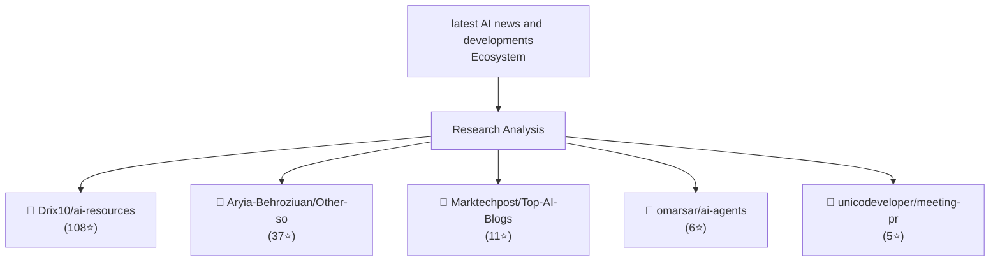

> **Generated**: April 10, 2026 at 08:00  
> **Research Intensity**: Quick  
> **Analysis Depth**: Fast

---

## Overview

**Research Scope**: Analyzed 5 web sources on 'latest AI news and developments'  
**Key Sources**: Reuters AI News | Latest Headlines and Developments | Reuters, AI News & Artificial Intelligence | TechCrunch, AI News | Latest News | Insights Powering AI-Driven Business Growth  
**Active Projects**: Drix10/ai-resources, Aryia-Behroziuan/Other-sources, Marktechpost/Top-AI-Blogs-Newsletters  
**Community Interest**: 167 combined GitHub stars across top 5 repositories  
**Ecosystem Status**: Growing interest with 5 major projects and 5 recent publications  

---

## Research Landscape

---

## Key Insights

### Insight 1: Reuters AI News | Latest Headlines and Developments | Reuter

**Finding**: Florida ​Attorney ‌General ​James ​Uthmeier ⁠on ​Thursday ​launched ​an ​investigation into ‌OpenAI ⁠and ​its ​popular ⁠chatbot ​ChatGPT.

**Source**: [Reuters AI News | Latest Headlines and Developments | Reuters](https://www.reuters.com/technology/artificial-intelligence/)

### Insight 2: AI News & Artificial Intelligence | TechCrunch

**Finding**: News coverage on artificial intelligence and machine learning tech, the companies building them, and the ethical issues AI raises today.

**Source**: [AI News & Artificial Intelligence | TechCrunch](https://techcrunch.com/category/artificial-intelligence/)

### Insight 3: AI News | Latest News | Insights Powering AI-Driven Business

**Finding**: AI News delivers the latest updates in artificial intelligence, machine learning, deep learning, enterprise AI, and emerging tech worldwide.

**Source**: [AI News | Latest News | Insights Powering AI-Driven Business Growth](https://www.artificialintelligence-news.com/)

### Insight 4: Artificial intelligence | MIT News | Massachusetts Institute

**Finding**: MIT researchers developed a testing framework that pinpoints situations where AI decision-support systems are not treating people and communities fairly.

**Source**: [Artificial intelligence | MIT News | Massachusetts Institute of Technology](https://news.mit.edu/topic/artificial-intelligence2)

### Insight 5: Artificial intelligence news: Chat AI, ChatGPT, AI generator

**Finding**: Angela Lipps&#x27; ordeal is the latest in a trend that has resulted in at least 13 case dismissals nationwide. ... The act would tighten restrictions on a choke point for the industry, banning export

**Source**: [Artificial intelligence news: Chat AI, ChatGPT, AI generator, AI Chatbot and Bard | NBC News](https://www.nbcnews.com/artificial-intelligence)

---

## Active Ecosystem

### Trending Projects

| Project | Community Interest | Focus Area |
|---------|:------------------:|-----------|
| [Drix10/ai-resources](https://github.com/Drix10/ai-resources) | 👀 Emerging (108⭐) | Daily updated resources on AI across various domai |
| [Aryia-Behroziuan/Other-sources](https://github.com/Aryia-Behroziuan/Other-sources) | 👀 Emerging (37⭐) | Asada, M.; Hosoda, K.; Kuniyoshi, Y.; Ishiguro, H. |
| [Marktechpost/Top-AI-Blogs-Newsletters](https://github.com/Marktechpost/Top-AI-Blogs-Newsletters) | 👀 Emerging (11⭐) | Here is a live list of Resources that could be hel |
| [omarsar/ai-agents](https://github.com/omarsar/ai-agents) | 👀 Emerging (6⭐) | Collection of latest AI agent news and development |
| [unicodeveloper/meeting-prep](https://github.com/unicodeveloper/meeting-prep) | 👀 Emerging (5⭐) | Get instant, AI-powered briefings on any topic bef |

---

## Best Resources to Explore

### Getting Started

The following resources provide excellent entry points for deeper understanding:

**Primary Sources**:

1. [Reuters AI News | Latest Headlines and Developments | Reuters](https://www.reuters.com/technology/artificial-intelligence/)  
   - Florida ​Attorney ‌General ​James ​Uthmeier ⁠on ​Thursday ​launched ​an ​investigation into ‌OpenAI ...
2. [AI News & Artificial Intelligence | TechCrunch](https://techcrunch.com/category/artificial-intelligence/)  
   - News coverage on artificial intelligence and machine learning tech, the companies building them, and...
3. [AI News | Latest News | Insights Powering AI-Driven Business Growth](https://www.artificialintelligence-news.com/)  
   - AI News delivers the latest updates in artificial intelligence, machine learning, deep learning, ent...
4. [Artificial intelligence | MIT News | Massachusetts Institute of Techno](https://news.mit.edu/topic/artificial-intelligence2)  
   - MIT researchers developed a testing framework that pinpoints situations where AI decision-support sy...
5. [Artificial intelligence news: Chat AI, ChatGPT, AI generator, AI Chatb](https://www.nbcnews.com/artificial-intelligence)  
   - Angela Lipps&#x27; ordeal is the latest in a trend that has resulted in at least 13 case dismissals ...

**Code & Implementation**:

1. [Drix10/ai-resources](https://github.com/Drix10/ai-resources) - 108 stars  
   - Daily updated resources on AI across various domains including ML, development, education, healthcar
2. [Aryia-Behroziuan/Other-sources](https://github.com/Aryia-Behroziuan/Other-sources) - 37 stars  
   - Asada, M.; Hosoda, K.; Kuniyoshi, Y.; Ishiguro, H.; Inui, T.; Yoshikawa, Y.; Ogino, M.; Yoshida, C. 
3. [Marktechpost/Top-AI-Blogs-Newsletters](https://github.com/Marktechpost/Top-AI-Blogs-Newsletters) - 11 stars  
   - Here is a live list of Resources that could be helpful for you to keep up with the latest AI develop
4. [omarsar/ai-agents](https://github.com/omarsar/ai-agents) - 6 stars  
   - Collection of latest AI agent news and developments
5. [unicodeveloper/meeting-prep](https://github.com/unicodeveloper/meeting-prep) - 5 stars  
   - Get instant, AI-powered briefings on any topic before your meeting. Enter a meeting topic or company

---

## Research Quality Metrics

| Metric | Value | Interpretation |
|--------|-------|-----------------|
| Web Sources Analyzed | 5 | Breadth of coverage |
| Active Projects Found | 5 | Ecosystem maturity |
| Community Engagement | 167⭐ | Interest level |
| Confidence Level | **High** | Data reliability |

---

## Complete Resource List

### Articles & Publications

- [Reuters AI News | Latest Headlines and Developments | Reuters](https://www.reuters.com/technology/artificial-intelligence/)
- [AI News & Artificial Intelligence | TechCrunch](https://techcrunch.com/category/artificial-intelligence/)
- [AI News | Latest News | Insights Powering AI-Driven Business Growth](https://www.artificialintelligence-news.com/)
- [Artificial intelligence | MIT News | Massachusetts Institute of Technology](https://news.mit.edu/topic/artificial-intelligence2)
- [Artificial intelligence news: Chat AI, ChatGPT, AI generator, AI Chatbot and Bar](https://www.nbcnews.com/artificial-intelligence)

### Open Source Projects

- [Drix10/ai-resources](https://github.com/Drix10/ai-resources) - 108 GitHub stars
- [Aryia-Behroziuan/Other-sources](https://github.com/Aryia-Behroziuan/Other-sources) - 37 GitHub stars
- [Marktechpost/Top-AI-Blogs-Newsletters](https://github.com/Marktechpost/Top-AI-Blogs-Newsletters) - 11 GitHub stars
- [omarsar/ai-agents](https://github.com/omarsar/ai-agents) - 6 GitHub stars
- [unicodeveloper/meeting-prep](https://github.com/unicodeveloper/meeting-prep) - 5 GitHub stars

---

## Next Steps

Based on this research, consider:

1. **Deep Dive**: Select one of the trending projects and review its documentation
2. **Hands-On**: Clone and test the most active repositories
3. **Community**: Join discussions on these projects to stay updated
4. **Integration**: Evaluate which solutions fit your specific use case

---

*Research Generated: April 10, 2026 at 08:00 UTC*  
*Intensity: quick | Thinking: fast*  
*Sources: Brave Search API + GitHub API*  
*Updated: 2026-04-10*