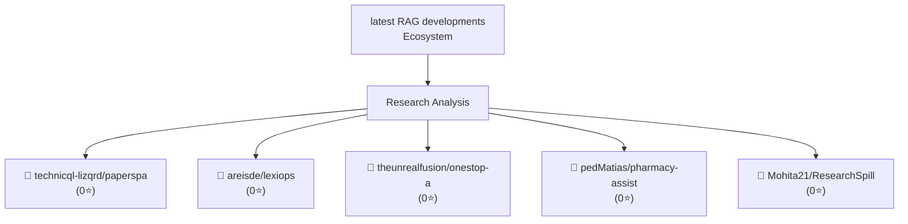

> **Generated**: April 07, 2026 at 09:00  
> **Research Intensity**: Deep  
> **Analysis Depth**: Extended

---

## Overview

**Research Scope**: Analyzed 20 web sources on 'latest RAG developments'  
**Key Sources**: The Latest RAG News in AI Enterprise: What's Happening Right Now - News from generation RAG, 8 Latest RAG Advancements Every Developer Should Know - Zilliz blog, Advanced RAG: Architecture, Techniques, Applications and Use Cases and Development  
**Active Projects**: technicql-lizqrd/paperspace-rag-tools-rolling, areisde/lexiops, theunrealfusion/onestop-ai-suite  
**Community Interest**: 0 combined GitHub stars across top 5 repositories  
**Ecosystem Status**: Growing interest with 5 major projects and 20 recent publications  

---

## Research Landscape

---

## Key Insights

### Insight 1: The Latest RAG News in AI Enterprise: What's Happening Right

**Finding**: Hallucination has been the Achilles heel of enterprise AI adoption. Legal teams, compliance officers, and executives don’t want a system that confidently makes things up. RAG addresses this directly b

**Source**: [The Latest RAG News in AI Enterprise: What's Happening Right Now - News from generation RAG](https://ragaboutit.com/the-latest-rag-news-in-ai-enterprise-whats-happening-right-now/)

### Insight 2: 8 Latest RAG Advancements Every Developer Should Know - Zill

**Finding**: The latest advancements in RAG are solving critical challenges in AI by enhancing accuracy, speed, and context awareness, so there is always a RAG variant tailored to your needs. These innovations ena

**Source**: [8 Latest RAG Advancements Every Developer Should Know - Zilliz blog](https://zilliz.com/blog/8-latest-rag-advancements-every-developer-should-know)

### Insight 3: Advanced RAG: Architecture, Techniques, Applications and Use

**Finding**: For example, the knowledge graph achieved an impressive 86.31% accuracy on the RobustQA benchmark, significantly outperforming other RAG methods. Additionally, Sequeda and Allemang’s follow-up study f

**Source**: [Advanced RAG: Architecture, Techniques, Applications and Use Cases and Development](https://www.leewayhertz.com/advanced-rag/)

### Insight 4: The State of Retrieval-Augmented Generation (RAG) in 2025 an

**Finding**: This can be an issue for low-latency ... are now experimenting with hybrid RAG techniques that pre-cache relevant information or rank retrieved documents before feeding them into LLMs....

**Source**: [The State of Retrieval-Augmented Generation (RAG) in 2025 and Beyond - Aya Data](https://www.ayadata.ai/the-state-of-retrieval-augmented-generation-rag-in-2025-and-beyond/)

### Insight 5: Retrieval Augmented Generation (RAG) for LLMs | Prompt Engin

**Finding**: There is also increasing demand ... ecosystem, techniques to enhance RAG, challenges, and other related aspects covered in this overview: ... Below is a collection of research papers highlighting key 

**Source**: [Retrieval Augmented Generation (RAG) for LLMs | Prompt Engineering Guide<!-- -->](https://www.promptingguide.ai/research/rag)

---

## Active Ecosystem

### Trending Projects

| Project | Community Interest | Focus Area |
|---------|:------------------:|-----------|
| [technicql-lizqrd/paperspace-rag-tools-rolling](https://github.com/technicql-lizqrd/paperspace-rag-tools-rolling) | 👀 Emerging (0⭐) | Provide a rolling release notebook development env |
| [areisde/lexiops](https://github.com/areisde/lexiops) | 👀 Emerging (0⭐) | Build a RAG based Agent for querying latest develo |
| [theunrealfusion/onestop-ai-suite](https://github.com/theunrealfusion/onestop-ai-suite) | 👀 Emerging (0⭐) | 🧠 OneStop-AI-Suite: Your all-in-one hub for learni |
| [pedMatias/pharmacy-assistant-gpt](https://github.com/pedMatias/pharmacy-assistant-gpt) | 👀 Emerging (0⭐) | This project explains how to create a Retrieval Au |
| [Mohita21/ResearchSpill](https://github.com/Mohita21/ResearchSpill) | 👀 Emerging (0⭐) | ResearchSpill is a comprehensive end-to-end pipeli |

---

## Best Resources to Explore

### Getting Started

The following resources provide excellent entry points for deeper understanding:

**Primary Sources**:

1. [The Latest RAG News in AI Enterprise: What's Happening Right Now - New](https://ragaboutit.com/the-latest-rag-news-in-ai-enterprise-whats-happening-right-now/)  
   - Hallucination has been the Achilles heel of enterprise AI adoption. Legal teams, compliance officers...
2. [8 Latest RAG Advancements Every Developer Should Know - Zilliz blog](https://zilliz.com/blog/8-latest-rag-advancements-every-developer-should-know)  
   - The latest advancements in RAG are solving critical challenges in AI by enhancing accuracy, speed, a...
3. [Advanced RAG: Architecture, Techniques, Applications and Use Cases and](https://www.leewayhertz.com/advanced-rag/)  
   - For example, the knowledge graph achieved an impressive 86.31% accuracy on the RobustQA benchmark, s...
4. [The State of Retrieval-Augmented Generation (RAG) in 2025 and Beyond -](https://www.ayadata.ai/the-state-of-retrieval-augmented-generation-rag-in-2025-and-beyond/)  
   - This can be an issue for low-latency ... are now experimenting with hybrid RAG techniques that pre-c...
5. [Retrieval Augmented Generation (RAG) for LLMs | Prompt Engineering Gui](https://www.promptingguide.ai/research/rag)  
   - There is also increasing demand ... ecosystem, techniques to enhance RAG, challenges, and other rela...

**Code & Implementation**:

1. [technicql-lizqrd/paperspace-rag-tools-rolling](https://github.com/technicql-lizqrd/paperspace-rag-tools-rolling) - 0 stars  
   - Provide a rolling release notebook development environment with transformers, PGVector that runs the
2. [areisde/lexiops](https://github.com/areisde/lexiops) - 0 stars  
   - Build a RAG based Agent for querying latest developments in data and AI Law in Switzerland and the E
3. [theunrealfusion/onestop-ai-suite](https://github.com/theunrealfusion/onestop-ai-suite) - 0 stars  
   - 🧠 OneStop-AI-Suite: Your all-in-one hub for learning 🚀 Agentic AI , RAG & Agentic-RAG and all latest
4. [pedMatias/pharmacy-assistant-gpt](https://github.com/pedMatias/pharmacy-assistant-gpt) - 0 stars  
   - This project explains how to create a Retrieval Augmented System (RAG) using LangChain and LLMs. In 
5. [Mohita21/ResearchSpill](https://github.com/Mohita21/ResearchSpill) - 0 stars  
   - ResearchSpill is a comprehensive end-to-end pipeline designed to help researchers, practitioners, an

---

## Research Quality Metrics

| Metric | Value | Interpretation |
|--------|-------|-----------------|
| Web Sources Analyzed | 20 | Breadth of coverage |
| Active Projects Found | 5 | Ecosystem maturity |
| Community Engagement | 0⭐ | Interest level |
| Confidence Level | **High** | Data reliability |

---

## Complete Resource List

### Articles & Publications

- [The Latest RAG News in AI Enterprise: What's Happening Right Now - News from gen](https://ragaboutit.com/the-latest-rag-news-in-ai-enterprise-whats-happening-right-now/)
- [8 Latest RAG Advancements Every Developer Should Know - Zilliz blog](https://zilliz.com/blog/8-latest-rag-advancements-every-developer-should-know)
- [Advanced RAG: Architecture, Techniques, Applications and Use Cases and Developme](https://www.leewayhertz.com/advanced-rag/)
- [The State of Retrieval-Augmented Generation (RAG) in 2025 and Beyond - Aya Data](https://www.ayadata.ai/the-state-of-retrieval-augmented-generation-rag-in-2025-and-beyond/)
- [Retrieval Augmented Generation (RAG) for LLMs | Prompt Engineering Guide<!-- -->](https://www.promptingguide.ai/research/rag)
- [Top 5 Trends in Enterprise RAG | Tonic.ai](https://www.tonic.ai/guides/enterprise-rag)
- [Retrieval-augmented generation - Wikipedia](https://en.wikipedia.org/wiki/Retrieval-augmented_generation)
- [Retrieval-Augmented Generation (RAG): 2025 Definitive Guide](https://www.chitika.com/retrieval-augmented-generation-rag-the-definitive-guide-2025/)
- [Trends in Active Retrieval Augmented Generation: 2025 and Beyond](https://www.signitysolutions.com/blog/trends-in-active-retrieval-augmented-generation)
- [[2410.12837] A Comprehensive Survey of Retrieval-Augmented Generation (RAG): Evo](https://arxiv.org/abs/2410.12837)
- [Latest Developments in Retrieval-Augmented Generation](https://celerdata.com/glossary/latest-developments-in-retrieval-augmented-generation)
- [16 New Types of Retrieval-Augmented Generation (RAG)](https://www.turingpost.com/p/16-new-types-of-rag)
- [Challenges and Future Directions in RAG Research: Embracing Data & AI](https://www.harrisonclarke.com/blog/challenges-and-future-directions-in-rag-research-embracing-data-ai)
- [RAG is dead - or is it? | IntraFind](https://intrafind.com/en/blog/rag-is-dead-or-not)
- [The Rise and Evolution of RAG in 2024 A Year in Review | RAGFlow](https://ragflow.io/blog/the-rise-and-evolution-of-rag-in-2024-a-year-in-review)

### Open Source Projects

- [technicql-lizqrd/paperspace-rag-tools-rolling](https://github.com/technicql-lizqrd/paperspace-rag-tools-rolling) - 0 GitHub stars
- [areisde/lexiops](https://github.com/areisde/lexiops) - 0 GitHub stars
- [theunrealfusion/onestop-ai-suite](https://github.com/theunrealfusion/onestop-ai-suite) - 0 GitHub stars
- [pedMatias/pharmacy-assistant-gpt](https://github.com/pedMatias/pharmacy-assistant-gpt) - 0 GitHub stars
- [Mohita21/ResearchSpill](https://github.com/Mohita21/ResearchSpill) - 0 GitHub stars

---

## Next Steps

Based on this research, consider:

1. **Deep Dive**: Select one of the trending projects and review its documentation
2. **Hands-On**: Clone and test the most active repositories
3. **Community**: Join discussions on these projects to stay updated
4. **Integration**: Evaluate which solutions fit your specific use case

---

*Research Generated: April 07, 2026 at 09:00 UTC*  
*Intensity: deep | Thinking: extended*  
*Sources: Brave Search API + GitHub API*  
*Updated: 2026-04-07*