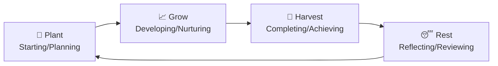
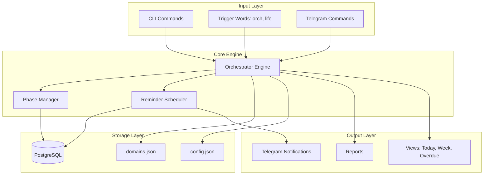
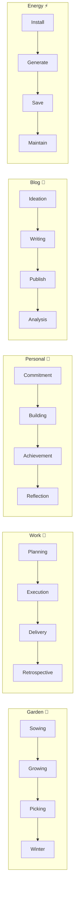
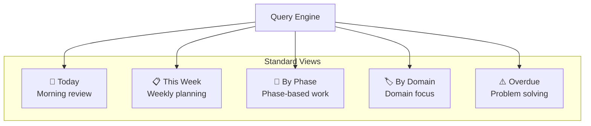
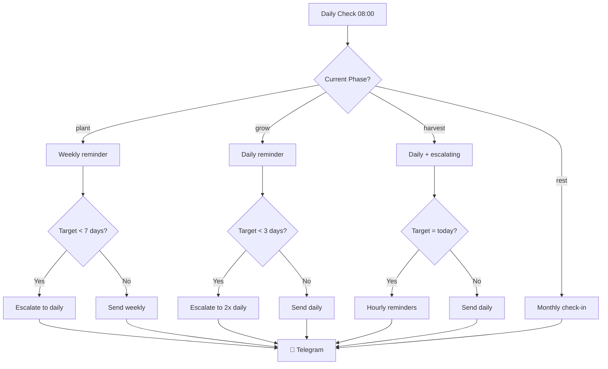
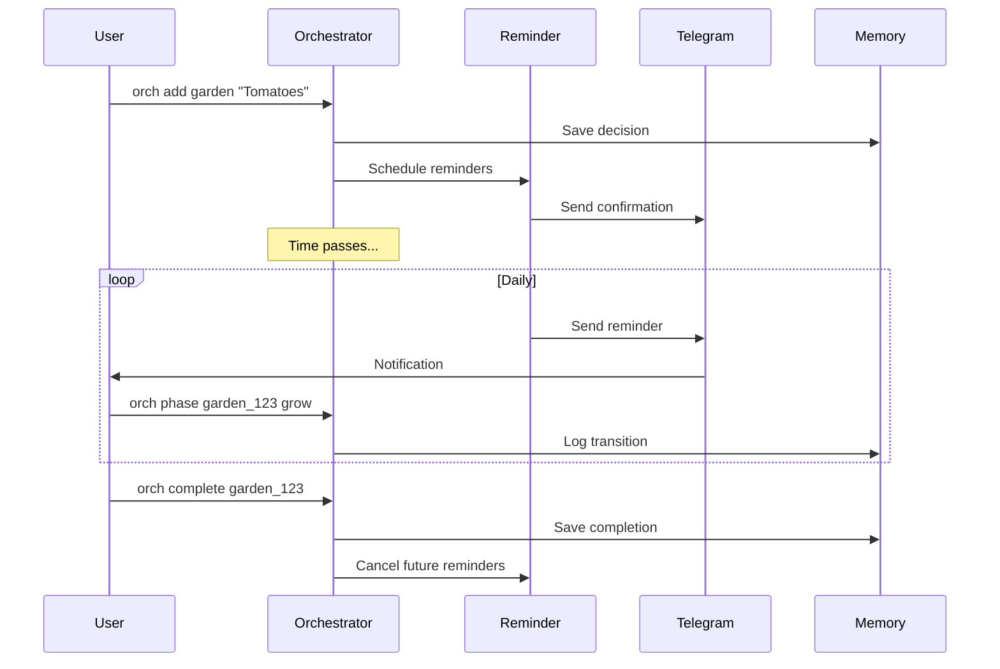
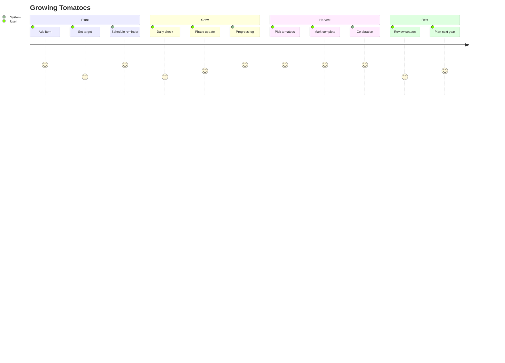

## The Problem

Life has many domains — garden, work, personal goals, blog, energy management. Each has its own rhythm, its own milestones, its own way of tracking progress. How do you unify them without forcing everything into the same mold?

## The Solution: Natural Lifecycle

Every living thing follows the same pattern: **Plant → Grow → Harvest → Rest**. The Orchestrator applies this natural cycle to everything you track.



## Phase Characteristics

| Phase | Emoji | Meaning | Reminder Style | Default Frequency |
|-------|-------|---------|----------------|-------------------|
| **plant** | 🌱 | Starting, planning, sowing | Gentle, encouraging | Weekly |
| **grow** | 📈 | Developing, nurturing, working | Regular, informative | Daily |
| **harvest** | 🎯 | Completing, collecting, achieving | Urgent, time-sensitive | Daily (escalating) |
| **rest** | 😴 | Reflecting, pausing, reviewing | Minimal, review-focused | Monthly |

## Architecture



## Domains

Each domain has phase-specific terminology:



## Item Data Model

Every tracked item uses the same structure:

```json
{
  "id": "garden_20260321_abc123",
  "title": "Sungold Tomatoes",
  "domain": "garden",
  "phase": "grow",
  "status": "active",
  "priority": "high",
  "created": "2026-03-21T10:00:00Z",
  "updated": "2026-03-21T22:00:00Z",
  "target_date": "2026-07-15",
  "phase_entered": "2026-03-15T08:00:00Z",
  "metadata": {
    "variety": "Sungold",
    "location": "Greenhouse bed 1",
    "quantity": 4
  },
  "history": [],
  "reminders": [],
  "tags": ["tomato", "greenhouse"]
}
```

## Commands

| Command | Purpose | Example |
|---------|---------|---------|
| `orch add` | Create new item | `orch add garden "Tomatoes" --priority high` |
| `orch list` | List all active | `orch list` |
| `orch today` | Today's priorities | `orch today` |
| `orch week` | This week | `orch week` |
| `orch overdue` | Past target date | `orch overdue` |
| `orch phase <id> <phase>` | Transition phase | `orch phase garden_123 grow` |
| `orch complete <id>` | Mark done | `orch complete garden_123` |
| `orch report [type]` | Generate report | `orch report weekly` |

## Views



## Reminder Escalation



## Integration Flow



## Cron Jobs

```bash
# Daily reminder check
0 8 * * * ~/.config/opencode/skills/orchestrator/scripts/check-reminders.sh

# Send notifications
5 8 * * * ~/.config/opencode/skills/orchestrator/scripts/send-notifications.sh

# Daily report
0 21 * * * ~/.config/opencode/skills/orchestrator/scripts/report.sh daily

# Weekly report (Mondays)
0 9 * * 1 ~/.config/opencode/skills/orchestrator/scripts/report.sh weekly
```

## Example Workflow



## PostgreSQL Schema

```sql
CREATE TABLE orchestrator_items (
    id TEXT PRIMARY KEY,
    title TEXT NOT NULL,
    domain TEXT NOT NULL,
    phase TEXT NOT NULL,
    status TEXT DEFAULT 'active',
    priority TEXT DEFAULT 'medium',
    created TIMESTAMPTZ DEFAULT NOW(),
    updated TIMESTAMPTZ DEFAULT NOW(),
    target_date DATE,
    phase_entered TIMESTAMPTZ,
    metadata JSONB DEFAULT '{}',
    history JSONB DEFAULT '[]',
    reminders JSONB DEFAULT '[]',
    tags TEXT[] DEFAULT '{}'
);

CREATE INDEX idx_orchestrator_domain ON orchestrator_items(domain);
CREATE INDEX idx_orchestrator_phase ON orchestrator_items(phase);
CREATE INDEX idx_orchestrator_status ON orchestrator_items(status);
CREATE INDEX idx_orchestrator_target ON orchestrator_items(target_date);
```

## Related Skills

| Skill | Relationship |
|-------|--------------|
| **reminder** | Notification delivery |
| **telegram** | Message channel |
| **cron** | Scheduling |
| **tracking** | Progress logging |
| **lifeplan** | Import goals as items |

## Next Post

In the next deep dive, we'll explore the **Meta-Skills** — how Skill Factory and Menu Factory enable the system to evolve and improve itself.

---

*This is part 3 of 5 in the Personal Assistant Ecosystem series.*