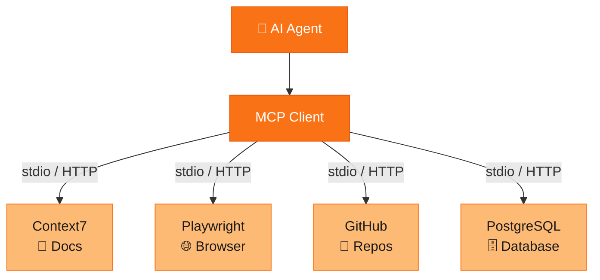
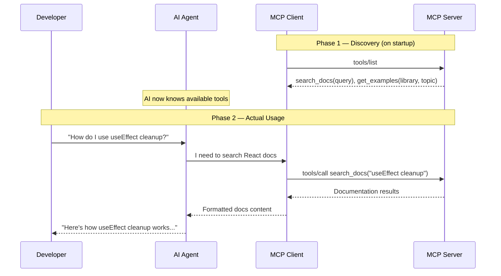
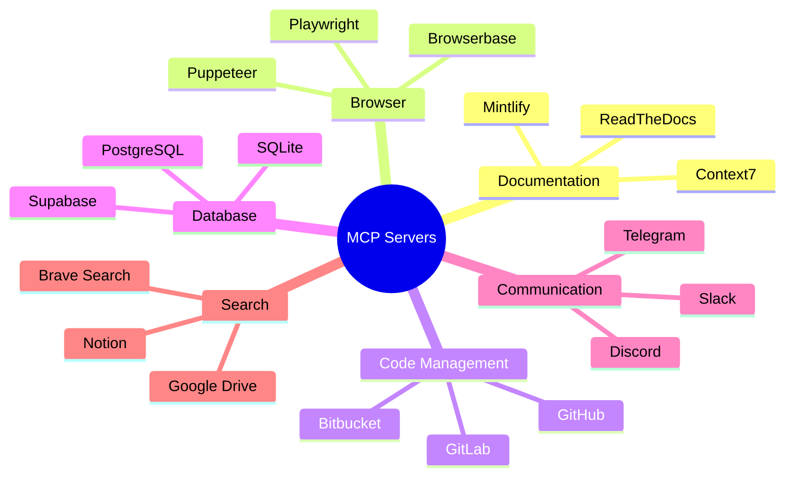

# MCPs: Giving Your AI Hands

Your AI can read code. But can it browse the web? Query a database? Search documentation in real time?

If you've used Copilot or ChatGPT, you've experienced the fundamental limitation: your AI is brilliant, but it's trapped in a box. It can reason about code you paste in, but it can't *do* anything on its own. It can't open a browser to check if your CSS actually looks right. It can't search the latest React docs to see if that hook still exists. It can't create a pull request when it's done fixing your bug.

That changes with **MCP** — the Model Context Protocol.

In this post, we're diving into the connective tissue that turns an AI from a fancy autocomplete into a genuine collaborator. By the end, you'll understand what MCP is, how it works, and you'll have installed your first MCP servers with real, working config.

Let's get into it.

---

## What MCP Actually Is

**Model Context Protocol** is an open standard created by Anthropic (the company behind Claude). It solves a simple but profound problem: *how do AI tools talk to the outside world?*

Before MCP, every AI tool built its own integrations. Copilot had one set of plugins. Cursor had another. Claude Code had a different approach entirely. If you built a tool that let AI search your database, you'd have to build it three times for three different platforms.

MCP changes this by defining **one protocol** that any AI client can use to connect to **any tool server**. Think of it like USB for AI — a universal connector.

The key properties:

- **Open standard**: Anyone can implement it. No vendor lock-in.
- **Client-server architecture**: Your AI is the client. Tools are servers. Clean separation.
- **Language-agnostic**: Servers can be written in Python, TypeScript, Go, Rust — anything that can speak the protocol.
- **Local-first**: Most MCP servers run on your machine, keeping your data private.

The result? Instead of every AI tool building integrations from scratch, we get a shared ecosystem. Build a server once, and it works with Claude Code, OpenCode, Cursor, Windsurf, Cline — any MCP-compatible client.

---

## How It Works: The Client-Server Model

The architecture is beautifully simple. Your AI agent has an **MCP client** built in. That client connects to one or more **MCP servers**, each of which exposes a set of **tools**.

Here's what that looks like:



### Tool Discovery and Invocation

The magic happens through a two-step dance:

1. **Discovery**: When your AI client starts, it asks each MCP server "what tools do you have?" The server responds with a list of tools, including their names, descriptions, and expected parameters. This is how the AI *learns* what it can do.

2. **Invocation**: When the AI decides it needs to use a tool (say, searching documentation), it sends a structured request to the MCP server. The server executes the action and returns the result.

Here's that flow as a sequence:



Notice something important: **the AI decides when to use tools**. You don't have to manually trigger a search or invoke a browser. You just ask your question, and the agent figures out which tools it needs.

### Transport: How Messages Travel

MCP supports two transport mechanisms:

- **stdio**: The MCP server runs as a local process. The AI client spawns it and communicates through standard input/output. This is the most common pattern — fast, secure, no network required.
- **HTTP (Streamable HTTP)**: The MCP server runs as a web service. The client connects over HTTP, which enables remote servers, shared infrastructure, and cloud-hosted tools.

For most developer workflows, stdio is what you'll use. Your tools run locally, your data stays on your machine, and latency is near-zero.

---

## Installing Your First MCP Servers

Enough theory. Let's get tools installed.

The exact config format depends on which AI client you're using, but the concept is the same everywhere: you list the MCP servers you want, tell the client how to start them, and restart.

### OpenCode

OpenCode uses a JSON config file at `~/.config/opencode/opencode.json`. Here's how to add servers:

```json
{
  "mcpServers": {
    "context7": {
      "type": "remote",
      "url": "https://mcp.context7.com/mcp",
      "enabled": true
    },
    "playwright": {
      "type": "local",
      "command": ["npx", "-y", "@anthropic-ai/mcp-playwright"],
      "enabled": true
    },
    "github": {
      "type": "local",
      "command": ["npx", "-y", "@modelcontextprotocol/server-github"],
      "env": {
        "GITHUB_PERSONAL_ACCESS_TOKEN": "ghp_your_token_here"
      },
      "enabled": true
    }
  }
}
```

Or use the CLI:

```bash
# Add a remote server
opencode mcp add context7 https://mcp.context7.com/mcp --enabled

# Add a local server
opencode mcp add --type local playwright -- npx -y @anthropic-ai/mcp-playwright
```

### Claude Code

Claude Code uses a similar approach. Add servers to your project's `.claude.json` or your global `~/.claude.json`:

```json
{
  "mcpServers": {
    "context7": {
      "command": "npx",
      "args": ["-y", "@upstash/context7-mcp@latest"]
    },
    "github": {
      "command": "npx",
      "args": ["-y", "@modelcontextprotocol/server-github"],
      "env": {
        "GITHUB_PERSONAL_ACCESS_TOKEN": "ghp_your_token_here"
      }
    }
  }
}
```

After editing, restart your client. On startup, you'll see the MCP servers connect and their tools become available.

### What Each Server Gives You

**Context7** — Search up-to-date documentation for any library or framework. Instead of relying on training data that might be months old, the AI searches live docs. Ask "how does the new React 19 `use()` hook work?" and get accurate, current answers.

**Playwright** — Full browser automation. The AI can navigate to URLs, click elements, fill forms, take screenshots, and extract content. This is how you get an AI that can *see* your web app and verify it works.

**GitHub** — Repository management directly from your coding session. Create branches, open pull requests, list issues, search code across repos, and manage reviews — all without leaving your terminal.

---

## Real-World Examples

Let's see these tools in action — not toy examples, but actual workflows that save real time.

### Searching Docs Mid-Conversation

You're building a feature with an unfamiliar library. Before MCP, you'd Google the docs, skim the results, paste relevant bits into your AI, and hope for the best.

With Context7 connected, the workflow becomes:

```
You: "Add a rate limiter to this Express route using the express-rate-limit package.
     Use the latest API."

AI: [internally calls context7 search for "express-rate-limit"]
    [gets current docs showing v7 API changes]

    Here's the implementation using the v7 API:
    
    import rateLimit from 'express-rate-limit';
    
    const limiter = rateLimit({
      windowMs: 15 * 60 * 1000,
      limit: 100,
      standardHeaders: true,
      legacyHeaders: false,
    });
    
    app.use('/api/', limiter);
```

No tabs open. No copy-pasting. The AI searched the docs itself and used the *current* API — not whatever it memorized during training.

### Automating Browser Testing

You've just built a login form. Does it actually work? With Playwright MCP:

```
You: "Test the login form at localhost:3000/login with email test@example.com
     and password testpass123"

AI: [launches browser via Playwright MCP]
    [navigates to localhost:3000/login]
    [fills email field]
    [fills password field]
    [clicks submit button]
    [takes screenshot of result]

    ✅ Login successful — screenshot shows the dashboard.
    There's a visual issue: the welcome banner overlaps the
    navigation on mobile viewports. Want me to fix that?
```

The AI didn't just write code — it *tested* it in a real browser and found a visual bug you'd have missed. That's the difference between an assistant and a collaborator.

### Managing PRs and Issues

You've finished a feature branch. The whole review cycle:

```
You: "Create a PR for this branch, target main, and link it to issue #42"

AI: [uses GitHub MCP to create pull request]
    [references issue #42 in the body]
    [lists all changed files in the description]

    Created PR #47: "Add user authentication flow"
    https://github.com/your-org/repo/pull/47
    
    Changes: 12 files, +340/-28 lines
    Linked to #42 — it will auto-close on merge.
```

Later, when a reviewer leaves comments:

```
You: "Check the review comments on PR #47 and address them"

AI: [fetches review comments via GitHub MCP]
    [reads each comment]
    [makes the requested changes]
    [pushes a new commit]

    Addressed 3 review comments:
    - Extracted validation into a separate module
    - Added error handling for expired tokens
    - Added integration tests for the auth middleware
```

This is where the agentic workflow fundamentally differs from traditional coding. You're not micro-managing keystrokes — you're directing outcomes, and the AI handles the mechanics.

---

## The Bigger Picture: The MCP Ecosystem

What makes MCP powerful isn't any single server — it's the growing ecosystem. New servers are being published every week, covering everything from database access to Slack integration to file system operations.



The ecosystem is growing fast. At the time of writing, there are hundreds of MCP servers available — and because the protocol is open, anyone can build one for their own tools and services.

If your team uses an internal tool, an internal API, or a proprietary database, you can build an MCP server for it. Your AI can then use that tool the same way it uses GitHub or Playwright — seamlessly, as part of the conversation.

---

## Getting Started Today

Here's your five-minute setup:

1. **Choose an MCP-compatible client** — Claude Code, OpenCode, Cursor, Windsurf, or Cline.
2. **Add Context7** — It's the easiest win. One config line, no API key needed. Suddenly your AI has live documentation access.
3. **Add GitHub MCP** — Create a personal access token with repo scope, add the config. Now your AI can manage PRs.
4. **Restart your client** — Watch the servers connect on startup.
5. **Try it** — Ask your AI something that requires external data. "What's the latest API for X?" or "Create a PR for my current changes."

You'll know it's working when your AI starts doing things instead of just suggesting them.

---

## What's Next

In this post, we gave our AI hands — tools to reach out and interact with the world. But hands aren't much use without a brain that knows how to use them strategically.

In the next post in The Agentic Stack series, we'll look at how AI agents *orchestrate* multiple tools together — chaining browser tests, doc searches, and code edits into coherent multi-step workflows. Because the real power isn't any single MCP server. It's what happens when your AI combines them.

*The Agentic Stack is a series exploring the tools, protocols, and patterns behind modern AI-assisted development. [Subscribe to catch every post.]*

---

*Color palette: Orange (#f97316) for agent elements, Light Orange (#fdba74) for tool servers.*