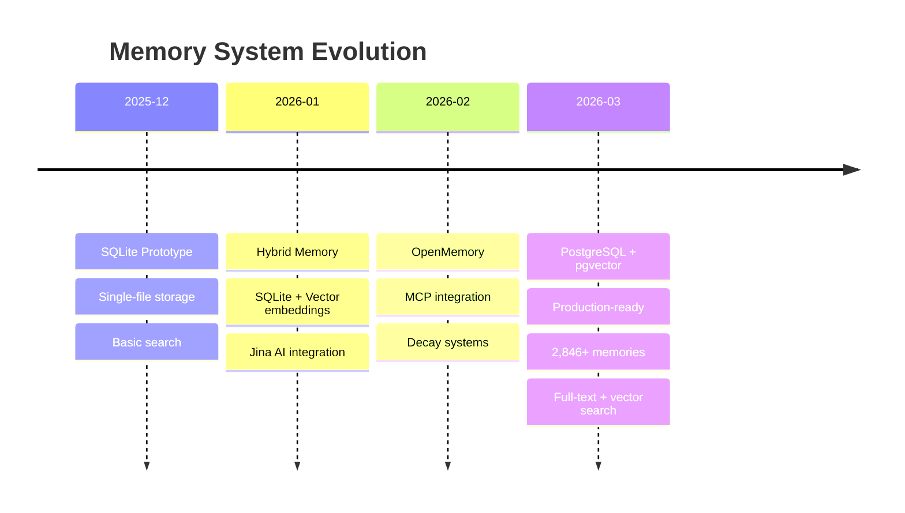
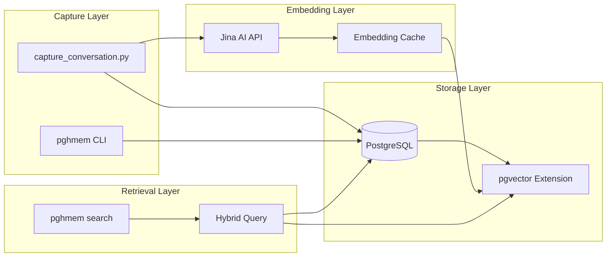
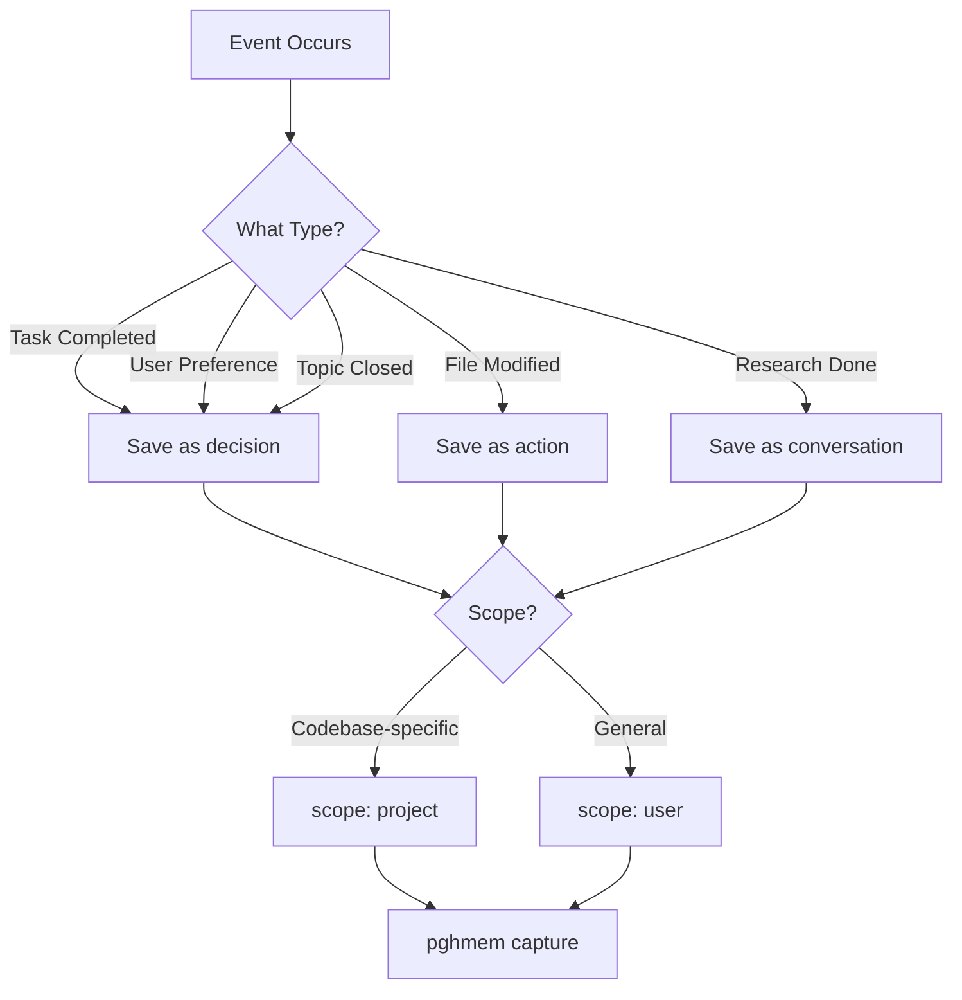
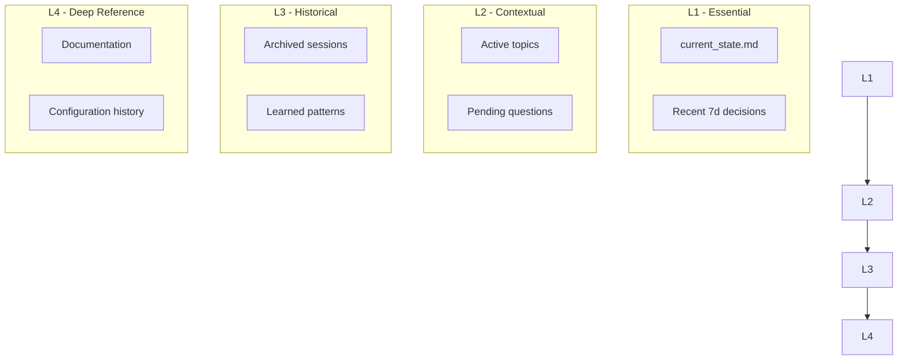

## Overview

The Memory System is the foundation of the Personal Assistant. Without persistent memory, every session starts from zero — no context, no learning, no continuity. This deep dive covers the architecture, protocols, and design decisions.

## Evolution of Memory



## Architecture



## Schema Design

### Core Tables

```sql
-- Main memory storage
CREATE TABLE memories (
    id UUID PRIMARY KEY DEFAULT gen_random_uuid(),
    content TEXT NOT NULL,
    memory_type TEXT NOT NULL,  -- conversation, decision, action, exchange
    scope TEXT DEFAULT 'user',   -- user, project
    tags TEXT[] DEFAULT '{}',
    metadata JSONB DEFAULT '{}',
    embedding vector(768),       -- Jina AI embeddings
    created_at TIMESTAMPTZ DEFAULT NOW(),
    accessed_at TIMESTAMPTZ DEFAULT NOW(),
    access_count INT DEFAULT 0
);

-- Indexes for fast retrieval
CREATE INDEX idx_memories_type ON memories(memory_type);
CREATE INDEX idx_memories_tags ON memories USING GIN(tags);
CREATE INDEX idx_memories_embedding ON memories 
    USING ivfflat (embedding vector_cosine_ops) WITH (lists = 100);
```

### Memory Types

| Type | Purpose | Example |
|------|---------|---------|
| `conversation` | Research, discussions | "Analyzed crustal displacement theories" |
| `decision` | Choices, preferences | "User prefers PostgreSQL over JSON" |
| `action` | Files created, commands | "Created reminder skill with 13 sections" |
| `exchange` | Quick checkpoints | "Session checkpoint saved" |

## Capture Protocol

### When to Save



### Capture Commands

```bash
# Basic save
pghmem capture "Content to remember" --type decision

# With tags
pghmem capture "User prefers dark mode" --type decision --tags "preference,ui"

# Project-scoped
pghmem capture "This codebase uses TypeScript" --scope project --tags "tech-stack"

# With metadata
pghmem capture "Server hostname changed" \
    --type decision \
    --metadata '{"old": "ubuntu58", "new": "ubuntu4"}'
```

## Retrieval Strategies

### 1. Keyword Search
```bash
pghmem search "crustal displacement"
```

### 2. Tag-based Search
```bash
pghmem search "tag:preference"
```

### 3. Hybrid Search (Keyword + Vector)
```bash
pghmem search "memory architecture" --hybrid
```

### 4. Time-based Search
```bash
pghmem search "decision" --recent 7d
```

## Progressive Disclosure

To prevent context overload, memories are loaded in layers:



### Session Initialization

```bash
# L1 - Always loaded
cat ~/.config/opencode/current_state.md

# L1 - Recent decisions
pghmem search "decision" --recent 7d

# L2 - Active flows (on demand)
python3 scripts/hybrid_tracker.py flow list --active
```

## Stats & Metrics

| Metric | Value |
|--------|-------|
| Total Memories | 2,846+ |
| Avg Daily Capture | 15-25 |
| Embedding Model | Jina AI (768 dims) |
| Search Latency | <50ms (hybrid) |
| Storage | PostgreSQL 16 |

## Session State Tracking

The `current_state.md` file tracks topic lifecycle:

```markdown
# Current State

## Active Topics
- Personal Assistant blog series
- Menu Factory optimization

## Recently Completed
- Orchestrator skill created
- Reminder Telegram integration

## Explicitly Closed
- Old memory system migration (dismissed 2026-03-13)

## Pending Questions
- Should we add OpenTelemetry?
```

## Migration History

| Date | From | To | Reason |
|------|------|-----|-----|
| 2026-03-13 | HybridMemory SQLite | PostgreSQL | Scalability, concurrent access |
| 2026-03-13 | OpenMemory SQLite | Archived | Consolidation |

## Key Design Decisions

1. **PostgreSQL over SQLite** — Concurrent access, better indexing, production-ready
2. **pgvector over FAISS** — Integrated search, ACID compliance
3. **Jina AI over OpenAI** — Cost-effective, good quality embeddings
4. **Hybrid search** — Best of keyword + semantic matching
5. **Progressive disclosure** — Prevent context window exhaustion

## Next Post

In the next deep dive, we'll explore the **Life Orchestrator** — how the Plant → Grow → Harvest → Rest model unifies tracking across garden, energy, work, personal, and blog domains.

---

*This is part 2 of 5 in the Personal Assistant Ecosystem series.*