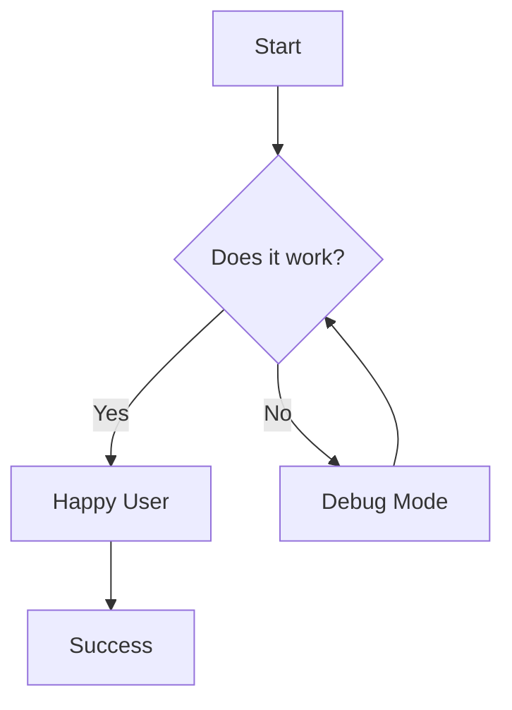

# Mermaid and Chart Rendering Test

This post verifies that both mermaid diagrams and Chart.js are working correctly in our new Astro theme.

## 1. Mermaid Flowchart



## 2. Chart.js Bar Chart

Here is a dynamic chart rendered from a JSON code block:

```chart
{
  "type": "bar",
  "data": {
    "labels": ["January", "February", "March", "April"],
    "datasets": [{
      "label": "Simulated Growth",
      "data": [12, 19, 3, 5],
      "backgroundColor": "rgba(74, 144, 226, 0.5)",
      "borderColor": "rgba(74, 144, 226, 1)",
      "borderWidth": 1
    }]
  },
  "options": {
    "responsive": true,
    "maintainAspectRatio": false,
    "scales": {
      "y": {
        "beginAtZero": true
      }
    }
  }
}
```

## 3. Hugo Shortcode Compatibility


graph LR
    X[Astro] --> Y[Directus]
    Y --> Z[Success]


If you see a flowchart, a bar chart, and another flowchart above, then everything is working perfectly!