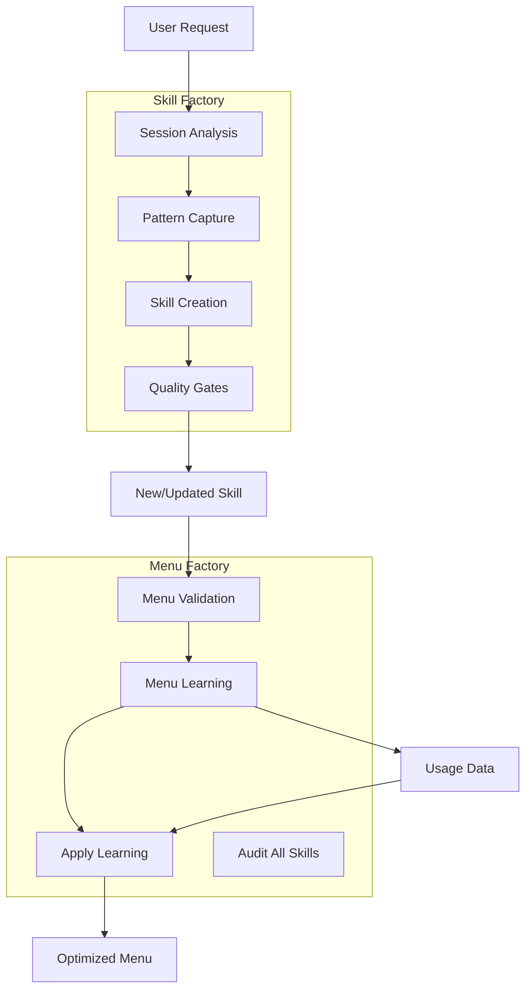
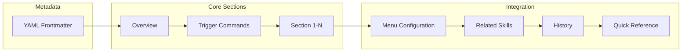
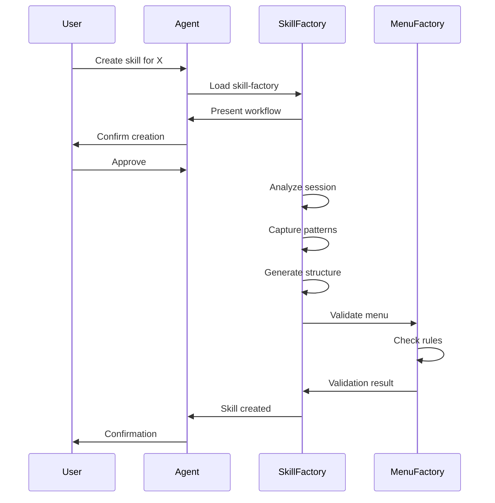
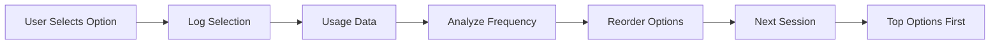
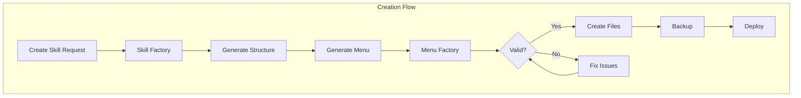
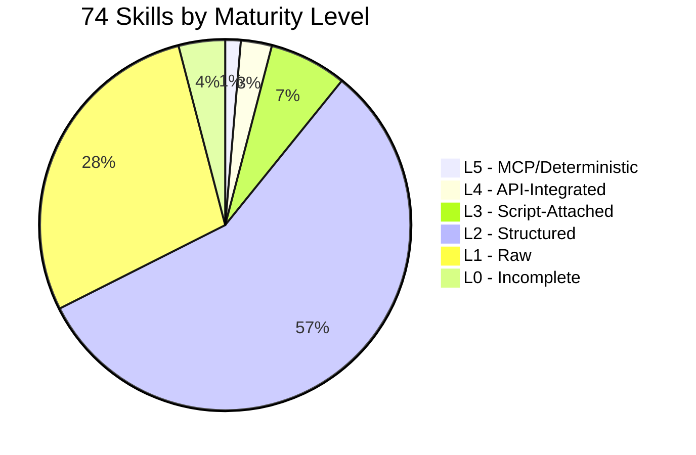
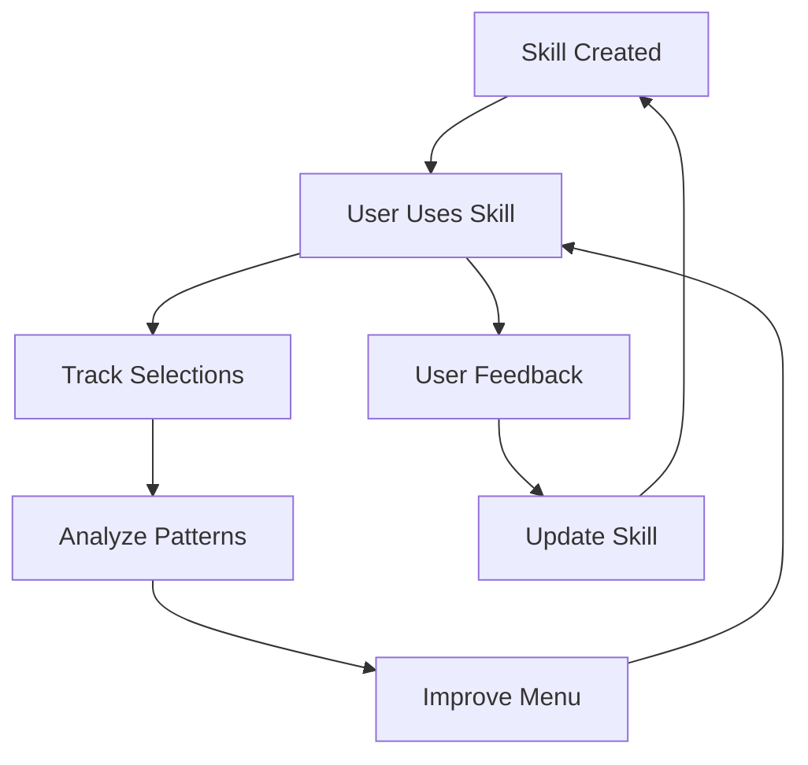

## The Meta-Concept

What if an AI system could create and improve itself? Meta-skills are skills that operate on other skills — creating, validating, and optimizing them. This is the Factory Pattern applied to AI capabilities.

## The Two Factories



## Skill Factory

### Purpose

Standardize skill creation with:
- Consistent 13-section structure
- Quality gates per maturity level
- Progressive disclosure templates
- Automatic validation

### The 13-Section Structure



### Maturity Levels

| Level | Name | Characteristics | Target For |
|-------|------|-----------------|------------|
| **L1** | Raw | SKILL.md only | Physical processes |
| **L2** | Structured | Metadata, sections, commands | Methodologies |
| **L3** | Script-Attached | Shell/Python automation | Automation tasks |
| **L4** | API-Integrated | REST/GraphQL endpoints | Data processing |
| **L5** | MCP/Deterministic | Full MCP server, typed tools | Service management |

### Creation Workflow



### File Structure

```
skill-name/
├── SKILL.md              # Main skill file
├── context/
│   ├── config.json       # User preferences
│   ├── templates.json    # L1-L4 templates
│   └── examples.md       # Usage examples
├── scripts/
│   ├── main.sh           # Main automation
│   └── helpers.py        # Helper functions
├── history/
│   └── changes.log       # Change history
└── docs/
    └── advanced.md       # Deep documentation
```

## Menu Factory

### Purpose

Ensure all skill menus follow rules and adapt to user behavior.

### Validation Rules

| Rule | Value | Why |
|------|-------|-----|
| Label max length | 40 chars | Readability |
| Description max length | 60 chars | Conciseness |
| Max options per menu | 10 | Cognitive load |
| Required suffix | Skill Discovery + Exit | Navigation |

### Menu-Learning Integration



### Validation Script

```bash
# Validate a specific skill
python3 scripts/validate.py --skill reminder

# Validate all skills
python3 scripts/validate.py --all

# Auto-fix missing suffix
python3 scripts/validate.py --skill reminder --fix
```

### Apply Learning

```bash
# Reorder a skill's menu by usage
python3 scripts/apply-learning.py --skill reminder
```

## Factory Integration



## Current Skills Stats



## Quality Gates

### L1 → L2 Transition
- [ ] YAML frontmatter complete
- [ ] All 13 sections present
- [ ] Menu configuration valid
- [ ] Related skills listed

### L2 → L3 Transition
- [ ] Scripts directory created
- [ ] Main automation script
- [ ] Helper functions
- [ ] Error handling

### L3 → L4 Transition
- [ ] API endpoints defined
- [ ] Request/response schemas
- [ ] Authentication
- [ ] Rate limiting

### L4 → L5 Transition
- [ ] MCP server implementation
- [ ] Typed tool definitions
- [ ] Schema validation
- [ ] Policy gates

## Example: Creating a Skill

```bash
# User says: "create a skill for tracking daily habits"

# 1. Skill Factory analyzes request
# 2. Generates structure:
```

```yaml
---
name: habit-tracker
version: 1.0.0
description: Track daily habits with streak counting and reminders
trigger: habit, habits, daily
maturity: L2
created: 2026-03-21
dependencies:
  - reminder
  - telegram
tags: [habits, tracking, daily, streaks]
---
```

```markdown
# Habit Tracker

## Overview
Track daily habits with streak counting, reminders, and progress visualization.

## Trigger Commands
- `habit` - Open habit tracker
- `habits` - List all habits
- `daily` - Today's habits

## Section 1: Habit Model
...

## Menu Configuration
{
  "questions": [{
    "question": "🎯 Habit Tracker - What would you like to do?",
    "header": "Habits",
    "options": [
      {"label": "📋 Today's Habits (Recommended)", "description": "View and complete today's habits"},
      {"label": "➕ Add Habit", "description": "Create a new habit to track"},
      {"label": "🔥 View Streaks", "description": "See your current streaks"},
      {"label": "📊 Weekly Report", "description": "Habit completion statistics"},
      {"label": "🔍 Skill Discovery", "description": "Related docs, improve menu"},
      {"label": "Exit", "description": "Return to previous context"}
    ],
    "multiple": false
  }]
}
```

## The Self-Improvement Loop



## Next Post

In the final deep dive, we'll explore **Reminders & Research** — how time-based triggers and deep research capabilities support the entire ecosystem.

---

*This is part 4 of 5 in the Personal Assistant Ecosystem series.*