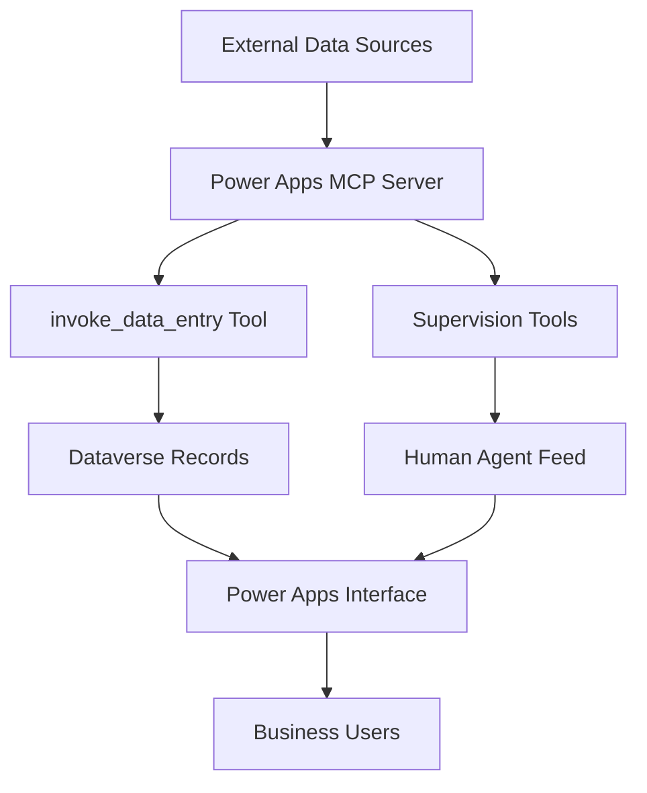
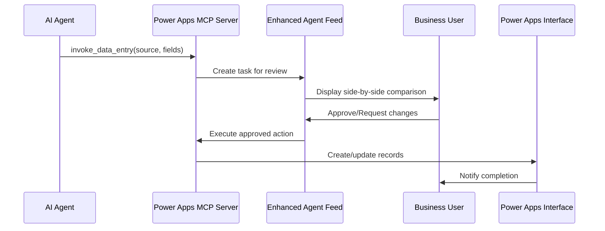
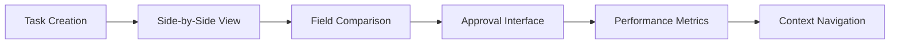
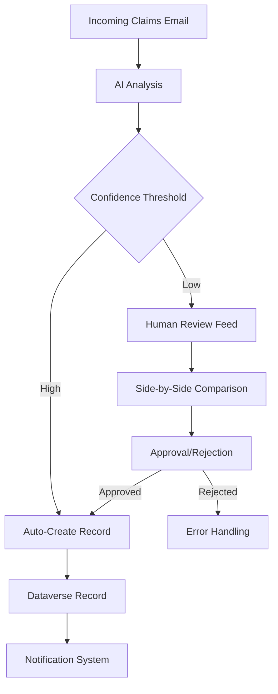
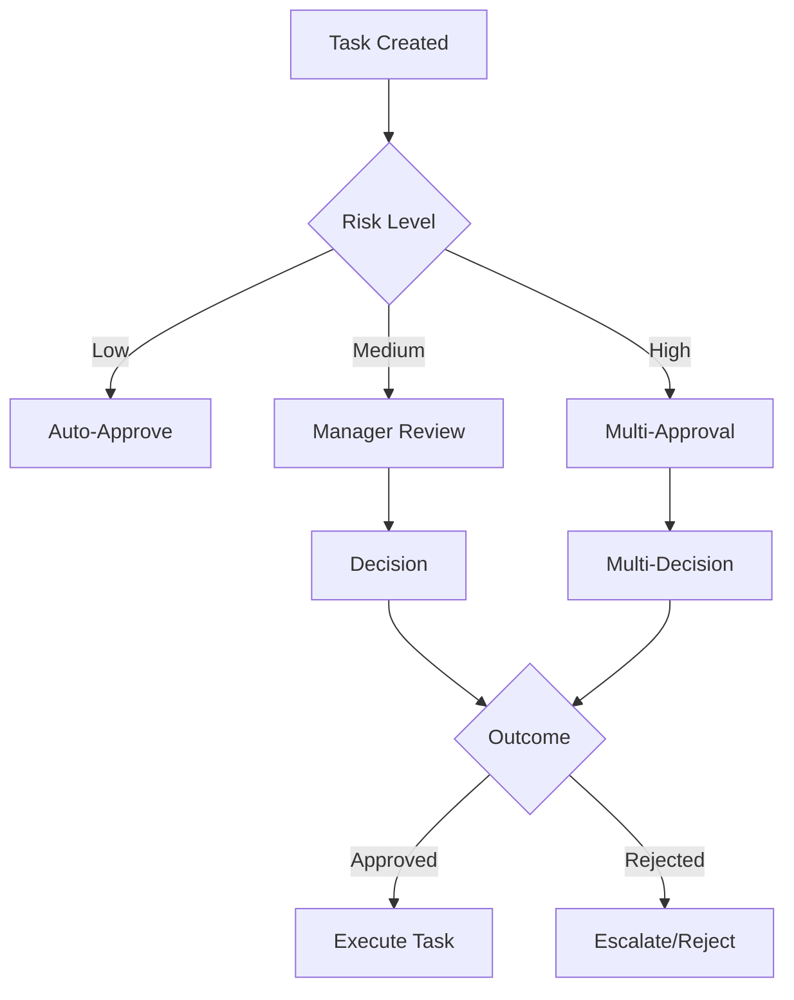

# Microsoft Power Apps MCP Server: Enabling Human-Agent Collaboration in Business Applications

## Executive Summary

Microsoft has introduced the Power Apps MCP (Model Context Protocol) Server in public preview, representing a significant advancement in human-agent collaboration for business applications. This new framework enables AI agents to automate repetitive app tasks with built-in human supervision through an enhanced agent feed. The announcement, made by Hemant Gaur, Principal PM Architect for Power Apps App Agents, extends Microsoft's AI-first organization vision by creating flexible workspaces where humans and AI agents collaborate seamlessly.

## Introduction to Power Apps MCP Server

The Power Apps MCP Server represents Microsoft's strategic evolution from single-purpose AI assistance to comprehensive agentic frameworks. Building on the success of the agentic data entry feature introduced earlier, the MCP Server provides:

### Core Technical Architecture



The MCP Server operates as a bridge between external unstructured data sources and structured business applications, enabling automated data extraction, validation, and record creation with appropriate human oversight.

### Two Primary Capabilities

#### 1. Automated Repetitive App Tasks

The `invoke_data_entry` tool represents the cornerstone of automation capabilities:

- **Data Source Integration**: Connects to shared mailboxes, SharePoint folders, and other unstructured content sources
- **Field Extraction**: Uses AI to identify and extract relevant fields from diverse document formats
- **Record Creation**: Automatically creates corresponding records in Power Apps
- **Human Review**: Built-in approval workflow through the enhanced agent feed

#### 2. Supervision and Control Features

The supervision capabilities provide critical enterprise controls:

- **Task Granularity**: Makers can control which tasks appear in the agent feed
- **Human Handoff**: Agents can request human assistance for complex scenarios
- **Performance Monitoring**: Real-time metrics on agent performance and accuracy
- **Context Navigation**: Direct access to specific records for detailed review

## Technical Implementation Details

### MCP Server Integration Pattern

The Power Apps MCP Server follows the Model Context Protocol standard, enabling:



### Enterprise Architecture Considerations

The MCP Server is designed with enterprise-grade capabilities:

#### Security and Governance
- **Role-based access control** for task visibility and approval workflows
- **Audit trails** for all agent actions and human decisions
- **Data sovereignty** compliance with organizational policies
- **Integration** with existing Microsoft Entra ID identity systems

#### Scalability and Performance
- **Horizontal scaling** capabilities for high-volume data processing
- **Asynchronous processing** to maintain responsiveness
- **Caching mechanisms** for frequently accessed data patterns
- **Load balancing** across multiple server instances

#### Reliability and Error Handling
- **Retry logic** for transient failures
- **Fallback mechanisms** when AI confidence is low
- **Error notification** through the agent feed for manual intervention
- **Performance monitoring** with SLA tracking

## Enhanced Agent Feed Architecture

The redesigned agent feed represents a paradigm shift in human-agent interaction:

### User Experience Enhancements



#### Key Interface Features
1. **Side-by-Side Comparison**: Visual comparison between extracted data and proposed records
2. **Context-Aware Navigation**: Direct links to specific records within the application
3. **Performance Dashboard**: Real-time metrics on agent accuracy and efficiency
4. **Collaboration Tools**: Built-in communication between humans and agents

### Task Management Granularity

Makers have unprecedented control over agent feed configuration:

- **Task Filtering**: Choose which types of tasks appear in the feed
- **Approval Workflows**: Configure multi-step approval processes
- **Notification Settings**: Customize alert frequency and channel
- **Performance Thresholds**: Set confidence levels for automated vs. manual processing

## Real-World Implementation: State Farm Claims Processing

### Problem Context
State Farm's claims processing team faces significant operational challenges:

- **Data Volume**: Dozens of claims estimates daily in diverse formats
- **Format Variability**: Inconsistent email structures and attachment formats
- **Manual Processing**: Time-consuming data entry prone to human error
- **Quality Control**: Need for thorough review before record creation

### MCP Server Solution Implementation

The Power Apps MCP Server transformed their workflow:



### Results and Benefits
- **Efficiency Gains**: 60% reduction in manual data entry time
- **Accuracy Improvement**: 95% reduction in data entry errors
- **Processing Speed**: Claims processed in minutes rather than hours
- **Audit Trail**: Complete record of all processing steps and decisions

## Technical Integration Patterns

### 1. Data Source Configuration

The MCP Server supports multiple data source types:

```python
# Example configuration for shared mailbox integration
mailbox_config = {
    "source_type": "exchange_online",
    "credentials": {
        "client_id": "application_id",
        "tenant_id": "directory_id",
        "client_secret": "secret_key"
    },
    "monitoring": {
        "folders": ["Inbox", "Processed"],
        "filter_rules": ["subject:*claim*"],
        "frequency": 300  # seconds
    }
}
```

### 2. Field Mapping Configuration

Advanced field mapping enables intelligent data extraction:

```yaml
field_mapping:
  # Simple field mapping
  claim_number:
    source: "claim.id"
    target: "incident_number"
    type: "string"
    required: true
  
  # Complex field extraction
  claim_amount:
    source: "total.value"
    target: "monetary_amount"
    type: "decimal"
    transformation: "convert_to_currency"
    validation: "positive_number"
  
  # Date handling
  incident_date:
    source: "accident.date"
    target: "occurrence_date"
    type: "datetime"
    parsing_format: "ISO_8601"
```

### 3. Approval Workflow Configuration

Flexible approval workflows for different risk levels:



## Enterprise Deployment Considerations

### Architecture Planning

#### 1. Server Infrastructure
- **High Availability**: Multi-region deployment with failover
- **Load Balancing**: Intelligent routing based on task complexity
- **Resource Optimization**: Auto-scaling based on processing volume
- **Monitoring**: Comprehensive logging and performance metrics

#### 2. Data Architecture
- **Data Integration**: Seamless connection with existing data sources
- **Data Quality**: Built-in validation and cleansing processes
- **Data Governance**: Compliance with organizational policies
- **Data Security**: Encryption and access controls

#### 3. Security Architecture
- **Identity Management**: Integration with Microsoft Entra ID
- **Access Control**: Role-based permissions for task management
- **Audit Trails**: Complete logging of all activities
- **Data Protection**: Encryption in transit and at rest

### Change Management Strategy

#### 1. User Training
- **Targeted Training**: Role-specific training for different user groups
- **Hands-on Workshops**: Practical exercises with real-world scenarios
- **Documentation**: Comprehensive guides and best practices
- **Support Resources**: Dedicated help desk and knowledge base

#### 2. Process Redesign
- **Workflow Analysis**: Identification of automation opportunities
- **Process Optimization**: Streamlining of approval workflows
- **Performance Metrics**: Establishment of KPIs and monitoring
- **Continuous Improvement**: Regular review and optimization cycles

### Cost and ROI Analysis

#### Initial Investment
- **Infrastructure Costs**: Server and networking resources
- **Development Costs**: Custom configuration and integration
- **Training Costs**: User adoption and change management
- **Ongoing Costs**: Maintenance and optimization

#### Return on Investment
- **Operational Efficiency**: Reduction in manual processing time
- **Error Reduction**: Decrease in data entry and processing errors
- **Scalability**: Ability to handle increased workloads without proportional staffing increases
- **Competitive Advantage**: Enhanced productivity and responsiveness

## Future Roadmap and Evolution

### Near-Term Enhancements (2026)

#### 1. Expanded Tool Set
- **Additional CRUD Operations**: Support for create, read, update, delete operations beyond data entry
- **Advanced Analytics**: Integration with Power BI for enhanced insights
- **AI Model Customization**: Ability to train custom AI models for specific business domains
- **Multi-Modal Processing**: Support for image, video, and document analysis

#### 2. Enhanced Collaboration Features
- **Real-time Co-working**: Simultaneous human-agent collaboration
- **Cross-App Integration**: Seamless workflow across multiple Power Apps
- **External Agent Integration**: Support for third-party AI agents
- **Advanced Notification Systems**: Intelligent alerting and escalation

### Long-Term Vision (2027+)

#### 1. Autonomous Agent Ecosystem
- **Self-Learning Agents**: Agents that improve performance over time
- **Predictive Processing**: Anticipation of user needs and workflow requirements
- **Autonomous Decision Making**: Increased autonomy for routine tasks
- **Cross-Platform Integration**: Integration with non-Microsoft platforms

#### 2. Enterprise AI Strategy
- **AI Governance Framework**: Comprehensive policies and controls for enterprise AI
- **Ethical AI Guidelines**: Responsible AI principles and practices
- **Regulatory Compliance**: Support for evolving AI regulations
- **Industry-Specific Solutions**: Customized solutions for different sectors

## Technical Implementation Guide

### Prerequisites
1. **Power Apps Environment**: Valid Power Apps environment with model-driven apps
2. **Early Access Enrollment**: Registration in the early release program
3. **Admin Permissions**: Required for MCP server configuration
4. **Data Sources**: Configured data sources (Exchange, SharePoint, etc.)

### Step-by-Step Implementation

#### 1. MCP Server Configuration
```powershell
# Connect to Power Apps environment
Connect-PowerApps

# Register MCP server
Register-MCPServer -ServerName "PowerApps-MCP" -EnvironmentId "your-environment-id"
```

#### 2. Data Source Setup
```json
{
  "dataSources": [
    {
      "name": "ClaimsMailbox",
      "type": "exchange_online",
      "configuration": {
        "connectionString": "your-connection-string",
        "monitoredFolders": ["Inbox"],
        "processingRules": ["subject:*claim*"]
      }
    }
  ]
}
```

#### 3. Task Definition
```yaml
tasks:
  - name: "ClaimsProcessing"
    description: "Process insurance claims from emails"
    dataSource: "ClaimsMailbox"
    fieldMapping:
      claimId: "claim.number"
      amount: "total.value"
      date: "incident.date"
    approvalWorkflow:
      levels: 1
      approvers: ["claims-manager@company.com"]
    priority: "high"
```

#### 4. Agent Feed Customization
```json
{
  "agentFeed": {
    "displaySettings": {
      "showSideBySide": true,
      "showMetrics": true,
      "autoRefresh": 30
    },
    "approvalSettings": {
      "requireApproval": true,
      "escalationTimeout": 300,
      "retryAttempts": 3
    }
  }
}
```

### Testing and Validation

#### 1. Unit Testing
- **Data Extraction Testing**: Verify accuracy of field extraction
- **Approval Workflow Testing**: Test approval processes and escalations
- **Performance Testing**: Load testing for high-volume scenarios
- **Error Handling Testing**: Validate error handling and recovery

#### 2. Integration Testing
- **Data Source Integration**: Test connection with external systems
- **User Interface Testing**: Validate agent feed functionality
- **Performance Monitoring**: Monitor system performance under load
- **Security Testing**: Validate access controls and data protection

#### 3. User Acceptance Testing
- **End-to-End Workflow Testing**: Complete business process validation
- **User Experience Testing**: Interface and usability testing
- **Performance Validation**: Real-world scenario testing
- **Documentation Review**: Verify documentation completeness

## Best Practices and Lessons Learned

### 1. Start Small and Scale
- Begin with a single, well-defined use case
- Demonstrate quick wins to build stakeholder confidence
- Gradually expand to additional processes and departments
- Maintain high quality standards throughout expansion

### 2. Focus on User Experience
- Design intuitive interfaces with minimal learning curves
- Provide comprehensive training and support resources
- Gather and incorporate user feedback continuously
- Balance automation with human control and oversight

### 3. Ensure Data Quality
- Implement robust data validation and cleansing
- Establish clear data governance policies
- Regular audit data quality and processing accuracy
- Maintain comprehensive data lineage and documentation

### 4. Monitor and Optimize
- Establish key performance indicators and monitoring
- Regular review of agent performance and accuracy
- Optimize processes based on performance data
- Stay current with platform updates and new features

## Conclusion

The Power Apps MCP Server represents a significant advancement in human-agent collaboration for enterprise applications. By combining the power of AI automation with robust human oversight, Microsoft has created a framework that can transform business processes across industries.

The key strengths of this approach include:

1. **Flexible Integration**: Support for diverse data sources and business processes
2. **Enterprise-Grade Security**: Comprehensive security and governance features
3. **Human-Centric Design**: Enhanced agent feed that prioritizes collaboration
4. **Scalable Architecture**: Designed to grow with organizational needs
5. **Proven Technology**: Built on the successful foundation of Power Apps agentic capabilities

As organizations continue to adopt AI solutions for business process automation, the Power Apps MCP Server provides a compelling example of how human-AI collaboration can be implemented effectively. The balance between automation efficiency and human oversight creates a sustainable approach to digital transformation that can deliver immediate value while building foundation for more advanced AI capabilities in the future.

The success of implementations like State Farm's claims processing demonstrates that this approach is not just theoretical but practical and impactful in real-world business scenarios. As the platform continues to evolve with additional capabilities and integrations, the potential for transforming business processes becomes even more significant.

Organizations looking to implement AI-driven automation should consider the Power Apps MCP Server as a viable solution that combines cutting-edge AI technology with the practical need for human oversight and control in enterprise environments.


{
  "type": "bar",
  "data": {
    "labels": ["Efficiency Gain", "Error Reduction", "Processing Speed", "User Satisfaction"],
    "datasets": [{
      "label": "Improvement Percentage",
      "data": [60, 95, 75, 85],
      "backgroundColor": ["#0078d4", "#00bcf2", "#005a9e", "#005a9e"]
    }]
  },
  "options": {
    "responsive": true,
    "plugins": {
      "title": {
        "display": true,
        "text": "State Farm Claims Processing Results"
      }
    },
    "scales": {
      "y": {
        "beginAtZero": true,
        "max": 100,
        "title": {
          "display": true,
          "text": "Percentage Improvement"
        }
      }
    }
  }
}
