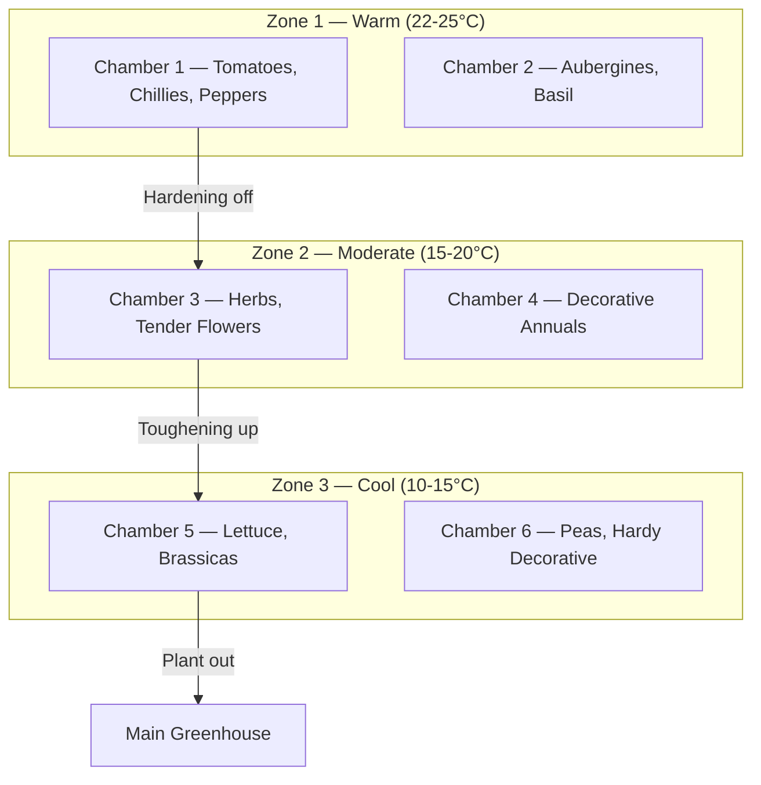
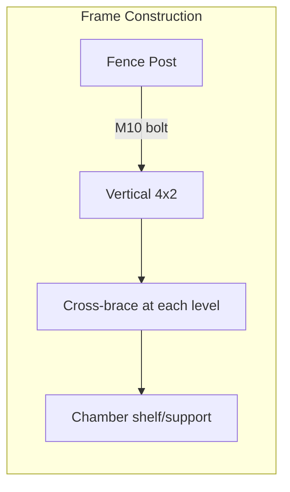
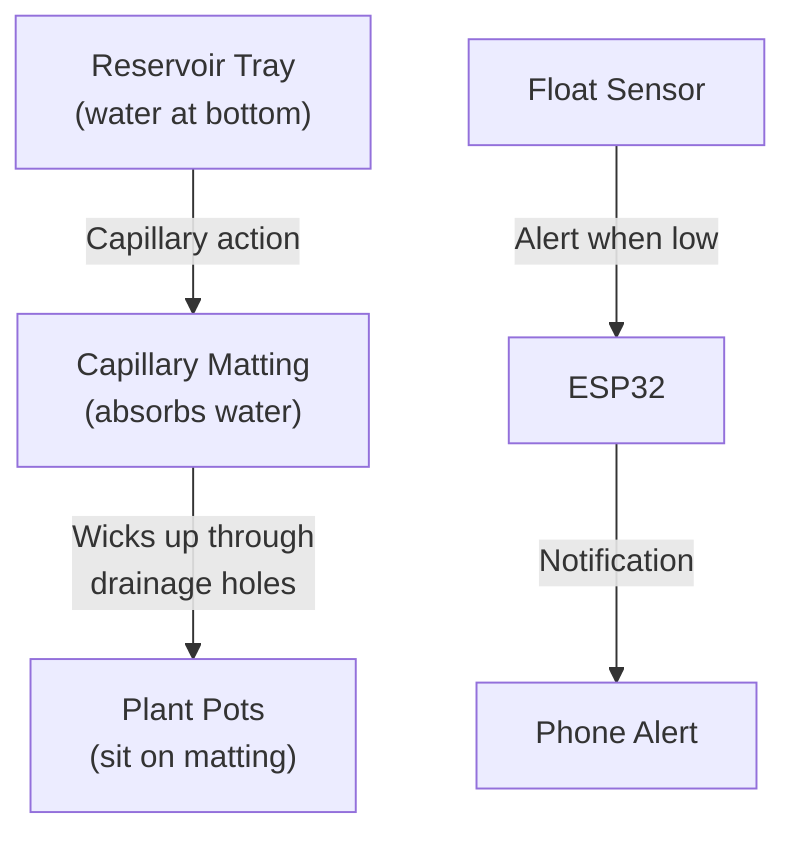
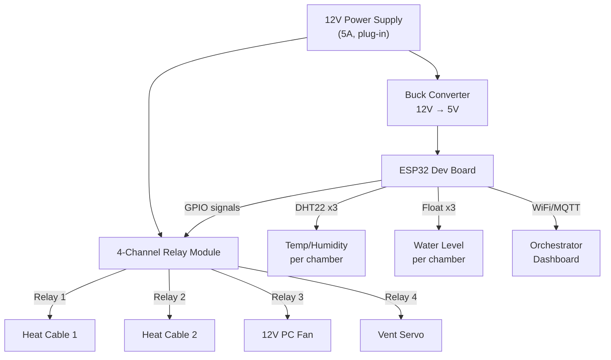

> **TL;DR**: A detailed build plan for a modular, vertically-stacked seedling nursery with ESP32 climate control, capillary watering, and 12V off-grid-ready power — designed to be built in phases starting from just £124.

## Quick Summary

- **Purpose**: Seedling nursery + space-efficient vertical growing, outdoors, fully exposed
- **Design**: Wall of 8+ chambers stacked 3-4 high, multiple columns side by side
- **Climate**: 3 zones — warm (top), moderate (middle), cool (bottom)
- **Power**: 12V from day one, battery + solar phased in later
- **Budget**: ~£124 for a 2-3 chamber prototype, ~£300 total for full build
- **Timeline**: Operational this season (spring/summer 2026)

## Design Overview

The system is a **wall of chambers** — multiple short stacks (3-4 high) fixed to fence posts, each stack forming a temperature zone. Seedlings start in the warm top chambers and graduate to the cooler bottom chambers for hardening off, before eventually moving to the main greenhouse.



### Key Design Decisions

| Decision | Choice | Reasoning |
|----------|--------|-----------|
| Materials | Wood frame + double polythene | Cheapest option with decent insulation; polycarbonate upgrade path |
| Heating | 12V heat mats + frost heater | Root temperature matters most; mats directly warm soil |
| Ventilation | Per-column 12V PC fans | One fan per stack, shared airflow, fewer ESP32s needed |
| Watering | Capillary matting + reservoir | Zero moving parts, plants self-regulate, cheap |
| Vents | Wax auto-vents + ESP32 servo | Wax as fail-safe (no power needed), servo for smart control |
| Power | 12V from day one | Battery + solar ready with zero rewiring later |

---

## Materials & Components

### Prototype Build (2-3 Chambers, 1 Zone)

#### Structural

| Item | Qty | Cost (£) | Notes |
|------|-----|----------|-------|
| 4x2 pressure-treated timber | 3m | 15 | Frame + cross-bracing |
| OS board or plywood (9mm) | 1 sheet | 10 | Chamber walls |
| Polythene (horticultural grade) | 5m roll | 10 | Double-layer covering |
| Screws (various) | 1 box | 4 | 50mm + 30mm |
| Corner brackets | 12 | 3 | Reinforce chamber corners |
| Hinges (zinc) | 3 pairs | 3 | Front access doors |
| Foam insulation board | 1 sheet | 8 | Celotex/Kingspan offcuts, back + base |
| Weatherstrip (self-adhesive rubber) | 5m | 4 | Door seals |
| Sliding vent covers (plastic) | 6 | 2 | 60mm port covers between chambers |

#### Heating & Ventilation

| Item | Qty | Cost (£) | Notes |
|------|-----|----------|-------|
| 12V reptile heat cable | 2 | 10 | Under trays in top chambers |
| 12V PC fan (120mm) | 1 | 5 | Column ventilation |
| Servo motor (SG90) | 1 | 3 | Primary vent control |
| Wax auto-vent | 1 | 5 | Fail-safe, opens at ~20°C |
| 4-channel relay module | 1 | 3 | Control heaters + fan |

#### Watering

| Item | Qty | Cost (£) | Notes |
|------|-----|----------|-------|
| Capillary matting | 2m | 4 | Plants sit on this |
| Plastic reservoir trays | 3 | 6 | Any waterproof tray works |
| Float sensors (water level) | 3 | 3 | Alert when reservoir low |
| Silicone tubing + connectors | 1 pack | 3 | Fill lines |

#### Electronics

| Item | Qty | Cost (£) | Notes |
|------|-----|----------|-------|
| ESP32 WROOM dev board | 1 | 4 | Zone controller |
| DHT22 temperature/humidity sensor | 3 | 6 | One per chamber |
| Buck converter (12V→5V) | 1 | 1 | Power the ESP32 |
| 12V power supply (5A) | 1 | 10 | Plug-in, battery-ready later |
| Junction box + wiring | 1 lot | 5 | Marine/automotive grade |
| Waterproof cable glands | 6 | 2 | Where cables enter chambers |
| **Prototype Total** | | **~£124** | |

### Full Build Expansion (Additional 5-6 Chambers, 2 More Zones)

| Item | Cost (£) | Notes |
|------|----------|-------|
| Additional timber + polythene | 50 | 5-6 more chambers |
| 2x ESP32 + sensors + relays | 30 | Zones 2 and 3 |
| Heat cables (4) + frost heater | 25 | Remaining warm chambers |
| 2x fans + 2x servos + 2x wax vents | 20 | Ventilation for new columns |
| Additional matting, trays, float sensors | 20 | Watering for new chambers |
| Insulation (remaining chambers) | 12 | Foam board |
| Water butt (100L) + guttering | 20 | Rainwater collection |
| Float valve + fittings | 5 | Auto-top-up from butt |
| **Expansion Total** | **~£177** | |

### Grand Total: ~£301 (lean) | ~£500 (quality upgrades)

<details>
<summary>Where to Save vs Where to Invest</summary>

**Invest in quality:**
- **Timber** — the frame must survive outdoors; pressure-treated is non-negotiable
- **ESP32/sensors** — DHT22 over DHT11; reliability matters for climate control
- **Insulation** — better insulation = less heating = lower running costs
- **Power supply** — a decent 12V supply won't overheat or fail

**Save money on:**
- **Reservoir trays** — any waterproof container works (old baking trays, plastic boxes)
- **Float sensors** — basic mechanical switches are fine
- **Fixings** — standard zinc-plated screws, not stainless
- **Polythene** — horticultural grade is fine; no need for commercial greenhouse film
- **Servo motors** — SG90 (~£3) works fine for vent flaps

</details>

---

## Build Phase 1: Frame & Structure

### Step 1: Fence Post Assessment

1. Check your fence posts are solid — dig around the base if unsure
2. Posts should be at minimum 75mm x 75mm, concreted in
3. Mark post positions where the frame will attach
4. **Critical**: Attach to fence posts, NOT fence panels — panels blow out in wind

### Step 2: Build the Support Frame

1. Cut 4x2 timber to create a vertical frame for each column
2. Frame dimensions: width matches your chambers (e.g., 60cm), depth ~40cm
3. Add horizontal cross-bracing at each chamber level
4. Bolt frame to fence posts using M10 bolts + large washers
5. Add storm hooks at the top for extra security in high winds



### Step 3: Build the Chambers

Each chamber is a simple box with:

- **Back**: Foam insulation board (Celotex/Kingspan) glued to OS board
- **Base**: Insulated OS board — this is where the reservoir tray sits
- **Sides**: OS board frame with double-layer polythene panels
- **Front**: Hinged door with polythene panel + weatherstrip seal
- **Top/Bottom**: OS board with 60mm ventilation ports (holes) between chambers

**Chamber dimensions** (adjust to your needs):
- **Small** (top): 50cm wide x 35cm deep x 30cm tall — seed trays
- **Medium** (mid): 60cm wide x 40cm deep x 35cm tall — mixed pots
- **Large** (bottom): 70cm wide x 45cm deep x 35cm tall — larger plants

### Step 4: Double Polythene Layer

The double-layer technique creates an **air gap** that significantly improves insulation:

1. Stretch first layer of polythene tight across the frame
2. Add thin timber battens (12mm) around the edges
3. Stretch second layer over the battens
4. Staple and trim — the 12mm air gap acts as insulation

### Step 5: Mount Chambers on Frame

1. Slide or lift chambers onto the shelf supports
2. Align ventilation ports between chambers in the same column
3. Add sliding covers to the ports (open for shared airflow, closed for isolation)
4. Seal door edges with self-adhesive weatherstrip

---

## Build Phase 2: Watering System

### Capillary Watering — How It Works



1. **Reservoir tray** sits at the base of each chamber
2. **Capillary matting** sits in the reservoir, hanging into the water
3. **Plant pots** sit on the matting with their drainage holes in contact
4. Water is drawn up by capillary action — plants take exactly what they need
5. **Float sensor** in each reservoir triggers an alert when water is low

### Assembly

1. Place reservoir tray at the base of each chamber
2. Cut capillary matting to fit the tray, with a "tail" that hangs into the water
3. Place seed trays or plant pots on top of the matting
4. Route float sensor wires through cable glands to the ESP32
5. Add a fill tube from outside the chamber to the reservoir for easy refilling

### Future: Rainwater Collection

- Small gutter along the top of the chamber wall catches rain
- Pipes down to a 100L water butt
- Gravity feed from butt to reservoirs via silicone tubing
- Float valve in each reservoir for automatic top-up
- Manual fill as backup

---

## Build Phase 3: Climate Control Electronics

### Wiring Diagram — Single Zone (Prototype)



### ESP32 Pin Allocation (Single Zone)

| Component | ESP32 Pin | Type | Notes |
|-----------|-----------|------|-------|
| DHT22 — Chamber 1 | GPIO 4 | Digital | Warm zone (top) |
| DHT22 — Chamber 2 | GPIO 5 | Digital | Warm zone (mid) |
| DHT22 — Chamber 3 | GPIO 18 | Digital | Warm zone (bottom) |
| Float sensor — Ch 1 | GPIO 19 | Digital | LOW = empty |
| Float sensor — Ch 2 | GPIO 21 | Digital | |
| Float sensor — Ch 3 | GPIO 22 | Digital | |
| Relay 1 (heat cable) | GPIO 23 | Digital | |
| Relay 2 (frost heater) | GPIO 25 | Digital | |
| Relay 3 (fan) | GPIO 26 | Digital | PWM capable |
| Relay 4 (vent servo) | GPIO 27 | Digital | |
| Status LED | GPIO 2 | Digital | Built-in |

### Software Logic

The ESP32 runs a simple state machine:

```
LOOP every 30 seconds:
  1. Read all DHT22 sensors
  2. Read all float sensors
  3. Check zone temperature:
     - If TEMP < TARGET - 2°C → turn ON heat cable
     - If TEMP > TARGET + 2°C → turn ON fan + open vent
     - If TEMP in range → turn OFF heating, idle fan
  4. If any float sensor = LOW → send water alert
  5. Publish readings to MQTT / orchestrator
  6. Check for remote commands (override vent, fan speed, etc.)
```

<details>
<summary>ESP32 Code Structure</summary>

```cpp
// Main includes
#include <WiFi.h>
#include <PubSubClient.h>
#include <DHT.h>

// Pin definitions (see table above)
#define DHT_PIN_1 4
#define DHT_PIN_2 5
#define DHT_PIN_3 18
#define FLOAT_PIN_1 19
#define FLOAT_PIN_2 21
#define FLOAT_PIN_3 22
#define RELAY_HEAT 23
#define RELAY_FROST 25
#define RELAY_FAN 26
#define RELAY_VENT 27

// Zone config
const float TARGET_TEMP = 22.0;  // Warm zone
const float HYSTERESIS = 2.0;

DHT dht1(DHT_PIN_1, DHT22);
DHT dht2(DHT_PIN_2, DHT22);
DHT dht3(DHT_PIN_3, DHT22);

void loop() {
  float t1 = dht1.readTemperature();
  float t2 = dht2.readTemperature();
  float t3 = dht3.readTemperature();
  
  float avgTemp = (t1 + t2 + t3) / 3.0;
  
  // Heating control
  if (avgTemp < TARGET_TEMP - HYSTERESIS) {
    digitalWrite(RELAY_HEAT, HIGH);
  } else if (avgTemp > TARGET_TEMP) {
    digitalWrite(RELAY_HEAT, LOW);
  }
  
  // Ventilation control
  if (avgTemp > TARGET_TEMP + HYSTERESIS) {
    digitalWrite(RELAY_FAN, HIGH);
    digitalWrite(RELAY_VENT, HIGH);
  } else if (avgTemp < TARGET_TEMP) {
    digitalWrite(RELAY_FAN, LOW);
    digitalWrite(RELAY_VENT, LOW);
  }
  
  // Water level alerts
  checkWaterLevels();
  
  // Publish to MQTT
  publishReadings(t1, t2, t3);
  
  delay(30000);  // 30 second loop
}
```

</details>

### Waterproofing the Electronics

1. **ESP32 + relays** in a waterproof junction box (IP65+)
2. Mount the box on the fence behind the chambers (sheltered)
3. Use **cable glands** for every wire entry point
4. Coat all connections with **silicone sealant** or dielectric grease
5. Keep the junction box accessible but protected from direct rain
6. Route all wires along the frame, secured with cable clips

---

## Build Phase 4: Ventilation & Insulation

### Ventilation Ports Between Chambers

1. Cut 60mm circular holes in the top/bottom panels between chambers in the same column
2. Add a simple sliding cover (piece of plastic/ply) that can open or close the port
3. When open: column fan pulls air through all chambers (shared ventilation)
4. When closed: chambers are isolated (individual temperature control)

### Vent System (Per Column)

1. **Primary**: ESP32-controlled servo opens a vent flap at the top of the column
2. **Backup**: Wax cylinder auto-vent (no power needed) — opens at ~20°C automatically
3. **Fan**: 120mm 12V PC fan at the top of the column, pulls air upward through chambers
4. **Passive**: Bottom chamber has adjustable inlet vents (manual)

### Insulation Strategy

| Location | Material | Why |
|----------|----------|-----|
| Back wall | 25mm foam board (Celotex) | Faces fence — no light needed |
| Chamber base | 25mm foam board | Prevents heat loss downward |
| Chamber top/bottom | OS board (structural) | Ports between chambers |
| Sides + front | Double polythene (air gap) | Lets light in, insulates |

---

## Build Phase 5: Commissioning & Testing

### Pre-Power Checklist

- [ ] All chambers mounted securely on frame
- [ ] Frame bolted to fence posts (not panels)
- [ ] Weatherstrip seals on all doors
- [ ] Ventilation ports aligned between chambers
- [ ] Capillary matting + reservoirs in place
- [ ] Float sensors installed and wired
- [ ] DHT22 sensors mounted inside each chamber (middle of chamber, not direct sun)
- [ ] Heat cables positioned under trays (not in direct water contact)
- [ ] All wiring through cable glands
- [ ] Junction box sealed

### Power-Up Sequence

1. Connect 12V power supply — check voltage at each point with multimeter
2. Power ESP32 via buck converter — verify 5V output
3. Test each relay channel individually (listen for click)
4. Test heat cables — confirm they warm up
5. Test fan — confirm airflow direction (pulling UP through column)
6. Test servo vent — confirm it opens and closes
7. Test wax auto-vent — warm with a hairdryer, confirm it opens
8. Test float sensors — dip in water, confirm reading changes
9. Test DHT22 sensors — breathe on them, confirm humidity/temperature changes
10. Connect to WiFi and verify MQTT/orchestrator connection

### Calibration

1. Set target temperatures per zone:
   - Zone 1 (warm): 22°C day / 18°C night
   - Zone 2 (moderate): 18°C day / 14°C night
   - Zone 3 (cool): 14°C day / 8°C night
2. Monitor for 24 hours before adding plants
3. Check for cold spots — move sensors if readings are inconsistent
4. Verify reservoirs last at least 2-3 days between fills

---

## Future Phases

<details>
<summary>Phase 6: Full Build Expansion</summary>

Expand from prototype to full 8+ chamber wall:

1. Build 2 more column frames
2. Add 5-6 more chambers
3. Install 2 more ESP32s (zones 2 and 3)
4. Add heat cables and frost heater for remaining warm chambers
5. Install fans and vent systems for new columns
6. Connect all zones to orchestrator dashboard
7. Test each zone independently, then test shared operation

</details>

<details>
<summary>Phase 7: Off-Grid Power</summary>

Transition from plug-in to battery + solar:

1. **Battery**: 100Ah lead-acid battery (~£50-80) — gives ~50Ah usable
2. **Solar**: 100W solar panel (~£50-80) + charge controller (~£15)
3. **Power budget**: Heat cables are the biggest drain (~1-2A each when on)
4. Estimate: 6 heat cables running overnight = ~8-10 hours of heat = ~60-80Ah
5. May need 2 batteries for reliable winter operation, or accept daily recharging
6. Solar panel replaces mains supply during daylight; battery covers nights

**Future upgrade path**: Swap lead-acid for LiFePO4 (£150-250) for 5-10x longer lifespan

</details>

<details>
<summary>Phase 8: LED Grow Lights</summary>

Add supplemental lighting for early-season starting:

1. Use 12V LED grow light strips (~£10-15 per chamber)
2. Controlled by the same ESP32 relay board
3. Timer-based: 14-16 hours of light per day for seedlings
4. Only needed January-March when daylight is short
5. Adds ~1A per light strip to power budget

</details>

---

## Parts Shopping List

### Immediate (Prototype)

- [ ] 3m 4x2 pressure-treated timber — ~£15
- [ ] 1 sheet 9mm OS board — ~£10
- [ ] 5m horticultural polythene roll — ~£10
- [ ] Box of screws (30mm + 50mm) — ~£4
- [ ] 12 corner brackets — ~£3
- [ ] 3 pairs hinges — ~£3
- [ ] 1 sheet 25mm foam insulation board — ~£8
- [ ] 5m self-adhesive weatherstrip — ~£4
- [ ] 2x 12V reptile heat cables — ~£10
- [ ] 1x 120mm 12V PC fan — ~£5
- [ ] 1x SG90 servo motor — ~£3
- [ ] 1x wax greenhouse auto-vent — ~£5
- [ ] 1x 4-channel relay module — ~£3
- [ ] 2m capillary matting — ~£4
- [ ] 3x plastic reservoir trays — ~£6
- [ ] 3x float sensors — ~£3
- [ ] Silicone tubing + connectors — ~£3
- [ ] 1x ESP32 WROOM dev board — ~£4
- [ ] 3x DHT22 sensors — ~£6
- [ ] 1x buck converter (12V→5V) — ~£1
- [ ] 1x 12V 5A power supply — ~£10
- [ ] Waterproof junction box — ~£3
- [ ] Wiring + cable clips + cable glands — ~£5

### Later (Expansion)

- [ ] Additional timber + polythene for 5-6 more chambers — ~£50
- [ ] 2x ESP32 + 6x DHT22 + 2x relay modules — ~£30
- [ ] 4x heat cables + 1x frost heater — ~£25
- [ ] 2x PC fans + 2x servos + 2x wax vents — ~£20
- [ ] Additional matting, trays, float sensors — ~£20
- [ ] Insulation board for remaining chambers — ~£12
- [ ] 100L water butt + guttering — ~£20
- [ ] Float valve + fittings — ~£5

### Future (Off-Grid)

- [ ] 100Ah lead-acid battery — ~£50-80
- [ ] 100W solar panel — ~£50-80
- [ ] Solar charge controller — ~£15

---

## Growing Guide: What Goes Where

| Zone | Chambers | Temperature | Plants | Notes |
|------|----------|-------------|--------|-------|
| **1 — Warm (top)** | 2-3 | 22-25°C | Tomatoes, chillies, peppers, aubergines, basil | Heat mats on, warm germination |
| **2 — Moderate (mid)** | 2-3 | 15-20°C | Herbs (coriander, parsley), tender annuals, decorative flowers | No heat mats, ambient warmth from below |
| **3 — Cool (bottom)** | 2-3 | 10-15°C | Lettuce, brassicas (cabbage, broccoli), peas, sweet peas, hardy decorative | Hardening off zone, minimal heating |

**Workflow**: Sow seeds in Zone 1 → Germinate and grow first true leaves → Move to Zone 2 to harden → Move to Zone 3 for final hardening off → Plant out in main greenhouse or garden

---

## Key Principles

1. **Design for 12V** — everything runs on 12V from day one, battery + solar ready
2. **Low-tech where it works** — capillary watering, wax vents, no over-engineering
3. **Smart where it adds value** — ESP32 for temperature control, alerts, monitoring
4. **Heat rises** — warm chambers on top, cool on bottom, natural temperature gradient
5. **Prototype first** — prove the concept with 2-3 chambers before building the full wall
6. **Expand incrementally** — add chambers, zones, and features as budget allows
7. **Manual feeding** — no automation needed; use orchestrator for reminders
8. **Modularity** — each chamber removable for maintenance or replanting

**Tags**: greenhouse, diy, esp32, gardening, seedling-nursery, climate-control, sustainable
**Categories**: Projects, DIY, Gardening