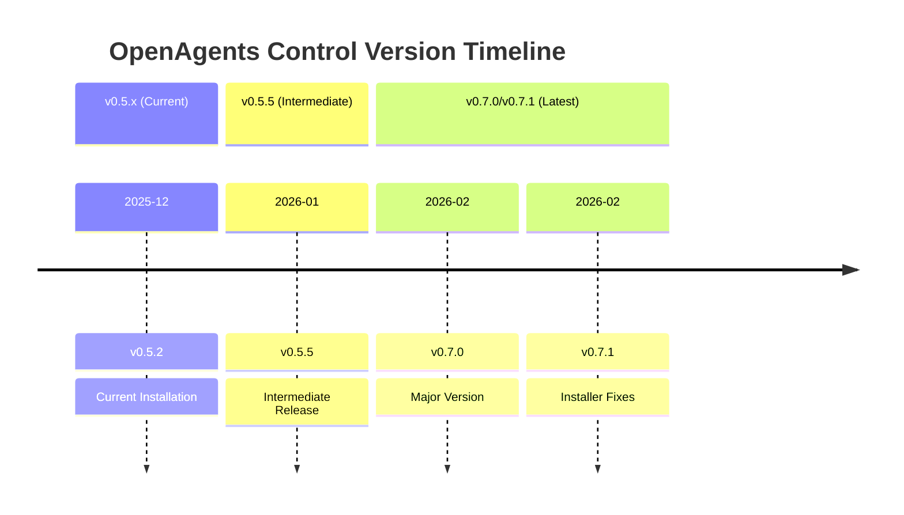

## Overview

I just checked my OpenAgents Control installation and discovered I'm running **v0.5.2** while the latest version is **v0.7.1** — that's **31 commits behind** on the primary repo and **34 on the secondary clone**. This post documents what I found during the analysis and the implications for my setup.

## Current Installation Status

**Installed Versions**:
- `[project directory]` → v0.5.2 (31 commits behind)
- `[project directory]` → v0.5.1 (34 commits behind)

**Latest Available**: v0.7.1 (tagged on GitHub)

**Commits Since v0.5.2**:
- Installer failures resolved (#189)
- Comprehensive context system audit and restructuring (#150)
- Agent naming standardized (TestEngineer, removed duplicates) (#178)
- Context path corrections with validation gates (#183)
- ESLint compatibility improvements (#176)
- YAML errors fixed with permissions restored (#167)
- ContextScout global fallback for core files (#186)

## What's New in v0.7.0/v0.7.1



### Key Improvements

| Feature | v0.5.2 | v0.7.1 | Benefit |
|---------|--------|--------|---------|
| **Agent Count** | 8 main agents | 8 main agents | Stable, but internals restructured |
| **Subagents** | 10 subagents | 19 subagents | +9 new specialized subagents |
| **Commands** | 9 commands | 17 commands | +8 new command infrastructure |
| **Context Files** | ~160 contexts | 191 contexts | +31 new organizational contexts |
| **Skills** | 2 skills | 4 skills | +2 new (context7, external management) |
| **Validation** | Basic checks | Comprehensive (#189) | Better installer reliability |
| **Context Paths** | Manual resolution | Auto-fallback (ContextScout #186) | Smarter context discovery |

### New Components Shipping with v0.7.1

- **TestEngineer subagent** (renamed from "Tester")
- **ExternalScout** agent for discovering external libraries
- **9 new system-builder subagents** (context-organizer, agent-generator, workflow-designer, domain-analyzer, command-creator)
- **4 new context skills** with advanced discovery mechanisms

---

## Breaking Changes - HIGH RISK

### 1. Agent Deletions

Your current installation includes specialist agents that are **completely removed** in v0.7.1:

```yaml
DELETED Agents:
  - backend-specialist.md
  - frontend-specialist.md
  - devops-specialist.md
  - codebase-agent.md
  - codebase-pattern-analyst.md
```

**Impact**: If any workflows delegate to these agents, they'll fail after upgrade. The system doesn't provide replacements — these capabilities are now expected to be handled by other agent combinations.

### 2. Tester → TestEngineer Rename

```
BEFORE: ~/.opencode/agent/subagents/code/tester.md
AFTER:  ~/.opencode/agent/subagents/code/test-engineer.md
```

**Impact**: Any hardcoded references to `tester` agent will break. The internal `openagent` and `opencoder` agents likely delegate to this, so the impact flows through all test-related workflows.

### 3. Massive Context Restructuring

The installer will:
- **Add**: 123 new context files (new navigation templates, config files)
- **Modify**: 58 existing context files (path updates, content reorganization)
- **Delete**: 32 context files (old development guides, deprecated workflows)

**Key Deletions**:
- `context/development/api-design.md`
- `context/development/clean-code.md`
- `context/development/design-systems.md`
- `context/core/workflows/design-iteration.md`
- `context/core/workflows/task-delegation.md`

These are replaced with more granular, category-based contexts.

### 4. Permission Schema Changes

Agent YAML frontmatter was overhauled for consistency (#156, #167). The permission system was restructured to use a different key schema. Your current agents won't automatically translate to the new permission model.

---

## Risk Matrix - My Exposure

| Risk Area | Level | My Situation |
|-----------|-------|--------------|
| Agent deletions | **HIGH** | Unknown if I use these 4+ specialists in workflows |
| Tester rename | **HIGH** | Likely breaks test delegation chains |
| Context restructuring | **MEDIUM-HIGH** | 213 files changed; some paths will be invalid |
| Permission schema | **MEDIUM** | Agents need reconfiguration |
| Installer overwrite | **MEDIUM** | May leave orphaned old files |
| Custom skills safety | **LOW** | 50+ custom skills are unaffected ✅ |

---

## My Custom Skills Inventory

One of the biggest mitigations: I have **50 custom skills** in `~/.opencode/skill/` that are **not managed by OpenAgents Control**. These won't be touched by any update:

```
Custom Skills (SAFE from upgrade):
├── hugo                  # Blog post creation & validation
├── news                  # News aggregation & digestion
├── flow                  # Execution flow analysis
├── research              # Deep research methodology
├── memos                 # Memo/todo management
├── telegram              # Telegram bot integration
├── nginx                 # Nginx proxy management
├── fabric                # AI pattern framework
├── databases             # Database management
├── maintenance           # System maintenance
├── git-backup-strategy   # Git backup automation
├── presentation          # Slide deck creation
├── skill-catalogue       # Skill discovery & management
├── menu-manager          # Interactive menu system
├── opentelemetry         # Telemetry integration
├── beautiful-mermaid     # Mermaid diagram enhancements
├── astro                 # Astro static site generation
├── chartjs               # Chart visualization
├── skill-pattern-discoverer
├── task-management       # (Also in repo, but my version is customized)
│
└── 30+ more...
```

**Why This Matters**: Even if the OpenAgents Control update breaks something, my entire custom skill ecosystem remains intact. I could theoretically revert to v0.5.2 without losing access to `hugo`, `research`, `memos`, `telegram`, or any other custom tools.

---

## The Dual-Repo Situation

I have two local clones that are technically redundant:

```
[project directory]
  └─ Remote: github.com/darrenhinde/OpenAgentsControl.git
  └─ Branch: main → bf02ad0 (v0.5.2)

[project directory]
  └─ Remote: github.com/darrenhinde/OpenAgents.git
  └─ Branch: main → 7590a7a (v0.5.1)
```

Both remotes actually resolve to the same upstream repository (the project was renamed from `OpenAgents` → `OpenAgentsControl`). This creates:
- **Duplicate clones** of the same project
- **Confusion about which is "current"**
- **Potential for divergent local edits**

**Action Item**: Consolidate to a single directory after upgrading.

---

## Update Strategy Recommendations

### Option A: Conservative (Recommended for my setup)
1. **Backup** `~/.opencode/` to `[file in resources]$(date +%s).tar.gz`
2. **Update repos** from v0.5.2 → v0.7.1 (`git pull --ff-only`)
3. **Manually inspect** deleted agents to confirm I don't use them
4. **Run installer** with `--profile full` to sync everything
5. **Test** key workflows (`openagent`, `opencoder`, test suite)
6. **Roll back** if critical breakage

**Advantages**:
- Full control over what gets overwritten
- Ability to rescue deleted agents if needed
- Time to test before committing

### Option B: Full Reinstall
```bash
cd [project directory]
git pull
bash -s full < install.sh
```

**Advantages**:
- Clean slate
- All new components integrated properly

**Disadvantages**:
- Loses any local customizations to agents/contexts
- No safety net if something breaks

### Option C: Defer Until v0.8.0
Wait for the next version bump to let bugs shake out of v0.7.1.

**Advantages**:
- Lower risk
- More documentation available

**Disadvantages**:
- Miss security fixes and reliability improvements
- Installer keeps failing on v0.5.2

---

## My Decision Framework

I'll **proceed with Option A** (conservative update) because:

1. ✅ **50+ custom skills are safe** — worst case I revert and only lose OpenAgents Control features
2. ⚠️ **Critical breaking changes are documented** — I can plan around agent deletions
3. 🎯 **Installer was broken in v0.5.2** (#189 fixes this) — worth updating for stability
4. 🔄 **Dual-repo redundancy** — good time to clean this up during the merge

**Next Steps**:
1. Backup current `~/.opencode/` 
2. Update both local repos to v0.7.1
3. Consolidate to single directory
4. Manually verify the 4 deleted specialist agents aren't in my active workflows
5. Run installer with full profile
6. Run test suite to catch regressions
7. Document any agents that needed manual intervention

---

## Key Takeaways

| Insight | Implication |
|---------|------------|
| **v0.7.1 removes 4+ specialist agents** | Must verify I don't depend on them |
| **Tester → TestEngineer rename is breaking** | Workflows need updating |
| **Context restructuring is comprehensive** | Expect some path resolution issues |
| **My 50+ custom skills are untouched** | Safe rollback option available |
| **Installer in v0.7.1 is more robust** | Worth upgrading for reliability |
| **Dual-repo setup is redundant** | Consolidate after upgrade |

The upgrade is **worth doing**, but requires **careful planning** around the breaking changes. My custom skill ecosystem provides a safety net if something goes wrong.

---

## References

- **Repository**: https://github.com/darrenhinde/OpenAgentsControl
- **Latest Release**: v0.7.1
- **Current Installation**: v0.5.2 (31 commits behind)
- **Backup Location**: `~/.opencode/` → `[file in resources][timestamp].tar.gz`