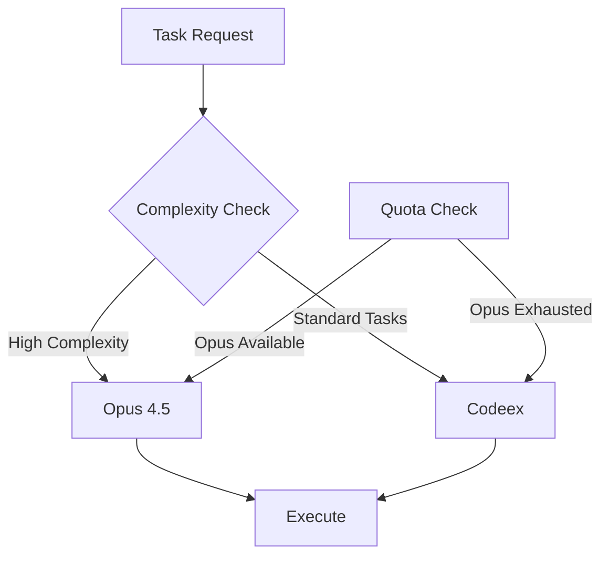

Tech With Tim walks through his professional OpenClaw AI agent setup, demonstrating how to deploy autonomous AI agents securely while avoiding the common security vulnerabilities found in most online tutorials. His system automates accounting, YouTube research, and development tasks through a 24/7 operation model that balances powerful capabilities with predictable costs.

## The Security Problem: Most OpenClaw Setups Are Dangerous

The video opens with a critical warning: **most online OpenClaw tutorials are fundamentally insecure**. People configure their AI agents on public IP addresses, expose them to the internet, and run them as root users—all of which create massive security vulnerabilities.

Tech With Tim's approach takes security seriously from the ground up:

- **Virtual Private Server**: Hosted on a VPS accessed via SSH
- **Network Isolation**: Configured with Tailscale VPN, allowing traffic only from authorized IP addresses
- **Firewall Protection**: Full blocking firewall that rejects all traffic except from his specific computer
- **Localhost Binding**: OpenClaw runs on localhost only, never exposed to public IPs
- **Non-Root User**: Operates under a separate "TIM" user account with isolated permissions

The result? The server doesn't appear in network scans, can't be pinged, and can't be SSH'd into externally. This defense-in-depth approach is critical when deploying AI agents that can execute code, send emails, and interact with APIs.

## Cost Crisis: Why Frontier Models Break the Bank

One of the biggest challenges when running AI agents continuously is cost. Tech With Tim connected his system to Opus 4.5 initially and discovered a shocking reality: **in just a few minutes, he had already burned through dollars of API credits**. Projecting that burn rate to continuous 24/7 operation would cost thousands per month.

The solution lies in rethinking how you access AI models. Instead of pay-per-API usage, he switched to **subscription-based models**:

- **ChatGPT Pro**: $200/month for practically unlimited Codeex usage
- **Claude Pro**: $20/month for Opus 4.5 access when needed
- **Cost Reduction**: Codeex is 99% cheaper than API usage while maintaining 99% of capability

### Dual-Model Strategy for Power Users

The real innovation is how he balances power with cost:

**Primary Model**: Codeex handles 99% of tasks—coding, development, routine reasoning. It's excellent at code writing and capable enough for most development work.

**Fallback Model**: Opus 4.5 kicks in only for complex planning tasks that require advanced reasoning. When the Claude subscription quota runs out, the system automatically falls back to Codeex.

The result? Running OpenClaw 24/7 with constant sub-agents, heartbeat monitoring, and parallel task processing—and still not hitting weekly or daily usage limits. The predictable subscription cost makes continuous operation economically viable.

## Communication Platform: Why Telegram Over WhatsApp?

Every AI agent needs a way to interact with its owner. Tech With Tim chose **Telegram** over more popular options like WhatsApp, and the reasoning reveals a security-conscious mindset:

- **Separation of Identity**: Telegram is an app he doesn't use personally, unlike WhatsApp which contains his phone number and contacts
- **Lower Risk**: If the Telegram account were compromised, the damage is contained—no access to personal messages, two-factor codes, or identity information
- **No Critical Data**: The platform doesn't receive authentication codes or sensitive personal information

This approach treats the communication channel as a dedicated tool interface, not a personal messaging platform.

## Secure Integration Strategy: The Trusted Email Pipeline

Connecting AI agents to personal accounts like Gmail, calendars, and banking systems is where most security failures happen. Tech With Tim's solution uses a **trusted-source filtering pipeline**:

1. **Dedicated Google Account**: Created a separate Google account exclusively for OpenClaw
2. **Full Service Access**: Gave the bot access to Gmail, Drive, Calendar, and Sheets on this secondary account
3. **Email Forwarding**: Configured forwarding rules on his main accounts to forward only trusted senders and domains to the secondary account
4. **Blocked Direct Access**: Configured the bot to ignore emails sent directly to its own address—only read forwarded emails

### Preventing Prompt Injection Attacks

This architecture solves the prompt injection problem. When a random attacker sends an email with malicious commands to the bot's address directly, the bot ignores it because it's not from a trusted, forwarded source. Only emails that pass through the trusted-sender filter reach the AI agent, creating a secure automation pipeline.

For API integrations, he applies the same security mindset:

- **Strict API Key Limits**: Every connected API has rate limits and spend caps
- **Immediate Notifications**: Configured alerts for unusual activity
- **Rapid Rotation**: Keys can be rotated or revoked instantly if compromised

## Observability: You Can't Optimize What You Can't See

Before automating a single task, Tech With Tim built a monitoring dashboard called **OpsHub**. This is a crucial pattern: **establish observability first, then automate**.

The dashboard provides:

- **Real-Time Agent Monitoring**: View all active sub-agents, their tasks, and current operations
- **Error Tracking**: Identify failures, bottlenecks, and issues as they happen
- **Session Inspection**: Review past sessions to understand what tools the bot called, what prompts it used, and what actions it took
- **Usage Analytics**: Track token consumption, quota remaining, and estimated costs
- **Live Logs**: See exactly what the agent is doing in real-time

This visibility enabled him to optimize the system, debug issues, and understand the agent's behavior patterns before it became autonomous.

## Real-World Automations: What OpenClaw Actually Does

The creator has been running this setup for about a week, and the practical use cases demonstrate the value of continuous AI operation:

### YouTube Research and Competitive Intelligence

OpenClaw continuously monitors YouTube for outlier videos and competitor channels. The bot:

- Searches for trending content in coding/tech niches similar to Tech With Tim's channel
- Generates daily reports showing high-performing videos with views per hour metrics
- Identifies competitor channels and provides inspiration for content ideas
- Maintains a YouTube operating system to track and star content ideas

This is valuable for content creators who need daily market intelligence but don't have time to manually research competitors.

### Automated Accounting

Perhaps the most practical use case is automated accounting. The system:

- Monitors a dedicated email inbox for receipts, invoices, contracts, and payment confirmations
- Classifies documents by type (expense, income, contract, bank statement)
- Extracts key information and logs it to Google Sheets
- Saves PDFs to Google Drive for record-keeping
- Generates invoices on command and automatically uploads them to the invoice tracking system
- Matches payments to previous invoices, creating complete transaction records

A custom invoice generation skill lets Tech With Tim create invoices with a simple command, and the bot handles the rest—uploading to Drive, updating the tracking sheet, and even attaching payment confirmations to existing invoices.

### Task Management and Parallel Processing

The operational hub includes a full Kanban-style task management system:

- **Task Queue**: A running list of tasks that the bot picks up automatically
- **Kanban Board**: Organized into To Do, In Progress, and Done columns
- **Heartbeat System**: Every 30 minutes, the bot spawns multiple sub-agents
- **Parallel Execution**: Sub-agents pick up tasks from the queue and work simultaneously
- **Activity Logging**: Complete record of every action taken by any sub-agent

This architecture is powerful because it doesn't require constant human interaction. You add 500 tasks to the queue once, and the bot continuously processes them in parallel, maximizing throughput of the subscription plan.

### Development and GitHub Integration

For a software developer, the development workflow automation is particularly valuable:

- **Separate GitHub Account**: Created a dedicated account (Tech with Tim Claudebot) with its own credentials
- **Automatic Code Storage**: All code written by the bot is automatically committed to a repository
- **Organization Integration**: Code is stored in the creator's organization for easy inspection
- **Real-Time Review**: See what code the bot is writing at any moment

This eliminates the manual commit-and-push workflow. The bot codes, tests, and deploys automatically, with full version history available for review.

## The Heartbeat System: Keeping AI Working 24/7

A key innovation in this setup is the **heartbeat system** that ensures the bot is always actively working:

Every 30 minutes, the system triggers and spawns multiple sub-agents. These agents:

1. Check the task queue for pending work
2. Pick up tasks and begin processing
3. Work in parallel to maximize throughput
4. Mark completed tasks and move them to the Done column
5. Log all actions to the activity feed

This design transforms the AI agent from a tool you prompt into an autonomous worker that continuously executes tasks within defined boundaries. It's particularly valuable given the high token quotas from ChatGPT Pro—you want the agent actively using those quotas, not sitting idle.

## Automated Cron Jobs: Scheduled Self-Improvement

The system runs several scheduled tasks via cron jobs:

- **Sponsorship Contact Logging**: Tracks and organizes potential partnership outreach
- **AI Accounting Triage**: Categorizes incoming financial emails and routes them appropriately
- **YouTube Outlier Research**: Continuous monitoring of competitors and market trends
- **Daily Self-Improvement**: Reviews skills backlog, examines available capabilities, and identifies areas for growth

These scheduled tasks demonstrate the self-improving nature of the system. The bot learns the creator's preferences, refines its processes, and gradually takes on more complex responsibilities over time.

## Is It Life-Changing? An Honest Assessment

Tech With Tim provides an honest evaluation of his setup:

**Time Invested**: About 30 hours of initial configuration

**Value Delivered**: Significant time savings on accounting, research, and task management

**Life-Changing?** No—but it's definitely useful

**Most Important Benefit**: The system saves time on repetitive tasks that you wouldn't want to code yourself or manually prompt AI to handle

This assessment is refreshing in its honesty. OpenClaw (and similar AI agents) aren't magical solutions that revolutionize your life overnight. They're tools that, when configured thoughtfully and securely, can automate specific workflows and save time on repetitive tasks.

## Key Takeaways for Professional Developers

Based on this comprehensive walkthrough, here are the critical lessons:

1. **Security Is Non-Negotiable**: Never expose AI agents to public IPs. Use VPNs, firewalls, non-root users, and trusted-source filtering.

2. **Reconsider Cost Models**: For continuous operation, subscription-based models are far more economical than pay-per-API usage. The dual-model strategy balances power with affordability.

3. **Observability First**: Build monitoring dashboards before automating. You cannot optimize what you cannot see.

4. **Treat AI Like an Employee**: Define clear job descriptions, training processes, and performance metrics. Use heartbeat systems and task queues for autonomous operation.

5. **Secure Integrations**: Use separate accounts, email forwarding, and API limits to contain damage if something goes wrong.

6. **Iterative Development**: Start with the monitoring dashboard, then add automations one at a time. Let the system learn your preferences gradually.

7. **Maximize Subscription Value**: If you're paying for high quotas (like ChatGPT Pro), design systems that actively use those tokens through parallel processing and continuous operation.

## Conclusion

Tech With Tim's OpenClaw setup demonstrates how professional developers can deploy autonomous AI agents securely and cost-effectively. The combination of defense-in-depth security, subscription-based model access, comprehensive observability, and practical automations creates a system that runs 24/7 and handles real business tasks.

While not life-changing, the time savings on accounting, research, and development workflows make the ~30 hour configuration investment worthwhile for professionals who want to scale their productivity with AI.

The key is approaching AI agents not as magical assistants but as secure, observable, trainable systems that execute defined workflows within strict boundaries. When done right, they become powerful tools for automation—just not in the way most online tutorials suggest.

---

## Additional Resources

- **Full Transcript**: `[file in resources]`
- **Short Summary**: `[file in resources]`
- **Video Source**: [Watch on YouTube](https://www.youtube.com/watch?v=NO-bOryZoTE)
- **Creator**: [Tech With Tim](https://www.youtube.com/@TechWithTim)