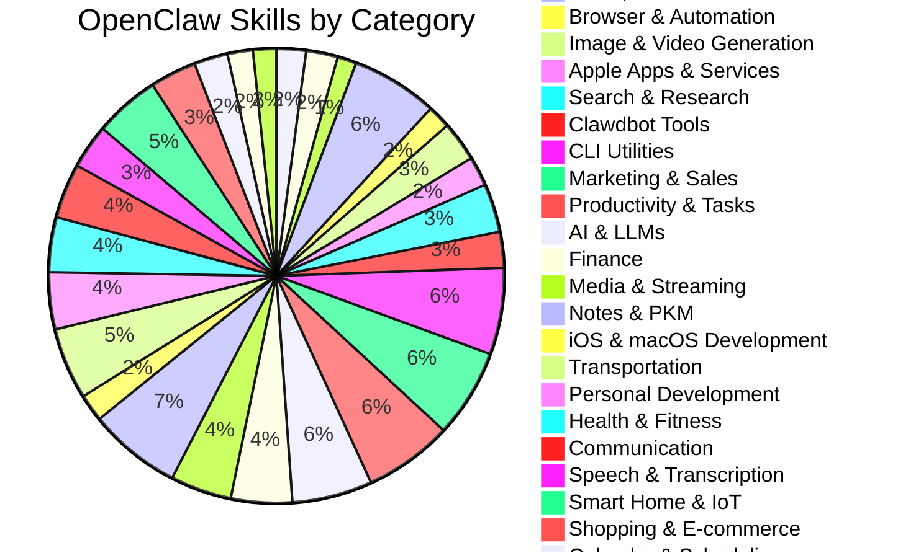

OpenClaw (formerly known as Moltbot, originally Clawdbot) is a locally-running AI assistant that operates directly on your machine. Skills extend its capabilities, allowing it to interact with external services, automate workflows, and perform specialized tasks.

The community has built an impressive collection of over 700 skills, all following the Agent Skill convention developed by Anthropic as an open standard for AI coding assistants.

## Skills Overview

I've extracted and catalogued all skills from the [awesome-openclaw-skills repository](https://github.com/VoltAgent/awesome-openclaw-skills), organizing them into multiple formats for easy reference and programmatic access.

### Statistics

- **Total Skills**: 672
- **Categories**: 28
- **Source**: [VoltAgent/awesome-openclaw-skills](https://github.com/VoltAgent/awesome-openclaw-skills)

## Categories Breakdown

The skills span across diverse domains, from development tools to smart home automation:



## Key Categories

### Development & Infrastructure
- **Web & Frontend Development** (14 skills): Discord, Slack, UI/UX design, React performance
- **Coding Agents & IDEs** (15 skills): OpenCode, Claude Code, Cursor, Factory AI orchestration
- **Git & GitHub** (9 skills): Commit workflows, GitHub operations, PR management
- **DevOps & Cloud** (41 skills): Kubernetes, Docker, cloud providers (Azure, AWS, Hetzner)
- **iOS & macOS Development** (13 skills): Apple documentation, SwiftUI, Instruments profiling

### AI & Automation
- **AI & LLMs** (38 skills): LLM integration, model management, AI workflows
- **Browser & Automation** (11 skills): Playwright, browser testing, web automation
- **Image & Video Generation** (19 skills): ComfyUI, Krea AI, Flux, video generation

### Productivity & Business
- **Marketing & Sales** (42 skills): CRM tools, SEO, email sequences, social media
- **Productivity & Tasks** (42 skills): Task management, documentation, automation
- **Notes & PKM** (44 skills): Personal knowledge management, note-taking systems

### Services & Platforms
- **Apple Apps & Services** (14 skills): macOS integration, Photos, Music, Homebrew
- **Search & Research** (23 skills): Web search APIs, academic research, content aggregation
- **Finance** (29 skills): Banking, accounting, financial tracking
- **Media & Streaming** (29 skills): Music services, streaming platforms

### Tools & Utilities
- **CLI Utilities** (41 skills): System tools, data processing, package tracking
- **Smart Home & IoT** (31 skills): Home automation, IoT device management
- **Shopping & E-commerce** (22 skills): E-commerce platforms, product tracking
- **Communication** (26 skills): Email, messaging, team communication
- **Calendar & Scheduling** (16 skills): Calendar management, scheduling tools

### Specialized Domains
- **Health & Fitness** (26 skills): Workout tracking, health data, fitness automation
- **Personal Development** (27 skills): Learning, habit tracking, self-improvement
- **Speech & Transcription** (21 skills): Audio processing, transcription services
- **PDF & Documents** (12 skills): Document conversion, PDF manipulation
- **Self-Hosted & Automation** (11 skills): Personal server management, automation
- **Security & Passwords** (6 skills): Password management, security tools

## Data Files Available

All extracted skills are available in `/media/docs/clawd/` with multiple formats:

| File | Format | Size | Purpose |
|-------|---------|-------|---------|
| **skills.json** | JSON | 181KB | Programmatic access, API-ready |
| **skills-by-category.md** | Markdown | 133KB | Organized by category with details |
| **skills-simple.md** | Markdown | 115KB | Simple list format |
| **skills-list.txt** | Text | 114KB | Raw extraction list |

## Installation

Skills can be installed via:

### ClawdHub CLI
```bash
npx clawdhub@latest install <skill-slug>
```

### Manual Installation
Copy skill folders to:
- Global: `~/.openclaw/skills/`
- Workspace: `<project>/skills/`

Priority: Workspace > Local > Bundled

## Agent Skill Convention

All these skills follow the [Agent Skill convention](https://github.com/anthropics/anthropic-quickstarts/tree/main/skills), an open standard for AI coding assistants. This standardization ensures:

- Consistent skill structure
- Clear documentation patterns
- Easy discovery and installation
- Cross-platform compatibility

## Notable Skills

### Development Focus
- **opencode-acp-control**: Direct OpenCode control via Agent Client Protocol
- **cursor-agent**: Comprehensive Cursor CLI agent integration
- **perry-workspaces**: Docker workspace management with Claude Code

### AI & Research
- **tavily**: AI-optimized web search for agents
- **perplexity**: Web-grounded search with citations
- **context7**: Documentation search and code context retrieval

### Platform Integrations
- **supabase**: Database operations and vector search
- **dokploy**: Deployment platform management
- **tailscale**: Tailnet management via CLI and API

## Community Impact

The rapid growth from initial releases to 700+ skills demonstrates:

- **Active community engagement**: 28 distinct skill categories
- **Broad applicability**: From CLI tools to full-stack development
- **Open collaboration**: Skills following standardized conventions
- **Continuous improvement**: Regular updates and new skill additions

## Future Potential

The skills ecosystem continues to expand with:

- New platform integrations
- Enhanced AI capabilities
- More specialized domain knowledge
- Better documentation and tooling

## Resources

- [OpenClaw](https://clawdhub.com) - Public skills registry
- [awesome-openclaw-skills](https://github.com/VoltAgent/awesome-openclaw-skills) - Source repository
- [Agent Skill Convention](https://github.com/anthropics/anthropic-quickstarts/tree/main/skills) - Official standard

---

*All skills data extracted and catalogued on February 1, 2026. Source repository is actively maintained and updated.*