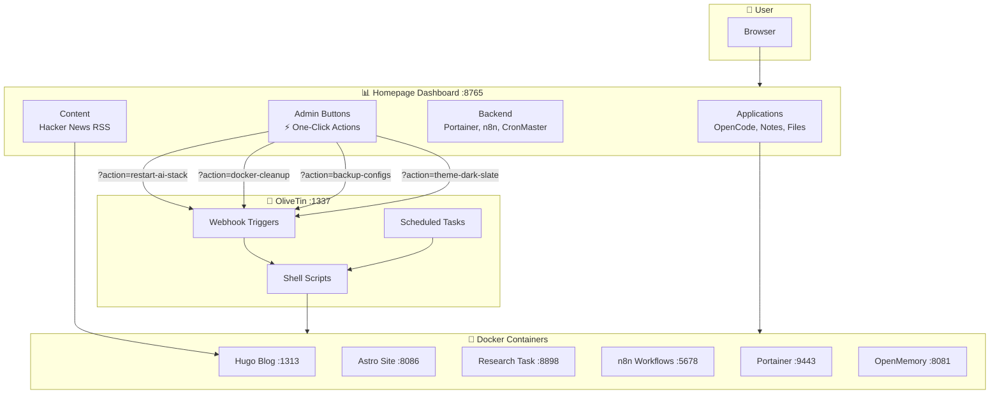
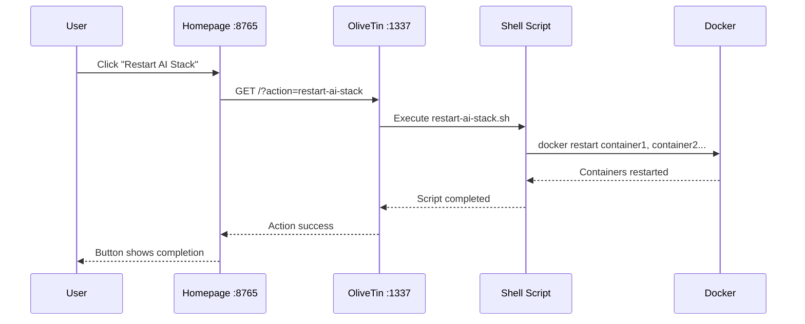
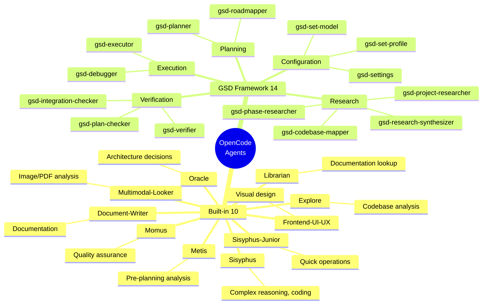
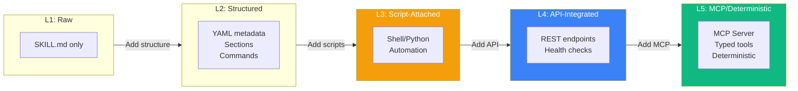
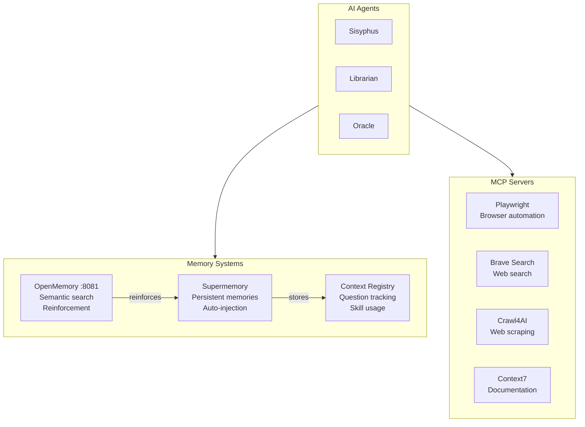
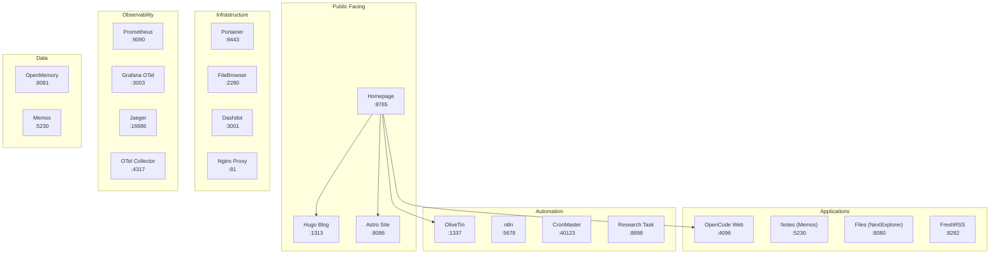
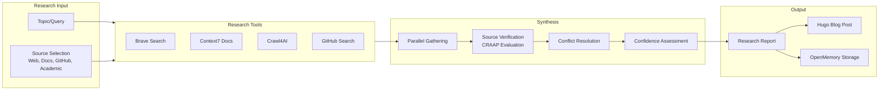

A visual overview of the OpenCode environment on ubuntu4, showing how components connect: Homepage → Admin Buttons → OliveTin → Microservices → Blog.

## High-Level Architecture

The environment follows a **dashboard-driven automation** pattern where Homepage acts as the central control plane, triggering OliveTin actions that manage Docker containers and services.

## Admin Button Flow

The Admin section of Homepage contains one-click action buttons that trigger OliveTin webhooks:

## OpenCode Agent Ecosystem

The environment runs 24 agents powered by GLM-5, organized into built-in and GSD (Get Shit Done) categories:

## Skills Maturity Model

Skills evolve through 5 maturity levels, from raw documentation to deterministic MCP servers:

### Current Skill Distribution

| Level | Count | Examples |
|-------|-------|----------|
| **L5** | 2 | `agent-browser`, `openmemory` |
| **L4** | 3 | `crawl4ai`, `openrag`, `portainer` |
| **L3** | 5 | `containers`, `cronflow`, `diagnose`, `news`, `skill-catalogue` |
| **L2** | 15+ | `research`, `flow`, `roadmap`, `space`, `roundup` |
| **L1** | 50+ | Most documentation skills |

## Memory & MCP Systems

## Service Network Map

All services running on ubuntu4 with their ports:

## Research Skill (Recent Addition)

The **Research skill** provides enterprise-grade research methodology with evidence-based synthesis:

### Research Features

- **Multi-source gathering**: Web, docs, GitHub, academic in parallel
- **Evidence-based synthesis**: CRAAP evaluation for source credibility
- **Conflict resolution**: Priority order (official docs > code > peer-reviewed)
- **Confidence levels**: GRADE framework adapted for technical research
- **Auto-publishing**: Results automatically create Hugo blog posts

## Quick Reference

| Component | URL | Purpose |
|-----------|-----|---------|
| Homepage | http://ubuntu4:8765 | Central dashboard |
| OliveTin | http://ubuntu4:1337 | Admin task automation |
| Hugo Blog | http://ubuntu4:1313 | TELOS Blog |
| OpenCode | http://ubuntu4:4096 | AI coding interface |
| Research | http://ubuntu4:8898 | Research task web form |
| Portainer | https://ubuntu4:9443 | Docker management |

---

*Last updated: February 28, 2026*