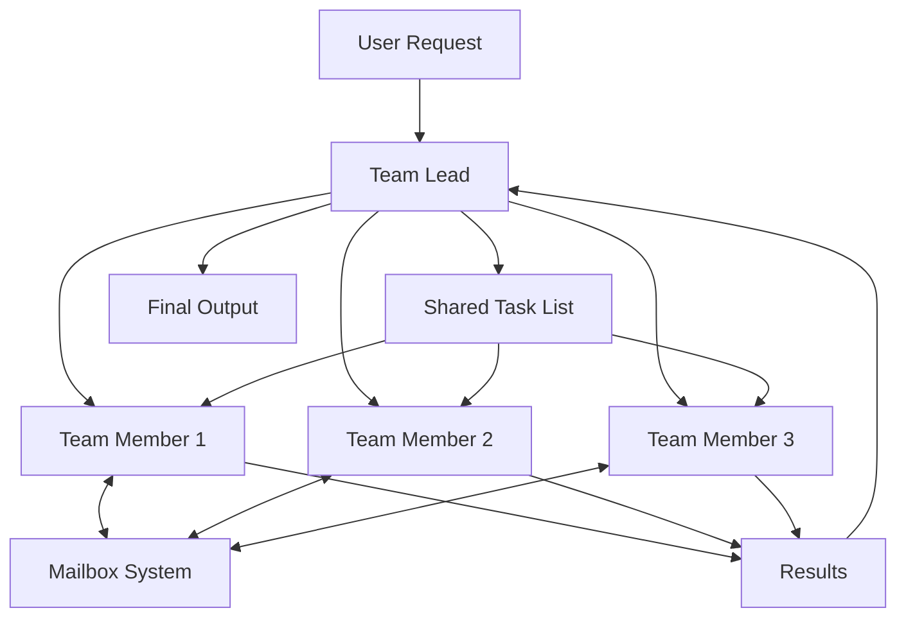
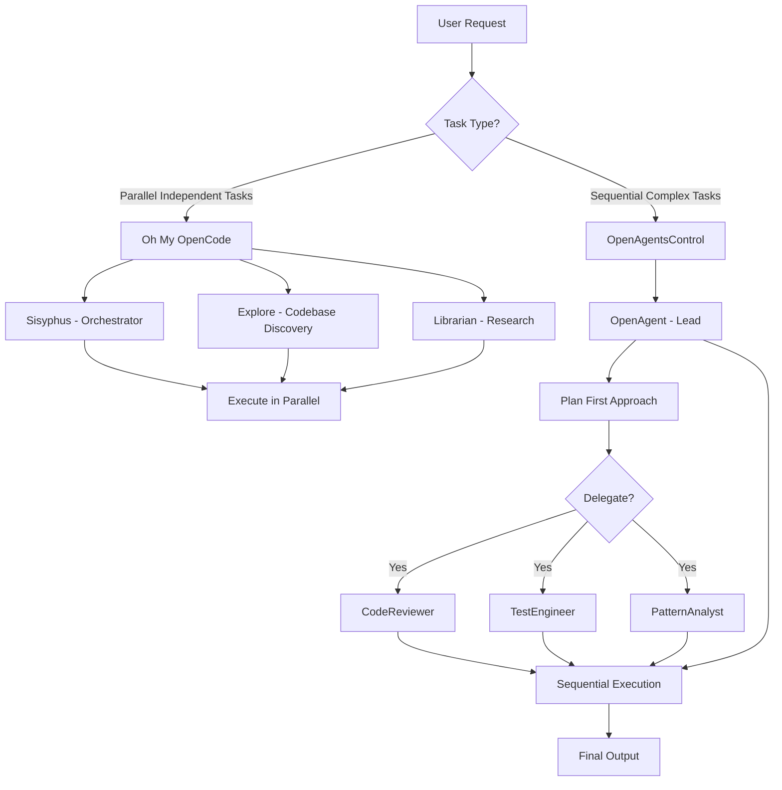
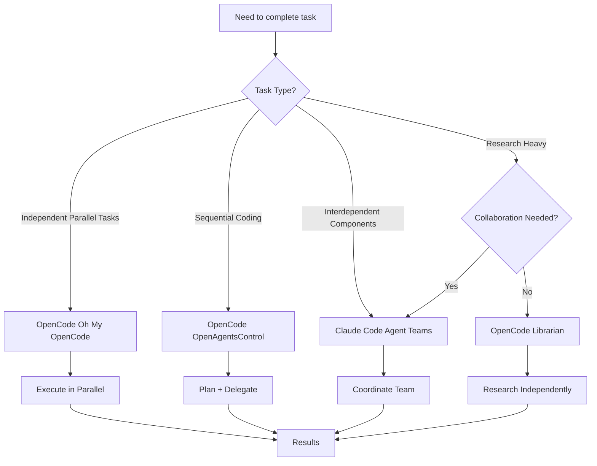

# OpenCode vs Claude Code: Multi-Agent Approaches Compared

## Introduction

The rise of AI-powered coding assistants has brought sophisticated multi-agent architectures to the forefront. Two leading implementations—Claude Code's Agent Teams and OpenCode's Multi-Agent System—take fundamentally different approaches to solving the same problem: **how to make AI agents more effective at complex tasks**.

This post explores both systems, their philosophies, and when to use each approach.

## The Core Problem: AI Agents Get Dumber Over Time

Both systems acknowledge a fundamental issue with single AI agents:

> **"AI coding agents get dumber the longer they work. Details blur and quality decreases substantially."**

This happens because:
- Context windows fill up with irrelevant information
- Long conversations drift from original intent
- Agent loses focus on core objectives
- Coordination between different aspects becomes fragmented

## Claude Code's Solution: Agent Teams

### Architecture Overview

Claude Code introduces **Agent Teams** as a collaborative system where multiple AI instances work together with full communication capabilities.

### Key Components

1. **Team Lead** - Main coordinator agent
2. **Team Members** - Independent Claude Code instances
3. **Shared Task List** - Visible to all agents
4. **Mailbox System** - Agent-to-agent messaging

### How It Works

### Key Features

- **Real-time Collaboration**: Agents communicate continuously
- **Full Codebase Awareness**: All agents see shared task list
- **Direct User Interaction**: User can chat with any team member individually
- **Cross-Agent Communication**: Mailbox system enables coordination
- **Independent Contexts**: Each agent has its own context window

### Real-World Example

> "Using this design pattern, an engineer at Anthropic built a completely working C compiler over 2,000 Claude Code sessions with a $20,000 API cost."

### When to Use Agent Teams

**Best for:**
- Complex problems requiring discussion and collaboration
- Interconnected tasks where agents need awareness of each other
- Research-heavy work with multiple parallel investigations
- Large-scale refactoring requiring multiple specialists

**Caution:**
- Higher token costs (multiple instances running)
- Overkill for simple, sequential tasks
- Can generate more code than needed if not focused

## OpenCode's Solution: Research-Backed Multi-Agent System

### Architecture Overview

OpenCode takes a **fundamentally different approach** based on Anthropic's 2025 research showing:

> **"Single agent + tools > multi-agent for coding tasks (code is sequential, not parallelizable)"**

### Key Components

1. **OpenAgentsControl** - Primary system with specialized agents
2. **Oh My OpenCode** - Parallel orchestration for independent tasks
3. **Delegation via Task Tool** - Primary agents delegate to subagents
4. **Specialized Agent Ecosystem** - 20+ domain-specific agents

### How It Works

### Available Agents

**Primary Agents:**
- `OpenAgent` - General coordination
- `OpenCoder` - Complex coding tasks
- `OpenFrontendSpecialist` - React, Vue, UI/UX
- `OpenBackendSpecialist` - API, databases
- `OpenSystemBuilder` - Architecture and setup

**Subagents:**
- `CodeReviewer` - Quality assurance
- `TestEngineer` - Testing and validation
- `PatternAnalyst` - Code pattern discovery
- `ContextRetriever` - Context search
- `Document-Writer` - Documentation

**Oh My OpenCode Agents:**
- `Sisyphus` - Parallel orchestration
- `Oracle` - Deep reasoning
- `Librarian` - External research
- `Explore` - Codebase discovery

### Key Features

- **Plan-First Approach**: Agents create plans, get approval, then execute
- **Specialized Expertise**: Each agent has domain-specific knowledge
- **Parallel Tool Calling**: Single agent can call multiple tools simultaneously (90% faster for research)
- **Just-in-Time Context**: Tools load context on demand, not pre-loaded
- **Outcome-Focused**: Evaluates on solving tasks, not following exact steps

### When to Use OpenCode Multi-Agent

**Use Oh My OpenCode (Parallel) when:**
- Multiple independent tasks that can run simultaneously
- Complex workflows requiring concurrent agent coordination
- Background research while implementing
- Codebase pattern discovery
- Frontend UI/UX work with multiple specialists

**Use OpenAgentsControl (Delegation) when:**
- Complex coding tasks with sequential steps
- Need code review + testing + documentation
- Multi-file implementations
- Architecture decisions requiring multiple perspectives

## Core Philosophical Differences

### Research-Backed Decision Making

OpenCode's approach is grounded in Anthropic's research findings:

| Finding | Implication |
|---------|--------------|
| **Code is sequential, not parallelizable** | Multi-agent excels at research (90.2% improvement) but not coding |
| **Token usage explains 80% of performance variance** | Optimize for solving problem, not minimizing tokens |
| **Single agent + tools > multi-agent for coding** | Use one lead agent with specialized sub-functions |
| **Agents drown in pre-loaded context** | Use just-in-time retrieval via tools |

### Coordination vs. Delegation

| Aspect | Claude Code Agent Teams | OpenCode |
|---------|---------------------|----------|
| **Coordination** | Agents collaborate in real-time on shared codebase | Lead agent delegates to specialists |
| **Communication** | Full mailbox system between all agents | Limited communication (task delegation only) |
| **Task Awareness** | All agents see shared task list | Only lead agent sees full picture |
| **User Interaction** | Chat with any team member individually | Interact with primary agent |
| **Token Efficiency** | Higher (multiple instances running) | Lower (focused delegation) |

## Comparative Analysis

### Performance Characteristics

**Claude Code Agent Teams:**
- **Strengths:**
  - Real-time collaboration and awareness
  - Agents can adapt to each other's findings
  - Ideal for research and interconnected problems
  - Full visibility into team progress

- **Weaknesses:**
  - Higher token costs
  - Can generate unnecessary code
  - Overkill for sequential tasks
  - Requires careful task sizing to avoid wasted effort

**OpenCode Multi-Agent:**
- **Strengths:**
  - Research-backed efficiency
  - Lower token costs
  - Plan-first approach reduces mistakes
  - Specialized expertise for specific domains
  - Parallel execution for truly independent tasks

- **Weaknesses:**
  - Less collaborative awareness between agents
  - Primarily sequential for coding tasks
  - Requires understanding of which agent to use
  - Limited agent-to-agent communication

### Use Case Comparison

| Scenario | Recommended System | Reasoning |
|----------|-------------------|------------|
| **Building a full-stack app with interconnected components** | Claude Code Agent Teams | Agents need awareness of each other's changes |
| **API endpoint testing and validation** | OpenCode (parallel) | Independent tasks, perfect for parallel execution |
| **Code search across multiple files** | OpenCode (Explore agent) | Specialized for codebase discovery |
| **Research-heavy task with multiple sources** | Claude Code Agent Teams OR OpenCode (Librarian) | Research benefits from parallel agents |
| **Refactoring a module** | OpenCode (OpenCoder + delegation) | Code is sequential, use one lead agent |
| **Complex multi-file changes** | Claude Code Agent Teams | Awareness of dependencies critical |
| **Writing documentation** | OpenCode (Document-Writer) | Specialized domain expertise |
| **Quality assurance workflow** | OpenCode (CodeReviewer + TestEngineer) | Sequential delegation works well |

## Practical Considerations

### Task Sizing Matters

Both systems emphasize the importance of proper task sizing:

**Too Small Tasks:**
- Coordination overhead not worth it
- Spawns unnecessary complexity
- Wastes tokens

**Too Large Tasks:**
- Agents risk wasted effort
- Don't check in with each other
- Lose focus on objectives

**Rule of Thumb:**
> **"Work on self-contained units and produce clear deliverables"** - Eddie Osmani

### File Ownership Challenges

Both systems face coordination challenges when multiple agents touch the same file:

**Claude Code Approach:**
- Shared task list shows who's working on what
- Mailbox system enables coordination
- Still requires careful planning

**OpenCode Approach:**
- Delegate to specialists working on different files
- Avoids coordination conflicts
- Use single agent for sequential changes

### Cost Considerations

**Claude Code:**
- Higher per-session cost (multiple agents running)
- Best for truly collaborative tasks
- May not justify cost for simple work

**OpenCode:**
- Lower per-session cost (focused delegation)
- Parallel execution only when truly beneficial
- More cost-efficient for most coding tasks

## Decision Framework

### Quick Decision Flow

### Choosing the Right System

**Choose Claude Code Agent Teams when:**
- Problem requires ongoing collaboration between agents
- Tasks are highly interconnected
- Research benefits from parallel investigations
- You have budget for higher token costs
- Real-time adaptation between agents is critical

**Choose OpenCode Multi-Agent when:**
- Tasks can be broken into sequential steps
- You need specialized domain expertise
- Cost efficiency is important
- You prefer plan-first approaches
- Parallel execution is limited to truly independent tasks

## Conclusion

Both Claude Code's Agent Teams and OpenCode's Multi-Agent System offer powerful approaches to solving complex AI coding tasks, but they take fundamentally different philosophies:

**Claude Code Agent Teams:**
- Collaboration-first approach
- Full awareness and communication
- Ideal for interconnected problems
- Higher costs, more collaboration

**OpenCode Multi-Agent:**
- Research-backed efficiency
- Specialized expertise
- Plan-first execution
- Lower costs, focused delegation

**The key is to match the approach to the problem:**

> **"Your problem should guide tooling, not the other way around."**

Don't use Agent Teams for every task just because it's the latest feature. Don't avoid multi-agent systems when collaboration would genuinely help. Understanding both approaches lets you choose the right tool for the right job.

---

## Resources

- **Claude Code Agent Teams Documentation**: [Anthropic's official documentation](https://docs.anthropic.com/)
- **OpenCode Documentation**: [OpenCode GitHub Repository](https://github.com/opencode/opencode)
- **Research Papers**: Anthropic Multi-Agent Research (Sept-Dec 2025)

*Video Source: [Claude Code: Agent Teams change everything (Opus 4.6)](https://www.youtube.com/watch?v=iXw4qwy5Ld4)*