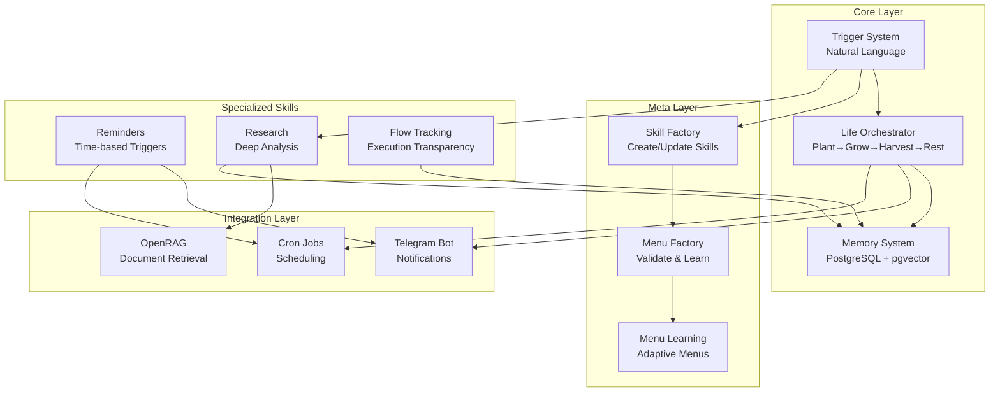
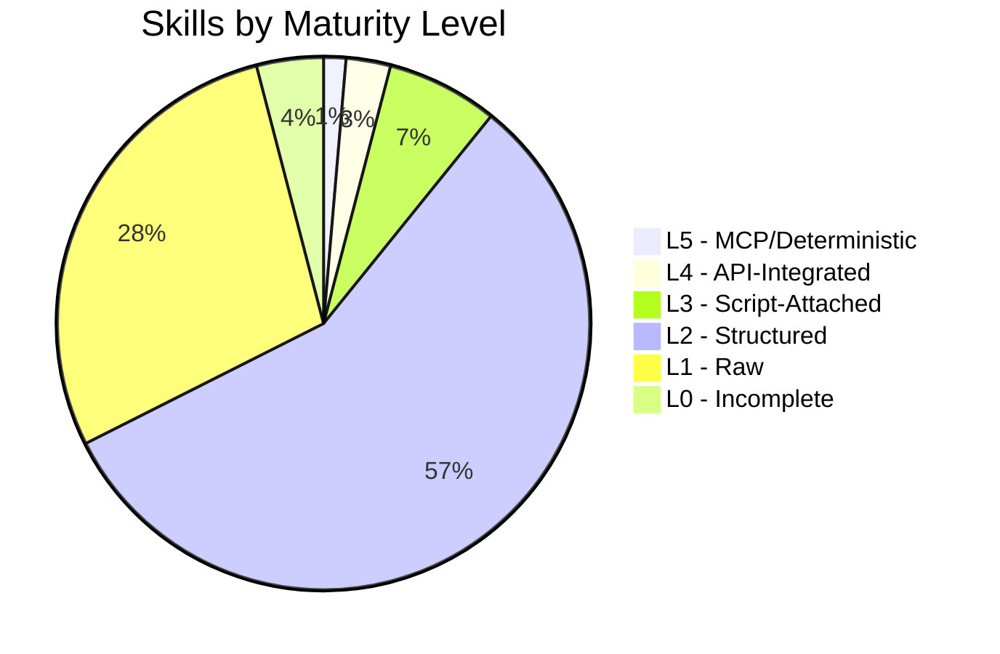

## The Vision

What if your AI assistant could evolve, learn, and manage your entire digital life? This is the Personal Assistant Ecosystem — a modular, skill-based architecture designed to handle everything from reminders to research, from content creation to life orchestration.

## Architecture at a Glance

## The Four Pillars

### 1. Memory System
The foundation. PostgreSQL with pgvector stores:
- **Conversations** — Every interaction
- **Decisions** — Choices and preferences
- **Actions** — What was done
- **Context** — Progressive disclosure layers

Stats: **2,846+ memories** and growing.

### 2. Meta-Skills
Skills that create and improve other skills:
- **Skill Factory** — Standardized skill creation with 13-section workflow
- **Menu Factory** — Validation, learning, and optimization
- **Menu Learning** — Adapts to your choices

### 3. Orchestrator
Unified lifecycle management using the **Plant → Grow → Harvest → Rest** model:
- 🌱 **Plant** — Starting, planning, sowing
- 📈 **Grow** — Developing, nurturing, working
- 🎯 **Harvest** — Completing, collecting, achieving
- 😴 **Rest** — Reflecting, pausing, reviewing

### 4. Integration Layer
Connecting everything to the real world:
- **Telegram** — Notifications and commands
- **Cron** — Scheduled tasks
- **OpenRAG** — Document retrieval and analysis

## Progressive Disclosure

This is the first in a series of posts. Each subsequent post dives deeper:

| Post | Topic | Depth |
|------|-------|-------|
| **This Post** | Overview | 10% |
| **Next** | Memory System Deep Dive | 25% |
| **Then** | Orchestrator Architecture | 25% |
| **Then** | Meta-Skills (Factory Pattern) | 25% |
| **Finally** | Reminders & Research | 15% |

## Key Metrics

## Trigger Words

Natural language triggers activate the system:

| Trigger | Action |
|---------|--------|
| `orch` | Life orchestrator |
| `sf` | Skill factory |
| `mf` | Menu factory |
| `remind` | Create reminder |
| `research` | Deep research mode |
| `mem` | Memory system |
| `flow` | Execution tracking |

## What's Next

In the next post, we'll dive deep into the **Memory System** — how PostgreSQL with pgvector enables persistent context across sessions, the capture protocols, and how progressive disclosure prevents context overload.

---

*This is part 1 of 5 in the Personal Assistant Ecosystem series.*