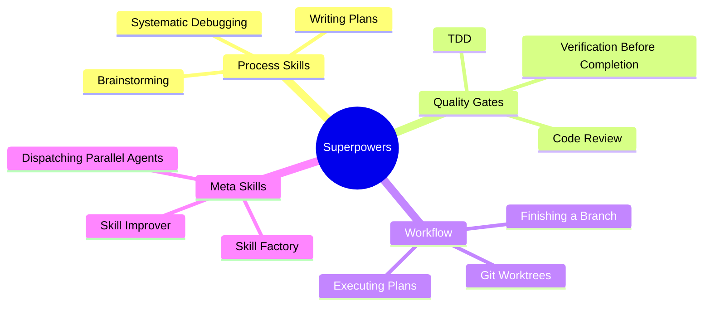
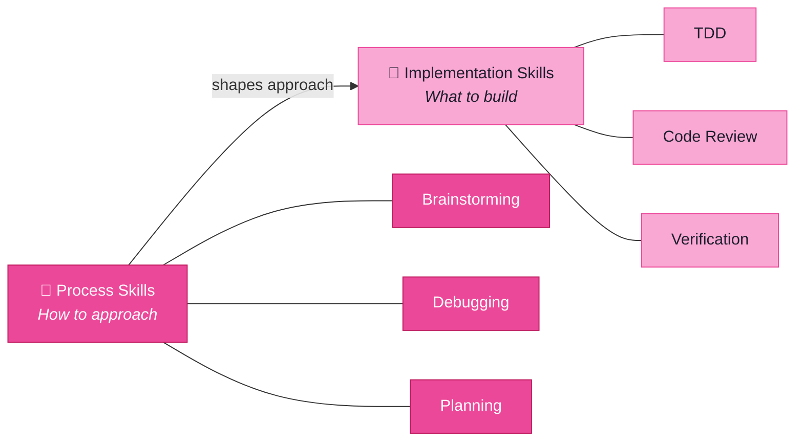
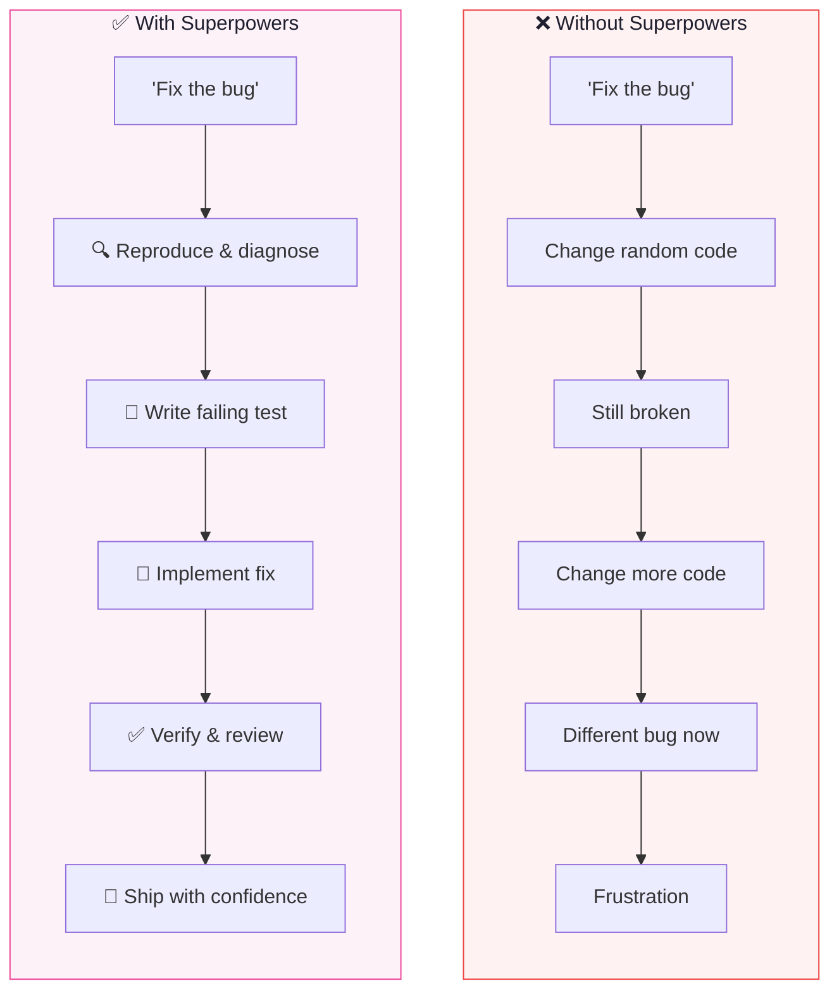

Your AI already writes code. What if it could also brainstorm, debug, and review its own work?

That's not a hypothetical. That's what superpowers do. They take the hard-won lessons of senior engineering — think before you type, debug before you "fix", test before you ship — and encode them into reusable skill packages your AI loads on demand. Not as suggestions it sometimes follows. As workflows it *executes*.

This is Post 5 in **The Agentic Stack** series, where we're building a mental model for how AI-powered development actually works. We've covered prompts, context windows, memory, and RAG. Now we get to the part that turns an AI assistant into something that genuinely feels like a senior pair programmer: **plugins and superpowers**.

---

## What Superpowers Actually Are

Think of superpowers as installable discipline. They're pre-packaged skill collections — markdown files, scripts, and configuration — that teach your AI how to approach specific situations. Not *what* to code, but *how* to think about coding.

Here's what makes them different from a good system prompt:

- **Installed once, available everywhere.** You don't repeat yourself. Configure a skill once and it's loaded in every session, every project, every conversation.
- **Triggered by context, not by memory.** Your AI doesn't need to "remember" to use test-driven development. The skill detects you're about to implement a feature and activates automatically.
- **Discipline-as-code.** Best practices aren't Suggestions — they're encoded into AI behaviour. The AI follows a structured workflow, not a vague intention to "write good code."

The result? Your AI stops being a fast typist and starts being a *systematic* engineer.

This diagram shows the four major categories. Process skills determine *how* you approach work. Quality gates ensure work is *good enough*. Workflow skills manage the mechanics of development. Meta skills improve the skills themselves. Together, they form a complete operating system for AI-assisted engineering.

---

## The Approval Protocol: You Stay in Control

Here's the critical part that separates superpowers from autonomous agent chaos: **you control when they activate.**

When your AI detects that a superpower might apply, it doesn't just fire it off. It asks first:

> "I notice you're about to implement a new feature. Should I use the **brainstorming** skill? This will help us explore the design space before writing any code. Approve?"

This approval protocol is non-negotiable. The AI never makes autonomous discipline decisions. It proposes, you dispose. There are several reasons this matters:

1. **You might have a different approach in mind.** Maybe you've already thought through the design and just want code written. The AI shouldn't force a brainstorming session you don't need.
2. **Not every task needs full rigour.** A one-line CSS fix doesn't need TDD. A critical payment flow does. You decide.
3. **Trust builds over time.** At first, you'll approve case-by-case. Eventually, you'll trust certain skills to activate automatically because you've seen them work.

The key insight: superpowers don't replace your judgment. They *amplify* it. You're still the architect. The AI is still the builder. But now the builder shows up with a full toolkit and the discipline to use the right tool for each job.

---

## Key Superpowers, Explained

Let's walk through the ones that will change how you work with AI the most.

### Brainstorming: Design Before Code

Before writing a single line, the brainstorming skill forces a structured exploration of the problem space. What are we building? Why? What are the edge cases? What are three possible approaches and their trade-offs?

**Real use case**: You say "add user authentication." Instead of immediately generating JWT middleware, the AI pauses and asks: "Are we building for a web app or API? Do we need OAuth providers? What's the session model?" Five minutes of brainstorming saves five hours of rewriting.

### Systematic Debugging: Root Cause Before Fix

When something breaks, the instinct is to start changing things. The systematic debugging skill enforces a different approach: reproduce the bug, form a hypothesis, test the hypothesis, identify the root cause, *then* fix it.

**Real use case**: Your API returns 500 errors. Instead of sprinkling `console.log` statements everywhere, the AI traces the error chain: bad request → missing validation → null pointer → database migration didn't run. One targeted fix instead of a panicked afternoon.

### Test-Driven Development: Tests Before Implementation

TDD with AI is genuinely magical. The skill writes the failing test first, watches it fail for the right reason, then writes the minimum implementation to make it pass. It's not faster than skipping tests — it's *better*, because every line of code is justified by a test that demanded it.

**Real use case**: "Add rate limiting to the API endpoint." The AI writes tests for: no rate limit returns 200, hitting the limit returns 429, limit resets after the window. Only then does it write the rate limiter. When all tests pass, you know it works — not because the AI said so, but because the tests prove it.

### Verification Before Completion: Evidence Before Assertions

This is the skill that stops your AI from saying "I've fixed the bug!" without actually running the tests. Verification means: run the test suite, check the output, confirm the fix works, *then* report success.

**Real use case**: After fixing a CSS layout issue, instead of just saying "done," the AI opens the page in a browser, takes a screenshot, compares it to the expected layout, and shows you the evidence. No more "trust me, it works."

### Code Review: Peer Review Before Merge

Before any code gets committed, the code review skill runs a structured review: check for edge cases, verify error handling, assess naming conventions, look for security issues, and compare against project patterns.

**Real use case**: You've just implemented a new feature. The AI reviews its own code and catches: "This function doesn't handle the case where the user's session has expired. Also, the variable name `d` should be `duration` for readability." It fixes both before you even see the PR.

---

## How Superpowers Chain Together

The real magic isn't any single skill. It's how they compose.

Superpowers follow a strict priority order: **process skills first, implementation skills second.** Process skills determine *how* you approach the work. Implementation skills determine *what* you build. Get the how right, and the what takes care of itself.

Here's what this looks like in practice. Let's say you say "fix the checkout bug":

1. **Systematic Debugging** activates (process skill) — the AI reproduces the bug, traces the root cause, identifies it's a race condition in the payment handler.
2. **TDD** activates (implementation skill) — the AI writes a test that reliably triggers the race condition, confirms it fails.
3. **The fix is implemented** — the AI adds proper locking to the payment handler.
4. **Verification** activates — the AI runs the full test suite, confirms the fix passes, checks for regressions.
5. **Code Review** activates — the AI reviews the change for edge cases and security implications.

Five skills. One natural chain. You approved each step, but the AI proposed each one at exactly the right moment.

Notice the difference? Without superpowers, the AI jumps straight to changing code and hopes for the best. With superpowers, each step builds on the last. The fix is justified by the diagnosis. The test proves the fix. The verification confirms no regressions. The review catches anything missed. This isn't magic — it's engineering discipline, systematized.

---

## Installing and Configuring Superpowers

The setup is surprisingly simple. Superpowers are typically distributed as skill packages — collections of markdown files and optional scripts that you drop into a configuration directory.

**Quick setup:**

1. **Install the skills directory.** Most frameworks use a standard location like `~/.config/opencode/skills/` or a project-level `.skills/` directory.
2. **Configure your AGENTS.md or equivalent.** Add the approval protocol rules so your AI knows to ask before activating skills.
3. **Start a session and mention a task.** The AI will detect which skills apply and request approval.

That's it. No API keys, no service accounts, no external dependencies. Skills are just structured text that teaches your AI better habits.

**Custom configuration tips:**

- Start with just 2-3 skills (brainstorming + verification is a powerful combo).
- Approve every activation at first. Trust is earned.
- After a week, you'll know which skills you want on auto-approve.
- Use the meta skills (skill-factory, skill-improver) to create and refine custom skills for your specific workflow.

The beauty of the system is its extensibility. Every team has unique workflows. Maybe you always want a security review before merging. Maybe you have a specific deployment checklist. Whatever your discipline looks like, you can encode it as a superpower and share it across your entire team.

---

## The Force Multiplier Effect

Here's the real takeaway: superpowers don't make your AI smarter. They make it *more reliable*. And in software engineering, reliable beats brilliant every time.

An AI that writes 95% correct code but always tests it, always verifies it, and always reviews it will ship fewer bugs than an AI that writes 99% correct code but skips all the safety checks. Superpowers don't add intelligence — they add *consistency*. And consistency at scale is a force multiplier.

The agentic stack we've built across this series — prompts, context, memory, RAG, and now superpowers — creates something genuinely new. Not just an AI that can write code. An AI that can *engineer* software. The difference isn't capability. It's discipline.

Your AI already writes code. Now it knows how to think.

---

*This is Post 5 in **The Agentic Stack** series. [Read the full series →](/posts/tag/agentic-stack)*