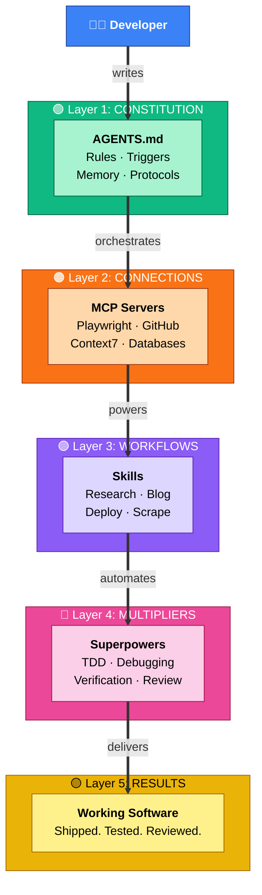
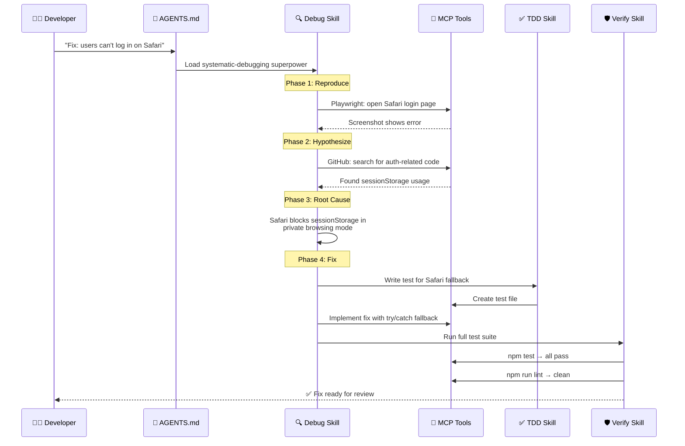
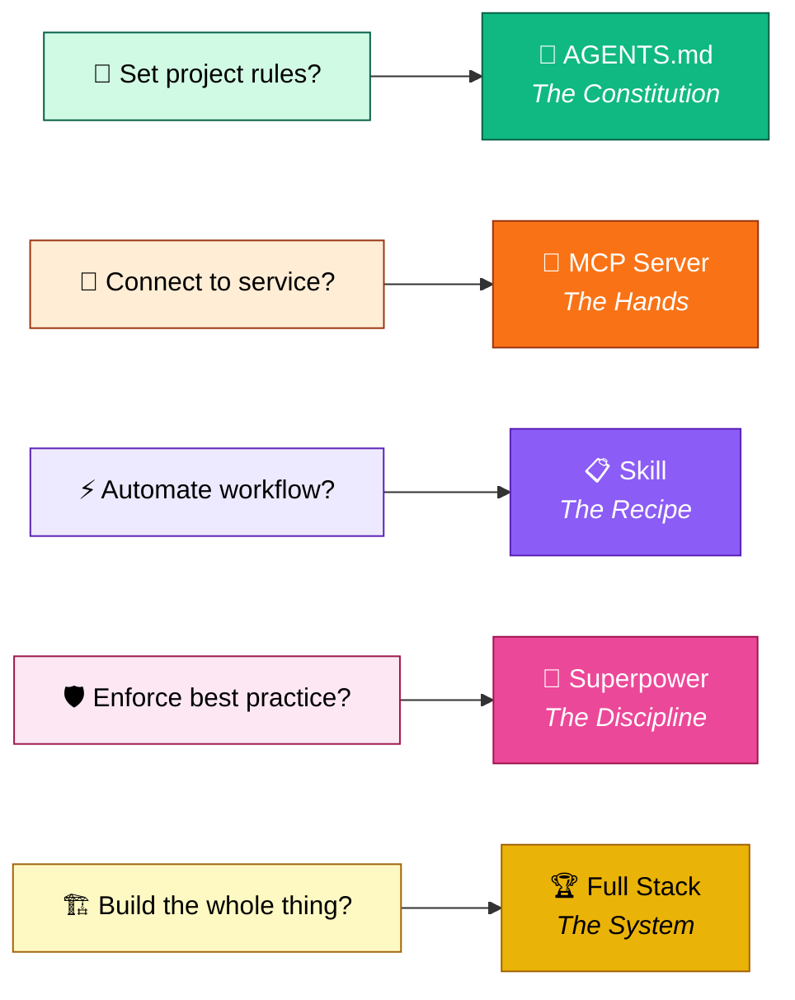

# Putting It All Together: Your Complete Agentic Stack

**Six layers. One system. Here's how they all connect.**

If you've been with us since Post 1, you've seen every piece of the agentic stack taken apart and examined under the light. We started with the question of *why* agents need structure at all, then worked our way through constitutions, connections, workflows, and discipline multipliers. Each post answered one question and raised three more.

This is the post that answers them all.

By the end, you'll see exactly how AGENTS.md, MCP servers, Skills, and Superpowers fit together — not as isolated tools, but as a single system that transforms an AI coding assistant from a chatty autocomplete into a disciplined, consistent, *agentic* software engineer.

Let's build the stack.

---

## The Five Components and How They Interact

Here's the thing most people miss: these five layers aren't just a list. They're a *dependency chain*. Each layer builds on the one below it, and the whole thing falls apart if you skip one.



Let's walk through each layer one more time — but this time, we'll see them *in relation to each other*.

### Layer 1: AGENTS.md Orchestrates (The Constitution)

Your AGENTS.md file is the single source of truth for how your agent behaves. It's not a suggestion — it's a constitution that the agent follows on every single interaction.

```markdown
# AGENTS.md (simplified)

## Build Commands
- **Build**: `npm run build`
- **Lint**: `npm run lint`
- **Test**: `npm test`

## Code Style
- TypeScript strict mode
- No comments unless asked
- snake_case for Python, camelCase for JS

## Memory System
- Store decisions with: `pghmem save "content" --type decision`
- Search before asking: `pghmem search "topic"`

## Triggers
- `blog` → Load astro skill for publishing
- `debug` → Load systematic-debugging superpower
- `setup` → Guided server configuration
```

The key insight: **AGENTS.md tells the agent *what* to do, not *how***. The "how" lives in your skills and superpowers.

### Layer 2: MCPs Connect (The Hands)

MCP servers are how your agent reaches outside its context window. Without them, you have a very eloquent assistant that can't actually *do* anything.

```json
{
  "mcpServers": {
    "playwright": {
      "type": "remote",
      "url": "http://localhost:3001/mcp"
    },
    "github": {
      "type": "remote",
      "url": "http://localhost:3002/mcp"
    },
    "context7": {
      "type": "remote",
      "url": "http://localhost:3003/mcp"
    }
  }
}
```

Three MCP servers give your agent: browser automation (Playwright), repository management (GitHub), and up-to-date documentation (Context7). That's the *minimum viable hands* for a productive agent.

### Layer 3: Skills Automate (The Workflows)

Skills are the recipes. They take repetitive multi-step processes and encode them into a single invocation that your agent can follow consistently.

A skill for publishing blog posts doesn't just "write a file." It:

1. Validates the frontmatter against a Zod schema
2. Posts to your CMS via API
3. Verifies the post is live
4. Sends a notification

That's four steps that would take a human 10 minutes and an unskilled agent 30 minutes of back-and-forth. A skilled agent does it in one shot.

### Layer 4: Superpowers Discipline (The Multipliers)

Superpowers are the difference between an agent that *can* write code and one that *reliably ships* code. They enforce the practices that humans skip when they're in a rush:

- **TDD**: Write the test first. Always.
- **Systematic Debugging**: Reproduce → Hypothesize → Test → Fix. Not "change random things."
- **Verification**: Run the tests *before* you say "done."
- **Code Review**: Check your work against requirements.

The approval protocol is what makes superpowers work without being annoying. You don't *always* need TDD for a one-line typo fix. But for anything non-trivial, the superpower asks permission first:

> *"I notice you're about to implement a new feature. Should I use the test-driven-development skill? This will help by ensuring every line of code has corresponding test coverage before it's written. Approve?"*

You say yes. The discipline kicks in. The code gets better.

### Layer 5: Together They Deliver Working Software

When all four layers are active, something remarkable happens: the agent stops being a chatbot and starts being a teammate. You describe what you want. The agent:

1. Reads your AGENTS.md to understand your project's conventions
2. Uses MCP servers to interact with your actual codebase and services
3. Loads the right skill for the task at hand
4. Activates superpowers to ensure quality
5. Delivers working, tested, reviewed code

That's the stack. That's the whole point of this series.

---

## Three Real-World Workflow Walkthroughs

Theory is nice. Let's see the stack in action.

### Workflow 1: "Add a New Feature"

**You say**: *"Add a user preferences panel to the dashboard."*

**What happens**:

1. **Brainstorming** (superpower) — The agent asks clarifying questions before writing a single line. What preferences? Where in the UI? Dark mode, language, notifications?

2. **TDD** (superpower) — You approve TDD. The agent writes tests for the preferences panel *first*:
   ```typescript
   describe('UserPreferences', () => {
     it('renders all preference sections', () => {
       render(<UserPreferences />);
       expect(screen.getByText('Appearance')).toBeInTheDocument();
       expect(screen.getByText('Notifications')).toBeInTheDocument();
     });

     it('saves preferences to localStorage', async () => {
       render(<UserPreferences />);
       await userEvent.click(screen.getByLabelText('Dark mode'));
       expect(localStorage.setItem).toHaveBeenCalledWith(
         'preferences',
         expect.stringContaining('"theme":"dark"')
       );
     });
   });
   ```

3. **Implementation** — Tests failing? Good. Now the agent writes the component to make them pass.

4. **Verification** (superpower) — `npm test`, `npm run lint`, `npm run build`. All green? Not done yet.

5. **Review** (superpower) — The agent reviews its own code against your AGENTS.md rules. Did it follow your naming conventions? Your file structure? Your import patterns?

6. **Browser validation** — The Playwright MCP opens the dashboard, navigates to the preferences panel, and takes a screenshot. You see it working.

**Total agent turns**: ~15-20. **Total human turns**: 2 (describe the feature, approve TDD).

### Workflow 2: "Fix a Production Bug"

This is where the stack really shines. Let's trace the full chain:



Notice the chain: AGENTS.md routes to the debug skill, which uses MCP tools to investigate, which feeds into TDD for the fix, which triggers verification before delivery. **Each layer does its job and hands off to the next.**

The bug that would have taken an hour of trial-and-error debugging? The stack reproduces it in 30 seconds, identifies the root cause in 2 minutes, and ships a tested fix in 5.

### Workflow 3: "Research and Document"

**You say**: *"Research the current state of WebAssembly for server-side computing and write it up."*

**What happens**:

1. **Research skill** — Loads automatically when it detects the research intent. Searches multiple sources, validates claims across at least two independent references, synthesizes findings.

2. **Write** — The agent drafts a comprehensive article with evidence, citations, and a clear narrative arc.

3. **Publish** — If you've configured the blog skill, the agent formats the post in your CMS's schema, posts via API, and verifies it's live.

4. **Memory** — Key findings are saved to your memory system so the agent can reference them later without re-researching.

This workflow demonstrates something important: the stack isn't just for code. It's for *knowledge work*. Research, documentation, analysis — the same structured approach applies.

---

## Common Pitfalls

I've watched dozens of teams adopt the agentic stack. Here are the four traps that catch almost everyone.

### Pitfall 1: Over-Configuring AGENTS.md

**The mistake**: Writing a 2,000-line AGENTS.md that tries to encode every possible rule for every possible situation.

**The problem**: Every line in AGENTS.md costs context tokens on every single interaction. A bloated AGENTS.md means less room for actual work. I've seen agents run out of context halfway through a task because the constitution was too verbose.

**The fix**: Keep AGENTS.md under 300 lines. Put the essential rules — build commands, code style, key triggers — in AGENTS.md. Move detailed workflows into skills where they're loaded *on demand* instead of *always*.

### Pitfall 2: Installing Too Many MCP Servers

**The mistake**: Connecting every MCP server you can find. Playwright, GitHub, Context7, Slack, Jira, Sentry, Notion, Linear, eight database connectors...

**The problem**: Each MCP server adds its tool definitions to the agent's context. Twenty servers means the agent spends 40% of its context just *knowing what tools exist*.

**The fix**: Start with three: browser automation, repository management, and documentation lookup. Add more only when you have a concrete, repeated need. Every new server should justify its context cost.

```bash
# Good: Minimal viable set
opencode mcp add playwright http://localhost:3001/mcp --enabled
opencode mcp add github http://localhost:3002/mcp --enabled
opencode mcp add context7 http://localhost:3003/mcp --enabled

# Bad: Everything at once
opencode mcp add playwright ... && opencode mcp add github ... && \
opencode mcp add slack ... && opencode mcp add jira ... && \
opencode mcp add sentry ... && opencode mcp add notion ...
```

### Pitfall 3: Creating Overlapping Skills

**The mistake**: Building a "deploy-frontend" skill and a "deploy-backend" skill and a "deploy-database" skill when a single "deploy" skill with a parameter would do.

**The problem**: Overlapping skills confuse the agent. When you say "deploy," which skill should it load? Three skills that do similar things mean the agent spends its first three turns trying to figure out which one you meant.

**The fix**: One skill per *domain*, not per *task*. A "deploy" skill that handles different service types is better than five deploy skills that each handle one.

### Pitfall 4: Skipping the Approval Protocol

**The mistake**: Disabling the superpower approval protocol because "I know what I want, just do it."

**The problem**: Without the approval gate, superpowers activate on *every* interaction. Simple typo fix? Full TDD cycle. Renaming a variable? Complete code review. The discipline becomes overhead instead of a quality multiplier.

**The fix**: Keep the approval protocol. It's not bureaucracy — it's a *conversation*. The agent asks "should I use TDD here?" and you say yes or no based on the situation. That five-second exchange saves you from a five-minute unnecessary workflow.

---

## Which Tool for Which Job

When you're staring at a task, it's not always obvious which layer of the stack to engage. Here's the decision matrix:



**Quick reference:**

| Question | Answer | Colour |
|----------|--------|--------|
| "How should my agent behave on this project?" | Write it in AGENTS.md | Green |
| "My agent needs to talk to X" | Add an MCP server for X | Orange |
| "I keep doing Y over and over" | Create a skill for Y | Purple |
| "My agent keeps shipping broken code" | Activate superpowers | Pink |
| "I want all of the above" | You want the full stack | Gold |

---

## Resources to Continue Learning

The agentic stack is evolving fast. Here's where to go next:

**Documentation:**
- [Model Context Protocol Specification](https://modelcontextprotocol.io/) — The official MCP docs, including the server registry
- [OpenCode Documentation](https://opencode.ai) — Agent configuration, skills, and superpowers
- [Context7](https://context7.com) — Up-to-date documentation retrieval for any library

**Communities:**
- [OpenCode GitHub Discussions](https://github.com/anomalyco/opencode/issues) — Ask questions, share your stack
- [MCP Server Registry](https://github.com/modelcontextprotocol/servers) — Browse and contribute MCP servers
- [r/AgenticCoding](https://reddit.com/r/AgenticCoding) — Community patterns and war stories

**Practice:**
- Start with a minimal AGENTS.md (under 50 lines) on an existing project
- Add one MCP server per week until you hit three
- Create your first skill by documenting a workflow you do daily
- Enable one superpower at a time — TDD first, then verification, then debugging

**Next Steps:**
1. **Audit your current setup** — Which layers do you already have? Which are missing?
2. **Add one layer at a time** — Don't try to build the full stack in a day
3. **Iterate** — Your AGENTS.md will be wrong at first. Your skills will be too specific. Your MCP config will have too many servers. That's fine. Adjust as you learn.

---

## The Stack in One Sentence

If you remember nothing else from this entire series, remember this:

> **AGENTS.md tells your agent *who to be*. MCP gives it *hands*. Skills give it *habits*. Superpowers give it *discipline*. Together, they ship *working software*.**

Six posts ago, you had an AI that could write code. Now you have a system that can *engineer* it.

Go build something remarkable.

---

*This is Post 6 of 6 in **The Agentic Stack** series.*

- [Post 1: What Is an Agentic Stack?](/posts/why-agentic-coding-changes-everything/)
- [Post 2: AGENTS.md — Your Agent's Constitution](/posts/agents-md-your-ais-constitution/)
- [Post 3: MCP Servers — Giving Your Agent Hands](/posts/mcps-giving-your-ai-hands/)
- [Post 4: Skills — Automating the Repetitive](/posts/skills-teaching-your-ai-new-tricks/)
- [Post 5: Superpowers — Disciplined by Default](/posts/plugins-and-superpowers-the-force-multiplier/)
- **Post 6: Putting It All Together** *(you are here)*
