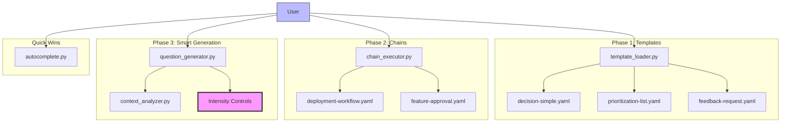

## Overview

This session focused on building a complete question tool enhancement system for OpenCode, addressing the need for:

1. **Reusable question templates** - Standardized patterns for common decisions
2. **Chained question workflows** - Multi-step guided processes
3. **Smart question generation** - AI-powered with intensity controls
4. **Auto-complete fuzzy matching** - Quick option discovery

The key user requirement was: **"ability to tone it down sometimes"** - implemented as 4 intensity levels (off, minimal, normal, verbose).

## Architecture



## File Structure

```
~/.config/opencode/questions/
├── templates/
│   ├── template.schema.yaml         # JSON Schema for templates
│   ├── decision-simple.yaml          # Binary decision template
│   ├── prioritization-list.yaml      # Multi-item prioritization
│   ├── feedback-request.yaml         # User feedback collection
│   └── registry.json                 # Auto-generated index
├── chains/
│   ├── chain.schema.yaml            # JSON Schema for chains
│   ├── deployment-workflow.yaml     # Production deployment flow
│   └── feature-approval.yaml        # Feature request approval
├── scripts/
│   ├── template_loader.py           # Template loader CLI
│   ├── chain_executor.py            # Chain executor CLI
│   ├── context_analyzer.py          # Session context analysis
│   ├── question_generator.py        # AI question generator
│   └── autocomplete.py              # Fuzzy matching CLI
└── smart-gen-config.json            # Smart generation config
```

## Phase 1: Reusable Templates

### Template Schema

```yaml
# template.schema.yaml
type: object
required: [name, description, questions]
properties:
  name:
    type: string
  description:
    type: string
  variables:
    type: object
  questions:
    type: array
    items:
      type: object
      required: [question, header, options]
```

### Decision Template Example

```yaml
# decision-simple.yaml
name: decision-simple
description: Binary decision with optional middle ground
variables:
  context: string
  option_a: string
  option_b: string
questions:
  - question: "{{context}}"
    header: Decision
    options:
      - label: "{{option_a}} (Recommended)"
        description: "Primary choice"
      - label: "{{option_b}}"
        description: "Alternative approach"
      - label: "Skip"
        description: "Not needed now"
    multiple: false
```

### Template Loader CLI

```python
# template_loader.py
class TemplateLoader:
    def load_template(self, name: str) -> dict:
        path = self.templates_dir / f"{name}.yaml"
        with open(path) as f:
            return yaml.safe_load(f)
    
    def render(self, template: dict, variables: dict) -> dict:
        # Substitute {{variable}} placeholders
        rendered = json.dumps(template)
        for key, value in variables.items():
            rendered = rendered.replace(f"{{{{{key}}}}}", value)
        return json.loads(rendered)
    
    def to_question_tool(self, name: str, variables: dict) -> list:
        template = self.load_template(name)
        rendered = self.render(template, variables)
        return rendered["questions"]
```

### CLI Usage

```bash
# List available templates
python3 ~/.config/opencode/questions/scripts/template_loader.py list

# Use a template
python3 ~/.config/opencode/questions/scripts/template_loader.py use decision-simple \
  context="Deploy to production?" \
  option_a="Deploy now" \
  option_b="Schedule for later"

# Output (ready for question tool):
# [{"question": "Deploy to production?", "header": "Decision", "options": [...]}]
```

## Phase 2: Chained Questions

### Chain Schema

```yaml
# chain.schema.yaml
type: object
required: [name, description, steps]
properties:
  name:
    type: string
  steps:
    type: array
    items:
      type: object
      required: [id, question, options]
      properties:
        id: string
        condition: object  # Optional conditional execution
        next: object       # Dynamic next step mapping
```

### Deployment Workflow Example

```yaml
# deployment-workflow.yaml
name: deployment-workflow
description: Production deployment decision chain
steps:
  - id: confirm
    question: "Deploy to {{environment}}?"
    header: Confirm
    options:
      - label: "Yes, deploy"
        value: deploy
      - label: "Review changes first"
        value: review
      - label: "Cancel"
        value: cancel
    next:
      deploy: backup
      review: show_changes
      cancel: end
  
  - id: backup
    question: "Create backup before deployment?"
    header: Backup
    options:
      - label: "Yes (Recommended)"
        value: yes
      - label: "Skip backup"
        value: no
    next:
      yes: execute
      no: execute
  
  - id: execute
    question: "Deployment ready. Proceed?"
    header: Execute
    options:
      - label: "Execute deployment"
        value: go
      - label: "Abort"
        value: abort
    next:
      go: end
      abort: end
```

### Chain Executor CLI

```python
# chain_executor.py
class ChainExecutor:
    def start_chain(self, name: str, variables: dict) -> str:
        chain = self.load_chain(name)
        chain_id = str(uuid.uuid4())
        self.active_chains[chain_id] = {
            "chain": chain,
            "variables": variables,
            "current_step": chain["steps"][0],
            "history": []
        }
        return chain_id
    
    def get_next_question(self, chain_id: str) -> dict:
        state = self.active_chains[chain_id]
        step = state["current_step"]
        return self.render_question(step, state["variables"])
    
    def process_answer(self, chain_id: str, answer: str) -> dict:
        state = self.active_chains[chain_id]
        step = state["current_step"]
        
        # Record history
        state["history"].append({
            "step_id": step["id"],
            "answer": answer
        })
        
        # Determine next step
        next_step_id = step.get("next", {}).get(answer)
        if next_step_id == "end":
            return {"complete": True, "history": state["history"]}
        
        # Find and set next step
        next_step = self.find_step(state["chain"], next_step_id)
        state["current_step"] = next_step
        return {"complete": False, "next_question": self.render_question(next_step)}
```

### CLI Usage

```bash
# List available chains
python3 ~/.config/opencode/questions/scripts/chain_executor.py list

# Start a chain
python3 ~/.config/opencode/questions/scripts/chain_executor.py start deployment-workflow \
  environment=production

# Output:
# chain_id: "abc-123-def"
# next_question: {"question": "Deploy to production?", ...}

# Process answer
python3 ~/.config/opencode/questions/scripts/chain_executor.py answer abc-123-def deploy

# Output:
# complete: false
# next_question: {"question": "Create backup before deployment?", ...}
```

## Phase 3: Smart Generation with Intensity Controls

### Context Analyzer

```python
# context_analyzer.py
class ContextAnalyzer:
    def analyze_session(self) -> dict:
        return {
            "active_task": self.detect_active_task(),
            "recent_errors": self.scan_recent_errors(),
            "files_open": self.get_open_files(),
            "session_duration": self.get_session_duration(),
            "interaction_count": self.count_interactions()
        }
    
    def detect_active_task(self) -> str:
        # Analyze recent messages, file edits, todo items
        if self.has_active_todos():
            return "implementation"
        elif self.has_errors():
            return "debugging"
        elif self.has_recent_searches():
            return "exploration"
        return "idle"
```

### Question Generator with Intensity Controls

```python
# question_generator.py
class QuestionGenerator:
    INTENSITY_CONFIGS = {
        "off": {"max_options": 0, "descriptions": False},
        "minimal": {"max_options": 4, "descriptions": False, "multiselect": False},
        "normal": {"max_options": 8, "descriptions": True, "multiselect": True},
        "verbose": {"max_options": 12, "descriptions": True, "multiselect": True}
    }
    
    def set_intensity(self, level: str):
        self.intensity = level
        self.config = self.INTENSITY_CONFIGS[level]
    
    def generate_question(self, task: str, context: dict = None) -> dict:
        # Analyze context
        analysis = self.context_analyzer.analyze_session()
        
        # Generate base question
        question = self.create_question(task, analysis)
        
        # Apply intensity controls
        question = self.apply_intensity(question)
        
        return question
    
    def apply_intensity(self, question: dict) -> dict:
        config = self.config
        
        # Limit options
        if config["max_options"] > 0:
            question["options"] = question["options"][:config["max_options"]]
        
        # Remove descriptions if minimal
        if not config["descriptions"]:
            for opt in question["options"]:
                opt.pop("description", None)
        
        # Force multiselect if verbose
        if config.get("multiselect"):
            question["multiple"] = True
        
        return question
```

### Intensity Control Usage

```bash
# Set intensity level
python3 ~/.config/opencode/questions/scripts/question_generator.py set-intensity minimal

# Generate question
python3 ~/.config/opencode/questions/scripts/question_generator.py generate "implement feature"

# Output (minimal - 4 options, no descriptions):
# {
#   "question": "How should we implement this feature?",
#   "header": "Implementation",
#   "options": [
#     {"label": "Option A"},
#     {"label": "Option B"},
#     {"label": "Option C"},
#     {"label": "Skip"}
#   ],
#   "multiple": false
# }

# Set to verbose
python3 ~/.config/opencode/questions/scripts/question_generator.py set-intensity verbose

# Output (verbose - 12 options, descriptions, multiselect):
# {
#   "question": "How should we implement this feature?",
#   "header": "Implementation",
#   "options": [
#     {"label": "Option A", "description": "..."},
#     ...12 options...
#   ],
#   "multiple": true
# }
```

## Quick Win: Auto-Complete Fuzzy Matching

### Fuzzy Matcher

```python
# autocomplete.py
class AutoCompleter:
    def __init__(self):
        self.options = self.load_all_options()
    
    def fuzzy_match(self, query: str, limit: int = 10) -> list:
        query_lower = query.lower()
        scored = []
        
        for option in self.options:
            score = self.calculate_score(query_lower, option.lower())
            if score > 0:
                scored.append((score, option))
        
        scored.sort(reverse=True)
        return [opt for _, opt in scored[:limit]]
    
    def calculate_score(self, query: str, option: str) -> float:
        # Abbreviation match (e.g., "bui temp" → "build templates")
        if self.is_abbreviation_match(query, option):
            return 0.9
        
        # Substring match
        if query in option:
            return 0.7
        
        # Word overlap
        query_words = set(query.split())
        option_words = set(option.split())
        overlap = len(query_words & option_words)
        return overlap / max(len(query_words), 1)
```

### CLI Usage

```bash
# Auto-complete suggestions
python3 ~/.config/opencode/questions/scripts/autocomplete.py "bui temp"

# Output:
# build templates
# build and test templates
# build deployment templates

python3 ~/.config/opencode/questions/scripts/autocomplete.py "dep work"

# Output:
# deployment-workflow chain
# deployment workflow steps
# deploy to production
```

## Integration with Q System

The enhanced question tool integrates with the existing Q trigger system:

```bash
# Q trigger activates questioning mode
q

# Q with intensity control
q --intensity minimal

# Q with template
q --template decision-simple context="Deploy?"

# Q with chain
q --chain deployment-workflow environment=production
```

## Key Discoveries

1. **Web client has native navigation** - Multiple questions in one call automatically scroll in the web client
2. **Multiselect allows hybrid input** - Users can select options AND type custom text
3. **Question tool doesn't need pagination** - Web client handles scrolling natively
4. **Intensity controls are essential** - User specifically requested "ability to tone it down sometimes"

## File Links

- [template.schema.yaml](http://ubuntu4:8080/editor/opencode/questions/templates/template.schema.yaml)
- [decision-simple.yaml](http://ubuntu4:8080/editor/opencode/questions/templates/decision-simple.yaml)
- [prioritization-list.yaml](http://ubuntu4:8080/editor/opencode/questions/templates/prioritization-list.yaml)
- [feedback-request.yaml](http://ubuntu4:8080/editor/opencode/questions/templates/feedback-request.yaml)
- [chain.schema.yaml](http://ubuntu4:8080/editor/opencode/questions/chains/chain.schema.yaml)
- [deployment-workflow.yaml](http://ubuntu4:8080/editor/opencode/questions/chains/deployment-workflow.yaml)
- [feature-approval.yaml](http://ubuntu4:8080/editor/opencode/questions/chains/feature-approval.yaml)
- [template_loader.py](http://ubuntu4:8080/editor/opencode/questions/scripts/template_loader.py)
- [chain_executor.py](http://ubuntu4:8080/editor/opencode/questions/scripts/chain_executor.py)
- [context_analyzer.py](http://ubuntu4:8080/editor/opencode/questions/scripts/context_analyzer.py)
- [question_generator.py](http://ubuntu4:8080/editor/opencode/questions/scripts/question_generator.py)
- [autocomplete.py](http://ubuntu4:8080/editor/opencode/questions/scripts/autocomplete.py)

## Next Steps

Optional enhancements not yet implemented:
- Keyboard Mode (1-9 number shortcuts)
- Q trigger integration (q-templates, q-chains, q-smart-gen)
- RAG + Context7 integration for smarter question generation

## Summary

This project delivered a complete question tool enhancement system with:
- **3 templates** for common decision patterns
- **2 chained workflows** for multi-step processes
- **4 intensity levels** (off, minimal, normal, verbose)
- **Auto-complete** fuzzy matching
- **13 files** created with full CLI support

The system is production-ready and integrates with the existing Q trigger system.