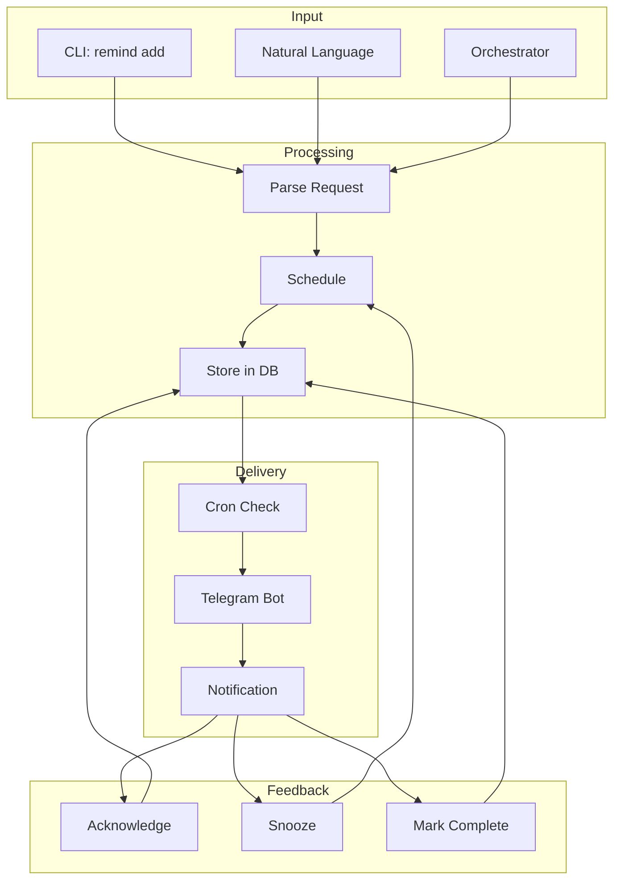
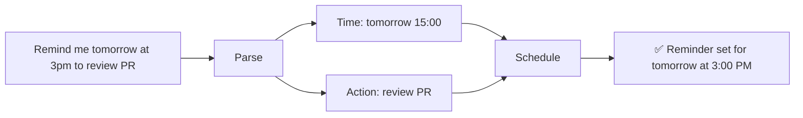
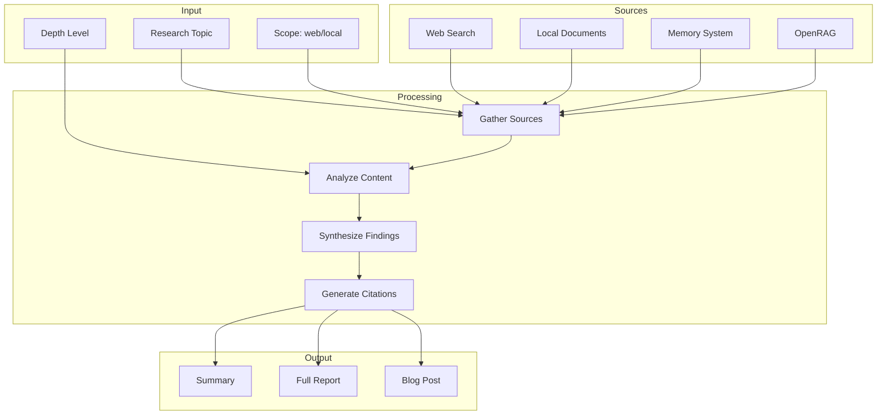
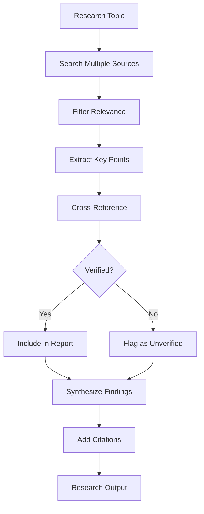
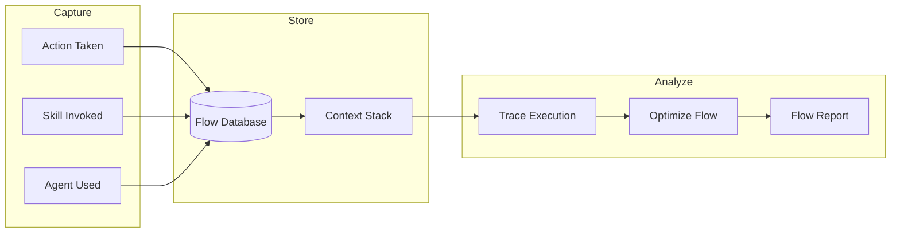
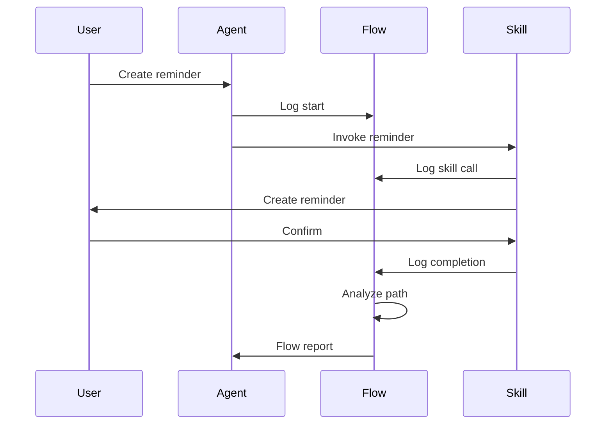
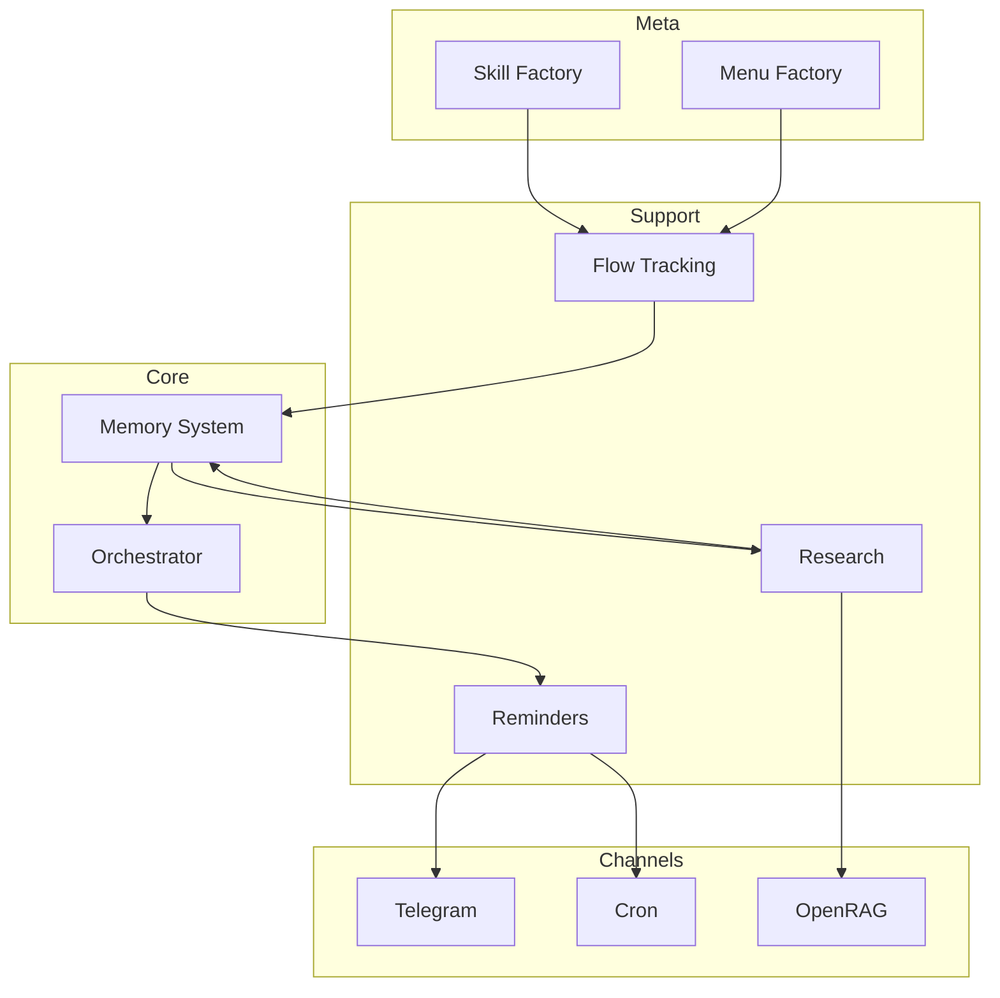
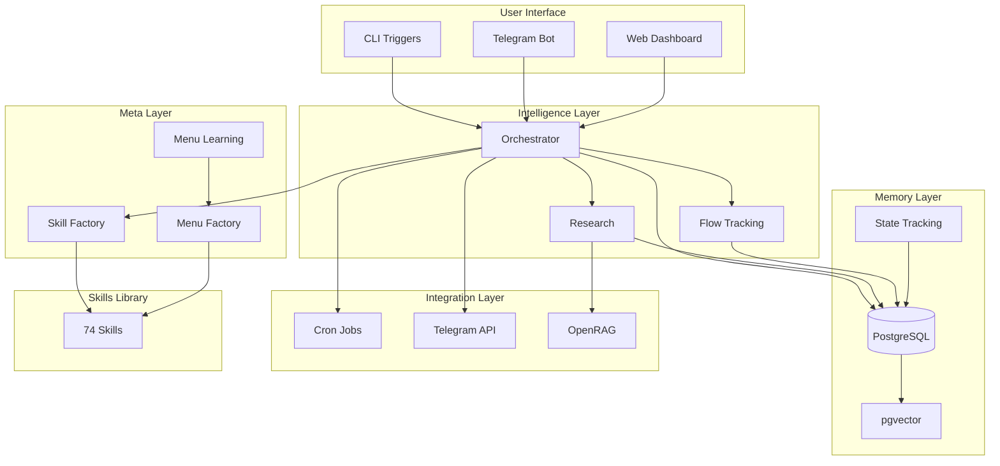

## The Supporting Cast

While Memory, Orchestrator, and Meta-Skills form the core, supporting skills make everything practical. This deep dive covers Reminders, Research, and Flow Tracking.

## Reminder System

### Architecture



### Reminder Types

| Type | Trigger | Example |
|------|---------|---------|
| **one-time** | Specific datetime | "Remind me at 3pm to call John" |
| **recurring** | Interval pattern | "Remind me daily at 9am to take vitamins" |
| **relative** | Duration from now | "Remind me in 30 minutes" |
| **conditional** | Event-based | "Remind me when I'm home" (location) |
| **escalating** | Increasing urgency | Orchestrator harvest phase |

### Natural Language Parsing



### Cron Integration

```bash
# Check for due reminders (every minute)
* * * * * ~/.config/opencode/skills/reminder/scripts/check-due.sh

# Send Telegram notifications
* * * * * ~/.config/opencode/skills/reminder/scripts/send-telegram.sh

# Daily summary at 8am
0 8 * * * ~/.config/opencode/skills/reminder/scripts/daily-summary.sh
```

### Telegram Bot Commands

| Command | Action |
|---------|--------|
| `/remind <text>` | Create reminder |
| `/list` | List pending reminders |
| `/done <id>` | Mark complete |
| `/snooze <id> <duration>` | Snooze reminder |
| `/cancel <id>` | Cancel reminder |

## Research System

### Architecture



### Research Depths

| Level | Name | Actions | Time |
|-------|------|---------|------|
| **quick** | Quick Overview | 3-5 sources, summary | 2-5 min |
| **standard** | Standard Research | 10-15 sources, analysis | 15-30 min |
| **deep** | Deep Dive | 30+ sources, synthesis | 1-2 hours |
| **comprehensive** | Comprehensive | Exhaustive, citations | 3+ hours |

### Evidence-Based Methodology



### Integration with OpenRAG

```bash
# Research with document retrieval
research "crustal displacement theories" --use-rag

# Research with memory context
research "personal assistant architecture" --use-memory

# Research web + local
research "best practices for AI memory" --scope all
```

## Flow Tracking

### Purpose

Execution transparency — understand how tasks flow through the system.

### Architecture



### Flow Notation

```
User Request → Agent → Global Rules → Skill → Execution
A > B > C > D > E

Example:
"Create reminder" > Sisyphus > Reminder Rules > Reminder Skill > Telegram
```

### Tracked Elements

| Element | What's Tracked |
|---------|----------------|
| **Context** | Current conversation state |
| **Flows** | Execution paths |
| **Actions** | Individual operations |
| **Delegations** | Agent handoffs |
| **Skills** | Skill invocations |
| **Questions** | Question tool usage |

### Flow Analysis



## Integration Map



## Complete Ecosystem View



## Key Metrics Summary

| Component | Metric | Value |
|-----------|--------|-------|
| **Memory** | Total memories | 2,846+ |
| **Skills** | Total skills | 74 |
| **Skills** | L2+ maturity | 50 (68%) |
| **Triggers** | Active triggers | 30+ |
| **Reminders** | Daily capacity | Unlimited |
| **Research** | Sources per deep dive | 30+ |

## What's Next?

The Personal Assistant Ecosystem is now complete with:
- ✅ **Memory System** — Persistent context
- ✅ **Orchestrator** — Lifecycle management
- ✅ **Meta-Skills** — Self-improvement
- ✅ **Reminders** — Time-based triggers
- ✅ **Research** — Deep analysis
- ✅ **Flow Tracking** — Execution transparency

Future enhancements:
- OpenTelemetry integration
- Voice interface
- Mobile app
- Multi-user support

---

*This is part 5 of 5 in the Personal Assistant Ecosystem series.*