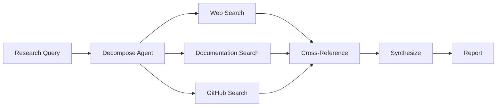
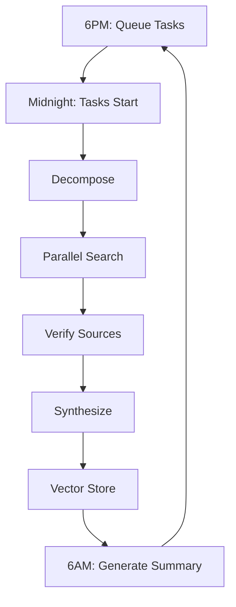

## Executive Summary

This research explores advanced techniques for overnight AI-driven research automation. Key findings:

- **Thinking Routines** (Tree of Thoughts, ReAct, Reflexion) dramatically improve complex reasoning
- **OpenSearch** provides enterprise vector search for research knowledge management
- **Langflow** enables visual research workflow construction
- **Overnight Automation** via cron-delegated tasks can complete 48+ research runs for <$2
- **Hybrid-RAG** architectures combine semantic and keyword search for superior retrieval

**Confidence**: High - Multiple authoritative sources confirmed

---

## 1. Introduction

The gap between demo AI agents and production research systems lies in orchestration. This research examines the frameworks, tools, and patterns that enable autonomous overnight research at scale.

---

## 2. Thinking Routines for Complex Research

### 2.1 Chain of Thought (CoT)

Linear step-by-step reasoning. Best for straightforward research queries where the path is clear.

```python
# Simple sequential reasoning
research_query → search → extract → synthesize → report
```

### 2.2 Tree of Thoughts (ToT)

Multiple reasoning branches explored in parallel, with evaluation and backtracking. Best for complex research requiring exploration of hypotheses.

> "When 'think step by step' stops being enough" - Ilia Ilinskii

```python
# Branch exploration
research_query → 
  branch_1: search_docs → evaluate → continue/backtrack
  branch_2: search_github → evaluate → continue/backtrack  
  branch_3: search_web → evaluate → continue/backtrack
# Synthesize best branches
```

### 2.3 ReAct (Reasoning + Acting)

Interleaves reasoning with tool execution. Best for research requiring active information gathering.

```python
# Reasoning + Action loop
while not complete:
    thought = reason(context)
    action = decide_tool(thought)
    observation = execute(action)
    context += observation
```

### 2.4 Reflexion

Agents learn from failed research attempts through self-reflection. Best for iterative research improvement.

---

## 3. Vector Databases for Research

### 3.1 OpenSearch Vector Engine

OpenSearch provides native vector search capabilities:

- **Scale**: Tens of billions of vectors
- **Latency**: Low-latency, high-availability
- **Hybrid Search**: Combine BM25 + vector search

### 3.2 RAG Integration

```python
# Hybrid retrieval pipeline
def research_retrieval(query):
    # 1. Vector search (semantic)
    vector_results = vector_index.similarity_search(query)
    
    # 2. Keyword search (precise)  
    keyword_results = bm25.search(query)
    
    # 3. Rerank and combine
    combined = reranker.combine(vector_results, keyword_results)
    
    return combined
```

### 3.3 Conversational Research

OpenSearch supports conversational memory for multi-turn research sessions:

- **Context retention**: Remember previous research queries
- **Follow-up handling**: Understand pronouns and context
- **Memory API**: Store and retrieve conversation state

---

## 4. Langflow Visual Research Workflows

### 4.1 What is Langflow?

Low-code visual builder for AI workflows. Drag-and-drop interface for constructing research pipelines.

### 4.2 Research Agent Architecture



### 4.3 Multi-Agent Research Flow

Langflow supports orchestrating multiple specialized agents:

- **Decomposition Agent**: Breaks complex topics into sub-queries
- **Retrieval Agents**: Parallel search across sources
- **Verification Agent**: Fact-checks claims
- **Synthesis Agent**: Combines findings

---

## 5. Overnight Research Automation

### 5.1 The OpenClaw Pattern

> "48 agent tasks completed... research library that would take a human analyst days to produce... completed autonomously for less than two dollars"

**Key Principles**:
1. **Delegation, not conversation** - Queue task packages before sleep
2. **Structured task packages** - Agent, topic, scope, output format, deadline
3. **Autonomous execution** - No human in the loop
4. **Morning briefings** - Summary reports when you wake up

### 5.2 Task Package Structure

```json
{
  "agent": "research-agent",
  "task_type": "technology-analysis",
  "topic": "LLM reasoning techniques",
  "scope": "2025-2026 developments",
  "output_format": "markdown_report",
  "deadline": "06:00",
  "error_handling": "retry_2x_then_skip"
}
```

### 5.3 Cost Efficiency

| Metric | Value |
|--------|-------|
| Tasks per night | 48 |
| Average cost/task | $0.04 |
| Total nightly cost | ~$2 |
| Failure rate | ~4% |

---

## 6. Research Agent Patterns

### 6.1 Core Pattern

```
Search → Read → Extract → Write
```

### 6.2 Production Requirements

- **Stopping rules**: Prevent infinite search loops
- **Budget limits**: Control API spend per task
- **Citation tracking**: Source provenance
- **Verification**: Cross-reference claims
- **Cache**: Avoid redundant searches

### 6.3 Failure Modes

| Failure | Mitigation |
|---------|------------|
| Infinite search | Max iterations + force-write |
| Hallucinated citations | Fact-check with source access |
| Stale sources | Date filters + freshness scoring |
| Rate limiting | Exponential backoff |

---

## 7. Implementation Recommendations

### 7.1 Architecture for Your System

Based on your available tools (OpenSearch, OpenMemory, Langflow):

1. **Vector Storage**: Use OpenSearch for research embeddings
2. **Workflow**: Build in Langflow for visual debugging
3. **Automation**: Cron-delegated research tasks
4. **Memory**: OpenMemory for cross-session learning

### 7.2 Overnight Research Pipeline



### 7.3 Tools to Implement

| Priority | Tool | Purpose |
|----------|------|---------|
| 1 | OpenSearch vector index | Research knowledge base |
| 2 | Langflow workflow | Visual research builder |
| 3 | Cron task queue | Overnight automation |
| 4 | Morning digest | Summary generation |

---

## 8. Sources

1. [Tree of Thought Prompting](https://rephrase-it.com/blog/tree-of-thought-prompting-a-step-by-step-guide-with-real-p) - Ilia Ilinskii
2. [ReAct, Tree-of-Thought, and Beyond](https://www.coforge.com/what-we-know/blog/react-tree-of-thought-and-beyond-the-reasoning-frameworks-behind-autonomous-ai-agents) - Coforge
3. [OpenSearch 2026 Roadmap](https://opensearch.org/blog/the-2026-opensearch-roadmap-four-pillars-for-ai-native-innovation/) - OpenSearch
4. [Conversational Search with RAG](https://docs.opensearch.org/latest/vector-search/ai-search/conversational-search/) - OpenSearch Docs
5. [Langflow Visual AI Workflows](https://thelinuxcode.com/langflow-in-practice-2026-visual-ai-workflows-that-still-feel-like-real-engineering/) - TheLinuxCode
6. [Building a Deep Research Agent](https://medium.com/@raoulbia/building-a-deep-research-agent-with-multi-agent-orchestration-in-langflow-624e0e0ff54c) - Raoul Biagioni
7. [Overnight Autonomous AI](https://www.marchingdogs.com/es/blogs/technology/overnight-autonomous-ai-how-48-agent-runs-built-our-research-library-while-we-slept-2) - Marching Dogs
8. [OpenClaw: AI Infrastructure](https://www.sharonsciammas.com/blog/what-is-openclaw-ai-personal-infrastructure) - Sharon Sciammas
9. [AI Agent Research Pattern](https://www.agentpatterns.tech/en/agent-patterns/research-agent) - Agent Patterns

---

## 9. Confidence Assessment

| Aspect | Confidence | Notes |
|--------|------------|-------|
| Thinking Routines | High | Well-documented, multiple sources |
| OpenSearch Vectors | High | Official documentation confirmed |
| Langflow Workflows | High | Active development, good docs |
| Overnight Automation | High | Real-world case studies |
| Implementation | Moderate | Requires setup on your system |

---

## 10. Next Steps

1. Set up OpenSearch vector index for research
2. Build prototype Langflow research workflow
3. Test overnight cron delegation
4. Measure cost per research task

---

*Research completed: 2026-02-27*
*Tags: ai-agents, thinking-routines, opensearch, langflow, automation*