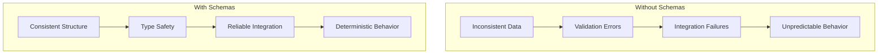
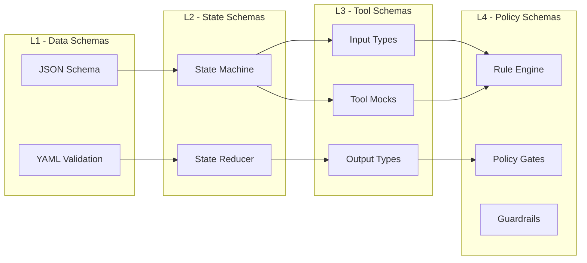
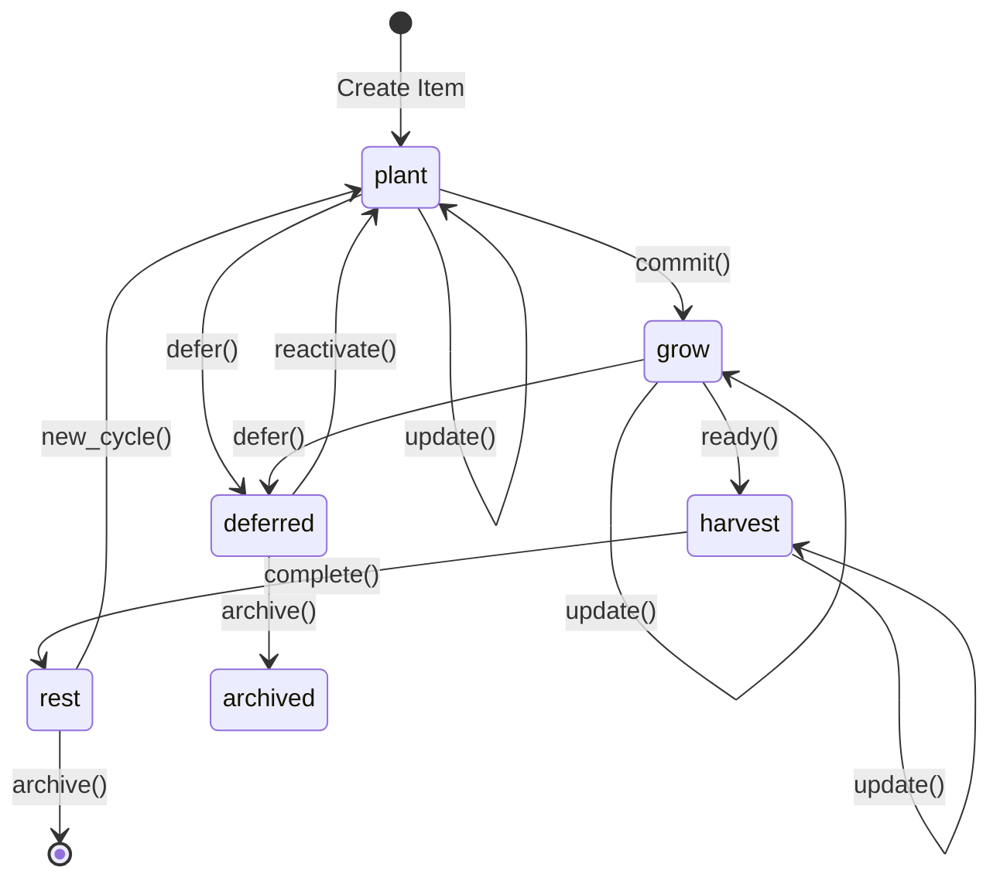
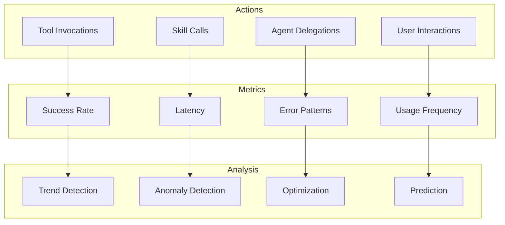
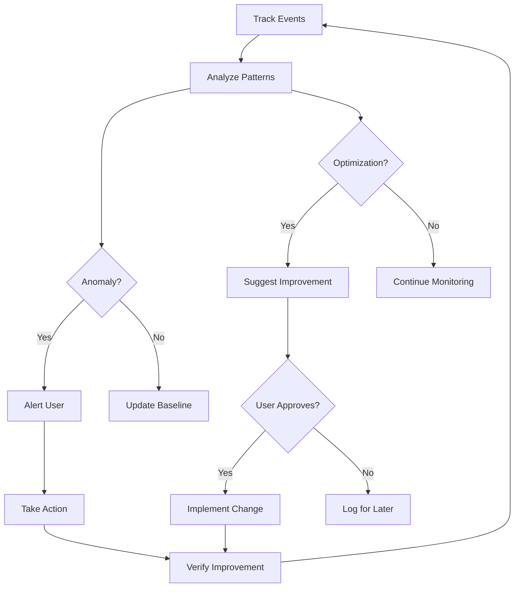
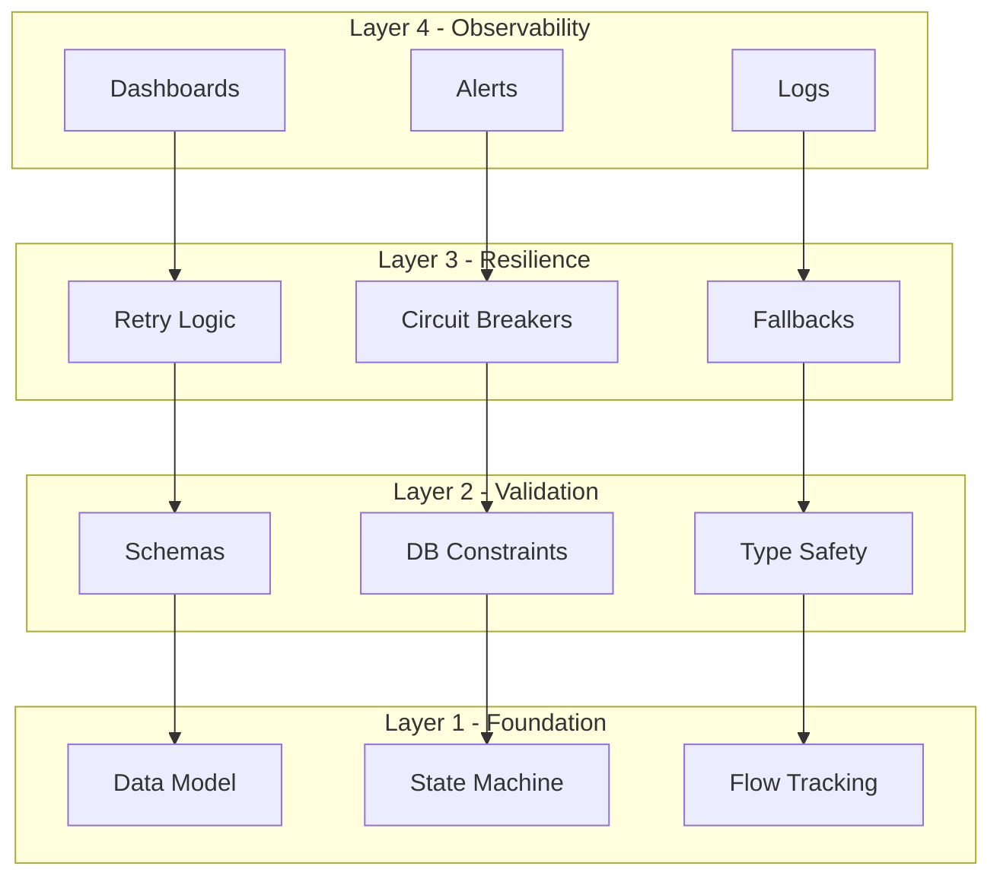

## The Reliability Problem

AI systems are probabilistic by nature. They make mistakes, forget context, and behave inconsistently. For a personal assistant to be truly useful, it must be **reliable**. This post covers how schemas, tracking, and validation create trust.

## The Schema Imperative

### Why Schemas Matter



### The 2026 Determinism Formula

```
Determinism = Schema Validation + State Reducer + Tool Mocks + Policy Gates
```

### Schema Layers



## Memory Schema

### PostgreSQL Schema

```sql
-- Core memory schema with constraints
CREATE TABLE memories (
    id UUID PRIMARY KEY DEFAULT gen_random_uuid(),
    content TEXT NOT NULL CHECK (length(content) >= 10),
    memory_type TEXT NOT NULL 
        CHECK (memory_type IN ('conversation', 'decision', 'action', 'exchange')),
    scope TEXT DEFAULT 'user' 
        CHECK (scope IN ('user', 'project')),
    tags TEXT[] DEFAULT '{}',
    metadata JSONB DEFAULT '{}',
    embedding vector(768),
    created_at TIMESTAMPTZ DEFAULT NOW(),
    accessed_at TIMESTAMPTZ DEFAULT NOW(),
    access_count INT DEFAULT 0 CHECK (access_count >= 0),
    
    -- Constraints
    CONSTRAINT valid_metadata CHECK (jsonb_typeof(metadata) = 'object'),
    CONSTRAINT valid_tags CHECK (array_length(tags, 1) IS NULL OR array_length(tags, 1) <= 10)
);

-- Indexes for reliability
CREATE UNIQUE INDEX idx_memories_id ON memories(id);
CREATE INDEX idx_memories_type ON memories(memory_type);
CREATE INDEX idx_memories_scope ON memories(scope);
```

### JSON Schema for API

```json
{
  "$schema": "http://json-schema.org/draft-07/schema#",
  "type": "object",
  "required": ["content", "memory_type"],
  "properties": {
    "content": {
      "type": "string",
      "minLength": 10,
      "maxLength": 10000
    },
    "memory_type": {
      "type": "string",
      "enum": ["conversation", "decision", "action", "exchange"]
    },
    "scope": {
      "type": "string",
      "enum": ["user", "project"],
      "default": "user"
    },
    "tags": {
      "type": "array",
      "items": { "type": "string" },
      "maxItems": 10
    },
    "metadata": {
      "type": "object",
      "additionalProperties": true
    }
  }
}
```

## Orchestrator Schema

### Item Schema

```sql
CREATE TABLE orchestrator_items (
    id TEXT PRIMARY KEY,
    title TEXT NOT NULL CHECK (length(title) >= 3 AND length(title) <= 200),
    domain TEXT NOT NULL 
        CHECK (domain IN ('garden', 'energy', 'work', 'personal', 'blog')),
    phase TEXT NOT NULL 
        CHECK (phase IN ('plant', 'grow', 'harvest', 'rest')),
    status TEXT DEFAULT 'active' 
        CHECK (status IN ('active', 'completed', 'deferred', 'archived')),
    priority TEXT DEFAULT 'medium' 
        CHECK (priority IN ('urgent', 'high', 'medium', 'low')),
    created TIMESTAMPTZ DEFAULT NOW(),
    updated TIMESTAMPTZ DEFAULT NOW(),
    target_date DATE CHECK (target_date > created),
    phase_entered TIMESTAMPTZ,
    metadata JSONB DEFAULT '{}',
    history JSONB DEFAULT '[]',
    reminders JSONB DEFAULT '[]',
    tags TEXT[] DEFAULT '{}',
    
    -- Reliability constraints
    CONSTRAINT valid_history CHECK (jsonb_typeof(history) = 'array'),
    CONSTRAINT valid_reminders CHECK (jsonb_typeof(reminders) = 'array')
);
```

### State Machine



## Tracking & Analysis

### What Gets Tracked



### Flow Tracking Schema

```sql
CREATE TABLE flow_events (
    id UUID PRIMARY KEY DEFAULT gen_random_uuid(),
    timestamp TIMESTAMPTZ DEFAULT NOW(),
    session_id UUID NOT NULL,
    event_type TEXT NOT NULL 
        CHECK (event_type IN ('action', 'skill', 'agent', 'question', 'delegation')),
    source TEXT NOT NULL,
    target TEXT,
    data JSONB DEFAULT '{}',
    success BOOLEAN DEFAULT true,
    duration_ms INT CHECK (duration_ms >= 0),
    error_message TEXT
);

CREATE INDEX idx_flow_session ON flow_events(session_id);
CREATE INDEX idx_flow_type ON flow_events(event_type);
CREATE INDEX idx_flow_timestamp ON flow_events(timestamp);
```

### Analysis Queries

```sql
-- Success rate by skill
SELECT 
    source as skill,
    COUNT(*) as total,
    SUM(CASE WHEN success THEN 1 ELSE 0 END) as successes,
    ROUND(100.0 * SUM(CASE WHEN success THEN 1 ELSE 0 END) / COUNT(*), 2) as success_rate
FROM flow_events
WHERE event_type = 'skill'
GROUP BY source
ORDER BY success_rate DESC;

-- Error patterns
SELECT 
    source,
    error_message,
    COUNT(*) as occurrences
FROM flow_events
WHERE success = false
GROUP BY source, error_message
ORDER BY occurrences DESC
LIMIT 10;

-- Latency by skill
SELECT 
    source as skill,
    AVG(duration_ms) as avg_ms,
    PERCENTILE_CONT(0.5) WITHIN GROUP (ORDER BY duration_ms) as p50,
    PERCENTILE_CONT(0.95) WITHIN GROUP (ORDER BY duration_ms) as p95
FROM flow_events
WHERE event_type = 'skill' AND duration_ms IS NOT NULL
GROUP BY source
ORDER BY avg_ms DESC;
```

## Acting on Analysis

### The Feedback Loop



### Automated Actions

| Metric | Threshold | Action |
|--------|-----------|--------|
| Error rate > 10% | Alert + disable skill | Automatic |
| Latency p95 > 5s | Alert + investigate | Semi-automatic |
| Success rate < 80% | Suggest alternatives | Manual |
| Usage decline > 50% | Review skill relevance | Manual |

## Reliability Checklist

### For Every Skill

- [ ] Input schema defined
- [ ] Output schema defined
- [ ] Error handling complete
- [ ] Retry logic for transient failures
- [ ] Timeout handling
- [ ] Logging at appropriate levels
- [ ] Metrics tracked
- [ ] Tests written

### For the System

- [ ] All state transitions validated
- [ ] Database constraints enforced
- [ ] API contracts validated
- [ ] Graceful degradation
- [ ] Circuit breakers for external services
- [ ] Health checks
- [ ] Monitoring dashboards

## The Reliability Stack



## Key Takeaways

1. **Schemas enable reliability** — Type safety prevents entire classes of bugs
2. **Tracking enables improvement** — You can't improve what you don't measure
3. **Analysis enables action** — Patterns reveal optimization opportunities
4. **Validation enables trust** — Constraints enforce consistency

## Next Steps

- Add OpenTelemetry for distributed tracing
- Implement circuit breakers for all external services
- Create automated reliability testing
- Build prediction models for proactive optimization

---

*This is part 6 of 6 in the Personal Assistant Ecosystem series.*